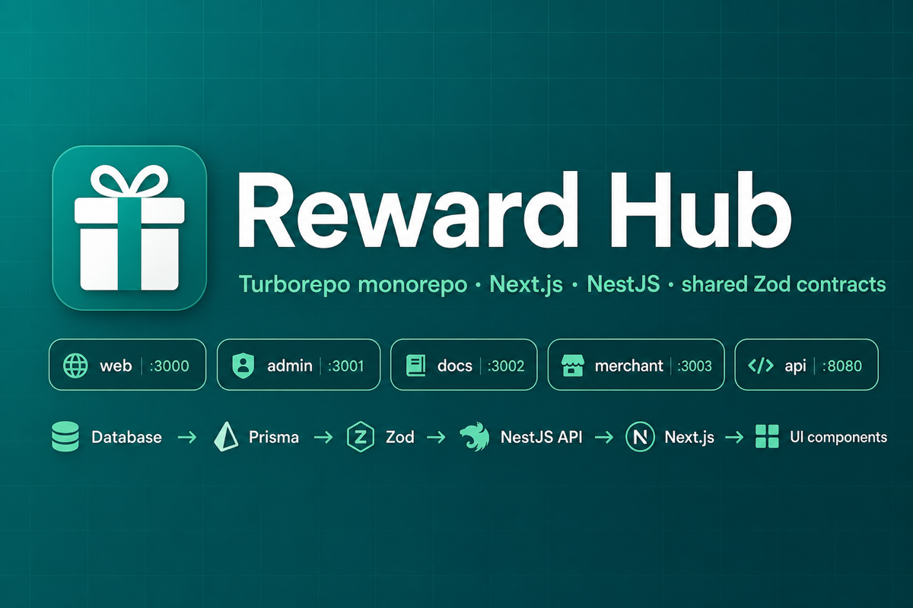

<p align="center">
  
</p>

<p align="center">
  <strong>Consumer rewards platform boilerplate</strong> — multiple Next.js portals, one NestJS API, and a single source of truth for types and validation.
</p>

<p align="center">
  <a href="https://nodejs.org"></a>
  <a href="https://pnpm.io"></a>
  <a href="https://turbo.build"></a>
  <a href="https://www.typescriptlang.org"></a>
</p>

<p align="center">
  <a href="./docs/getting-started.md"><strong>Getting started</strong></a>
  ·
  <a href="./docs/architecture.md">Architecture</a>
  ·
  <a href="./docs/README.md">All docs</a>
  ·
  <a href="http://localhost:8080/docs">API Swagger</a>
</p>

---

## What you get

| Surface | App | Port | Purpose |
| ------- | --- | ---- | ------- |
| **Web** | `@workspace/web` | `3000` | Public landing + authenticated Reward Hub for consumers |
| **Admin** | `@workspace/admin` | `3001` | Internal operations panel |
| **Docs** | `@workspace/docs` | `3002` | In-repo documentation site |
| **Merchant** | `@workspace/merchant` | `3003` | Merchant portal (isolated auth cookies) |
| **API** | `@workspace/api` | `8080` | NestJS backend — Swagger at `/docs` |

Shared packages keep the stack consistent: **`@workspace/shared`** (Zod schemas), **`@workspace/client`** (auth + typed API), **`@workspace/ui`** (presentational components).

---

## Repository layout

```
apps/
├── web/        Customer-facing Next.js app
├── admin/      Admin panel
├── merchant/   Merchant portal
├── docs/       Documentation site
└── api/        NestJS + Prisma API

packages/
├── shared/     Zod schemas + shared types (the API contract)
├── client/     Auth context, useApi hook, endpoint registry
├── ui/         shadcn/ui components (presentational only)
├── eslint-config/
└── typescript-config/
```

**Data flow:** `Database → Prisma → Zod (shared) → NestJS → Next.js (smart) → UI (dumb props)`

---

## Quick start

**Prerequisites:** Node 20+, pnpm 11, PostgreSQL running locally.

```bash
pnpm install

# One-time env + database setup
cp apps/api/.env.example apps/api/.env    # fill in secrets
cp apps/web/.env.example apps/web/.env
cp apps/admin/.env.example apps/admin/.env
pnpm db:all                               # generate → deploy → seed (~30s)

pnpm dev                                  # web + admin + api (see turbo for all apps)
```

Run individual apps when you need them:

```bash
pnpm dev:web
pnpm dev:admin
pnpm dev:merchant
pnpm dev:api
```

> **New here?** Follow the full [A-to-Z setup guide](./docs/getting-started.md) — prerequisites, every env var, seeded login accounts, best practices, and troubleshooting.

---

## Commands

| Command | What it does |
| ------- | ------------ |
| `pnpm dev` | Start dev servers (Turbo) |
| `pnpm build` | Build all workspaces |
| `pnpm lint` / `pnpm format` / `pnpm typecheck` / `pnpm test` | Quality gates across the monorepo |
| `pnpm db:all` / `db:migrate` / `db:generate` / `db:seed` / `db:studio` / `db:reset` | Database — see [docs/prisma.md](./docs/prisma.md) |
| `pnpm deps:check` / `deps:fix` / `deps:list` | Shared dependency version hygiene (syncpack) |
| `pnpm kill:all` | Free dev ports 3000–3003 and 8080 |
| `pnpm dlx shadcn@latest add <component> -c apps/web` | Add a shadcn component to `packages/ui` |

---

## Documentation

Start with **[Getting started (A-to-Z)](./docs/getting-started.md)**, then **[Architecture](./docs/architecture.md)**.

The full index lives in **[docs/README.md](./docs/README.md)** — auth, Prisma, RBAC, UI audit, token refresh, and more.

---

<p align="center"><sub>Built with Turborepo · Type-safe from database to browser</sub></p>
