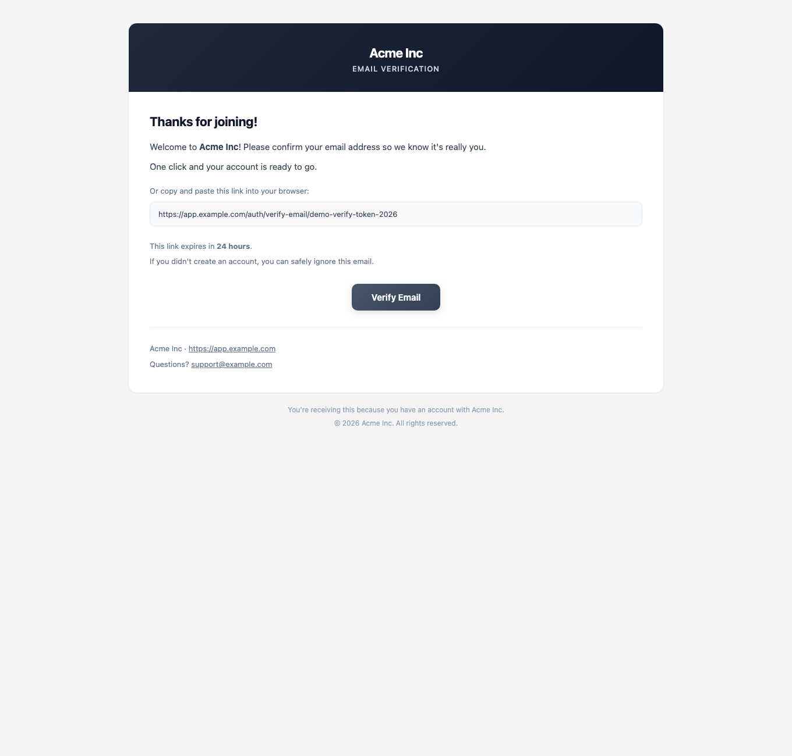
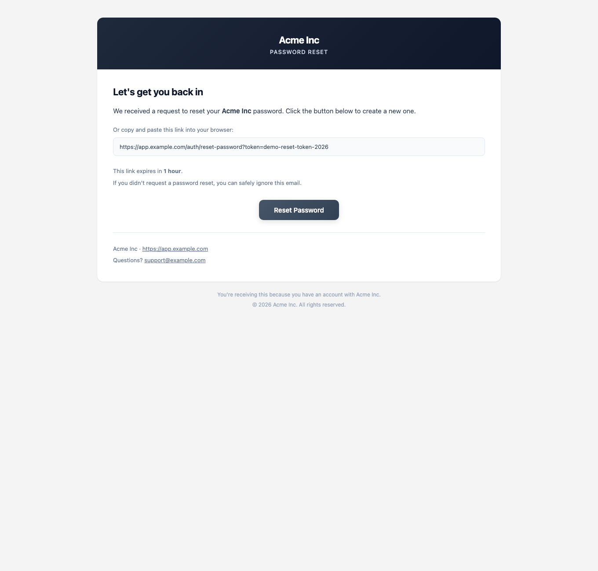
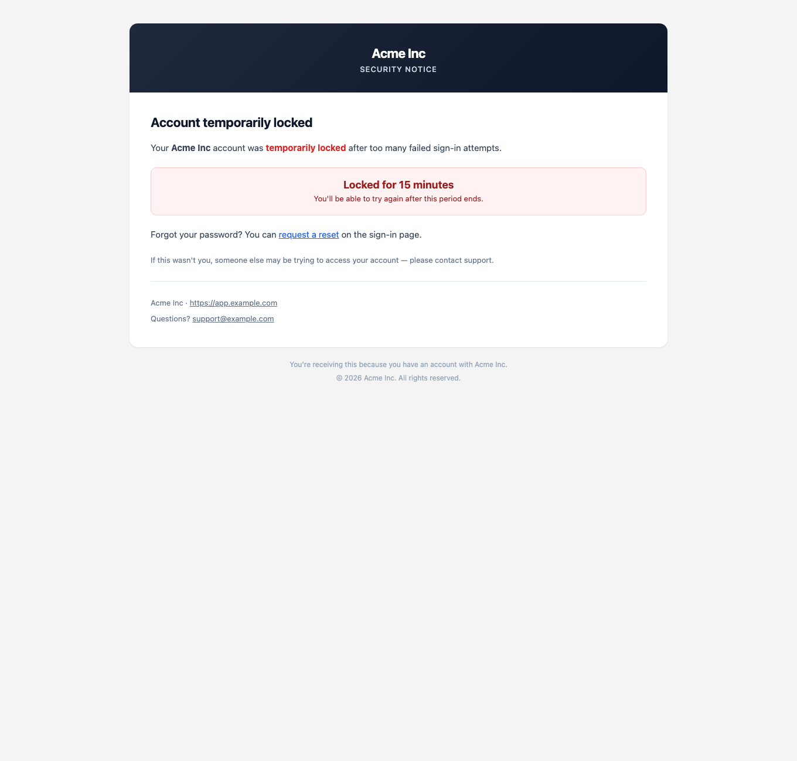
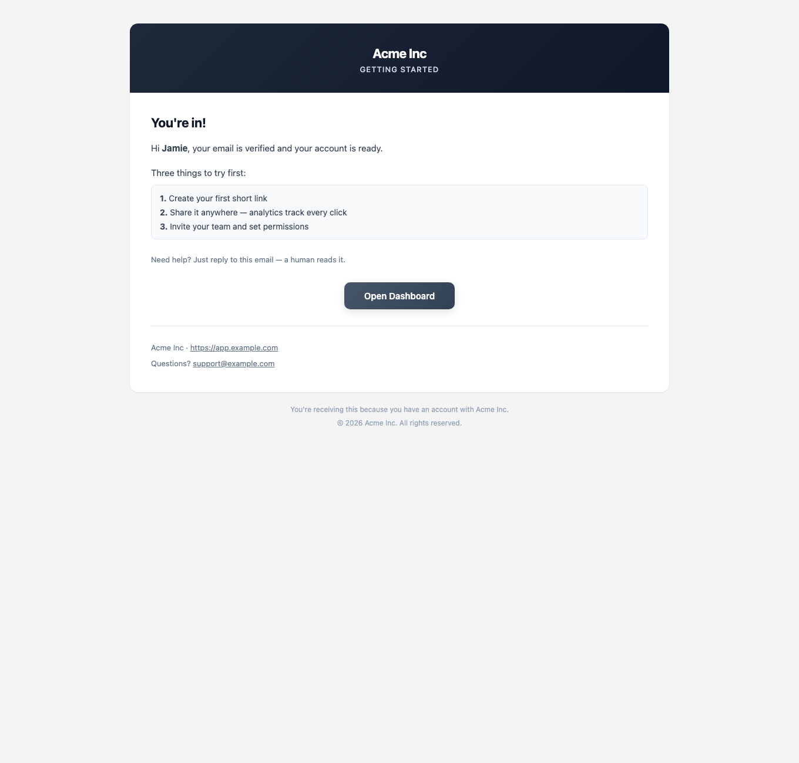
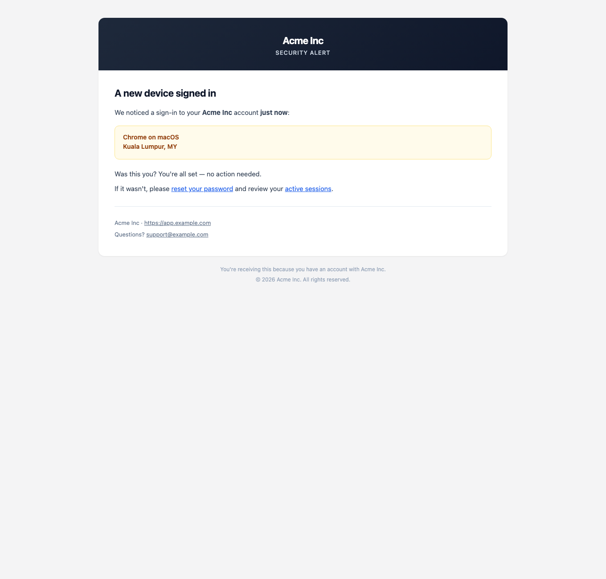
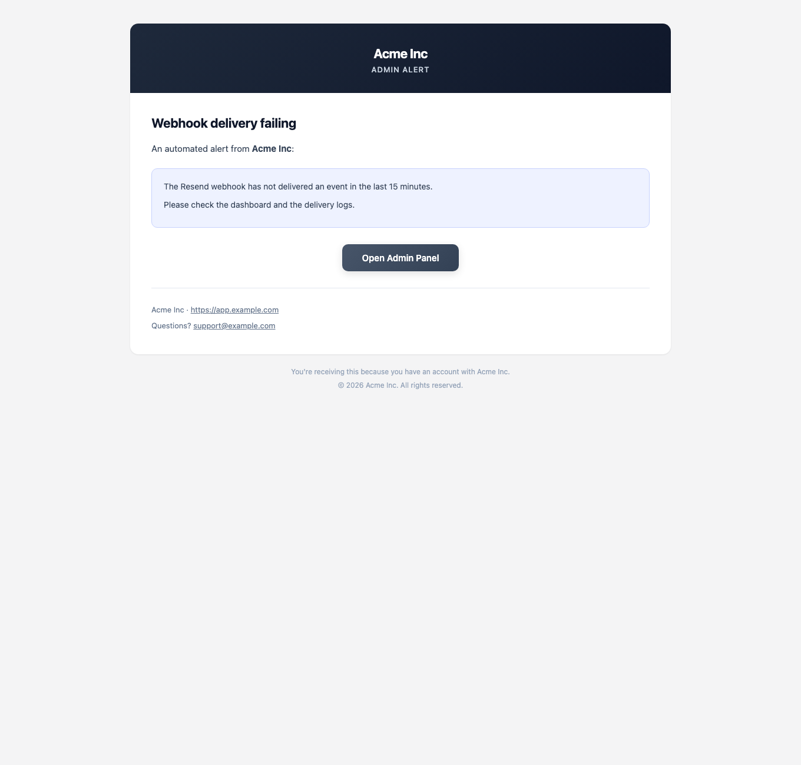
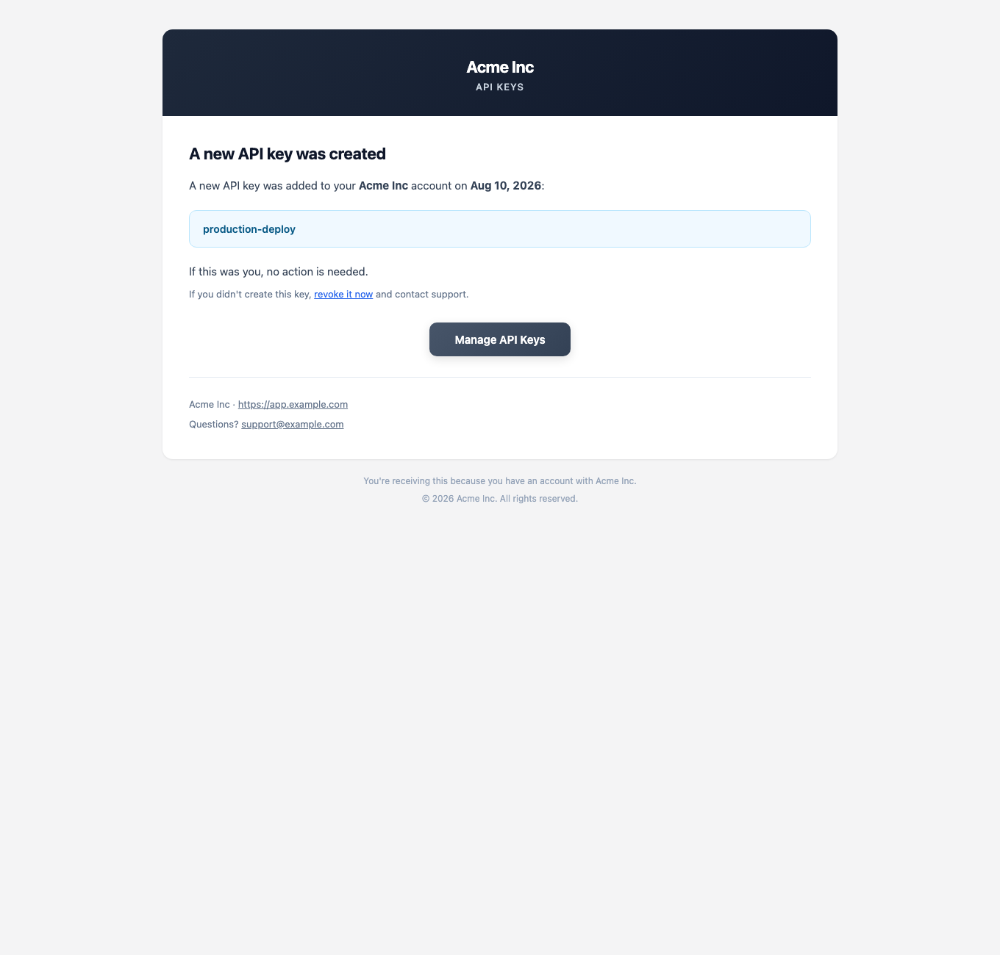

# Email Template System

> [!NOTE] A production-grade transactional-email layer on **Resend**. Every item states **what** it is,
> **why** it matters, the **current state** (verified against the code today), and **how** to
> implement it — written so a junior developer with ~6 months of experience can execute without
> guessing.
>
> **Ground truth** (checked 2026-08-05):
>
> - `apps/api/src/modules/auth/services/email.service.ts` sends 3 transactional emails via
>   **Resend v6** (`this.resend.emails.send(...)`) with **inline HTML + plain-text template
>   builders** (no template files, no preview, no tests).
> - Config comes from `TypedConfigService` (`resendApiKey`, `emailFromAddress`, `appName`,
>   `appUrl`).
>
> This system must follow the repo's non-negotiable rules: no `any`/`unknown`/`never`, no type
> casting, infer types from zod schemas, generic types first, explicit access modifiers + return
> types on every method, and structured zod-schema-driven payloads.
>
> **Related docs:** the logging system has its own guide — [Logging System](./logging.md). For
> the **operational** half (setting up Resend, verifying a domain, and exposing the delivery
> webhook locally with cloudflared), read **[Email + Webhook Setup](./email-setup.md)**.

---

# ✉️ Email Template System (Resend)

> [!NOTE] **The goal:** a production-grade transactional-email layer on **Resend** — real template files
> (no inline HTML strings), HTML + plain-text for every email, a preview workflow, and total
> control over content without touching code. `EmailService` stays the single send entry point.

---

## ✅ Implementation status (shipped 2026-08-10)

> [!TIP] The core system from items **1–8, 10–17, 20, 26, 28, 36–38** below is **built and
> tested**. The old ~250-line copy-pasted HTML in `email.service.ts` is gone — the auth flows now
> delegate to the shared `BaseEmailTemplate` + `EmailSenderService` pipeline. This section is the
> ground truth for what exists **today**; the numbered items below remain the backlog for what
> hasn't landed yet.

### What exists now

| Area | Where | Notes |
|---|---|---|
| Abstract base template | `apps/api/src/modules/notifications/email/base/base-email-template.ts` | Shared responsive HTML shell (950px container), preheader, CTA button, `linkBlock`, footer, dark-mode overrides, HTML escaping, `buildUrl` query encoding, plain-text twin |
| 7 concrete templates | `apps/api/src/modules/notifications/email/templates/*.template.ts` | `verification`, `password-reset`, `account-locked`, `welcome`, `security-alert`, `admin-alert`, `api-key-created` — each with zod props + `sampleProps` for previews |
| Registry | `email-template.registry.ts` | Single source of truth `key → { meta, build }`; completeness-tested against the shared `EmailTemplateKeySchema` |
| Delivery engine | `email-sender.service.ts` | Zod re-validation, `EMAIL_MODE` (send / log-only / noop), `EMAIL_TEST_TO` override, per-recipient sliding-window rate limit, retry-with-jittered-backoff, per-send timeout, PII-safe recipient masking, never throws |
| Email log | `email-log.service.ts` + Prisma `EmailLog` model (`email_logs` table, migrations `20260809182240_add_email_log`, `20260811132303_add_email_engagement_tracking`, `20260811133228_add_email_log_resend_id_index`, `20260811160000_remove_email_tracking`) | One row per send; the webhook flips `sent → delivered / bounced / complained / failed`. `resend_id` is indexed (every webhook looks a row up by it). The tracking columns (`tracking_token` / `opened_at` / `clicked_at`) were dropped by the `remove_email_tracking` migration — open/click tracking is gone |
| Admin preview API | `GET /notifications/email-preview`, `GET /notifications/email-preview/:key` | Sample props only — never sends mail |
| Resend webhook | `POST /notifications/email-webhook` | `@Public()` + signature-verified via `resend.webhooks.verify` (booted with `rawBody: true`). Handles delivery events (status flips, bounce/complaint reasons captured into `error`); tracking events (`email.opened` / `email.clicked`) are acknowledged and ignored — open/click tracking was removed |
| Admin preview page | `apps/admin/app/(panel)/emails/page.tsx` + sidebar entry (Settings → Email Templates) | Template index + iframe preview + HTML/text tabs + copy |
| Admin email log | `apps/admin/app/(panel)/email-log/page.tsx` + sidebar entry (Settings → Email Log) | `GET /notifications/email-log` (JWT-guarded, `?limit=` 1–500) → shared `DataTable`. Delivery-only status badges (Sent / Delivered / Bounced / Complained / Failed) with bounce/complaint reasons in `error`. Search, export, mobile cards. **Live updates via SSE** — see "Live updates (SSE)" below |
| Env vars | `EMAIL_MODE`, `EMAIL_TEST_TO`, `EMAIL_REPLY_TO`, `EMAIL_MAX_ATTEMPTS`, `EMAIL_TIMEOUT_MS`, `EMAIL_RATE_LIMIT_PER_MINUTE`, `RESEND_WEBHOOK_SECRET` | Added to shared `EnvSchema` + `TypedConfigService` |

### Live wiring (verified 2026-08-10)

> [!TIP] Production config confirmed working end-to-end. Real sends + webhook signature
> verification were exercised against Resend's API and the public tunnel:
>
> - `apps/api/.env`: `RESEND_API_KEY=re_…` (real key), `RESEND_WEBHOOK_SECRET=whsec_…`,
>   `EMAIL_FROM_ADDRESS=noreply@bishenpatel.com` (domain **verified** in Resend).
> - Real send via Resend returned an email `id` (`POST https://api.resend.com/emails` with the
>   verified from-address).
> - Webhook endpoint is publicly reachable behind a `cloudflared` quick tunnel:
>   `https://<random>.trycloudflare.com/notifications/email-webhook` — register this URL in the
>   Resend dashboard (Webhooks → Add Webhook) with events Sent / Delivered / Delivery Delayed /
>   Bounced / Complained / Failed. The signing secret Resend shows becomes
>   `RESEND_WEBHOOK_SECRET` in `.env`.
> - Signed-payload test: a locally HMAC-signed `email.delivered` event (standard-webhooks scheme,
>   message = `<msgId>.<timestamp>.<payload>`) was POSTed through the tunnel and accepted (200);
>   a tampered signature was rejected (403).

### Live updates (SSE)

> [!TIP] The admin Email Log page updates itself **in real time** — no polling, no refresh.
> Every `EmailLog` write (a send is logged, a delivery webhook flips a status) pushes a
> frame down a Server-Sent Events stream, and the page refetches its list the instant the
> frame arrives — the status badge updates the moment the webhook writes the row.
>
> **How it works (3 moving parts):**
>
> 1. **`EmailLogEventsService`** (`email-log-events.service.ts`) — a tiny in-process
>    `node:events` emitter. `EmailLogService` calls `emitUpdated()` after every successful
>    write (create / status flip).
> 2. **`GET /notifications/email-log/events`** — an `@Sse()` endpoint on `EmailLogController`
>    that subscribes to the emitter and streams one `{ updatedAt }` frame per signal. It's
>    guarded by the global auth guard like the rest of the controller (admin-only), and the
>    global `ResponseInterceptor` **bypasses** `text/event-stream` requests so frames stay
>    raw instead of being wrapped in the `{ success, data, meta }` envelope.
> 3. **`useEmailLogLive()`** (`apps/admin/lib/email-log-live.ts`) — opens an
>    `EventSource(url, { withCredentials: true })` (cookies are the only auth transport SSE
>    supports) and invalidates the `["email", "log-list"]` query on every frame. The refetch
>    goes through the normal schema-validated pipeline (including the 401 → silent-refresh
>    flow), so rows always come from the same validated path. A **Live pill** next to the
>    Refresh button shows the connection state: green `Live`, amber `Connecting…`, or
>    `Offline` (stream down — Refresh still works as a fallback).
>
> EventSource auto-reconnects after a drop, so a momentary API blip self-heals; navigating
> away closes the stream (the hook cleans up its listener + connection). The stream also
> sends a typed `event: ping` frame every **25s** as a keep-alive — idle SSE connections
> send zero bytes and intermediaries (nginx, CDNs, the cloudflared tunnel) drop them after
> ~30–60s. The client ignores the ping (it's an `event:`-typed frame, not a `message`), so
> it holds the socket open without triggering refetches.
> - **Tunnel caveat:** quick tunnels are ephemeral — the URL changes on restart. In dev,
>   re-run `python3 apps/api/scripts/start-tunnel.py`: it auto-repoints the Resend webhook
>   to the fresh URL (see [Email + Webhook Setup → Auto-wiring](./email-setup.md)). For
>   production, point the webhook at the deployed API URL instead.

### Tracking removed (deliberately)

> [!NOTE] Open/click tracking was **removed** from the system (2026-08-11): no tracking
> pixel in the HTML, no `openedAt` / `clickedAt` columns, no opener fingerprinting on the
> admin side. The EmailLog page shows delivery only. The webhook still receives Resend's
> `email.opened` / `email.clicked` events but acknowledges and ignores them. If you ever
> want engagement data back, re-add it from git history — this doc and
> `docs/email-setup.md` were updated alongside the removal.

### Template gallery (rendered with sample props)

Every template below is rendered with the **same HTML, shell, and colors** (slate-800 hero band
+ slate CTA buttons via `SHELL_HEADER_BG`/`SHELL_CTA_BG`; content-area chips keep per-accent
color via `ACCENT_PALETTES`). Generated from the preview API's sample props with headless
Chrome — the captures are **light-mode renders** (dark-mode mail clients get the
`@media (prefers-color-scheme: dark)` overrides instead).

| Template | Preview |
|---|---|
| **Email Verification** (green accent) |  |
| **Password Reset** (indigo) |  |
| **Account Locked** (red, locked-duration chip) |  |
| **Welcome** (green, onboarding list) |  |
| **Security Alert** (amber, device/location chip) |  |
| **Admin Alert** (indigo, `[Admin]` subject prefix) |  |
| **API Key Created** (sky, key-name chip) |  |

### Quick-start env setup

```bash
# apps/api/.env
RESEND_API_KEY=re_xxxxx
EMAIL_FROM_ADDRESS="Acme Inc <noreply@example.com>"
APP_NAME="Acme Inc"
APP_URL=https://app.example.com

# Optional but recommended
EMAIL_MODE=log-only            # send | log-only | noop (dev default: send)
EMAIL_TEST_TO=you@example.com  # redirects EVERY send to one inbox (non-prod)
EMAIL_MAX_ATTEMPTS=3
EMAIL_TIMEOUT_MS=10000
EMAIL_RATE_LIMIT_PER_MINUTE=0  # 0 = disabled
RESEND_WEBHOOK_SECRET=whsec_xxx # required for delivery webhooks
```

### Tests

`pnpm --filter @workspace/api test:unit` (vitest, `vitest.config.unit.ts`) — **39 tests** across:
`base-email-template.spec.ts` (escaping, URL building, footer, text twin),
`email-sender.service.spec.ts` (mode switch, test-recipient, retry/backoff, non-retryable
short-circuit, timeout, rate limiting, PII masking), `email-log.service.spec.ts` (create/update +
metadata mapping + **live-event emissions on every write** — and asserts rows carry **no** tracking
fields), `email-webhook.controller.spec.ts` (event branching: delivery flips update the row,
tracking events like `email.opened` are acknowledged and ignored, bounce/complaint reason capture,
missing-header 403), `email-log-events.service.spec.ts` (pub/sub delivery, unsubscribe, no replay),
`email-log.controller.spec.ts` (**SSE stream**: one `{ updatedAt }` frame per emit, cold + stops on
disconnect), `email-template.registry.spec.ts` (schema↔registry completeness + every template
renders). The admin side has `lib/email-log-live.test.ts` (SSE `readyState → LiveState` mapping).

---

## 📋 Reference — 20 improvements + 20 new features (the shortlist)

> [!NOTE] This is the **planning shortlist** discussed for the email module, split into
> **20 improvements** (polish what already exists) and **20 new features** (net-new
> capability). Each item names the current state so you can see exactly what would change.
> Items that have **already shipped** are marked ✅. The detailed how-to for the backlog
> lives in items **1–40** below this section — the two lists cross-reference where relevant.

### The 20 improvements (make what exists better)

1. **Token-driven design tokens instead of hardcoded hex** — `SHELL_HEADER_BG`,
   `SHELL_CTA_BG`, and the per-template `ACCENT_PALETTES` in `base-email-template.ts` are
   hardcoded color strings. Move them into one token map so a rebrand touches a single place.
2. **Subject discipline enshrined in a test** — add a registry test asserting every subject is
   ≤ 78 chars, not ALL-CAPS, and free of spam trigger words (relates to item 29).
3. **Preheader length rule** — `getPreviewText()` exists per template; add a ≤ 100 char
   constraint + a test (Gmail clips longer previews).
4. **Outlook dark-mode support** — the shell has `@media (prefers-color-scheme: dark)`
   overrides but not the `[data-ogsc]` / `[data-ogsb]` attribute overrides Outlook (Windows)
   needs; add them (item 20).
5. **Rate-limit key granularity** — the sliding window in `email-sender.service.ts` is
   per-recipient; extend it to `(recipient, templateKey)` so two different templates to the
   same user don't share one bucket (item 18).
6. **Retry policy polish** — honor `Retry-After` on 429s, cap the jitter, and skip retry for
   non-idempotent sends unless an idempotency key is present (ties to feature 7 below).
7. **Per-template timeout override** — `EMAIL_TIMEOUT_MS` is global today; allow a per-template
   override so urgent resets get a stricter budget than alerts.
8. **Richer log context** — `EmailSenderService` logs via `LogService`, but without
   `userId` / `correlationId`; thread those through the send context so every line answers
   "which user, which request" (item 14).
9. **Masked recipient everywhere** — PII-safe masking exists for logging; make sure the
   masked form is also what lands in `EmailLog.to` when `EMAIL_TEST_TO` rewrites the target.
10. **Webhook event dedupe** — a Resend retry can deliver the same event twice; dedupe by
    `event id` before flipping `EmailLog.status` so status transitions are idempotent (item 16).
11. **Webhook replay tolerance** — verify `webhook-timestamp` freshness before HMAC
    verification so an old captured payload can't be replayed (item 17).
12. **EmailLog retention + index** — the `email_logs` table grows unbounded; add a prune job
    and an index on `(status, sentAt)` so the admin log stays fast (item 15).
13. **Preview API hardening** — `GET /notifications/email-preview/:key` should 404 cleanly
    (not 500) for unknown keys and expose a text-only variant (item 21).
14. **Snapshot tests per template** — the registry completeness test renders every template;
    add committed HTML snapshots so a visual regression fails CI (item 28).
15. **Sender edge-case tests** — cover the rate-limit boundary (exactly N/min), timeout
    boundary, and retry exhaustion in `email-sender.service.spec.ts` (item 36).
16. **Admin-facing error surface** — map `EmailSendResult.reason` (`config | api-error |
    invalid-recipient`) to helpful toasts on the `/emails` send button instead of a raw
    message (item 8).
17. **Dev-mode HTML dump** — in `EMAIL_MODE=log-only`, also write the rendered HTML to
    `/tmp/email-preview.html` so you can eyeball a template without sending (item 37).
18. **Boot-time env sanity** — fail fast at startup (not first send) when `EMAIL_MODE=send`
    but `RESEND_API_KEY` is empty or malformed (item 38).
19. **Error-code runbook table** — consolidate Resend `error_code`s (`invalid_from_address`,
    `rate_limit_exceeded`, …) into one table in `email-setup.md` with cause + fix (item 40).
20. **Screenshot drift guard** — the gallery PNGs in `docs/images/email/` are regenerated by
    `scripts/render-email-previews.ts`; add a check that flags when a template's HTML changed
    but the screenshot wasn't refreshed (item 40).

### The 20 new features (net-new capability)

1. ✅ **Email verification / password reset / account locked / welcome / security alert /
   admin alert / API-key-created templates** — all seven shipped with the `BaseEmailTemplate`
   pipeline (see “What exists now”).
2. **Email-change verification** — a template + flow that emails the NEW address when a user
   changes their email (auth-roadmap: item 33).
3. **Password-changed confirmation** — “your password was changed; if this wasn't you, reset
   it now” (item 33).
4. **New-device login alert** — reuse the `security-alert` pattern to flag logins from an
   unfamiliar device/geo (item 33).
5. **2FA enabled / disabled confirmations** — two small templates for toggling 2FA (item 33).
6. **Role / admin invite emails** — notify when an admin grants or revokes a role (RBAC
   wiring, item 33).
7. **Send idempotency (`X-Entity-Ref-ID`)** — pass a per-logical-email idempotency key so a
   retried send never double-delivers (item 9).
8. **Background send queue** — move slow sends off the request path (fire-and-forget or a
   tiny in-process queue with a flusher), keeping resets ordered but verifies async (item 25).
9. **BCC audit copy** — `EMAIL_AUDIT_BCC` env (comma-separated) spread into `bcc` on every
   send for compliance (item 13).
10. **`POST /notifications/email-test`** — an admin endpoint that sends any registry template
    with its `sampleProps` to a given address, returning the `EmailSendResult` (item 24).
11. **Template versioning on the log** — record the template `key` + a content hash on each
    `EmailLog` row so you can reproduce exactly what was sent (item 15).
12. **i18n-ready templates** — `render(props, { locale })` with `en` as today's default;
    wire the FE i18n catalog later without breaking the contract (item 23).
13. **Email preferences center** — per-user opt-out categories for non-transactional sends
    (digests, alerts), backed by a `Preference` model (item 30).
14. **`List-Unsubscribe` + one-click unsubscribe** — CAN-SPAM-compliant headers + endpoint
    for non-transactional emails (item 30).
15. ❌ **Open/click tracking — REMOVED (2026-08-11).** This shipped earlier (Resend's native
    tracking + our own pixel) but was deliberately removed as annoying: no pixel in the
    HTML, `opened_at` / `clicked_at` / `tracking_token` dropped from the DB, and no
    engagement UI on the admin log. See "Tracking removed" above.
16. **Health integration** — `GET /health` reports `email: ok | misconfigured` from
    `EmailSenderService.isConfigured()` (item 39).
17. **Usage dashboard** — an admin widget (recharts + the existing DataTable) plotting sends /
    day, per-template counts, and delivery % from `EmailLog` (item 40).
18. **Markdown → HTML for content emails** — a shared `mdToEmailHtml` helper so future
    welcome/digest content is authored in markdown, not HTML (item 27).
19. **Attachment support** — thread Resend's `attachments` through the sender contract for
    receipts/PDFs (currently `html` + `text` only).
20. **Scheduled / digest sends** — a cron flusher that sends non-urgent digests at a set
    time instead of inline in a request (item 25).

---

## 1. Move templates out of the service into real files

**What:** today `email.service.ts` builds HTML with inline template-literal strings inside
`buildVerificationHtml`/`buildPasswordResetHtml`/`buildAccountLockedHtml`. Move each into its
own file (e.g. `apps/api/src/modules/email/templates/`).
**Why:** inline strings can't be previewed, tested, or edited without touching code, and they
blow up the service file.
**How:** a `templates/` folder with one `.tsx` or `.ts` file per email (see items 3–4 for the
format). Each exports a pure `render(props) → { html, text }` function.

## 2. A dedicated `EmailModule`

**What:** emails currently live inside `AuthModule` (`auth/services/email.service.ts`).
**Why:** auth shouldn't own email; a `POST /emails/test` admin endpoint (item 24) and the
preview pages (item 21) need a home outside auth.
**How:** create `apps/api/src/modules/email/` with `email.module.ts` (exports `EmailService`),
`email.controller.ts` (admin + internal routes), and `templates/`. Re-export `EmailService`
from auth for the migration window, then update imports.

## 3. HTML templates as React components (react-email) — or a strict HTML-file convention

**What:** the industry standard is [react-email](https://react.email) — React components that
render to bulletproof email HTML. Alternative: keep `.html` template files with a tiny
`{{variable}}` interpolator.
**Why:** email HTML is a minefield (Outlook + Gmail + dark mode); React components give
reusable `<Button>`/`<Container>` building blocks and auto-generate the plain-text version.
**How:** add `react-email` + `@react-email/components` to `apps/api`; each template is a
`<EmailTemplate />` component; `EmailService` calls `render(<VerifyEmail ... />)` to get
`{ html, text }`. If you prefer zero new deps: a `templates/*.html` + `templates/*.txt` pair
per email with `replaceAll("{{var}}", value)` — but you lose components.

## 4. Every email ships with a plain-text twin

**What:** `resend.emails.send({ html, text })` already gets `text` — but it's hand-written and
drifts from the HTML.
**Why:** text clients, screen readers, spam scoring — text version matters.
**How:** if react-email: `render(<T />, { plainText: true })` auto-generates it. Otherwise keep
pairs in sync with a test that asserts both mention the same key variables.

## 5. One `render` contract — every template is a pure function

**What:** every template exports `render(props): { html: string; text: string }` where `props`
is a zod-validated object.
**Why:** rules 9–13: data comes in typed via props; templates are dumb/pure; nothing hardcoded.
**How:** `EmailTemplatePropsSchema` per template (zod) — `render(schema.parse(props))`.

## 6. A template registry (map of name → renderer)

**What:** `EmailTemplateNameSchema` (zod enum: `welcome`, `verify-email`, `password-reset`,
`account-locked`, `email-changed`, …) and a `TEMPLATE_REGISTRY: Record<TemplateName,
TemplateRenderer>`.
**Why:** prevents drift between names used by callers and files on disk; gives a single place
to enumerate templates (preview, tests).
**How:** a plain object literal + a zod-validated name; a unit test asserts every enum value
has a renderer (completeness check).

## 7. Type-safe props per template

**What:** `sendPasswordResetEmail(email, resetToken)` becomes `send("password-reset", {
recipient, resetUrl })` — props typed by the registry.
**Why:** callers can't pass the wrong shape; refactors are caught at compile time.
**How:** `EmailService.send<Name extends TemplateName>(name: Name, props:
TemplatePropsMap[Name])` with a mapped type from the registry.

## 8. `send()` with a result object (never throw, never silent)

**What:** `EmailService.send(...)` returns a `SendEmailResult` (`{ ok: true, id } | { ok: false,
reason: "config" | "api-error" | "invalid-recipient", detail? }`) instead of `void` + internal
catch.
**Why:** today failures are swallowed to a log line — callers can't react (retry, alert).
**How:** keep the no-throw contract but surface the outcome; audit emails get the reason too
(ties into the logging doc's audit table).

## 9. `X-Entity-Ref-ID` / idempotency on send

**What:** Resend supports `idempotency_key` on send; pass one per logical email (e.g.
`reset-<userId>-<requestId>`).
**Why:** a retry after a timeout could otherwise send the same email twice.
**How:** `resend.emails.send({ ... , headers: { "X-Entity-Ref-ID": key } })`; generate the key
in the caller (the auth service already has a requestId/correlationId).

## 10. Retry with backoff for transient Resend failures

**What:** Resend 429/5xx should retry (e.g. 2 retries, 1s/4s backoff) before giving up.
**Why:** transactional emails are the reliability-critical path (password resets!).
**How:** a small `withRetry` wrapper in `EmailService` (bounded, logged); never retry on 4xx
except 429.

## 11. Proper `from` handling (verified domain + reply-to)

**What:** `emailFromAddress` is one string. Production needs a **verified sender domain** in
Resend and a distinct `replyTo` (e.g. `support@`).
**Why:** unverified senders get spam-foldered; `reply-to` routes replies to a real inbox.
**How:** env vars `EMAIL_FROM_NAME` + `EMAIL_FROM_ADDRESS` (verified in Resend) and
`EMAIL_REPLY_TO`; pass `replyTo` in every send; document the Resend domain-verification step in
`.env.example`.

## 12. Recipient validation before send (zod email)

**What:** validate `recipient` with `z.string().email()` before calling Resend.
**Why:** a garbage address costs a failed API call + a noisy log line, and can mark the sender
as spammy.
**How:** `EmailService.send` parses the recipient through `EmailRecipientSchema` and returns
`{ ok: false, reason: "invalid-recipient" }` on failure.

## 13. BCC/audit copy for transactional emails (optional, env-gated)

**What:** `EMAIL_AUDIT_BCC` env (comma-separated) — every send gets a blind copy.
**Why:** compliance / debugging ("what exactly did the user receive?").
**How:** spread the list into `bcc` in the send payload; empty env = no BCC.

## 14. Every send logged through `LogService` (already done — harden it)

**What:** `EmailService` already logs sent/failed — but with no `userId`/`correlationId` and
with raw `to`.
**Why:** you need to answer "which user, which request, which email" per send.
**How:** accept `{ userId?, correlationId? }` in the send context and pass to `LogService`
(ties into the logging doc — after its item 5 lands, correlationId arrives automatically).

## 15. Email audit table (`EmailLog`)

**What:** a Prisma `EmailLog` model: `{ id, template, to, userId?, status, resendId?,
errorReason?, sentAt }`.
**Why:** the audit trail for "what email went where and did it deliver" — distinct from generic
logs; the seeds/auth roadmaps already call for an audit log.
**How:** mirror the auth-audit-log pattern (auth-roadmap item 15); write in `EmailService`
after each send result; `GET /admin/emails` to view (SuperAdmin).

## 16. Resend webhook → delivery status

**What:** Resend can POST delivery events (sent, delivered, bounced, complained, failed) to an
endpoint. Build `POST /emails/webhook` and record status on `EmailLog`.
**Why:** knowing an email **bounced** (bad address) or **wasn't delivered** is critical for
password resets — "the user never got the link" is a support ticket.
**How:** `POST /emails/webhook` (signature-verified via Resend's `WEBHOOK_SECRET`, public but
unthrottled with verification); map events to `EmailLog.status`; log anomalies (bounce → warn).

## 17. Webhook signature verification

**What:** Resend signs webhook payloads (`Resend-Signature` header + timestamp).
**Why:** anyone could POST fake events to poison the audit trail.
**How:** verify `crypto.createHmac("sha256", WEBHOOK_SECRET)` over the body (Resend's documented
scheme); reject mismatches with 401 before touching the DB.

## 18. Email cooldown / rate control (per user, per template)

**What:** a per-recipient cooldown (e.g. min 60s between same-template emails; max 5
verification/reset emails per 24h per user).
**Why:** anti-abuse — a bot hitting `/auth/forgot-password` would otherwise spam a victim's
inbox (auth-roadmap item 11 already calls for this).
**How:** check `EmailLog` counts before send; skip + log `EMAIL_COOLDOWN` when exceeded (still
return the caller's success message — anti-enumeration).

## 19. Email verification is **not** required for login (document + keep)

**What:** the app currently lets unverified users log in (`isEmailVerified` is informational).
**Why:** this is a product decision — but the email system must support flipping it later
(auth-roadmap item 6).
**How:** keep the gate toggle (`REQUIRE_EMAIL_VERIFICATION` env) in one place; the login form
shows "verify your email" when the flag is on.

## 20. Dark-mode + client-compatible HTML

**What:** the current inline HTML has hardcoded colors and no `prefers-color-scheme` handling.
**Why:** emails render differently on dark-mode clients and mobile; a broken layout erodes
trust.
**How:** if react-email: its components handle this. Otherwise: add `@media (prefers-color-scheme: dark)` overrides + `color-scheme: light dark` meta; keep colors on brand tokens; test in
Gmail + Apple Mail.

## 21. Admin preview page (`/emails/preview`)

**What:** a SuperAdmin page listing every template with sample data, rendering the HTML in an
iframe + the text version.
**Why:** the "preview without sending" workflow — the whole point of moving templates out of
code; lets non-devs edit content (item 22).
**How:** `GET /admin/emails/preview/:template` renders sample props; low-level `EmailPreview`
component takes `{ html, text }` props (rules 9–11) — no data logic inside.

## 22. Templates editable at runtime (DB-stored) or file-based? — decide

**What:** auth-roadmap's older "email template management" feature envisioned DB-stored
editable templates. That adds a template engine + injection surface.
**Why:** DB templates = edit without deploy; file/react templates = type-safe, testable.
**How:** **recommendation: file-based first** (react-email), with DB-stored *content overrides*
(scoped by template + locale) as a later phase. Document the decision here so nobody rebuilds
it both ways.

## 23. i18n-ready templates (locale param from day one)

**What:** `render(props, { locale })` — the registry supports a `locale` at least structurally
(en strings today).
**Why:** auth-roadmap #26 built the i18n catalog on the FE; the email layer must not block
localization later.
**How:** `TemplateProps` carries an optional `locale`; the resolver picks the locale-scoped
template/strings; default `en` now, no behavior change.

## 24. `POST /emails/test` (SuperAdmin send test)

**What:** an endpoint that sends a chosen template with sample props to a given address (or the
caller's own).
**Why:** verifying Resend config + template output without triggering real flows.
**How:** `POST /admin/emails/test { template, to }` → renders with sample props → sends →
returns the result; write an `EmailLog` row like any send.

## 25. Send **outside** the request path (queue) for slow templates

**What:** currently `sendVerificationEmail` awaits Resend inline. For signup/login that adds
~200–500ms.
**Why:** request latency vs. email reliability — emails should not block the user's redirect.
**How:** fire-and-forget with the existing pattern (or a tiny `EmailQueueService` + cron
flusher, mirroring the logging doc's item 2). Keep ordering for resets (they matter);
verify-emails can be async.

## 26. Links are absolute + HTTPS, tokenized, no raw secrets

**What:** the current reset URL is `{appUrl}/auth/reset-password?token={rawToken}` — fine — but
all URLs must be absolute, use `APP_URL` (already done), and **not** log the token.
**Why:** a leaked reset link in logs = account takeover.
**How:** audit every URL built in templates; ensure tokens are only in the email, never in
logs/metadata; add `utm`/tracking only if analytics needs it.

## 27. `markdown` → HTML for future content emails (welcome, digest)

**What:** a shared `mdToEmailHtml` (remark) for long-form emails, so content authors write
markdown not HTML.
**Why:** welcome emails, digests, and breach alerts are content-heavy — markdown is
maintainable.
**How:** reuse the admin app's markdown pipeline if extractable, or add `marked`/`remark` to
`apps/api`; keep transactional emails as components (they need precise layout).

## 28. Template tests (render + snapshot + required-vars)

**What:** unit tests per template: renders without throwing, HTML contains the link/CTA,
plain-text contains the same variables, no raw `undefined` in output.
**Why:** a template regression ships a broken email to every user — tests are cheap insurance.
**How:** `EmailService`/registry tests in the API (needs the test setup from the logging doc's
item 30, or pure-render tests in `packages/shared` if templates live there).

## 29. Spam-score sanity (subject + preheader discipline)

**What:** no ALL-CAPS subjects, no "FREE!!", no misleading preheaders; keep a `preheader`
(visually hidden preview line) in every HTML email.
**Why:** spam filters + Gmail's category tabs; also improves open rates.
**How:** a `subject` + `preheader` prop in the template contract; a test asserting subject
length ≤ 78 and lowercase-ish.

## 30. `List-Unsubscribe` / one-click unsubscribe where relevant

**What:** for non-transactional sends (digests, breach alerts) include `List-Unsubscribe`.
**Why:** CAN-SPAM compliance and deliverability.
**How:** Resend supports headers — pass through the template's `headers`; transactional emails
exempt (they're service-required).

## 31. Error copy that helps the user (not "an error occurred")

**What:** template copy tells the user exactly what to do next ("click Reset", "expires in 1
hour", "if this wasn't you, contact support"). The current 3 templates mostly do — formalize
it.
**Why:** good transactional copy reduces support load.
**How:** a copy style guide in the doc; per-template review checklist.

## 32. Consistent branding (logo, colors, footer, legal line)

**What:** one shared `<Layout>` for all emails: logo, header band, footer with address +
unsubscribe + "you're receiving this because…".
**Why:** brand consistency builds trust; the footer legal line is a compliance must.
**How:** react-email `<EmailLayout>` component reused by every template; `APP_NAME` + address
from env.

## 33. New-email templates for the flows in the auth roadmap

**What:** the roadmap (items 6, 31, 33, 36) adds flows that need emails: **email change**
(verify new address), **new-device login** alert, **password changed** confirmation,
**2FA enabled** confirmation.
**Why:** security emails are the ones users trust most — and the flows can't ship without them.
**How:** add each as a template + registry entry + `EmailService` method; wire into the auth
service when those roadmap items land.

## 34. Time-sensitive copy (expiry shown to the user)

**What:** every tokenized email states the expiry in human terms ("expires in 24 hours").
Current templates do this — keep it as a rule for new ones.
**Why:** users act on urgency; and a user who knows the window won't report a "broken link"
that expired.
**How:** pass the expiry into template props (`expiresInHours`) rather than hardcoding copy
per template.

## 35. No raw user data in subjects (privacy)

**What:** subjects never include the user's email/full name beyond product-required context.
**Why:** the subject line is visible on shared screens/lock screens.
**How:** review the 3 current subjects (they're generic — good); keep new ones generic.

## 36. `EmailService` unit tests with a mocked Resend client

**What:** tests that stub `resend.emails.send` and assert payload shape (`from`, `to`, `html`
contains CTA, `text` non-empty).
**Why:** the send contract is the integration point — lock it down.
**How:** constructor-inject the Resend client (it's already a field — make it injectable for
tests), or mock the module.

## 37. Dev-mode mail sink (no real sends in dev/test)

**What:** when `NODE_ENV !== "production"` (or `EMAIL_DISABLED=true`), log the rendered email
instead of sending.
**Why:** a dev accidentally triggering 100 real verification emails to test addresses is a
real disaster; also avoids burning the Resend free quota.
**How:** `EmailService` checks the env; prints `[email:dry-run] to=... subject=...` via
`LogService` and returns `{ ok: true, id: "dry-run" }`.

## 38. `.env.example` + docs for all email vars

**What:** `RESEND_API_KEY`, `EMAIL_FROM_ADDRESS`, `EMAIL_FROM_NAME`, `EMAIL_REPLY_TO`,
`EMAIL_DISABLED`, `RESEND_WEBHOOK_SECRET`, `EMAIL_AUDIT_BCC` documented in `.env.example`.
**Why:** onboarding + deploys need the full list (rule 14 / getting-started doc).
**How:** extend `docs/getting-started.md`'s env table; cross-link this doc.

## 39. Health check includes Resend reachability

**What:** `GET /health` reports `email: ok | misconfigured` (key present, a light ping).
**Why:** a missing API key silently disables password resets — the worst failure to discover
late.
**How:** in the health endpoint, `EmailService.isConfigured()` (key non-empty) + optional
`POST /emails/test` from ops; never send a real email from health.

## 40. Document + runbook

**What:** this doc grows as items land: env vars, the template registry, how to add a new
email, the dry-run mode, and the Resend dashboard workflow.
**Why:** rule 14 — a junior must be able to add an email end-to-end.
**How:** each shipped item gets a ✅ and its recipe appended below; keep the "How to add a new
email" checklist at the bottom of this file.

---

## ✅ How to add a new email (checklist — the system is live)

1. **Add the shared key** — extend `EmailTemplateKeySchema` in
   `packages/shared/src/schemas/email/email.ts` (the registry completeness test fails until
   you register it).
2. **Write the template** — copy any file in
   `apps/api/src/modules/notifications/email/templates/`; extend `BaseEmailPropsSchema` with your
   zod props, implement `key / subject / accent / eyebrow / heading / getPreviewText /
   renderBodyHtml / renderBodyText`, set a `static sampleProps` (powers the admin preview +
   screenshots), and give it a `key` string matching the shared enum.
3. **Register it** — add an entry to `EMAIL_TEMPLATE_REGISTRY` in
   `apps/api/src/modules/notifications/email/email-template.registry.ts` (label, description,
   sample `to`, `build()` factory).
4. **Send it** — construct the template with real props and call
   `emailSenderService.send(template)` (or add a facade method on `EmailService` in
   `apps/api/src/modules/auth/services/email.service.ts` for auth flows). Inspect the returned
   `EmailSendResult` — `send()` never throws.
5. **Preview it** — open the admin panel → Settings → Email Templates. The new template appears
   automatically with its sample render.
6. **Test it** — add a smoke case to `email-template.registry.spec.ts` and, if it has unusual
   delivery semantics, a sender test in `email-sender.service.spec.ts`.
7. **Docs** — regenerate the gallery screenshots with
   `pnpm --filter @workspace/api exec tsx scripts/render-email-previews.ts` (renders every
   template to HTML, pins a light-mode capture via headless Chrome, and writes the PNGs into
   `docs/images/email/`).

_Last updated: 2026-08-11._
