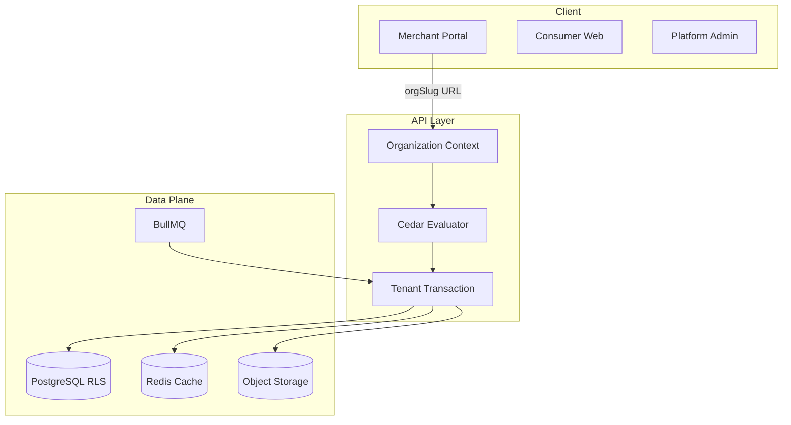

# Multi-Tenancy Threat Model

## Scope

Organization-scoped isolation for the merchant portal, shared PostgreSQL with RLS, in-process Cedar ABAC, background jobs, object storage, caches, analytics, and JIT support access.

**Out of scope at pilot launch:** HIPAA/PHI, contractual RPO/RTO on single-VPS topology.

## Assets

| Asset | Owner |
| --- | --- |
| Organization business data (rewards, KYB, files, keys) | Organization |
| User credentials and MFA secrets | Global user |
| Platform RBAC catalog | Platform |
| Cedar policy bundles | Platform + organization |
| Audit and support-grant records | Platform (tenant-scoped views for org admins) |
| Encryption key metadata | Organization |

## Trust boundaries

## Threat catalog

| ID | Threat | Impact | Mitigation |
| --- | --- | --- | --- |
| T1 | Confused deputy via client tenant header | Cross-tenant read/write | URL slug resolution + membership check; reject client `organizationId` |
| T2 | Slug enumeration | Tenant discovery | Uniform not-found; rate limits |
| T3 | IDOR on organization resources | Data leak | RLS + Cedar + composite FKs |
| T4 | Cross-tenant FK reference | Integrity break | Composite `(organizationId, id)` constraints |
| T5 | Pool/session context bleed | Wrong-tenant query | Transaction-local `SET LOCAL`; fail-closed without context |
| T6 | Implicit RLS bypass | Global data exposure | Remove default bypass; allowlisted system ops only |
| T7 | Stale authorization cache | Post-revocation access | Policy version in cache keys; pub/sub invalidation; seconds SLA |
| T8 | Cache key without org namespace | Cross-tenant cache hit | Prefix keys with env + org + policy version |
| T9 | Worker trusts queue payload | Forged tenant job | Signed job context + re-authorization at execution |
| T10 | Super-admin permanent impersonation | Unaudited full access | JIT grants, read-only default, expiry, tenant approval |
| T11 | Tenant policy lockout / escalation | Admin loss / privilege gain | Platform forbids, simulation, protected policy-admin role |
| T12 | Object storage path traversal | Cross-tenant file access | Org namespace prefixes + authz on download |
| T13 | Analytics/metadata leakage | Tenant inference | Metadata-only platform analytics; tenant-tagged warehouse rows |
| T14 | Incomplete tenant deletion | Regulatory/residual data | Erasure saga + backup expiry + deletion certificate |
| T15 | Slug reuse after rename | Wrong-tenant routing | Slug history reservation |
| T16 | Mixed-tenant API batch | Cross-tenant mutation | Single org context per request |
| T17 | Realtime subscription bleed | Live data leak | Per-channel authz + revalidation on revocation |
| T18 | Support grant without approval | Unauthorized access | Tenant or two-person emergency approval |
| T19 | Encryption key misuse | Decrypt without audit | Envelope keys + audited decrypt operations |
| T20 | Migration partial state | Exposure during cutover | Expand/backfill/contract gates; shadow Cedar parity |

## Abuse cases (detailed)

### AC1: Attacker swaps `X-Merchant-Org-Id` to victim org

**Precondition:** Valid session, not a member of victim org.  
**Attack:** Send API request with victim org header.  
**Expected:** 404 uniform not-found; no RLS-visible rows.

### AC2: Attacker reuses old slug after org rename

**Precondition:** Org renamed from `acme` to `acme-corp`.  
**Attack:** Request `/orgs/acme/...`.  
**Expected:** Redirect or not-found per slug history policy; never attach to wrong org.

### AC3: Policy admin removes all owners

**Precondition:** Tenant policy admin with builder access.  
**Attack:** Publish policy denying all `OrganizationOwner` actions.  
**Expected:** Simulation blocks last-owner removal; platform forbid prevents owner strip.

### AC4: Worker job forged without signature

**Precondition:** Compromised queue producer.  
**Attack:** Enqueue job with arbitrary `organizationId`.  
**Expected:** Signature verification fails; job rejected and audited.

## Verification requirements

- Two-tenant integration tests per resource class
- RLS policy coverage tests per classified table
- Cedar golden tests for guardrail + tenant templates
- Cache isolation tests across org switch
- Job context tampering tests
- Support grant expiry and revocation tests
- Migration reconciliation checksums before cutover

## References

- [Data classification inventory](./data-classification-inventory.md)
- ADRs 008–013
