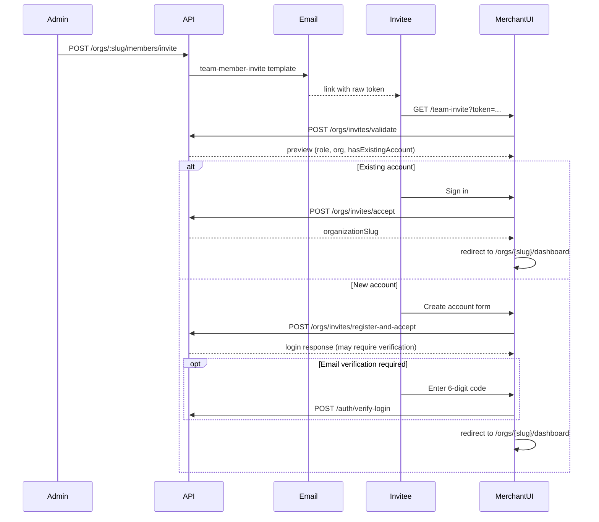

# Team member invitations

Organization admins and owners can invite staff (cashiers, members, policy admins, etc.) to join their merchant organization. Invited users land on `/team-invite?token=...` in the merchant app, where they either sign in with an existing account or create a new one, accept the invite, and are redirected to the organization dashboard.

This document covers the full implementation: database model, API endpoints, RLS/system-operation patterns, auth changes, shared contracts, client wiring, merchant UI, seed data, and how to test locally.

---

## Table of contents

1. [Overview](#overview)
2. [User flows](#user-flows)
3. [Database model](#database-model)
4. [API endpoints](#api-endpoints)
5. [Service layer](#service-layer)
6. [RLS and system operations](#rls-and-system-operations)
7. [Auth session changes](#auth-session-changes)
8. [Email](#email)
9. [Shared schemas and contracts](#shared-schemas-and-contracts)
10. [Client API wiring](#client-api-wiring)
11. [Merchant UI](#merchant-ui)
12. [Auth routing changes](#auth-routing-changes)
13. [UI polish](#ui-polish)
14. [Circular import fix](#circular-import-fix)
15. [Seed data and local testing](#seed-data-and-local-testing)
16. [Error reference](#error-reference)
17. [File index](#file-index)
18. [Troubleshooting](#troubleshooting)

---

## Overview

### What was built

| Layer | What |
| ----- | ---- |
| **Database** | `organization_invitations` extended for `TEAM_MEMBER` invites with role, location scope, and lifecycle status |
| **API — admin** | Invite, list pending invites, revoke (under `/orgs/:orgSlug/members/...`) |
| **API — public** | Validate invite token, register-and-accept (create account + accept + auto-login) |
| **API — authenticated** | Accept invite for signed-in users |
| **Auth** | Merchant login allowed when user has a pending team invite but no membership yet |
| **Email** | `team-member-invite` transactional template with accept link |
| **Merchant UI** | `/team-invite` page with preview, sign-in link, create-account form, and email verification step |
| **Shared** | Zod schemas, API routes, contracts, client mutations |

### Actors

| Actor | Action |
| ----- | ------ |
| **Org owner/admin** | Sends invite from org settings (or API) |
| **Invitee (existing account)** | Opens link → signs in → accepts |
| **Invitee (new account)** | Opens link → creates password → verifies email → lands on dashboard |

### High-level sequence



---

## User flows

### Flow A — Admin sends an invite

1. An org **owner** or **admin** calls `POST /api/v1/orgs/:orgSlug/members/invite` with:
   - `email` — invitee address
   - `role` — one of `ADMIN`, `MEMBER`, `POLICY_ADMIN`, `CASHIER` (not `OWNER`)
   - `locationScopeType` — `ALL_LOCATIONS` or `SELECTED`
   - `locationIds` — required when scope is `SELECTED`
2. API checks the invitee is not already a member and no duplicate pending invite exists.
3. A cryptographically random token is generated; only its SHA-256 hash is stored.
4. Email is sent with link: `{merchantAppUrl}/team-invite?token={rawToken}`
5. Invite expires after **7 days**.

### Flow B — Invitee opens the link (validate)

1. Merchant page loads `/team-invite?token=...`
2. On mount, `POST /api/v1/orgs/invites/validate` returns a preview:
   - Organization name and slug
   - Intended role and location scope
   - Invited email and expiry
   - `hasExistingAccount` — drives which UI branch to show

### Flow C — Existing account

1. UI shows **"Sign in to accept"** with a link to:
   ```
   /auth/login?redirect=/team-invite?token=...&email={invitedEmail}
   ```
2. Login page prefills email via `defaultEmail` prop.
3. After login, user returns to team-invite page.
4. If signed-in email matches invite → **Accept invitation** button appears.
5. `POST /api/v1/orgs/invites/accept` creates membership and marks invite `ACCEPTED`.
6. User is redirected to `/orgs/{slug}/dashboard`.

### Flow D — New account (register-and-accept)

1. UI shows registration form: full name, read-only email, password + strength meter.
2. Client validates with `OrganizationTeamInviteRegisterAcceptSchema`.
3. `POST /api/v1/orgs/invites/register-and-accept`:
   - Creates consumer account
   - Sends verification email if unverified
   - Accepts invite (creates membership)
   - Auto-logs in via `authService.login`
4. Login response variants handled by UI:
   - **`requiresVerification: true`** → show 6-digit code form → `verifyLogin` → dashboard
   - **`isLoginSuccess`** → session cookies set → dashboard
   - **`isLoginRestrictedEnrollment`** → restricted session → enrollment redirect path

### Flow E — Wrong account signed in

If the authenticated user's email does not match the invite email, the UI shows a warning and a link to sign in with the invited address. The API returns `ORGANIZATION_INVITE_EMAIL_MISMATCH` if accept is attempted with the wrong email.

---

## Database model

### `organization_invitations`

Defined in `apps/api/prisma/schema.prisma`.

| Column | Team-invite usage |
| ------ | ----------------- |
| `id` | UUID primary key |
| `organizationId` | Target merchant org |
| `email` | Invitee email (case-insensitive match on accept) |
| `tokenHash` | SHA-256 of raw invite token (unique) |
| `kind` | `TEAM_MEMBER` (vs `PLATFORM_ONBOARDING` for merchant onboarding) |
| `intendedRole` | Role granted on accept (`CASHIER`, `ADMIN`, etc.) |
| `locationScopeType` | `ALL_LOCATIONS` or `SELECTED` |
| `status` | `PENDING` → `ACCEPTED` / `REVOKED` / `EXPIRED` |
| `createdByAdminId` | Inviting user |
| `acceptedByUserId` | Set when invite is accepted |
| `expiresAt` | Epoch ms (7-day TTL) |
| `acceptedAt` | Epoch ms on accept |

### `organization_invitation_location_scopes`

Junction table linking a `SELECTED`-scope invite to specific `organization_locations`.

### Enums

- `OrganizationInvitationKind`: `PLATFORM_ONBOARDING`, `TEAM_MEMBER`
- `OrganizationInvitationStatus`: `PENDING`, `ACCEPTED`, `EXPIRED`, `REVOKED`

---

## API endpoints

All paths are versioned via `apiPath()` → `/api/v1/...`.

### Public invite endpoints

Controller: `apps/api/src/modules/organization/controllers/organization-team-invite.controller.ts`  
Base path: `@Controller(apiPath("/orgs/invites"))`

| Method | Path | Auth | RLS | Description |
| ------ | ---- | ---- | --- | ----------- |
| `POST` | `/orgs/invites/validate` | `@Public()` | `@RlsBypass()` | Return invite preview for a token |
| `POST` | `/orgs/invites/register-and-accept` | `@Public()` | `@RlsBypass()` + `SetAuthCookiesInterceptor` | Create account, accept invite, auto-login |

### Authenticated invite endpoint

| Method | Path | Auth | Description |
| ------ | ---- | ---- | ----------- |
| `POST` | `/orgs/invites/accept` | JWT required | Accept invite for signed-in user |

### Admin management endpoints

Controller: `apps/api/src/modules/organization/controllers/organization.controller.ts`  
Base path: `@Controller(apiPath("/orgs"))`

| Method | Path | Description |
| ------ | ---- | ----------- |
| `GET` | `/orgs/:orgSlug/members/invites` | List pending team invites |
| `POST` | `/orgs/:orgSlug/members/invite` | Send a new team invite |
| `POST` | `/orgs/:orgSlug/members/invites/:inviteId/revoke` | Revoke a pending invite |

Route constants live in `packages/shared/src/api-routes.ts` under `apiRoutes.organizations.teamInvites.*`.

---

## Service layer

Primary service: `apps/api/src/modules/organization/services/organization-membership.service.ts`

### Key constants

| Constant | Value |
| -------- | ----- |
| `INVITE_TTL_DAYS` | `7` |
| `TEAM_MANAGER_ROLES` | `["OWNER", "ADMIN"]` — required to invite/list/revoke |
| Token generation | `randomBytes(32).toString("hex")`, stored as `sha256Hex(token)` |

### Methods

| Method | Visibility | Purpose |
| ------ | ---------- | ------- |
| `inviteMember` | public | Create invite, send email, audit |
| `listPendingInvites` | public | List pending invites (tenant-scoped) |
| `revokeInvite` | public | Mark invite `REVOKED` |
| `validateTeamInvite` | public | Resolve token → preview DTO |
| `acceptTeamInvite` | public | Authenticated accept |
| `registerAndAcceptTeamInvite` | public | Create account + accept + return email for login |
| `acceptTeamInviteForUser` | private | Create membership, mark invite accepted |
| `findValidTeamInvite` | private | Hash lookup, expiry check |

### Accept logic (`acceptTeamInviteForUser`)

1. Verify invitee email matches authenticated user (case-insensitive).
2. Run system operation `organization.membership.accept`:
   - Reject if user is already a member.
   - Build location scope rows via `buildMembershipLocationScopeRows`.
   - Create `organizationMembership` with `intendedRole` and location scopes.
   - Call `inviteRepository.markAcceptedInTx`.
3. Record audit event `membership.invite_accepted`.
4. Return `{ organizationSlug, message: "Invitation accepted" }`.

### Repository

`apps/api/src/modules/organization/repositories/organization-invite.repository.ts`

All team-invite DB writes use `*InTx` methods designed to run inside system-operation transactions:

| Method | Purpose |
| ------ | ------- |
| `createTeamInviteInTx` | Insert `TEAM_MEMBER` invite + optional location scopes |
| `findTeamInviteByTokenHashInTx` | Lookup pending invite by hash |
| `listPendingTeamInvitesInTx` | List pending invites for org |
| `findPendingTeamInviteInTx` | Single pending invite by ID |
| `findPendingTeamInviteByEmailInTx` | Duplicate-check before create |
| `markAcceptedInTx` | Set `ACCEPTED`, `acceptedByUserId`, `acceptedAt` |
| `markRevokedInTx` | Set `REVOKED` |

---

## RLS and system operations

Team invites touch `organization_invitations`, which is protected by Row Level Security. Writes to this table require RLS bypass — they cannot run in a normal tenant transaction.

### Two bypass mechanisms

#### 1. Request-level `@RlsBypass()`

Used on **public** endpoints that unauthenticated users hit:

- `POST /orgs/invites/validate`
- `POST /orgs/invites/register-and-accept`

Decorator: `apps/api/src/modules/auth/decorators/rls-bypass.decorator.ts`  
Interceptor: `apps/api/src/common/interceptors/rls.interceptor.ts`

> **Important:** `@Public()` alone does **not** bypass RLS. Public endpoints that query tenant-owned tables must also use `@RlsBypass()`.

#### 2. Transaction-level `withSystemOperation`

Used for all invite CRUD and membership creation:

| Operation | Used for |
| --------- | -------- |
| `organization.membership.invite` | Create, revoke, resolve invite by token |
| `organization.membership.accept` | Accept invite + create membership |
| `auth.pre_login` | Check account existence, existing membership |

Registry: `apps/api/src/prisma/system-operation.registry.ts`  
Executor: `apps/api/src/prisma/tenant-transaction.service.ts` — sets `app.rls_bypass = 'true'` inside the transaction.

### Why invite create initially failed (500)

The original invite-create path ran inside a tenant transaction without bypass. Postgres returned `42501` (insufficient privilege) on `INSERT INTO organization_invitations`. The fix wraps all invite writes in `withSystemOperation("organization.membership.invite", ...)`.

### Accept endpoint RLS note

`POST /orgs/invites/accept` is authenticated but **not** `@RlsBypass()` at the controller level. The service layer uses `withSystemOperation("organization.membership.accept")` for the actual membership write.

---

## Auth session changes

**File:** `apps/api/src/modules/auth/services/auth-session.service.ts`

### Problem

New invitees have no `organizationMembership` yet. Before this change, merchant login threw `MERCHANT_ACCESS_REQUIRED` because the session issuer required an active merchant org membership.

### Fix

When `clientType === "merchant"` and the user has **no** active merchant membership and lacks `MANAGE` on `MERCHANT_ORG`:

1. Count pending `TEAM_MEMBER` invitations where:
   - `email` matches the user
   - `status = PENDING`
   - `expiresAt > now`
2. If count is **0** → throw `MERCHANT_ACCESS_REQUIRED`
3. If count **> 0** → allow session issuance so the user can reach `/team-invite` and accept

This enables the **existing-account** flow: sign in first, then accept.

---

## Email

### Template

**File:** `apps/api/src/modules/notifications/email/templates/team-member-invite-email.template.ts`

| Property | Value |
| -------- | ----- |
| Template key | `team-member-invite` |
| Subject | `"You've been invited to join a team"` |
| Props | `to`, `organizationName`, `roleLabel`, `locationSummary`, `inviteUrl`, `expiresInDays` |

### Sending behavior

- Sent from `inviteMember` via `emailSender.send(new TeamMemberInviteEmailTemplate({...}))`.
- Email failure is **logged but does not roll back** the invite record.
- In non-production, the invite URL is also printed to the API console:
  ```
  [team-member-invite] email=... url=https://merchant.../team-invite?token=...
  ```

See [Email + Webhook Setup](./email-setup.md) for Resend configuration.

---

## Shared schemas and contracts

**Schemas:** `packages/shared/src/schemas/domain/organization/organization.ts`  
**Routes:** `packages/shared/src/api-routes.ts`  
**Contracts:** `packages/shared/src/contracts/index.ts`

### Zod schemas

| Schema | Type alias | Purpose |
| ------ | ---------- | ------- |
| `OrganizationTeamInviteTokenSchema` | `OrganizationTeamInviteTokenInput` | `{ token }` — validate & accept |
| `OrganizationTeamInviteRegisterAcceptSchema` | `OrganizationTeamInviteRegisterAcceptInput` | `{ token, fullName, password }` — new account |
| `OrganizationTeamInvitePreviewSchema` | `OrganizationTeamInvitePreview` | Invite preview response |
| `OrganizationTeamInviteAcceptResponseSchema` | `OrganizationTeamInviteAcceptResponse` | `{ organizationSlug, message }` |

Admin-side (sending invites):

| Schema | Purpose |
| ------ | ------- |
| `OrganizationMemberInviteSchema` | Invite request body |
| `OrganizationMemberInviteResponseSchema` | Pending invite list item |
| `OrganizationMemberInviteCreatedResponseSchema` | `{ inviteId, message }` |

### Validation rules

- Token: 16–256 characters
- Invite roles: `ADMIN`, `MEMBER`, `POLICY_ADMIN`, `CASHIER` (not `OWNER`)
- Password: `strongPassword` from `packages/shared/src/schemas/auth/password.ts`

### Contracts

| Contract key | Method | Input | Output |
| ------------ | ------ | ----- | ------ |
| `validateTeamInvite` | POST | `OrganizationTeamInviteTokenSchema` | `OrganizationTeamInvitePreviewSchema` |
| `acceptTeamInvite` | POST | `OrganizationTeamInviteTokenSchema` | `OrganizationTeamInviteAcceptResponseSchema` |
| `registerAndAcceptTeamInvite` | POST | `OrganizationTeamInviteRegisterAcceptSchema` | `LoginClientResponseSchema` |

---

## Client API wiring

**File:** `packages/client/src/lib/api/endpoints.ts`

| Mutation | Contract | Response | Notes |
| -------- | -------- | -------- | ----- |
| `api.organizations.validateTeamInvite` | `validateTeamInvite` | `OrganizationTeamInvitePreviewSchema` | Public |
| `api.organizations.acceptTeamInvite` | `acceptTeamInvite` | `OrganizationTeamInviteAcceptResponseSchema` | Requires auth cookies |
| `api.organizations.registerAndAcceptTeamInvite` | `registerAndAcceptTeamInvite` | `LoginClientResponseSchema` | Sends `X-Client-Type: merchant` |

`registerAndAcceptTeamInvite` returns a **login response** (not `OrganizationTeamInviteAcceptResponse`) because the endpoint auto-logs the user in after account creation.

---

## Merchant UI

**File:** `apps/merchant/app/team-invite/page.tsx`  
**Route:** `/team-invite?token=<invite-token>`

### Component structure

| Component | Responsibility |
| --------- | -------------- |
| `TeamInvitePage` | Page shell — grid background, header, footer |
| `TeamInviteRouteContent` | Reads `token` from search params; shows invalid-invite card if missing |
| `TeamInviteContent` | All business logic — mutations, auth state, forms |
| `InviteDetailRow` | Reusable detail row (icon, label, value) |

### State and mutations

| State / mutation | Purpose |
| ---------------- | ------- |
| `validateMutation` | Fetch invite preview on mount |
| `acceptMutation` | Accept for authenticated existing users |
| `registerMutation` | Create account + register-and-accept |
| `verifyLoginMutation` | Complete email verification after register |
| `handleAuthLoginResponse` | Unified handler for all login response variants |
| `loginVerificationId` | Tracks verification-pending state |
| `joinedOrganizationSlug` | Stored during verification for post-verify redirect |

### UI states

1. **Loading** — validating token
2. **Load error** — invalid/expired token or API unreachable
3. **Preview** — org avatar initials, role badge, email, locations, expiry
4. **Existing account, not signed in** — sign-in CTA with redirect + email prefill
5. **Existing account, signed in, email match** — accept button
6. **Existing account, signed in, email mismatch** — warning + sign-in-with-invited-email link
7. **New account** — registration form with password strength meter
8. **Email verification** — 6-digit code input after register-and-accept
9. **Form error** — inline error banner for API failures

### Login response handling

`handleAuthLoginResponse` mirrors the standard login form behavior:

```typescript
if (isLoginVerificationPending(response)) → show verification form
if (isLoginRestrictedEnrollment(response)) → restricted session + enrollment redirect
if (isLoginSuccess(response)) → authLogin() + navigate to dashboard
else → "Unexpected sign-in response" error
```

The verification step was added because `register-and-accept` calls `authService.login`, which returns `requiresVerification: true` for new unverified accounts instead of immediate session cookies.

---

## Auth routing changes

### `apps/merchant/lib/auth/routes.ts`

Added `/team-invite` to `MERCHANT_AUTH_ROUTE_PREFIXES`. The page is treated as a public auth path — no forced login redirect, no session revalidation blocking.

### `apps/merchant/proxy.ts`

- `isAllowedPostLoginRedirect()` explicitly allows `/team-invite*` paths.
- When an authenticated user visits `/auth/login?redirect=/team-invite?token=...`, the proxy redirects back to team-invite instead of `/`.

### `apps/merchant/app/auth/login/page.tsx`

Reads `redirect` and `email` query params and passes them to `LoginForm` as `redirectPath` and `defaultEmail`.

### `packages/client/src/lib/auth/forms/login-form.tsx`

Added optional `defaultEmail` prop:

```typescript
readonly defaultEmail?: string; // Prefills email (team invite / onboarding return links)
```

Initialized via `useState(defaultEmail ?? "")`.

### `apps/merchant/lib/session/root-provider.tsx`

Uses `isMerchantAuthPath()` so `/team-invite` works without unauthorized redirects.

---

## UI polish

### Grid background

**File:** `apps/merchant/app/merchant-theme.css`

| Class | Description |
| ----- | ----------- |
| `.merchant-grid-bg` | Original grid — 28×28px, 55% border opacity |
| `.merchant-grid-bg-subtle` | Softer variant — 36×36px, 20% border opacity, gentler radial mask |

Applied to:

- `/team-invite` — `merchant-grid-bg-subtle`
- `/onboarding` — `merchant-grid-bg-subtle`

Both pages also use gradient blur orbs for visual depth.

### Team invite page layout

- Organization avatar with initials
- Role badge with human-readable label
- Detail rows for email, role, locations, expiry
- Responsive card layout with aligned action buttons
- Password strength meter on registration form

---

## Circular import fix

### Problem

`organization.ts` imported `strongPassword` from `auth.ts`, which imported `OrganizationSlugSchema` from `organization.ts`. This caused a runtime crash: `ReferenceError: Cannot access 'strongPassword' before initialization`.

### Solution

Extracted `strongPassword` into a standalone module:

**File:** `packages/shared/src/schemas/auth/password.ts`

Updated imports in:

- `packages/shared/src/schemas/auth/auth.ts` — re-exports from `./password`
- `packages/shared/src/schemas/auth/change-password.ts`
- `packages/shared/src/schemas/domain/organization/organization.ts` — imports from `../../auth/password`
- `packages/shared/src/schemas/domain/rewards/rewards-kyb.ts`

---

## Seed data and local testing

### Seeded team invite

**Files:**

- `apps/api/prisma/seed/organizations.ts`
- `apps/api/prisma/seed/rewards.ts` (prints credentials on seed)

| Field | Value |
| ----- | ----- |
| Organization | Brew & Bean KL (`brew-bean-kl`) |
| Invitee email | `alice.kl@kl-rewards.demo` |
| Invitee password | `AliceKl@123` |
| Role | `CASHIER` |
| Location scope | `SELECTED` → Bukit Bintang |
| Raw token | `seed_team_invite_token_kl_alice` |
| Accept URL | `/team-invite?token=seed_team_invite_token_kl_alice` |
| Invite ID | `3178a4d1-6915-4eb3-bf84-6fb14e1feb71` |

The seeded user exists but has **no membership** — designed to test the existing-account accept flow.

### Local dev setup

```bash
# Rebuild shared package after schema/route changes
pnpm --filter @workspace/shared build

# Start API (port 8080)
pnpm --filter api dev

# Start merchant app (port 3003)
pnpm --filter merchant dev
```

### Test scenarios

| Scenario | Steps | Expected result |
| -------- | ----- | --------------- |
| **Validate invite** | Open `http://localhost:3003/team-invite?token=seed_team_invite_token_kl_alice` | Preview shows Brew & Bean KL, CASHIER role |
| **Existing account accept** | Sign in as `alice.kl@kl-rewards.demo` → Accept | Redirect to `/orgs/brew-bean-kl/dashboard` |
| **New account** | Send invite to a fresh email → fill registration form | Verification code form → dashboard |
| **Wrong email** | Sign in as different user on invite page | Warning banner, accept blocked |
| **Admin invite** | `POST /orgs/brew-bean-kl/members/invite` as owner | Email sent (or console URL in dev) |
| **Revoke** | `POST /orgs/brew-bean-kl/members/invites/:id/revoke` | Token no longer validates |

---

## Error reference

| Error / status | When | User-facing message (typical) |
| -------------- | ---- | ----------------------------- |
| `404` on validate | Invalid/revoked/expired token | "This invitation could not be found..." |
| `ORGANIZATION_INVITE_EMAIL_MISMATCH` | Accept with wrong signed-in email | "Sign in with the invited email address..." |
| `MERCHANT_ACCESS_REQUIRED` | Merchant login with no membership and no pending invite | "Merchant access required..." |
| `400` duplicate invite | Pending invite already exists for email | "A pending invitation already exists..." |
| `400` already member | Invitee or accepter is already a member | "User is already a member..." / "You are already a member..." |
| `400` account exists | Register-and-accept for existing email | "An account already exists... Sign in to accept" |
| Login `requiresVerification` | New account, email unverified | Verification code form (not an error) |

---

## File index

### API

| File | Role |
| ---- | ---- |
| `apps/api/src/modules/organization/controllers/organization-team-invite.controller.ts` | Public invite endpoints |
| `apps/api/src/modules/organization/controllers/organization.controller.ts` | Admin invite management |
| `apps/api/src/modules/organization/services/organization-membership.service.ts` | Core invite logic |
| `apps/api/src/modules/organization/repositories/organization-invite.repository.ts` | DB access (`*InTx` methods) |
| `apps/api/src/modules/organization/utils/organization-membership-location-scope.util.ts` | Location scope row builder |
| `apps/api/src/modules/auth/services/auth-session.service.ts` | Pending-invite login bypass |
| `apps/api/src/modules/notifications/email/templates/team-member-invite-email.template.ts` | Email template |
| `apps/api/src/prisma/system-operation.registry.ts` | `organization.membership.invite` / `.accept` |
| `apps/api/prisma/schema.prisma` | `organization_invitations` model |
| `apps/api/prisma/seed/organizations.ts` | Seed invite record |

### Shared + client

| File | Role |
| ---- | ---- |
| `packages/shared/src/schemas/domain/organization/organization.ts` | Team invite Zod schemas |
| `packages/shared/src/schemas/auth/password.ts` | `strongPassword` (circular import fix) |
| `packages/shared/src/api-routes.ts` | Route path constants |
| `packages/shared/src/contracts/index.ts` | API contracts |
| `packages/client/src/lib/api/endpoints.ts` | Client mutations |
| `packages/client/src/lib/auth/forms/login-form.tsx` | `defaultEmail` prop |

### Merchant UI

| File | Role |
| ---- | ---- |
| `apps/merchant/app/team-invite/page.tsx` | Invite accept page |
| `apps/merchant/app/auth/login/page.tsx` | Redirect + email prefill |
| `apps/merchant/proxy.ts` | Post-login redirect allowlist |
| `apps/merchant/lib/auth/routes.ts` | Public auth path prefixes |
| `apps/merchant/app/merchant-theme.css` | Subtle grid background |

---

## Troubleshooting

### `404` on `register-and-accept` after deploying changes

Restart the API dev server. NestJS must reload the new controller route. Rebuild shared first:

```bash
pnpm --filter @workspace/shared build && pnpm --filter api dev
```

### `42501` RLS violation on invite create

Ensure invite writes use `withSystemOperation("organization.membership.invite", ...)`, not a plain tenant transaction.

### `MERCHANT_ACCESS_REQUIRED` on login before accepting

Confirm `auth-session.service.ts` includes the pending team invite count check. The user must have a `PENDING` `TEAM_MEMBER` invite matching their email.

### "Unexpected sign-in response" after register

The login response likely returned `requiresVerification: true`. The team-invite page must handle `isLoginVerificationPending` and show the verification code form.

### Invite email not received

Check `EMAIL_MODE` in API `.env`. In development, the accept URL is logged to the API console regardless of email delivery.

### Token expired

Invites expire after 7 days. Admin must send a new invite (or revoke and re-invite).

---

## Related documentation

- [Multi-Tenancy](./multi-tenancy.md) — RLS and tenant isolation
- [ADR 012: System Operations](./adr/012-system-operations.md) — bypass registry pattern
- [ADR 007: Tenancy and RLS Bypass](./adr/007-tenancy-and-rls-bypass.md) — when bypass is allowed
- [Authorization & RBAC](./authorization.md) — org roles and permissions
- [API Routes](./api-routes.md) — route constant conventions
- [Email + Webhook Setup](./email-setup.md) — transactional email configuration
- [Merchant Onboarding](./merchant-onboarding.md) — `PLATFORM_ONBOARDING` invites (different flow)
