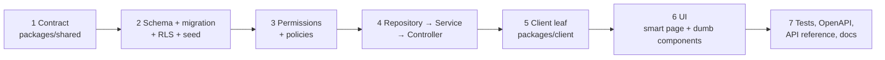

# Adding a feature

The process (scoping, ownership, the plan you write *before* coding) is
[`rules/15-feature-development-process.md`](../../rules/15-feature-development-process.md). The
copy-the-shape example of every layer is
[`rules/24-golden-reference-implementations.md`](../../rules/24-golden-reference-implementations.md).
The live template in this repo is the **sample category** module: contract
`packages/shared/src/schemas/domain/catalog/sample-category.ts`, API
`apps/api/src/modules/sample-category/`, admin pages `apps/admin/app/(panel)/catalog/categories/`.



## Checklist

1. **Contract** (`packages/shared`)
   - Zod schemas for inputs and the response in `src/schemas/domain/<area>/` (no `z.any`, explicit
     limits, list queries through the list-query helpers).
   - Path(s) in `src/api-routes.ts`; contract leaf in `src/contracts/index.ts`.
2. **Database** (`apps/api/prisma`)
   - Model in `schema.prisma` with `isDeleted` / `deletedAt` / `deletedBy`, epoch-ms timestamps,
     indexes for every filter and sort; `pnpm db:migrate:create --name <change>` ([Database](./database.md)).
   - RLS: manifest entry in `prisma/rls/manifest-index.ts` and policies; `pnpm db:check-rls-manifest`.
   - Seed rows for every new table and column (`db:check-seed-coverage` fails otherwise).
3. **Authorization**
   - New permission(s) in `packages/shared/src/authorization/permission.ts` and the seed's permission
     catalog; merchant features use `MERCHANT_CAPABILITY`.
   - Record-dependent rules via `@Authorize` / the kernel ([recipes](./authorization/recipes.md)).
4. **API** (`apps/api/src/modules/<feature>/`)
   - Repository (extends the base repository: soft delete, list paging), service (business rules,
     transactions, race-condition protection), controller (`@Controller(apiPath(...))`,
     `@ZodBody`/`@ZodQuery`/`@ZodParams`, `@ZodResponse`, permission decorators).
   - Side effects that other systems need → outbox event in the same transaction ([Messaging](./messaging.md)).
5. **Client** — typed leaf in `packages/api-client/src/router.ts` (re-exported by `@workspace/client/lib/api/endpoints`).
6. **UI** — page (smart) under the right app, presentational pieces in `@workspace/ui` if reusable,
   menu entry in the app's sidebar JSON with its authorization requirement, `can()` mirroring the API.
7. **Tests** — unit tests for every function, controller/service specs, e2e for authorization, RLS
   and the happy path ([rules/11](../../rules/11-testing-vitest.md)).
8. **Generated artifacts and docs**
   - `pnpm --filter @workspace/api openapi:export` (commits `docs/generated/openapi.json`).
   - Capture samples for the new endpoints (`apps/docs/scripts/capture-api-samples.mjs`) and run
     `pnpm docs:api` ([how](./api/README.md#how-the-reference-is-generated)).
   - User-guide page if operators see it; ADR if you made an architectural decision.
9. **Gate** — `pnpm run lint` and `pnpm run test` (plus `pnpm run typecheck`) after your last edit.

## Resetting your database during development

```bash
pnpm db:reset      # drops everything, migrations, generate, RLS, seed
```

Stop `pnpm dev` first so workers are not writing while RLS is re-applied.
