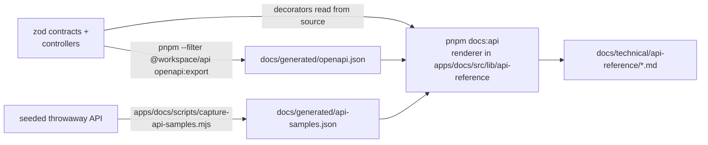

# API conventions

Every endpoint, with a real request and response captured from the seeded API, is in the
**[API reference](../api-reference/README.md)**. This page explains what they have in common.

## Base URL and versions

- Business routes: `https://<api-host>/api/v1/...` (`apiPath()`); unversioned: `/`, `/health*`,
  `/version`, `/notifications/email-webhook` ([architecture §6](../architecture.md#6-api-versioning)).
- Swagger UI: `/v1/docs`, JSON at `/v1/docs-json`. On by default outside production and public there;
  in production it is off unless `SWAGGER_ENABLED=1`, and then only SuperAdmins can open it.
- Paths are defined once in `packages/shared/src/api-routes.ts` ([routes](./routes.md)).

## Authentication

| Caller | Credential | Notes |
| --- | --- | --- |
| Browser apps | httpOnly cookies set by `POST /api/v1/auth/login` | Send `X-Client-Type: web \| admin \| merchant` on login (or `?client_type=`) to pick the cookie pair |
| Server-to-server with a user | `Authorization: Bearer <access token>` | A Bearer token wins over cookies |
| POS / integrations | `X-API-Key: mk_live_…` (or `Authorization: Bearer mk_live_…`) | Merchant API keys; POS keys only on `/redemptions/*` ([POS](../pos-integration.md)) |
| Machine callbacks | Signature or shared secret | Resend webhook (svix signature), storage callback (`x-storage-callback-secret`) |

Restricted sessions (email not verified, or 2FA enrollment overdue) get `403 RESTRICTED_SESSION` on
everything except the setup routes ([authentication](../security/authentication.md)).

## CSRF: `X-Mutation-Intent`

Cookie-authenticated `POST` / `PUT` / `PATCH` / `DELETE` requests must send
`X-Mutation-Intent: same-origin` **and** come from an origin in `CORS_ORIGINS`. The typed client and
the Next.js proxies add it. Bearer-token and API-key callers and the machine routes are exempt.

## Envelopes

```json
{ "success": true, "data": { "…": "…" }, "meta": { "correlationId": "x9lQL-lxZl1dsIXjFTo0Z", "timestamp": 1791096202425 } }
```

```json
{ "success": false, "error": { "code": "VALIDATION_ERROR", "message": "Validation failed", "details": { "issues": [ { "path": "rewardId", "message": "Field 'rewardId' must be a valid uuid", "code": "format" } ] } }, "meta": { "correlationId": "…", "timestamp": 1791096581165 } }
```

- Branch on `error.code`, never on `message`. Quote `meta.correlationId` (also the
  `X-Correlation-Id` header) in bug reports. Full contract: [Errors](./errors.md).
- A few routes return a raw body (`GET /version`, file downloads, the SSE stream).
- Timestamps are epoch milliseconds (UTC); money is integer minor units (sen).
- Responses are validated against their contract before they leave the API
  ([response contracts](./response-contracts.md)).

## Lists

`?page=&limit=` (default 50, max 100) or keyset `?cursor=` from `meta.nextCursor`; `?sort=-createdAt,name`
(whitelisted fields, max 3); `?filter[field]=value` or `?filter[field][op]=value`; `?search=` where
supported. Details and the per-endpoint allowed fields: [List queries](./list-queries.md).

## Idempotency and concurrency

- POS checkout takes an `idempotencyKey` in the body; routes marked `@Idempotent()` accept an
  `Idempotency-Key` header. A retry with the same key and body replays the first result; the same
  key with a different body is `409`.
- Updates of versioned records send the `version` they read (`PATCH /auth/profile`, catalog
  updates); a stale version is a conflict.

## Rate limits

Per client IP: a default limiter (`THROTTLE_DEFAULT_LIMIT`, 300 per `THROTTLE_TTL_MS` = 60 s) and a
strict limiter for auth routes (30), tightened per route (login 5/min, signup and resets lower). POS
calls are limited per API key (120/min). Over the limit: `429 RATE_LIMITED` with
`error.details.retryAfterSeconds`. The client IP honours `X-Forwarded-For` only from `TRUST_PROXY`.

## How the reference is generated



1. **OpenAPI** — `pnpm --filter @workspace/api openapi:export` rewrites `docs/generated/openapi.json`
   from the running code; the API's e2e suite fails when it is stale.
2. **Access rules** — the renderer reads `@Public`, `@RequirePermission`, `@Authorize`,
   `@SuperAdminOnly`, `@UseGuards(MerchantApiKeyGuard)`, `@Throttle`, `@RlsBypass`, … from
   `apps/api/src/**/*.controller.ts` and keys them by operation id (`Controller_method`).
3. **Samples** — real calls against a freshly seeded API on a throwaway database (the script
   header lists the exact commands). Ids, names and codes come from the seed or earlier responses in
   the same run; session tokens, signed links, generated API keys and one-time secrets are redacted;
   arrays are cut to two items. Endpoints that cannot be captured are listed with the reason.
4. **Render** — `pnpm docs:api` writes `docs/technical/api-reference/`. The docs unit tests
   (`apps/docs/src/lib/api-reference/api-reference.artifact.test.ts`) fail when the committed pages
   differ from what the three inputs render, when a controller cannot be matched, or when a new
   OpenAPI tag has no page.

When you change an endpoint: export OpenAPI, re-capture (or add the endpoint to the capture
script), run `pnpm docs:api`, commit all three outputs.

Per-endpoint domain error codes appear in the reference only where the contract declares them
(explicit responses or the operation description). Describing every non-obvious error in the zod →
OpenAPI description is the standard in [`rules/14`](../../../rules/14-documentation.md#api-documentation-practices).
