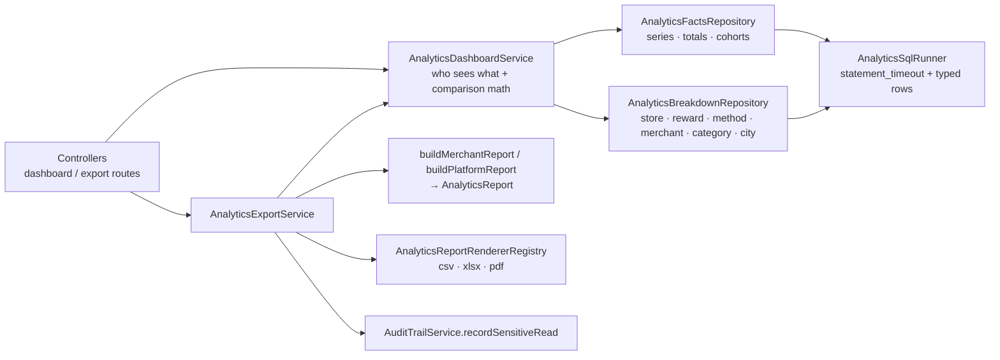

# Analytics API — dashboards and exports

Five routes serve every analytics screen. The JSON shapes live in
`packages/shared/src/schemas/domain/rewards/analytics-dashboard.ts`, the range grammar in
`analytics-range.ts`, the export rules in `analytics-export.ts`; the generated
[API reference](../api-reference/README.md) lists every field.

| Route | Who | Response |
| --- | --- | --- |
| `GET /api/v1/claims/analytics/dashboard` | the signed-in customer (self only) | `CustomerAnalyticsDashboard` |
| `GET /api/v1/orgs/{orgSlug}/analytics/dashboard` | member with `merchant:view_analytics` (or an INTEGRATION API key), within their store scope | `MerchantAnalyticsDashboard` |
| `GET /api/v1/admin/analytics/dashboard` | `READ ANALYTICS` | `AdminAnalyticsDashboard` |
| `GET /api/v1/orgs/{orgSlug}/analytics/export` | as the merchant dashboard | the report file |
| `GET /api/v1/admin/analytics/export` | `READ ANALYTICS` | the report file |

The weekly v1 summaries (`/claims/analytics`, `/orgs/{orgSlug}/analytics`,
`/admin/analytics/sales`) are unchanged for API clients; no web, merchant or admin screen reads them
any more — every analytics screen uses the dashboards
([Analytics dashboards](../frontend/analytics-charts.md)).

## Range, interval and time zone

| Parameter | Meaning | Default |
| --- | --- | --- |
| `from` | epoch ms, **inclusive** | `to` − 30 days (`DEFAULT_ANALYTICS_RANGE_DAYS`) |
| `to` | epoch ms, **exclusive** | now |
| `interval` | `day` \| `week` \| `month` | ≤ 31 days → `day`, ≤ 183 days → `week`, longer → `month` (`defaultAnalyticsInterval`) |
| `locationId` | merchant only: one store | every store the caller may see |
| `format` | exports only: `csv` \| `xlsx` \| `pdf` | required |

- The range is half-open and **never re-aligned**: totals cover exactly `[from, to)`. "September"
  in the merchant's zone is `from = Sep 1 00:00`, `to = Oct 1 00:00`.
- At most **366 days** (`MAX_ANALYTICS_RANGE_DAYS`, plus one DST hour). Longer, or `from ≥ to`, is
  `400 VALIDATION_ERROR` whose `details.issues[].message` names the limit. The same zod refinement
  runs in the browser.
- Buckets are generated **in Postgres** (`generate_series` over local wall-clock time) and cut at
  local midnight / Monday 00:00 / the 1st: a day is 23 or 25 hours across a DST change, a month
  its real length. The first and last bucket are clipped to the range and flagged `isPartial`.
  Every bucket is present; empty ones are zero.
- Zone: the merchant's `Organization.timeZone`; **UTC** for the admin and customer views (the same
  rule as the v1 summaries). `range.timeZone` says which — label buckets in it. Members read the
  merchant's zone up front in `GET /orgs/{orgSlug}/context` (`organization.timeZone`).
- Every KPI is `{ value, previous, change, changePercent }` against the equally long range before
  (`range.previousFrom` / `previousTo`). `changePercent` has one decimal and is `null` when
  `previous` is 0.
- Money is integer minor units of `currency` (sen); bill totals are summed as 64-bit and carried
  as safe JSON integers.

## What each dashboard holds

| | Totals | Series (per bucket) | Breakdowns |
| --- | --- | --- | --- |
| Merchant | sales, bills, average bill, claims, redemptions, conversion rate, customers | sales, bills, average bill, claims, redemptions | `byStore` (every active store in scope, plus stores with activity, plus `locationId: null` for store-less bills — all-stores callers only), `byReward` (25 most active), `byRedemptionMethod` (every method) |
| Admin | as merchant + active merchants, customers, **new** and **returning** customers | as merchant + new / returning customers | `topMerchants` (10), `byCategory`, `byCity` |
| Customer | spent, visits, average bill, claims, redemptions, conversion rate, merchants, referrals sent (started in the range), referrals credited (`creditedAt` in the range), referral rewards earned (referrer credit claims received) | spent, visits, claims, redemptions | `spendingByCategory`, `spendingByMerchant` (5), each with its own `series`; `claimsByStatus` (claims made in the range by current status, every status) |

"New" = the customer's first bill **ever** (platform-wide) falls in the bucket/range; "returning"
= they bought before. Claims count live claims of live rewards (a merchant counts the rewards
offered at its stores); redemptions count live redemptions of live claims, at the store they
happened.

### Sample: merchant dashboard

Real response from the seeded API (arrays cut to two items):

```http
GET /api/v1/orgs/brew-bean-kl/analytics/dashboard?interval=week
X-Client-Type: merchant
Cookie: <session cookies from POST /api/v1/auth/login>
```

```json
{
  "success": true,
  "data": {
    "range": { "from": 1788596410877, "to": 1791188410877, "timeZone": "Asia/Kuala_Lumpur", "interval": "week", "previousFrom": 1786004410877, "previousTo": 1788596410877 },
    "currency": "MYR",
    "firstBillAt": 1759625940000,
    "totals": {
      "salesMinor": { "value": 292705, "previous": 264767, "change": 27938, "changePercent": 10.6 },
      "bills": { "value": 101, "previous": 93, "change": 8, "changePercent": 8.6 },
      "conversionRate": { "value": 87.8, "previous": 86.1, "change": 1.7, "changePercent": 2 }
    },
    "series": [
      { "start": 1788596410877, "end": 1788710400000, "isPartial": true, "salesMinor": 14143, "bills": 5, "averageBillMinor": 2829, "claims": 5, "redemptions": 5 },
      { "start": 1788710400000, "end": 1789315200000, "isPartial": false, "salesMinor": 69394, "bills": 23, "averageBillMinor": 3017, "claims": 31, "redemptions": 23 }
    ],
    "byStore": [{ "locationId": "c178a4d1-6915-4eb3-bf84-6fb14e1feb6d", "name": "Brew & Bean KL — Bukit Bintang", "city": "KUALA_LUMPUR", "salesMinor": 292705, "bills": 101, "averageBillMinor": 2898, "redemptions": 101 }],
    "byReward": [{ "rewardId": "ca5e4873-45fa-4124-b24b-14ef2df21d7c", "title": "Morning brew club — free refill", "claims": 52, "redemptions": 50, "conversionRate": 96.2 }],
    "byRedemptionMethod": [{ "method": "SCAN", "redemptions": 66 }, { "method": "MANUAL", "redemptions": 35 }]
  },
  "meta": { "correlationId": "…", "timestamp": 1791188410890 }
}
```

(`totals` also carries `averageBillMinor`, `claims`, `redemptions` and `customers`.) The admin and
customer samples are in the [API reference](../api-reference/platform-admin.md) and
[customer rewards](../api-reference/customer-rewards.md).

## Exports

`GET …/analytics/export?from=&to=&interval=&format=` (merchant: plus `locationId`). `from` and
`to` are **required**, so a file is reproducible and its name deterministic.

```http
GET /api/v1/orgs/brew-bean-kl/analytics/export?from=1788596410692&to=1791188410692&format=xlsx
X-Client-Type: merchant
Cookie: <session cookies from POST /api/v1/auth/login>

HTTP/1.1 200 OK
Content-Type: application/vnd.openxmlformats-officedocument.spreadsheetml.sheet
Content-Disposition: attachment; filename="analytics_brew-bean-kl_2026-09-05_2026-10-05_day.xlsx"; filename*=UTF-8''analytics_brew-bean-kl_2026-09-05_2026-10-05_day.xlsx
Cache-Control: private, no-store, max-age=0
X-Content-Type-Options: nosniff

<8924 bytes>
```

- **File name** (`analyticsExportFileName`): `analytics_<org slug | platform>_<first day>_<last
  included day>_<interval>.<ext>`, days in the report's zone, only `[a-z0-9-]` in the subject.
- **Errors** keep the JSON error envelope: `400 VALIDATION_ERROR`, `401`, `403` / `404` (not a
  member), `429 ANALYTICS_EXPORT_RATE_LIMITED` (with `Retry-After`), `503 ANALYTICS_QUERY_TIMEOUT`.
- **Rate limit:** 10 exports per caller (user, or API key) per 10 minutes
  (`ANALYTICS_EXPORT_RATE_LIMIT` / `…_WINDOW_MS` in `@workspace/shared`), counted in the shared
  Redis throttler store so every API instance enforces one budget.
- **Audit:** every export writes one `audit_logs` row before a byte is sent — actor, impersonator,
  organization, IP, device, endpoint, query, and as `response_body`
  `{ export: { report, subject, format, fileName, from, to, timeZone, interval, rowCounts } }`
  (never the data). If the row cannot be written the export fails with `500`.
- **Time budget:** every report statement runs with `SET LOCAL statement_timeout = 10 s`
  (`ANALYTICS_STATEMENT_TIMEOUT_MS`); a cancelled statement is `503 ANALYTICS_QUERY_TIMEOUT`. The
  366-day cap and the bounded breakdowns keep a report to a handful of indexed aggregates.

| Format | Library | Layout |
| --- | --- | --- |
| CSV | none (RFC 4180) | UTF-8 with BOM, CRLF; metadata, KPI summary, then each table with its title and header. Money as `1234.50` with the currency in the header, dates `YYYY-MM-DD` in the report's zone. Text cells starting with `= + - @` TAB or CR are prefixed with `'` (CSV injection). |
| XLSX | `write-excel-file` (one dependency, `fflate`; maintained) | "Summary" sheet (typed KPIs + metadata) and one sheet per table; money and counts are number cells with a number format, percentages are fractions formatted `0.0%`, bucket starts are date cells showing the local day; header row frozen; text is shared strings (never a formula). |
| PDF | `pdfkit` (streams, vector drawing, embeds font subsets) | Branded header (`APP_NAME`), subject, range + zone + interval + comparison range, KPI cards, vector bar / line charts of the main series (`pdf-chart.ts`), every table paginated with its header repeated, "page n of m" footer. Renders **English, Malay, Tamil, Simplified Chinese and Hindi** — see [Fonts and scripts](#fonts-and-scripts-in-the-pdf). |

### Fonts and scripts in the PDF

PDFKit draws a string in one font and does not fall back per glyph, so every string the PDF draws
(titles, KPI labels, table cells, chart labels, footers — and the width measurements behind table
layout and "…" truncation) goes through `PdfText` (`report/renderers/pdf-text.ts`): it splits the
text into runs by Unicode script (`segmentByScript`) and draws each run in its family's font on a
shared baseline. Spaces, digits and punctuation stay in the surrounding run when its font has the
glyph; other letters use the Latin fallback.

| Script | Font (SIL OFL 1.1) | Source |
| --- | --- | --- |
| Latin — English, Malay (fallback) | Noto Sans | `@expo-google-fonts/noto-sans@0.4.2` |
| Tamil | Noto Sans Tamil | `@expo-google-fonts/noto-sans-tamil@0.4.3` |
| Devanagari — Hindi | Noto Sans Devanagari | `@expo-google-fonts/noto-sans-devanagari@0.4.1` |
| Han — Simplified Chinese | Noto Sans SC | `@expo-google-fonts/noto-sans-sc@0.4.3` |

- The regular and bold TTFs and each family's `OFL.txt` are bundled in `apps/api/assets/fonts/`
  (≈ 22 MB, almost all of it Noto Sans SC). Each file is referenced by a static
  `new URL("…", import.meta.url)`, so the build emits them to `dist/assets/` next to `main.js` and
  they resolve relative to the bundle — the API works from any working directory; unbundled (tests,
  `tsx`) they resolve next to the source. `ReportFontRegistry` loads and
  checks them **once at startup** — the file exists, it is the expected family, it can draw its
  sample text, the licence is there — and the API refuses to boot otherwise. A test pins each
  file's SHA-256 (`report/fonts/report-fonts.ts`).
- **Adding a language** is one entry in `REPORT_FONT_FAMILIES`: its Unicode ranges, its two font
  files with their hashes, its licence and a sample text.
- **Shaping:** Tamil and Devanagari need OpenType shaping; fontkit (inside PDFKit) applies it per
  run. The tests check known words glyph by glyph — `தமிழ்` (zha + pulli ligature), `கொ`
  (two-part vowel around the consonant), `हिन्दी` (i-sign reordered before ह, half-form न्),
  `क्षत्रिय` (क्ष and त्र conjuncts).
- Fonts are embedded as **subsets**: a one-page report with all four scripts is ≈ 20 KB, a
  year-long merchant export ≈ 26 KB.
- Extracted text (copy-paste, search) of Tamil and Devanagari follows glyph order — e.g. the i-sign
  comes out before its consonant — as in most PDF producers.

`exceljs` was not chosen: its last release is from 2024 and it pulls `archiver`, `unzipper`,
`tmp` and `uuid@8`. `pdfmake` wraps an older `pdfkit` and needs font files.

### Client

```ts
import { apiDownloads, saveDownloadedFile } from "@workspace/client/lib/api/download";

const { api } = useAuth();
const file = await api.download(apiDownloads.organizations.analyticsExport, { orgSlug, from, to, interval, format: "xlsx" });
saveDownloadedFile(file); // file.blob, file.fileName (from Content-Disposition), file.contentType
```

`api.download` (= `fetchDownload` with the session's refresh pipeline) validates the input with
the shared schema, refuses a body that is not one of the contract's media types, and rejects with
`ApiDownloadError` (`code`, `statusCode`, `retryAfterSeconds`, `correlationId`). Dashboards are
ordinary queries: `api.organizations.analyticsDashboard.useQuery({ orgSlug, from, to, interval })`,
`api.rewardsAdmin.analyticsDashboard`, `api.claims.analyticsDashboard`.

## How the code is laid out



`apps/api/src/modules/rewards/analytics/`:

- `analytics-scope.ts` — `AnalyticsScope` (`platform` / `organization` + store scope / `customer`)
  and the SQL filters for each fact table; a store-limited caller's filter is never "no filter".
- `analytics-sql.ts` — the Postgres bucket generator, the statement-time budget, timeout mapping.
- `report/analytics-report.ts` — the one report model; `report/renderers/*` — one class per
  format behind `AnalyticsReportRenderer`. **A new format** = a value in
  `AnalyticsExportFormatSchema` (+ its content type and extension), one renderer class, one entry
  in the registry; renderers never query the database.

Indexes used: `reward_sales (organization_id, paid_at)`, `(user_id, paid_at)`, `(paid_at)`;
`reward_redemptions (organization_id)`, `(redeemed_at)`; `reward_claims (reward_id)`, `(user_id)`.
The first-bill lookup of new vs returning customers is one `(user_id, paid_at)` probe per buyer.
Composite `reward_redemptions (organization_id, redeemed_at)` and `reward_claims (reward_id,
claimed_at)` indexes would tighten the merchant aggregates on large tenants; they need a generated
migration and are a follow-up.

## Tests

- `apps/api/test/analytics-bucketing.e2e-spec.ts` — buckets against Postgres: DST days (23 h /
  25 h), Monday weeks across DST, months incl. a leap February, partial edges, exclusive `to`.
- `apps/api/test/analytics-dashboard.e2e-spec.ts` — facts placed in the merchant's local day vs
  UTC, totals = series, store scope, new vs returning, validation, 401/403.
- `apps/api/test/analytics-export.e2e-spec.ts` — every format end to end, headers, formula
  neutralised, store scope in the file, the audit row, 401/403/404, the rate limit.
- Unit: renderers (CSV escaping + injection, XLSX parsed back with cell types and frozen panes,
  PDF text extracted through its ToUnicode maps; all five languages in every format), the font
  registry, script segmenter and shaping, chart scale, report builder, comparison math, scope SQL,
  services, guard;
  `packages/client/src/lib/api/download.test.ts`.
