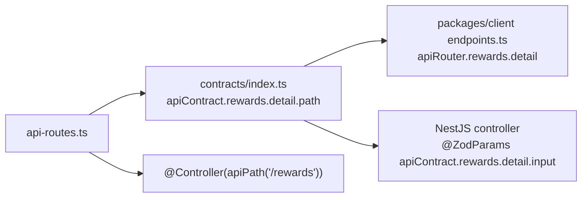

# API Routes — Single Source of Truth

> [!NOTE]
> **TL;DR.** Every API endpoint path lives in one place: `packages/shared/src/api-routes.ts`.
> Contracts, controllers, and the client transport all reference this tree instead of
> hardcoding path strings. This means: change a path once → it propagates everywhere at
> compile time. No drift. No typos. Full autocomplete.

---

## Table of Contents

1. [Why one registry](#1-why-one-registry)
2. [The registry](#2-the-registry)
3. [How each layer consumes it](#3-how-each-layer-consumes-it)
4. [Adding an endpoint](#4-adding-an-endpoint)
5. [Removing an endpoint](#5-removing-an-endpoint)
6. [Tests](#6-tests)
7. [Rules](#7-rules)
8. [Health probes](#8-health-probes)
9. [API docs (Swagger)](#9-api-docs-swagger)
10. [Idempotency](#10-idempotency)

---

## 1. Why one registry

Every path used to be a string in two places — the contract and the controller — so a renamed
controller path silently broke the client with a 404. Now `packages/shared/src/api-routes.ts`
defines each path template once; contracts, controllers and the client read it from there, so a
change propagates at compile time.

## 2. The registry

```ts
// packages/shared/src/api-routes.ts (excerpt)
export const apiRoutes = {
  rewards: {
    list: "/rewards",                                       // static
    detail: "/rewards/:rewardId",                           // parameterized
  },
  organizations: {
    rewards: {
      publish: "/orgs/:orgSlug/rewards/:rewardId/publish",
    },
  },
} satisfies Record<string, RouteTree>;
```

- Every leaf is a plain path string; a parameterized segment is a `:param` placeholder. The client
  router (`endpoints.ts`) fills the placeholders from the contract's validated input, and the
  controller's `@ZodParams` schema must cover every `:segment`.
- Paths do **not** contain the version prefix: `apiPath()` adds `/api/v1` on the server and the
  client transport adds the same `API_VERSION_PREFIX` ([architecture §6](../architecture.md#6-api-versioning)).

## 3. How each layer consumes it



**Contract** (`packages/shared/src/contracts/index.ts`) — method, path, input and response schema:

```ts
detail: defineContract({
  access: "public",
  method: "GET",
  path: apiRoutes.rewards.detail,
  input: z.object({ rewardId: UuidParamSchema }).strict(),
  response: singleResponse(RewardResponseSchema),
}),
```

**Controller** (`apps/api/src/modules/rewards/controllers/consumer-rewards.controller.ts`):

```ts
@Controller(apiPath("/rewards"))
export class ConsumerRewardsController {
  @Public()
  @Get(":rewardId")
  @ZodResponse(RewardResponseSchema, { description: "Reward detail" })
  public getReward(@ZodParams(apiContract.rewards.detail.input) params: { rewardId: string }): ReturnType<ConsumerRewardsService["getPublishedReward"]> {
    return this.consumerRewardsService.getPublishedReward(params.rewardId);
  }
}
```

**Client** (`packages/client/src/lib/api/endpoints.ts`) — a typed leaf whose query key scope is
declared once:

```ts
detail: defineQuery(apiContract.rewards.detail, { scope: ({ rewardId }: { readonly rewardId: string }): QueryKey => ["rewards", "detail", rewardId] }),
```

Pages call `api.rewards.detail.useQuery({ rewardId })`; the response is parsed with the contract's
schema.

## 4. Adding an endpoint

1. Route in `api-routes.ts` (a plain path string; `api-routes.test.ts` checks its shape).
2. Input and response schemas in `packages/shared/src/schemas/…` (responses are never `.strict()`).
3. Contract leaf in `contracts/index.ts` (`singleResponse` / `paginatedResponse`).
4. Client leaf in `endpoints.ts` (`defineQuery` with a `scope`, or `defineMutation`).
5. Controller method: `@ZodBody` / `@ZodQuery` / `@ZodListQuery` / `@ZodParams` with the contract's
   input, exactly one response decorator, the authorization decorators. A `POST` that creates passes
   `{ status: HttpStatus.CREATED }` to the response decorator.
6. `pnpm --filter @workspace/api openapi:export` and `pnpm docs:api`
   ([how the reference is generated](./README.md#how-the-reference-is-generated)).

## 5. Removing an endpoint

Remove the route, contract leaf, client leaf, controller method and tests, then run
`pnpm run typecheck` — every dangling reference is a compile error. Regenerate the OpenAPI export
and the API reference.

## 6. Tests

`packages/shared/src/api-routes.test.ts` covers the tree shape: the core groups exist, and every
leaf is a non-empty absolute path (static or `:param` template). The API e2e suite calls
every `apiContract` leaf under `/api/v1` and fails on a 404 (a controller that forgot `apiPath()`).

```bash
pnpm --filter @workspace/shared test
```

---

## 7. Rules

1. **Every API path must be defined in `api-routes.ts`.** No hardcoded path strings in
   contracts, controllers, or client code. The only exception is truly unversioned root
   routes (`GET /`, `GET /health`, `GET /health/live`, `GET /health/ready`,
   `GET /health/deep`, `GET /version`, `POST /notifications/email-webhook`).

2. **Every route is a plain path string.** Parameterized segments are `:paramName`
   placeholders; the contract's input schema names every one of them.

3. **Contracts reference `apiRoutes` directly** (`path: apiRoutes.rewards.detail`).

4. **Tests live alongside the implementation.** `api-routes.test.ts` checks the shape of
   every leaf.

5. **The route tree mirrors the contract tree.** `apiRoutes.auth.*` → `apiContract.auth.*`
   → `apiRouter.auth.*`. Same shape, same nesting, same naming.


---

## 8. Health probes

Unversioned, public (`@Public()`), served by `HealthController`
(`apps/api/src/modules/health`). All answer in the standard envelope; failures use the
[error envelope](./errors.md).

| Route | Probe | Touches the DB | 200 when | Fails with |
|---|---|---|---|---|
| `GET /health/live` | **liveness** (restart policy) | never | the process answers | — (no answer = dead) |
| `GET /health/ready` | **readiness** (load-balancer rotation) | `SELECT 1`, 2 s timeout | startup finished, not draining, DB up, every **critical** indicator up | 503 `SERVICE_UNAVAILABLE`, `error.details.checks` lists every probe |
| `GET /health` | *deprecated alias* for existing uptime monitors | yes | started (reports `db: "connected" \| "disconnected"`) | 503 while starting/draining only |
| `GET /health/deep` | human/ops diagnostics with module reports | yes | started | 503 while starting/draining only |

Why liveness never touches dependencies: restarting a process does not fix a database outage,
and killing an instance that is draining (`markNotReady()` during graceful shutdown) drops
in-flight requests.

Module indicators (queue/BullMQ, Kafka, RabbitMQ) are registered in
`module-health-indicators.provider.ts` as **non-critical**: they are reported by
`/health/ready` and `/health/deep` but never flip readiness, because every instance would fail
a shared broker probe at the same moment and a broker blip would become a full API outage
(jobs and events are buffered by BullMQ retries and the transactional outbox). Mark an
indicator `critical: true` only when the API truly cannot serve requests without it. See
[ADR 006](../../adr/006-module-health-indicators.md).

Kubernetes example:

```yaml
livenessProbe:  { httpGet: { path: /health/live,  port: 8080 }, periodSeconds: 10 }
readinessProbe: { httpGet: { path: /health/ready, port: 8080 }, periodSeconds: 5, failureThreshold: 2 }
```

---

## 9. API docs (Swagger)

Swagger UI is mounted at `apiDocsPath()` (`/v1/docs`; `/docs` redirects there) with the
OpenAPI document at `/v1/docs-json` / `/v1/docs-yaml`. Exposure is decided by
`resolveApiDocsPolicy()` in `apps/api/src/config/api-config.schema.ts`:

| `SWAGGER_ENABLED` | development / test | production |
|---|---|---|
| unset | **on**, public | **off** |
| `1` / `true` | on, public | on, **SuperAdmin-only** |
| `0` / `false` | off | off |

In production the docs are an attack-surface map, so they are off unless explicitly enabled,
and then every docs URL (UI, `-json`/`-yaml`, assets, `/docs`) is gated by
`ApiDocsAccessGate` (`apps/api/src/common/api-docs-access.gate.ts`): the caller needs a valid,
non-revoked access token of a platform SuperAdmin — the admin panel's `adminAccessToken`
cookie or `Authorization: Bearer …`. No token / an invalid token → `401 UNAUTHORIZED`; a
non-SuperAdmin → `403 FORBIDDEN` (standard error envelope). Every endpoint still enforces its
own authentication and authorization regardless of the docs.

**Calling protected endpoints from Swagger UI — no token to paste.** `AuthGuard` accepts a
`Bearer` token or a session cookie, and picks the cookie by `X-Client-Type`
(`admin` → `adminAccessToken`, `merchant` → `merchantAccessToken`, otherwise `accessToken`).
Swagger UI sends **`X-Client-Type: admin` by default** (`swaggerClientTypeInterceptor` in
`apps/api/src/common/api-docs.ts`), so:

1. Log in to the admin panel (or call `POST /auth/login` from Swagger — it then sets the
   admin cookies), and open the docs on the **same host as the cookie**:
   `http://localhost:8080/v1/docs` (with `COOKIE_DOMAIN=localhost` the browser never sends
   the cookies to `http://127.0.0.1:8080`).
2. "Try it out" — the browser attaches the httpOnly `adminAccessToken` cookie
   (`withCredentials`).

To act as a web or merchant session instead, set **X-Client-Type** under **Authorize** to
`web` / `merchant` (persisted across reloads). A token entered under **bearer** takes
priority over any cookie. Every operation declares this, derived from the same `@Public()`
metadata `AuthGuard` enforces (`applyOperationSecurity`): protected routes accept the bearer
token *or* the selected session cookie; `@Public()` routes require nothing. A blank
`Authorization: Bearer ` header is ignored, so it never hides a valid cookie. Turn the docs off per deployment with `SWAGGER_ENABLED=0`; any other value
(e.g. `yes`) fails boot. The same document is committed as `docs/generated/openapi.json`
([response contracts](./response-contracts.md)).

### Request bodies, query strings and path params — declared once, from zod

TypeScript types are erased at runtime, so a handler written as
`@Body(new ZodValidationPipe(Schema)) body: z.output<typeof Schema>` is validated but invisible to
Swagger (it reflects `Object` → no `requestBody`, no parameters, nothing to "Try it out"). Declare
every request input with the decorators in `apps/api/src/common/decorators/zod-request.decorators.ts`
instead — one schema, two jobs:

| Input | Decorator | Documented as |
|---|---|---|
| JSON body | `@ZodBody(Schema) body: Input` | `requestBody` (`application/json`) |
| Query string (object schema) | `@ZodQuery(Schema) query: Query` | one `in: query` parameter per key |
| Paginated list query (`defineListQuery(...).schema`) | `@ZodListQuery(Schema) query: ListQuery` | `page`, `limit`, `cursor`, `sort`, `filter`, `search` (+ resource params) as `in: query` parameters |
| All route params (object schema) | `@ZodParams(Schema) params: Params` | one `in: path` parameter per key |
| One route param (value schema) | `@ZodParam("id", UuidParamSchema) id: string` | `in: path` parameter `id` |

```ts
@Post()
public create(@ZodBody(CreateProductSchema) body: z.output<typeof CreateProductSchema>) { … }

@Get(":id")
public get(@ZodParams(ProductIdParamSchema) params: { id: string }) { … }
```

- **Validation is unchanged.** Each decorator applies the existing `ZodValidationPipe` (compiled
  Ajv, `400 { message: "Validation failed", errors: [{ path, message, code }] }` → the
  `VALIDATION_ERROR` envelope in [Errors](./errors.md)).
- **Documentation is derived.** The schema is attached through Nest 12's native
  `@Body({ schema, pipes })` option; `buildOpenApiDocument()` (`apps/api/src/common/api-docs.ts`)
  converts it with `zodStandardSchemaConverter` (`common/openapi/zod-openapi-schema.ts`, zod's
  `z.toJSONSchema(..., { target: "openapi-3.0", io: "input" })`). Required keys, types, enums,
  formats, min/max, defaults, `nullable`, and `.describe()` / `.meta({ description, example })`
  all land in the document; Swagger UI pre-fills "Try it out" from them. `io: "input"` means a
  `.default()` key is shown as optional — that is what a client may omit.
- **Describe fields in the schema, not the controller.** Add `.describe("…")` or
  `.meta({ description: "…", example: … })` to the shared zod schema. Do not add `@ApiBody`,
  `@ApiQuery` or `@ApiParam` that restate the schema — they are a second source of truth
  (rules/05-contracts-zod-api.md). Keep `@ApiBody` only for inputs no zod schema validates
  (e.g. a raw webhook body verified by signature).
- **Recursive schemas** (`z.lazy`, e.g. `JsonValueSchema`) become `components.schemas` entries
  named `ZodSchema_<hash>`; the names are deterministic, so identical schemas share one component.
- **List endpoints use `@ZodListQuery`.** It nests `filter[field][op]` bracket keys
  (`BracketQueryPipe`, prototype-pollution safe) and parses with zod so the handler receives the
  typed filter AST; the `sort` / `filter` parameter descriptions list the whitelisted fields. The
  grammar, the Prisma translators and the client adapter are in [List queries](./list-queries.md).
- `@ZodParams(schema)` validates the whole `params` object, so its schema must cover **every**
  `:segment` of the route (extend `OrganizationSlugParamSchema` rather than mixing it with a bare
  `@Param("otherId")`).

### Responses — documented AND enforced, from the same zod schema

Every route handler declares its response with exactly one decorator from
`apps/api/src/common/decorators/zod-response.decorators.ts` (ADR 022, guide:
[Response contracts](./response-contracts.md)):

| Handler returns | Decorator | Client receives |
|---|---|---|
| one value | `@ZodResponse(Schema)` | `{ success: true, data, meta: { correlationId, timestamp } }` |
| one list-grammar page (`PaginatedServiceResult`) | `@ZodPaginatedResponse(ItemSchema)` | `{ success: true, data: Item[], meta: { limit, total, page, totalPages, nextCursor, hasNext, hasPrevious, correlationId, timestamp } }` |
| a body consumed outside the typed client with a fixed raw shape (the unversioned `GET /version` manifest) | `@ZodRawResponse(Schema)` | the value itself, no envelope |

Options: `{ status?: HttpStatus, description?: string }` — `status` (default `200`) is both sent
(`HttpCode`) and documented.

```ts
@Post()
@ZodResponse(ProductSchema, { status: HttpStatus.CREATED, description: "Created product" })
public create(@ZodBody(CreateProductSchema) body: CreateProductInput): Promise<Product> { … }

@Get()
@ZodPaginatedResponse(ProductSchema, { description: "Paginated list of products" })
public list(@ZodListQuery(ProductListQuerySchema) query: ProductListQuery): Promise<PaginatedServiceResult<Product>> { … }
```

- **Documented** — the success status with the full envelope (converted with
  `zodStandardSchemaConverter`, `io: "output"`), plus `4XX` and `5XX` → the standard error envelope
  (`ApiErrorResponseDto`, [Error model](./errors.md)). Keep specific error docs
  (`@ApiResponse({ status: 409, type: ApiErrorResponseDto, description })`) where they help.
- **Enforced** — the global `ResponseInterceptor` parses the handler result with the schema, once.
  Unknown keys are **stripped** (an internal field — a hash, a token, a cost price — can never reach
  the wire); a mismatch is a server bug: logged at `error` with the route and failing paths (never
  the values), answered with `500 INTERNAL_ERROR`. A JSON route **without** a contract is refused
  the same way before its handler runs.
- **Type-checked** — the decorator only compiles on a handler whose return type is assignable to
  the schema's input: a controller returning a Prisma row with `bigint` / `Date` columns does not
  build. Map to the contract DTO (epoch-ms numbers) in the service or repository.
- **Response schemas are never `.strict()`** — the API strips, and clients must ignore fields added
  later (rules/05 change-safety matrix). The response document therefore never says
  `additionalProperties: false`; request bodies still do.
- **Pass-through, deliberately**: `@Sse()` streams and `@SkipEnvelope()` routes that write their own
  reply (binary downloads) — currently `EmailLogController.stream` and
  `FilesController.localDownload`. Adding another is a reviewed decision; the e2e test pins the list.

`apps/api/test/openapi-document.e2e-spec.ts` builds the real document and fails when any
`@Body` / `@Query` / `@Param` is not validated by `ZodValidationPipe` with its schema attached, when
an operation that takes a body has no `requestBody`, when a validated query/path key or a
`{templated}` path segment is undocumented, or when a `$ref` dangles — and, for responses, when a
JSON route has no contract, when the sent status differs from the documented one, when the success
/ `4XX` / `5XX` responses are missing, when a response schema is closed (`.strict()`), or when an
`apiContract` leaf and its handler use different response schemas. Snapshots of
`POST /api/v1/product` and `POST /api/v1/auth/login` pin representative bodies.

### Exported artifact — `docs/generated/openapi.json`

The same document is committed as `docs/generated/openapi.json`: keys sorted at every depth,
two-space indent, trailing newline (`serializeOpenApiArtifact`,
`apps/api/src/common/openapi/openapi-artifact.ts`), so it is reproducible byte for byte and every
API change shows up as a reviewable diff. Regenerate it after changing a route, a request schema
or a response contract:

```bash
pnpm openapi:export          # = turbo run openapi:export --filter=@workspace/api (needs Postgres + Redis, like test:e2e)
```

`apps/api/test/openapi-artifact.e2e-spec.ts` (part of `pnpm --filter @workspace/api test:e2e`)
fails while the committed file is stale; `openapi:export` is that spec run with `--update`.

---

## 10. Idempotency

Non-idempotent endpoints that clients may retry (creates, charges, submits) opt in with
`@Idempotent()` (`apps/api/src/platform/idempotency/idempotent.decorator.ts`); `POST /product`
is the reference usage. The decorator only records metadata: `IdempotencyInterceptor` is a
global interceptor (AppModule), between the audit and response interceptors, so it stores and
replays the exact wire body. Works for user sessions AND API-key (POS) callers.

The client sends an `Idempotency-Key` header — any 8–128 characters of `[A-Za-z0-9._:-]`,
typically a UUID generated once per user action and reused for every retry of that action.

| Situation | Response |
|---|---|
| No header | Runs normally (`@Idempotent({ required: true })` → 400 `IDEMPOTENCY_KEY_REQUIRED`). |
| Malformed header / sent twice | 400 `VALIDATION_ERROR` |
| No authenticated principal (user or API key) | 401 — anonymous keys are refused. |
| Body that is not JSON (multipart, form, raw bytes) | 415 `UNSUPPORTED_MEDIA_TYPE` — it cannot be fingerprinted. |
| First request with a key | Runs; the successful response is stored for **24 h**. |
| Identical retry (same principal, tenant, route, URL, canonical body) | **Replayed without running the handler**, same status, `Idempotent-Replayed: true`, fresh `meta.correlationId`/`timestamp`. |
| Same key, different method/URL/body | 409 `IDEMPOTENCY_KEY_REUSED` |
| Same key while the first request is still running | 409 `IDEMPOTENCY_REQUEST_IN_PROGRESS` + `Retry-After: 1`. |
| The handler failed (any error) | The key is released — errors are **not** cached; a retry re-executes. |
| The handler succeeded but storing the response failed | The key is **kept** (never re-executes while the lease lasts), the client gets the real response, the failure is logged at `error` (`idempotency.store_failed`). |

**Scope.** A key lives in `http:<principal>|org:<id>:store:<id>:loc:<id>|<METHOD> <route template>`:
the principal is `user:<id>` (plus `:as:<impersonator>` while impersonating) or `key:<apiKeyId>`,
and the tenant is the server-verified one from the request context (never a raw header) — the same
user can never replay one organization's response in another.

**Ledger.** `platform_resource_idempotency_records` (RLS bypass-only, `http.idempotency` system
operation). A row is `IN_PROGRESS` with a 60-second lease and a fresh **fencing token**
(`lease_token`) while the handler runs, then `COMPLETED` with the response and a 24-hour replay
window. `complete`/`release` succeed only for the current token while its lease is live, so a
request that outlived its lease can never overwrite or free its successor's record (logged as
`idempotency.lease_lost`). The unique `(scope, idempotency_key)` index lets exactly one concurrent
request acquire a key; expired rows are taken over by a conditional update.

**Retention.** Rows expired for more than 1 hour are deleted in batches of 500 (60-second budget per
run) under `idempotency.retention`: by an hourly BullMQ job scheduler when Redis is configured
(always in production), otherwise by an in-process interval — retention always runs.

> [!WARNING]
> HTTP-layer idempotency is **at-most-once per lease, not exactly-once**: the business write and
> the ledger update are separate transactions. If the process dies after committing the write but
> before storing the response, a retry after the lease expires runs again. For payments and other
> exactly-once operations, back the operation with a unique business key written in the same
> transaction as the business row (as POS checkout does) — see `rules/09-messaging-and-jobs.md`.

The IETF draft (`draft-ietf-httpapi-idempotency-key-header`) suggests 422 for a reused key; this
API uses 409 for both conflicts and distinguishes them by `error.code`.
