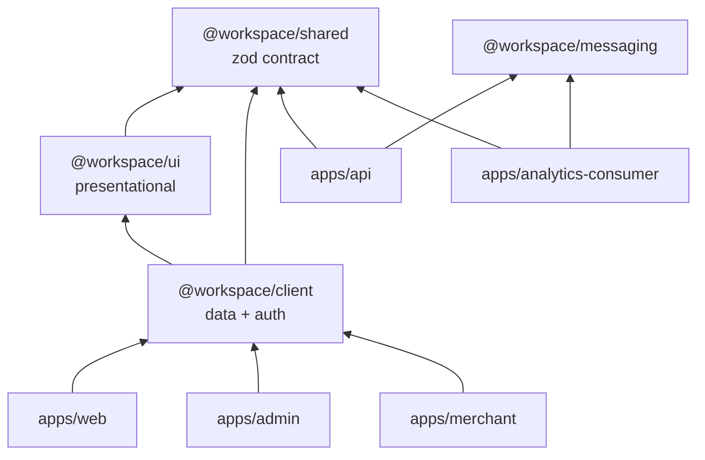
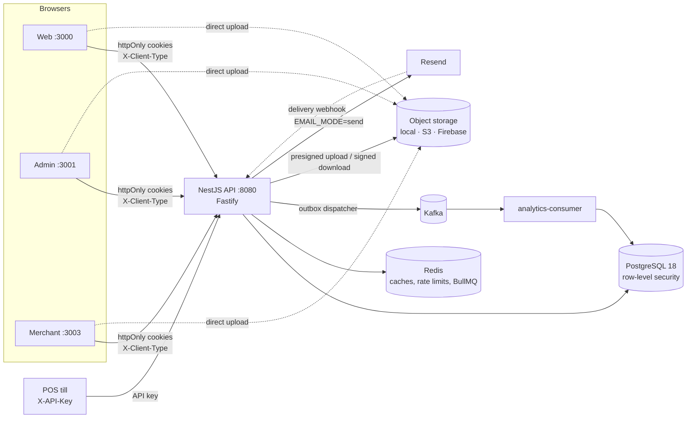
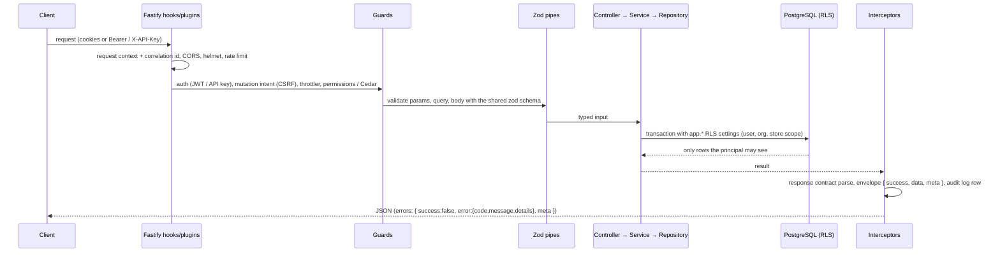

# Architecture

A Turborepo monorepo: one NestJS API (on Fastify) in front of PostgreSQL, three Next.js
frontends, a Kafka analytics consumer, an AWS CDK stack for storage, and shared packages that make
the API contract one zod schema from database to browser. The non-negotiable rules behind every
design choice are in [`rules/00-non-negotiables.md`](../../rules/00-non-negotiables.md); where code
belongs in detail is [`rules/01-repository-architecture.md`](../../rules/01-repository-architecture.md).

## 1. Workspaces

| Path | Package | What it is | Port |
| --- | --- | --- | --- |
| `apps/api` | `@workspace/api` | NestJS 12 on Fastify: every endpoint, auth, authorization, Prisma, queues, outbox | 8080 |
| `apps/web` | `@workspace/web` | Customer app (RewardHub) | 3000 |
| `apps/admin` | `@workspace/admin` | Platform admin panel | 3001 |
| `apps/merchant` | `@workspace/merchant` | Merchant portal (`/orgs/[orgSlug]/…`) | 3003 |
| `apps/docs` | `@workspace/docs` | This documentation site (Astro, static) | 3002 |
| `apps/analytics-consumer` | `@workspace/analytics-consumer` | Kafka consumer → inbox (dedupe) → `analytics_events` | — |
| `apps/aws-infrastructure` | `@workspace/aws-infrastructure` | CDK stack: S3 buckets, CloudFront, API upload user ([AWS S3](./storage/aws-s3.md)) | — |
| `packages/shared` | `@workspace/shared` | Zod schemas, `apiContract`, `apiRoutes`, permissions — **the contract** | — |
| `packages/client` | `@workspace/client` | Typed API client (TanStack Query), auth/session, `can()`, shared auth forms | — |
| `packages/ui` | `@workspace/ui` | Presentational, data-agnostic components (shadcn/ReUI based) | — |
| `packages/messaging` | `@workspace/messaging` | Reusable Redis / BullMQ / Kafka / RabbitMQ wiring | — |
| `packages/tooling` | `@workspace/tooling` | Repo scripts: `ci:local`, secret scan, migration-history check, syncpack | — |
| `packages/eslint-config`, `packages/typescript-config` | | Shared lint and compiler presets | — |

Dependencies only point **down**. `ui` never imports `client`; frontends never import Prisma or
NestJS; the API never imports frontend code. ESLint import-boundary rules enforce this
([ESLint](./tooling/eslint.md)).

## 2. Runtime topology

- **Cookies, not tokens in JavaScript.** Each frontend has its own cookie pair
  (`X-Client-Type: web | admin | merchant`), so a web login never grants admin access. The Next.js
  `proxy.ts` of each app refreshes an expiring session server-side on navigation
  ([Token refresh](./security/token-refresh.md)).
- **Files never pass through the API**: the browser uploads straight to storage with a short-lived
  ticket, then the API verifies and finalizes ([Object storage](./storage/overview.md)).
- **Kafka is optional** and fed only through the transactional outbox; BullMQ (Redis) runs
  in-process jobs ([Messaging](./messaging.md)).

## 3. Request lifecycle (API)

- **Validation:** `@ZodBody` / `@ZodQuery` / `@ZodParams` with schemas from `@workspace/shared`; the
  client validates with the same schemas ([API conventions](./api/README.md)).
- **Responses:** `@ZodResponse` documents *and* enforces the response shape; Swagger and
  `docs/generated/openapi.json` are generated from it ([Response contracts](./api/response-contracts.md)).
- **Errors:** one envelope from one global filter ([Errors](./api/errors.md)).
- **Authorization:** permissions, ACL / store scope, Cedar policies, then PostgreSQL RLS as the
  last line of defence ([Authorization](./authorization/overview.md),
  [Database security](./security/database-security.md)).
- **Audit:** every state-changing request writes one append-only `audit_logs` row
  ([ADR 025](../adr/025-global-http-audit-log.md)).

## 4. Who owns what

| Concern | Owner |
| --- | --- |
| Shape of every request/response | `packages/shared` (zod) |
| Path of every endpoint | `packages/shared/src/api-routes.ts` ([Routes](./api/routes.md)) |
| Validation | Server always (authoritative); client with the same schema for UX |
| Authorization | API guards + services; RLS in PostgreSQL; frontend `can()` only hides UI |
| Persistence | Repositories over Prisma, soft delete everywhere ([Database](./database.md)) |
| Rendering | Next.js smart components fetch; `@workspace/ui` components only render props |
| Configuration | One zod env schema per app, parsed once at boot ([Configuration](./configuration/api.md)) |

## 5. Tenancy

The **organization** is the tenant. Merchant routes carry it in the URL (`/orgs/{orgSlug}/…`);
the API resolves the slug to an organization the caller is an active member of, then every query
runs in a transaction whose PostgreSQL settings name the user, organization and store scope.
`TENANCY_ENABLED=false` (default) runs single-tenant against `DEFAULT_ORGANIZATION_ID`. Details:
[Tenancy and RLS](./authorization/tenancy-and-rls.md) and ADRs 007–014.

## 6. API versioning

`packages/shared/src/contracts/versioning.ts` is the single source of truth:
`API_VERSION = "v1"`, `API_VERSION_PREFIX = "/api/v1"`, `apiPath()` and `apiDocsPath()` (`/v1/docs`).

- Business controllers use `@Controller(apiPath("/auth"))`; the client transport prepends the
  same prefix. Only `/`, `/health*`, `/version` and `POST /notifications/email-webhook` are
  unversioned (the webhook URL is registered at Resend and must not move).
- An e2e drift test calls every `apiContract` leaf under `/api/v1` and fails on a 404; the ESLint
  rule `no-unversioned-controller` rejects a controller path that skips `apiPath()`.
- `GET /version` returns the version manifest; on a 404 the client retries against the current
  version. `Accept-version: v2` rewrites the path for clients that cannot change URLs.
  Deprecated versions get a `Sunset` header.
- Adding v2: add it to the `ApiVersion` union, annotate changed contract leaves with
  `version: "v2"`, serve both versions during the migration, then deprecate v1.

## 7. Build and module resolution

- The API is bundled with **Rspack** (`pnpm dev` = watch + restart, `pnpm build` → `dist/main.js`);
  `tsc` only type-checks. Fastify replaced Express entirely.
- Next.js apps compile `@workspace/shared`, `client` and `ui` from source (`transpilePackages`); the
  API consumes the built `dist/` of `@workspace/shared` (Turbo builds it first).
- Turbo caches `build`, `lint`, `typecheck` and `test`; `dev`, `db:*` and `deps:*` are uncached.

## Related

[Dos and don'ts](./dos-and-donts.md) · [Adding a feature](./adding-a-feature.md) ·
[Architecture decisions (ADRs)](../adr/README.md)
