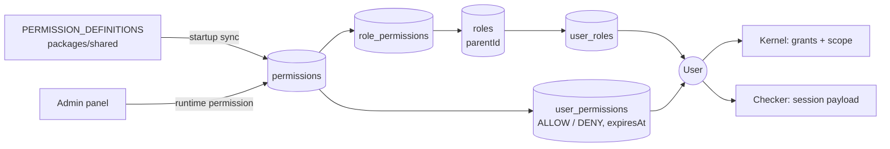

# RBAC internals: roles, permissions and caches

> [!NOTE]
> The [kernel page](./backend.md) explains how a request is **decided**. This page explains the
> **data** the kernel decides with — where permissions come from, how roles inherit, and how every
> API instance learns that something changed. Paths are relative to `apps/api/src/` unless stated.

The model in one sentence: **roles are groups of permissions; permissions are what authorize
actions** ([ADR 001](../../adr/001-permission-first-rbac.md)). Controllers ask for a permission
(`@RequirePermission("CREATE", "USER")`), never for a role name.



## The permission registry

`PERMISSION_DEFINITIONS` (`packages/shared/src/schemas/domain/rbac/permissions-registry.ts`) is the
code catalogue: one row per `(action, resource, scope)` with a description, a group and `isSystem`.

- **Registry → database, one direction.** On every API start `PermissionRegistrySyncBootstrap`
  runs `PermissionMigrationService.syncFromRegistry()` (`modules/authorization/migration/`): missing
  rows are inserted, stale `description` / `group` / `isSystem` are updated, and the authorization
  caches are cleared when anything changed. The seed and `db:sync-reference-data` use the same list,
  so a fresh database, a deploy and the seed agree.
- **Nothing is written back to TypeScript.** Database rows that are not in the registry (created in
  the admin panel, or legacy) are reported as *orphaned* with a warning and never deleted.
- **Two kinds of permission:**

  | Created via | Stored in | Enforced by a route | In the registry |
  | --- | --- | --- | --- |
  | `PERMISSION_DEFINITIONS` + deploy | DB (startup sync / seed) | yes — add the matching decorator | yes |
  | Admin panel "create permission" | DB only | only if code checks that `action:resource` | no |

  A new protected route therefore needs a registry row **and** a decorator
  ([recipe](./recipes.md#1-add-a-new-permission)); a runtime-only permission needs neither — assign
  it to roles or users and every check honours it.

Actions are the enum `CREATE | READ | UPDATE | DELETE | LIST | MANAGE`; resources are the
`PermissionResource` enum in `prisma/schema.prisma`. Decorators take the enum pair, so a typo does
not compile.

## `MANAGE` and role hierarchy

- **`MANAGE` is the wildcard:** a grant of `MANAGE` on a resource satisfies every action on that
  resource (kernel `grantsFor`, ACL lookups, the checker). A `DENY` override on `MANAGE` removes every
  action on that resource.
- **Roles may have a parent** (`roles.parentId`). A role inherits all permissions of its active
  ancestors; `collectRoleHierarchy` (`kernel/subject-grants.loader.ts`) walks parents breadth-first,
  one query per level, ignoring cycles and inactive or deleted roles. Role mutations reject cycles
  and walk deleted and inactive ancestors too, because a restore or re-activation brings them back.
- **Inheritance counts for permissions, not for role names.** `@RequireAnyRole` /
  `@RequireAllRoles` (`kernel.hasRoles`) only see **directly assigned** role names:

  ```text
  User assigned: ["Editor"]        Role tree: Viewer → Editor
  READ permission held by Viewer → granted (inherited)
  @RequireAnyRole("Viewer")      → denied  (not a direct assignment)
  ```

- **An empty role list never passes:** `hasRoles([], "all" | "any")` returns `false`.
- The seed keeps the hierarchy **flat**. Use parents only for extension roles (e.g. *Viewer ←
  Editor*), never to chain customer and staff roles.

## Two readers of the same data

| Reader | File | Used for |
| --- | --- | --- |
| **Authorization kernel** | `kernel/authorization-kernel.service.ts` | Every security decision: guard decorators, `@Authorize`, `can` / `authorize` / `filter` ([kernel](./backend.md)) |
| **`AuthorizationCheckerService`** | `services/authorization-checker.service.ts` | The session payload, not decisions: `getUserPermissionDetails` (`/auth/me`, `/auth/permissions`, login, admin user detail), `getUserCapabilitySlugs` (UI capability slugs; every platform slug for a SuperAdmin), `checkPermissionWithGrants` (the admin "why does this user have it?" check at `POST /admin/permissions/check`) |

The checker resolves direct roles, their hierarchy, role permissions and live direct grants, then
subtracts live `DENY` overrides. Its results are cached per user (below). It still contains one
legacy matching rule — a plural resource such as `READ:USERS` satisfies `READ:USER` — which no
current `PermissionResource` value triggers; the kernel has no such rule.

`hasAdminAccess` on `request.user` is recomputed by `AuthorizationGuard` on every request through
the kernel (`READ:ADMIN_DASHBOARD`, or SuperAdmin) — never trust the JWT's copy on a protected route.

## Caches and invalidation

All in-process caches use the shared primitives in `packages/shared/src/cache/`:

| Need | Primitive | When full |
| --- | --- | --- |
| Derived data with a TTL (authorization, `/auth/me`, token state) | `BoundedTtlCache` | evicts the oldest entry |
| Security counters (rate limits, throttler memory fallback) | `SecurityKeyStore` | **rejects new keys** (fail closed), so cardinality pressure can never evict an active limit window |

| Cache | Key | Default TTL / size | Backend |
| --- | --- | --- | --- |
| `AuthorizationCacheService` | user id → roles, permissions, capabilities | `AUTHORIZATION_CACHE_TTL_MS` 5 min / `AUTHORIZATION_CACHE_MAX_ENTRIES` 10,000 | always in-process; `AUTHORIZATION_CACHE_BACKEND` (`memory` / `redis` / `auto`) decides whether invalidations are broadcast |
| User session cache | `/auth/me` and `/auth/permissions` payloads (Redis keys `<namespace>:auth:me:<userId>`, `…:auth:permissions:<userId>`) | `USER_SESSION_CACHE_TTL_MS` 30 min / `USER_SESSION_CACHE_MAX_ENTRIES` 10,000 | `USER_SESSION_CACHE_BACKEND`: in-memory or Redis; warmed at login |
| Access-token state | user id → `tokenVersion`, active, deleted | `ACCESS_TOKEN_STATE_CACHE_TTL_MS` 30 s / 50,000 | in-process |
| Throttler counters | IP / route window | `SECURITY_COUNTER_MAX_KEYS` 50,000 | Redis, in-memory fallback |

`auto` means Redis when `REDIS_URL` is set and `NODE_ENV` is not `development`. Tokens are never
cached in Redis — only profile and RBAC payloads.

**Why local reads plus broadcast invalidation** (not Redis as the read store): every permission
check stays a synchronous in-process lookup; Redis is used only to tell the other instances what to
drop ([ADR 004](../../adr/004-authorization-caching.md)). After an RBAC transaction commits,
`AuthorizationInvalidationService` drops the affected users locally and publishes on the
`authz:invalidate` channel; a lost message is bounded by the TTLs above. Nobody invalidates by
hand — go through `RoleService` / `PermissionService` ([mutation contract](./backend.md#111-the-rbac-mutation-contract)).

## Events

`AuthorizationEventEmitter` (`events/authorization.events.ts`) is an in-process, typed emitter for
RBAC changes — `ROLE_CHANGED`, `PERMISSION_CHANGED`, `USER_ROLE_CHANGED`,
`USER_PERMISSION_CHANGED` and `USERS_ME_INVALIDATE`. `AuthMeCacheListener`
(`modules/auth/listeners/`) subscribes to the last one and clears the user session cache, so `/auth/me`
and `/auth/permissions` are fresh on the next read. Events are not durable; anything another system
must not miss goes through the [outbox](../messaging.md).

The browser side: after an RBAC mutation the admin UI calls `invalidateSessionAuth(queryClient)`
(`packages/client`) to refetch both session queries; the affected user's next request with an old
JWT gets `401 TOKEN_VERSION_MISMATCH` and refreshes or signs in again.

## Background jobs

| Job | Schedule | Does |
| --- | --- | --- |
| `PermissionExpiryCleanup` | hourly | Soft-deletes expired direct grants (`expiresAt`), through `RbacMutationRunner` under the system operation `maintenance.permission_expiry` (audited actor), then invalidates caches. Expired grants are already ignored at read time. |
| `AuditLogCleanup` | hourly | Soft-deletes `authorization_audits` rows older than 90 days |

## The capability catalogue

`capability_definitions` holds every capability slug the UIs show, by scope
(`CapabilityDefinitionService`, `GET /api/v1/capabilities/catalog?scope=`):

| Scope | Example | Source |
| --- | --- | --- |
| `PLATFORM` | `platform:user.read` | derived from `permissions` at API start (`syncPlatformCapabilitiesFromPermissions`) |
| `MERCHANT` | `merchant:manage_api_keys` | `reference-data/merchant-capability-catalog.ts`, loaded by `db:sync-reference-data` and the seed |

The catalogue supplies labels and ordering. **Which merchant role holds which capability** is the
code table `MERCHANT_ROLE_CAPABILITIES` in `packages/shared` ([kernel §12](./backend.md#12-merchant-reward-hub-capabilities)),
shared by the API and the merchant app.

## Automatic role provisioning

New accounts get their platform role when they are created — never by hand:

| Flow | Platform role | Organization access |
| --- | --- | --- |
| Signup (`POST /auth/signup`) | `User` | — |
| Merchant onboarding (`POST /orgs/onboarding/complete`) | `User` (new or existing account) | `OWNER` membership of the new organization |
| Team invite, new account (`POST /orgs/invites/register-and-accept`) | `User`, in the same transaction as the membership | the invited role and stores |

`UserProvisioningService` (`modules/auth/services/`) creates the account and assigns
`DEFAULT_CONSUMER_ROLE_NAME` (`User`) through `RoleService`, with the new account as its own
audited actor. A missing `User` role is a deployment error (500), not a client error.

## Health

`AuthorizationHealthIndicator` (`health/authorization.health.ts`) reports healthy when a live role
row can be read, plus role / permission / assignment counts in its detailed report
([ADR 006](../../adr/006-module-health-indicators.md)). It is exported by `AuthorizationModule` but
**not yet registered** with the health endpoints: `GET /health/deep` does not include it today.

## Related

[Kernel](./backend.md) · [Recipes](./recipes.md) · [Troubleshooting](./troubleshooting.md) ·
[Access-control API](../api-reference/access-control.md) · [ADR 002 — junction tables](../../adr/002-explicit-junction-tables.md) ·
[ADR 003 — identity-only JWTs](../../adr/003-jwt-identity-only.md)
