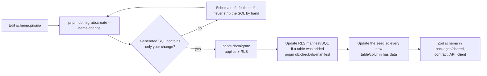

# Database, migrations and seed

PostgreSQL 18 accessed through Prisma 7 (`@prisma/adapter-pg`). Only `apps/api` (and the analytics
consumer, through its own least-privilege role) talks to the database. Modelling rules — soft
delete, money as integer minor units, epoch-ms timestamps, indexes, race conditions — live in
[`rules/08-database-prisma.md`](../../rules/08-database-prisma.md); this page is the operational
side.

## Where things live

| Path | What |
| --- | --- |
| `apps/api/prisma/schema.prisma` | The schema — single source of truth for tables, columns, indexes |
| `apps/api/prisma/migrations/` | Prisma-generated migrations; immutable once committed |
| `apps/api/prisma/migrations-baseline.json` | The [baseline marker](#migration-baseline) |
| `apps/api/prisma/rls.sql`, `apps/api/prisma/rls/*.sql` | Row-level security, roles and grants — applied after every migrate ([database security](./security/database-security.md)) |
| `apps/api/prisma/seed.ts`, `apps/api/prisma/seed/` | Seed orchestrator, per-domain seeders, scenarios |
| `apps/api/prisma.config.ts` | Prisma CLI configuration |

## Commands

Run from the repo root (`pnpm db:*` forwards to `apps/api`).

| Command | Does | Destructive |
| --- | --- | --- |
| `pnpm setup:db` | Build shared → `db:all` (generate + deploy → seed) | Rewrites demo rows |
| `pnpm db:all` | `turbo run db:seed` (its `dependsOn` runs `db:generate` + `db:deploy` first) | Rewrites demo rows |
| `pnpm db:migrate` | `prisma migrate dev` then RLS — create + apply a migration for a schema change | Dev only |
| `pnpm db:migrate:create --name <change>` | Generate a migration without applying it (review the SQL first) | No |
| `pnpm db:deploy` | `prisma migrate deploy` then RLS — the only command for shared/deployed databases | No |
| `pnpm db:migrate:status` | Which migrations are applied | No |
| `pnpm db:apply-security` (`db:rls`) | Re-apply RLS policies, roles, grants and withheld privileges (idempotent) | No |
| `pnpm db:check-rls-manifest` | Prisma models ↔ RLS manifest ↔ SQL agree (no database needed) | No |
| `pnpm --filter @workspace/api db:check-drift` | Replays migrations into `SHADOW_DATABASE_URL` and compares with `schema.prisma` | Wipes the shadow DB |
| `pnpm --filter @workspace/api db:check-seed-coverage` | Read-only audit of a seeded database ([below](#seed-coverage--every-table-every-column)) | No |
| `pnpm db:seed` | Seed (`--scenario`, `--seed`, `--allow-destructive`) | Rewrites seed rows |
| `pnpm db:reset` | Drop everything, replay migrations, generate, RLS, seed | **Wipes the DB** |
| `pnpm db:push` | Push the schema without a migration (throwaway experiments only) | Can drop data |
| `pnpm db:studio` | Prisma Studio | — |
| `pnpm --filter @workspace/api db:rewrap-tenant-keys -- --actor-user-id <id>` | Re-wrap tenant data keys after a KEK rotation ([encryption](./security/encryption-and-kms.md)) | No |
| `pnpm --filter @workspace/api db:sync-reference-data` | Load or converge the platform reference data (permissions, system roles + grants, merchant capabilities); production-safe, idempotent, audited ([runbook](./operations/superadmin-bootstrap.md#loading-the-reference-data)) | Writes only differences; nothing if up to date |
| `pnpm --filter @workspace/api admin:bootstrap-superadmin -- --email <e> --full-name <n>` | Create the first SuperAdmin where the seed never runs ([runbook](./operations/superadmin-bootstrap.md)) | Creates one account; refuses if one exists |

## Changing the schema (generated-only migrations)



- **Migrations are generated, never hand-written.** Prisma writes the SQL from `schema.prisma`. If
  the generated file contains changes you did not make, the database or the history has drifted —
  fix that, do not edit the SQL. The rare exception (for example `CREATE INDEX CONCURRENTLY`) is
  documented in `rules/08-database-prisma.md`.
- **RLS is never appended to a migration.** Policies live in `prisma/rls*` and are re-applied by
  every `db:migrate`, `db:deploy`, `db:reset` and `db:push`.
- **Committed migrations are immutable.** Undo with a new forward migration.
- **Expand / contract** for anything that runs against live data: add the new column, backfill,
  switch reads, then drop the old one in a later release
  ([`rules/13-ci-cd-and-quality-gates.md`](../../rules/13-ci-cd-and-quality-gates.md)).

### Migration history is append-only

Once a migration folder has reached a shared branch, never edit, rename, delete or re-squash it:
every database that applied it records its name and checksum in `_prisma_migrations`, and a
rewritten history makes `prisma migrate deploy` fail (or silently skip work) on those databases.
Every schema change is a new forward folder on top of the existing ones. Squashing into a new
baseline is allowed only in a fork that has never been deployed anywhere (no staging, no
production, no teammate database you cannot wipe) — see [Migration baseline](#migration-baseline).

### Schema conventions that keep drift at zero

- **`dbgenerated` defaults in Postgres's canonical form.** Epoch-ms timestamps use exactly
  `@default(dbgenerated("((EXTRACT(epoch FROM now()) * (1000)::numeric))::bigint"))` — the text
  Postgres stores after normalising the default (`pg_get_expr`). Prisma compares the string
  literally, so any other spelling (e.g. `(EXTRACT(EPOCH FROM now()) * 1000)::bigint`) makes every
  `migrate dev` / `migrate diff` emit a spurious `ALTER COLUMN … SET DEFAULT` and shows up in
  `db:check-drift`. For a new `dbgenerated` default: apply it once, read
  `information_schema.columns.column_default`, and copy that text back.
- **One exception:** the vendored geography tables (`Region`, `Subregion`, `Country`, `State`,
  `City`, from dr5hn/countries-states-cities-database) keep the dataset's
  `DateTime @db.Timestamp(0)` columns and fixed `createdAt` default. Never copy that shape into a
  new table.
- **Unique values on soft-deletable models.** Decide whether a soft-deleted row should still hold
  its unique value. Usually it should not: use a partial unique index,
  `@@unique([organizationId, terminalId], where: { isDeleted: false })` (the `partialIndexes`
  preview feature is enabled). A partial unique cannot be used with `findUnique`; query it with
  `findFirst` + `isDeleted: false`.

## Migration baseline

`apps/api/prisma/migrations-baseline.json` names the oldest migration that is still history:

```json
{ "baseline": "<timestamp>_init", "reason": "why earlier history was dropped", "since": "<YYYY-MM-DD>" }
```

CI's migration-history job (`packages/tooling/scripts/check-migration-history.mjs`) ignores
migrations older than the baseline, treats the baseline and everything after it as immutable, and
requires the baseline to name a migration directory that exists. Moving it forward is the only way
to drop history and is allowed **only if no shared or deployed database ever applied the dropped
migrations**. The procedure is in [CI → Migration baseline](./operations/ci.md#migration-baseline).

## Seed data

`pnpm db:seed` refuses to run unless `DATABASE_URL` points at a local host and `NODE_ENV` is
`development` or `test` (override: `--allow-destructive`).

| Scenario | Contents |
| --- | --- |
| `development` (default) | Reference data (126 permissions, 6 roles), platform accounts, demo customers, two demo merchants (Brew & Bean KL, Jonker Street Kitchen) with stores, staff, invites, rewards in every lifecycle state, claims, referrals, POS keys and terminals, sales plus a year of POS history for the analytics dashboards and exports (`prisma/seed/analytics-history.ts`: ~2,000 bills across the three stores, six campaign rewards, QR and backup-code redemptions, expired claims, customers joining month by month, campaign titles in Chinese, Tamil, Hindi and Malay — through the same invariants as checkout), KYB files, geography, sample catalog, email log, audit trail, account-security history |
| `empty` | Reference data only (permissions and roles); no users or tenants. Deployments use `db:sync-reference-data` instead (same loader, no seed guard needed) |
| `enterprise --seed <n>` | One large tenant, **Northwind Retail Group** (`/orgs/northwind-enterprise/dashboard`): 25 stores, 250 members, 500 products; deterministic for a given seed and additive (other tenants are left alone) |

Enterprise accounts (in addition to the development platform accounts):

| Email | Password | Organization role |
| --- | --- | --- |
| `owner@enterprise.example.com` | `EnterpriseOwner@123` | OWNER (all locations) |
| `member.0001@enterprise.example.com` … `member.0249@enterprise.example.com` | `EnterpriseMember@123` | `0001` POLICY_ADMIN; every 25th ADMIN (all locations); every 4th MEMBER; the rest CASHIER at one location |

- **Deterministic:** demo data comes from a seeded PRNG (`--seed`), and fixed ids live in
  `apps/api/prisma/seed/organization-seed-ids.ts` (`DEFAULT_ORGANIZATION_ID` in `.env.example` is
  Brew & Bean KL). A few values are random per run (for example the MFA demo user's TOTP secret);
  the seed prints them.
- **Converges:** re-running upserts reference data and replaces only the demo tenants'
  re-creatable rows; other tenants and audit tables are never touched.
- **Credentials:** every login, POS key, invite token and demo QR / backup code is printed at the
  end of the run (summary in the [user guide](../user-guide/README.md#try-it-with-the-demo-data)).
- The seed imports the **built** `@workspace/shared`; on a fresh clone run `pnpm setup` first.
- **Same invariants as the app:** seeders write through the rules the API enforces — passwords and
  tokens hashed, values parsed by the shared zod schemas (e.g. member display names through
  `OrganizationMemberDisplayNameSchema`), soft deletes instead of hard deletes, and the audit row
  the real endpoint would write (e.g. `membership.display_name_updated` for each seeded display
  name). Seeded organization lifecycle events carry a deterministic correlation id
  (`prisma/seed/lifecycle-correlation.ts`), like the request id the app stamps.
- **Adding a scenario:** add its name to `SeedScenarioSchema` (`prisma/seed/seed-options.ts`), write
  `prisma/seed/scenarios/<name>.ts` and register it in `SEED_SCENARIO_RUNNERS`
  (`scenarios/index.ts`, a full `Record`, so a missing runner fails to compile). Keep generated data
  in a pure builder with unit tests (see `enterprise-dataset.ts`).

### Seed coverage — every table, every column

> **Only meaningful on a freshly reset database.** A long-lived dev database accumulates rows that the
> seed does not write (the analytics consumer fills `analytics_events`, the API boot fills capability
> links, …), so a pass there proves nothing about CI, which seeds an empty database. Check it the way CI
> does: `pnpm ci:local --e2e-only` (throwaway databases: migrate → RLS → `db:seed` → coverage → e2e, then
> dropped), or `pnpm db:reset` first. `analytics_events` and `inbox_processed_events` are seeded by replaying the
> PUBLISHED outbox events through the analytics consumer's own handler and SQL
> (`packages/messaging/src/inbox`, `prisma/seed/analytics-ingest.ts`), so they match what the consumer writes.

`db:check-seed-coverage` audits a freshly seeded database in a read-only transaction and fails when
any table has no rows or any nullable column is `NULL` in every row, unless
`apps/api/prisma/seed/coverage-exemptions.ts` lists the gap with a written reason. CI runs it right
after the `development` seed, so a new table or column must ship with seed data in the same change.
That includes soft-delete fields (seed at least one soft-deleted row), optional columns,
audit/context columns (IP, user agent, correlation id, impersonator) and short-lived tables (a live
2FA challenge, a pending setup, …).

How it works (`apps/api/scripts/seed-coverage.ts`, `seed-coverage-catalog.ts`, `check-seed-coverage.ts`):

- The table/column list comes from **both** the generated client's DMMF (cross-checked against the
  `model` declarations in `schema.prisma`, so a stale client fails) and the live Postgres catalog. A
  table or column present on only one side fails the check; `_prisma_migrations` is ignored.
- It connects with `DATABASE_URL` in a `READ ONLY` transaction with `row_security = off`: it never
  writes, and if RLS would filter a table Postgres raises an error instead of returning a partial view.
- One `count(*)` + `count(column)` scan per table; NOT NULL columns are guaranteed by the database.
- **Exemptions** name an `empty-table` or a `null-column` with a written `reason` of at least 40
  characters that states a structural cause ("no correct database holds this value"). "We did not
  seed it" is never a reason. An entry that no longer matches a gap fails the check, so the list
  only shrinks.

## Device sessions (`refresh_tokens`)

One row per signed-in device ([mobile plan §8](./mobile/mobile-app.md#8-piece-4-device-sessions),
[ADR 034](../adr/034-immediate-per-session-revocation.md)). The row is rotated **in place** on every
refresh, so its `id` is the session id for the whole session: the refresh token's `jti` and the
access token's `sid`.

| Column | Written | Notes |
| --- | --- | --- |
| `token`, `previous_token_hash`, `rotation_version` | sign-in, every refresh | SHA-256 digests, never a token; `rotation_version` also moves on a revoke |
| `client_type` (`SessionClientType`) | sign-in | the validated `X-Client-Type` |
| `browser_name`, `browser_version`, `os_name`, `os_version`, `device_type` | sign-in | parsed from the User-Agent (`common/http/user-agent.ts`) |
| `device_model` | sign-in | `X-Device-Model` for client type `mobile`, else the User-Agent's model |
| `device_name`, `app_version` | sign-in | `X-Device-Name` / `X-App-Version`, client type `mobile` only |
| `sign_in_method` (`SessionSignInMethod`) | sign-in | the proofs the login flow required (password, TOTP, backup code, team-invite registration — each with or without the emailed new-device code) |
| `ipAddress`, `last_ip_address` | sign-in / every refresh | server-observed (`TRUST_PROXY`-aware) |
| `last_active_at` | sign-in, every refresh | epoch ms |
| `location_country`, `location_region`, `location_city` | sign-in | the `SessionLocationResolver` port (`SESSION_LOCATION_PROVIDER`, only `none` today — NULL) |
| `is_deleted`, `deleted_at`, `deleted_by` | every revocation | `deleted_by` = a user id (the user or an admin) or a system marker from `SessionSystemRevokerSchema` |

Client-reported values are display-only: bounded to their columns and validated with the shared zod
schemas before storage (`packages/shared/src/schemas/auth/device-session.ts`); an invalid value is
stored as NULL rather than refusing the sign-in. The device-detail columns are nullable because
sessions created before the `device_sessions` migration have no details; they stay NULL until those
sessions expire (`last_active_at` was backfilled with the migration time).

**Seed coverage.** `prisma/seed/device-sessions.ts` builds every seeded session through the API's own
User-Agent parser and header validation (`describeSessionDevice`): every client type (web, merchant,
admin, and the mobile app on iOS and Android), every sign-in method, locations with and without a
region or city, and — on the MFA demo user (`account-security.ts`) — a revoked session for every
`deleted_by` path (the user, an admin, and each system marker), so `db:check-seed-coverage` sees a
value in every column.

## Related

[Database security (RLS, roles, system operations)](./security/database-security.md) ·
[Tenancy and RLS](./authorization/tenancy-and-rls.md) · [ADR 010](../adr/010-rls-transaction-contract.md) ·
[Multi-tenancy runbook](./operations/multi-tenancy-runbook.md)
