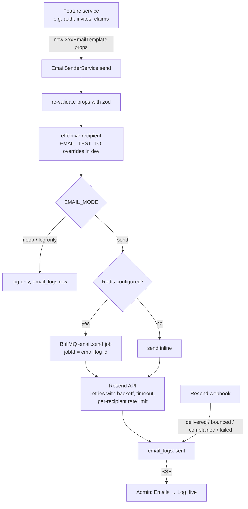

# Email templates and pipeline

Code: `apps/api/src/modules/notifications/email/`. Provider setup: [Set up email with Resend](./resend-setup.md).

## Pipeline

- `send()` **never throws**: it returns `{ ok: true, id }` or `{ ok: false, reason, detail }`, so a
  Resend outage can never break a signup or login. Callers decide what to tell the user.
- Every attempt is an `email_logs` row (recipient masked in logs). The admin log page receives
  changes over Server-Sent Events (`GET /api/v1/notifications/email-log/events`).
- With BullMQ the job id is the email log id, so the same attempt is never enqueued twice.

## Templates

Each template is a class extending `BaseEmailTemplate` with a `key`, a subject, a zod props schema,
and `renderBodyHtml()` / `renderBodyText()` — every email has a plain-text twin. The
`EmailTemplateRegistry` lists them with sample props for the admin preview.

| Key | Sent when |
| --- | --- |
| `welcome` | Account created |
| `verification` | Email verification (signup, resend) |
| `login-verification` | New-device sign-in code (`LOGIN_VERIFICATION_MODE`) |
| `password-reset` / `password-changed` | Reset requested / password changed |
| `account-locked` | Too many failed sign-ins |
| `two-factor-enabled` / `two-factor-disabled` | 2FA switched on / removed (e.g. after MFA recovery) |
| `security-alert` | Security-relevant account events |
| `api-key-created` | An API key was created |
| `admin-alert` | Operational alerts to administrators |
| `merchant-invite` | Platform admin invites a merchant (onboarding link) |
| `team-member-invite` | Merchant invites a team member |
| `reward-claim-otp` | One-time code for claiming a reward |
| `referrer-reward-credited` | A referral earned the referrer a reward (retried by the `rewards.referral-credit-notify` job) |

`pnpm --filter @workspace/api exec tsx scripts/render-email-previews.ts` re-renders the screenshots
below (headless Chrome, light mode):

| | | |
| --- | --- | --- |
|  |  |  |
|  |  |  |
|  |  |  |

## Adding a template

1. Add the key to `EmailTemplateKeySchema` in `packages/shared`.
2. Create `templates/<name>-email.template.ts` extending `BaseEmailTemplate` with a strict zod
   props schema; never put secrets other than the intended one-time link/code in the body.
3. Register it with sample props in `email-template.registry.ts` and the factory
   (`email-template.factory.ts`, used to rebuild queued jobs).
4. Send it from the owning service with `EmailSenderService.send(new XxxEmailTemplate(props))` and
   handle the result.
5. Test the rendering (HTML + text) and the call site; preview it in **Emails → Templates**.

## Related

[Email API reference](../api-reference/email.md) · [Messaging and jobs](../messaging.md)
