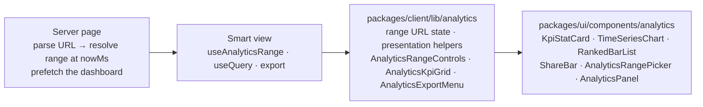

# Analytics dashboards and chart primitives

Three pages read the [analytics API](../api/analytics.md): **My Activity** in the web app
(`/rewardhub/activity`), **Analytics** in the merchant app (`/orgs/[orgSlug]/analytics`) and
**Analytics** in the admin panel (`/analytics`; the old `/analytics/sales` redirects there). All
three are built from one set of primitives, so a chart looks and behaves the same everywhere.

## Layers

| Layer | Where | Knows about |
| --- | --- | --- |
| Primitives (dumb) | `packages/ui/src/components/` | Nothing about the API: formatted strings, numbers, colour slots, callbacks |
| Formatters | `packages/ui/src/lib/format/` — `formatEpochMsRange`, `formatBucket`, `formatPercent`, `formatPercentChange`, plus the existing money / count helpers | Locale, currency and time zone, always passed in |
| Range + presentation (shared smart layer) | `packages/client/src/lib/analytics/` | The dashboard contracts, the URL, the download helper |
| Pages (smart) | each app's `components/analytics/…` and `lib/analytics/…` | Which KPIs, charts and breakdowns that audience sees |

### Primitives (`@workspace/ui/components/*`)

| Component | Use it for | Notes |
| --- | --- | --- |
| `KpiStatCard` | One headline number and its change vs the previous period | The change is an icon **and** words ("Up +12.5%"), coloured by *sentiment* (good / bad news), never by direction alone. `change: { status: "noPrevious" }` says "No data in the previous period" instead of a percentage. Skeleton while `value` is `undefined`. |
| `TimeSeriesChart` | A series over time: `kind` = `line`, `area`, `bar` or `stackedBar` | One y-axis only (never dual-axis). ≥ 2 series get a legend (a line key, dashed for the second line); tooltip lists every series at the bucket, value first, with the bucket's full range; partial buckets are shaded, explained under the chart and marked in the tooltip and table; every value is also in a "Show as table" disclosure. Keyboard: recharts' accessibility layer (focus the plot, arrow keys move the tooltip). Animations off under `prefers-reduced-motion`. `state` swaps the plot for loading / empty / error (with retry) at the same height. Generic over the series keys. |
| `RankedBarList` | A ranked breakdown (top merchants, stores, rewards, categories, cities) | Text carries every value; the bar is decorative. One series → one colour (slot 1) for every bar. |
| `ShareBar` | Part-to-whole with a handful of parts (redemption method) | One stacked horizontal bar with 2px surface gaps and a legend list stating name, value and share. |
| `AnalyticsRangePicker` | The filter row: preset, custom days + Apply, interval, the range in effect | Built from the shared kit only: preset and interval are `DropdownMenu` radio groups (trigger named by its label and current choice; arrow keys, type-ahead, Escape); custom days are picked in the shared `Calendar` (range mode, in a `Popover`) with later days and over-long spans disabled. The caller validates and passes `customError`, which disables Apply and is tied to the calendar trigger with `aria-describedby`. The range label is a polite live region. The calendar's open state is controllable (`calendarOpen` / `onCalendarOpenChange`, closed after a successful Apply); left uncontrolled, the picker manages it. |
| `AnalyticsPanel`, `ChartStateFrame` | A titled section (`<section aria-labelledby>`) and the loading / empty / error frame | `CHART_READY` / `CHART_LOADING` constants for the common states. |

Every primitive forwards its ref (`TimeSeriesChart` and `AnalyticsRangePicker` are generic, so
they take `ref` as a prop — React 19) and takes no business copy: labels arrive as props.

### Shared smart layer (`@workspace/client/lib/analytics/*`)

- **`analytics-range`** — `ANALYTICS_URL_STATE` (`?range=` preset, default `last30Days` left out
  of the URL; `?from=&to=` inclusive `YYYY-MM-DD` days for `range=custom`; optional
  `?interval=`), `presetLocalDateRange`, `checkCustomRange` (≤ 366 days, in order, both set —
  the API's own message for "too long"), `resolveAnalyticsRange(state, nowMs, timeZone)` and
  `analyticsPrefetchKey`. Presets: Last 7 / 30 / 90 days, This month, Last month, This quarter,
  Year to date, Last 12 months (this month + the 11 before), Custom. Every preset ends **today**
  and is cut in whole days of the report's zone; the interval defaults to the API's rule
  (≤ 31 days day, ≤ 183 week, else month) and resets when the range changes.
- **`analytics-range-controls`** — `useAnalyticsRange(nowMs, timeZone)` reads and writes the URL
  (shallow History API updates through `useUrlState`, so the queries refetch and the server page
  does not re-render) and `AnalyticsRangeControls` renders the picker; its only local state is
  the custom days being picked, committed by Apply.
- **`analytics-presentation`** — `toKpiViews` (KPI definitions + `totals` → card props),
  `toKpiChange`, `toChartSeriesData` (API points → chart points + "is everything zero"),
  `bucketFormatters`, `analyticsFormatters(currency, locale)`, `formatPreviousPeriodLabel`,
  `toChartFrameState`, and the shared copy (preset and interval labels, chart labels).
- **`AnalyticsKpiGrid`** — a named group of `KpiStatCard`s.
- **`AnalyticsExportMenu`** — Export ▾ CSV / Excel (XLSX) / PDF for merchants and admins, through
  `api.download(apiDownloads.…analyticsExport, input)`. Disabled while a file downloads, a polite
  live region announces progress, the file is saved under the server's name, and failures become
  toasts by error code: `ANALYTICS_EXPORT_RATE_LIMITED` shows the wait from `Retry-After`,
  `ANALYTICS_QUERY_TIMEOUT` suggests a shorter range or coarser interval, `VALIDATION_ERROR` shows
  the API's message, others show the correlation id.

## How a page fits together

1. The **server page** parses `searchParams` with `ANALYTICS_URL_STATE`, takes `nowMs =
   nowEpochMs()`, resolves the range in the report's zone and prefetches the dashboard. It passes
   `nowMs` and a `PrefetchedQuery` (`stateKey = analyticsPrefetchKey(query, scope)`) to the view.
2. The **view** calls `useAnalyticsRange(nowMs, zone)` — the same request time, so the same
   range — parses the query input with the dashboard's zod schema and seeds `useQuery` with the
   prefetch **only** when the keys match (never another range's or another store's numbers). It
   uses `placeholderData: keepPreviousData`: while a new range loads, the previous charts stay,
   dimmed, with `aria-busy` (no skeleton flash).
3. The export builds its input from the same resolved range (plus the store for merchants).

| Page | Report zone | Store | Export |
| --- | --- | --- | --- |
| Customer `/rewardhub/activity` | UTC | — | none (own data only) |
| Merchant `/orgs/[orgSlug]/analytics` | The organization's zone, read up front from the organization context the app already loads (`organization.timeZone`; `reportTimeZone`) | The member's store selector (the same tenant-context filter every merchant page uses), part of the query and prefetch key | yes |
| Admin `/analytics` | UTC | — | yes |

The merchant store filter deliberately stays in the store selector (cookie + tenant context), not
in the URL: one store choice drives every merchant page, and a second, URL-level choice on one
page would disagree with the top bar. A shared link carries the range and interval; the store
scope always comes from the viewer's own access.

## Colour and non-colour encodings

Charts name a **slot** (`chart-1` … `chart-5`, `@workspace/ui/lib/charts/chart-colors`); each app
theme fills the slots in light and dark (`apps/*/app/*-theme.css`). Every slot also owns a
**dash pattern, a marker shape and a fill pattern** (`lib/charts/chart-encodings.ts`), applied by
the primitives wherever the slot is drawn — so identity never rests on colour alone:

| Slot | Line dash | Marker | Bar / share fill |
| --- | --- | --- | --- |
| `chart-1` (primary series) | solid | circle | solid |
| `chart-2` | `6 4` | square | 45° hatch |
| `chart-3` | `2 3` | triangle | 135° hatch |
| `chart-4` | `8 3 2 3` | diamond | crosshatch |
| `chart-5` (de-emphasis / "Other") | `1 5` | cross | dots |

- `TimeSeriesChart` draws markers on lines up to 40 points (the active point always), hatched
  bars and stacked segments (`ChartPatternDefs`), legend and tooltip keys that mirror the mark
  (`SeriesKey`), and **direct labels** at the end of each line when a chart has two or more lines.
- `ShareBar` textures every part with its slot pattern, in the bar and the legend.
- `RankedBarList tone="ranked"` steps the bars from full strength to 45% opacity — ordered
  lightness for lists where the order is the point (top merchants, top rewards, top shops); the
  default `uniform` keeps one strength (length already carries the value).
- Slots are assigned per entity in fixed order, never cycled; a fifth series folds into "Other"
  (slot 5). Charts keep to two or three series, so they stay legible in grayscale.

**The admin panel is black and white**, so it uses the shared neutral ramp from
`packages/ui/src/styles/tokens.css` (no override): slot 1 has the most contrast and slots 1↔2 —
the pair every two-series admin chart uses — are a wide lightness step apart. Validator results
(dataviz `validate_palette.js`):

| Mode (surface) | Ramp | Ordinal checks | Slots 1↔2 | Contrast |
| --- | --- | --- | --- | --- |
| Light (card `#ffffff`) | `#1a1a1d #47474d #606066 #74747a #88888e` | pass (monotone, ΔL ≥ 0.06, light end 3.5:1) | normal-vision ΔE 18.1, CVD 18.1 — pass | all ≥ 3:1 |
| Dark (card `oklch(0.307 …)`) | `#edeef1 #b5b7be #a0a3ab #8c8f97 #797c83` | pass (light end 3.2:1) | normal-vision ΔE 16.9, CVD 16.9 — pass | all ≥ 3:1 on the background and card |

As a *categorical* palette the full gray ramp fails the chroma floor and the adjacent
normal-vision floor by design (gray carries no hue), which is exactly why the dash / marker /
pattern encodings and direct labels are built into the primitives rather than left to each page.
`tokens-contrast.test.ts` keeps every slot ≥ 3:1 on the surfaces it checks.

The web and merchant apps keep their brand hues (slots 1–4 categorical, slot 5 gray); the same
encodings apply there and also cover colour-blind readers and grayscale print.

## Testing

- Primitives: `packages/ui/src/components/*.test.tsx` — states, roles and names, the
  table twin, keyboard (Enter submits the custom range), ref forwarding. jsdom has no
  `matchMedia`: stub it before rendering a `TimeSeriesChart`.
- Range and presets: `packages/client/src/lib/analytics/analytics-range.test.ts` (month, quarter,
  year and leap edges; local midnight in Kuala Lumpur vs UTC; invalid custom ranges).
- Pages: each app's analytics view test mocks `useAuth().api` and `useSearchParams` (reading
  `window.location`) and checks the data → screen mapping, the URL round trip, the prefetch key,
  the export input and the error toasts.
