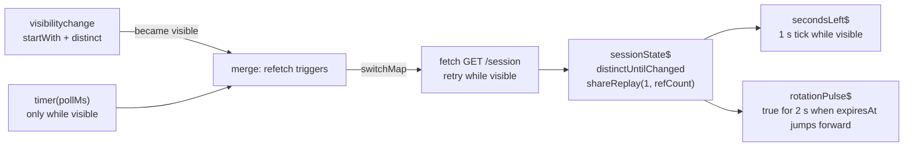

# Streams (RxJS) in the frontends

**Server state belongs to TanStack Query; client state to Zustand feature stores**
([rules/06](../../../rules/06-tanstack-state-forms-tables.md),
[ADR 023](../../adr/023-client-state-feature-stores.md)). RxJS is the tool for the third kind of
problem: **behaviour over time** — timers, polling that pauses when the tab is hidden, retry with
backoff, "collapse several triggers into one fetch". Writing those with `setInterval`, `useEffect`
and refs is where leaks and race conditions come from; a stream states the behaviour once and is
torn down as one unit.

> [!NOTE]
> An earlier design for an in-house, dependency-free "reactive core" package (`packages/reactive`)
> was dropped in favour of **RxJS 7**, which the API already depends on (NestJS interceptors). Only
> the React binding and a test scheduler remain from that work. Do not reintroduce a custom
> Observable implementation.

## Where RxJS is used

| Code | What the stream does |
| --- | --- |
| `packages/ui/src/hooks/use-observable.ts` | `useObservable(source$, initialValue)` — the React binding |
| `apps/admin/lib/session/status-badge-stream.ts` | The topbar session badge: fetch, countdown and token-rotation pulse |
| `packages/client/src/lib/api/server-request.ts` | Server-side prefetch: per-attempt timeout, total budget, jittered retry after network failures |
| `apps/api` | NestJS interceptors (`Observable`, `tap`, `catchError`) |

## `useObservable`

```ts
const state = useObservable(sessionState$, { status: "loading" });
```

- Built on React's `useSyncExternalStore`: renders `initialValue` on the server **and** on the first
  client render (no hydration mismatch), then each emission.
- Subscribes once per `source` identity and **unsubscribes on unmount** or when `source` changes —
  create the stream with `useMemo` (or outside the component) so it is not rebuilt every render.
- A source that emits synchronously (`of`, `BehaviorSubject`) renders its value immediately; a
  completed stream keeps its last value; an unhandled stream error is reported, not swallowed.
- The component stays dumb: the stream is built in a smart wrapper or a `lib/` module, and the
  presentational view receives plain props.

## Worked example: the session badge

`buildSessionBadgeStreams()` returns three streams from one fetch pipeline:



- **Zero polling by default.** The badge fetches once on mount and when the tab becomes visible,
  and computes the countdown locally from `expiresAt`. `NEXT_PUBLIC_SESSION_POLL_MS` (admin, unset
  or `0` = off, [frontend configuration](../configuration/frontend.md)) adds a steady poll; it is an
  observation cadence for spotting a rotated or dead session, unrelated to the token lifetime.
- **`shareReplay({ bufferSize: 1, refCount: true })` is load-bearing.** Three subscribers
  (`sessionState$` directly, plus the countdown and the pulse) share **one** fetch per trigger; a
  test asserts it. `refCount: true` tears the pipeline down when the last subscriber leaves.
- **`switchMap`** cancels an in-flight fetch when a newer trigger arrives, so a slow response can
  never overwrite a newer one.

## Testing streams

Inject the scheduler. Every time-based operator in a pipeline takes the `scheduler` parameter
(default `asyncScheduler`); tests pass `VirtualTimeScheduler` (`apps/admin/lib/virtual-time-scheduler.ts`,
an RxJS `SchedulerLike`) and drive time explicitly:

```ts
const scheduler = new VirtualTimeScheduler();
const { sessionState$ } = buildSessionBadgeStreams({ fetchSession, scheduler, pollMs: 10_000 });
const subscription = sessionState$.subscribe(record);
scheduler.advanceBy(10_000); // fire everything due at or before this frame
subscription.unsubscribe();
```

`flush()` throws if actions are still pending after 1,000 frames, so an infinite source fails the
test instead of hanging it. Assert that every subscription you open is closed — leaked
subscriptions are the bug class streams exist to prevent.

## Rules

- ✅ Use a stream for time, visibility, retry and multi-trigger coordination; ❌ not for data that
  TanStack Query already caches, and not as a global store.
- ✅ Every `subscribe` has an owner that unsubscribes (`useObservable`, `take`, or an explicit
  teardown).
- ✅ Model what a stream emits with a zod schema and infer the type, as the session badge does
  (`SessionStateSchema`, a discriminated union of `loading` / `error` / `ready`).
- ❌ No `Subject` exported from a module as shared mutable state; ❌ no `setInterval` beside a stream
  doing the same job.
