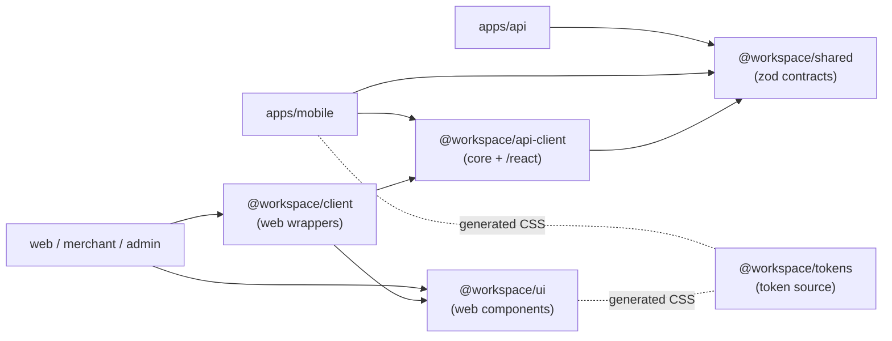
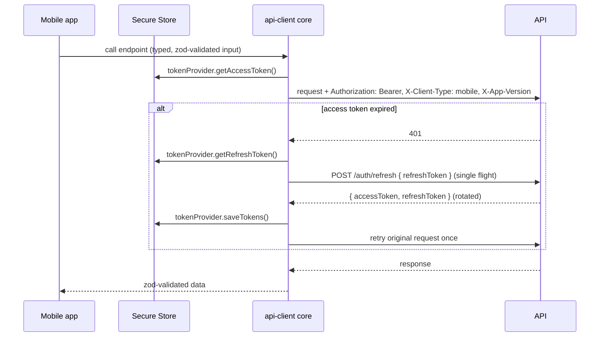
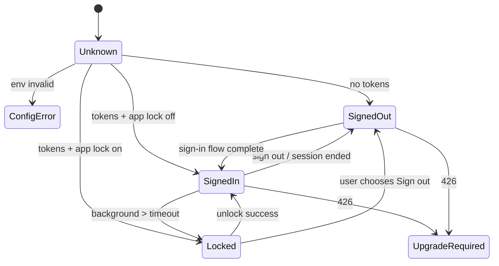
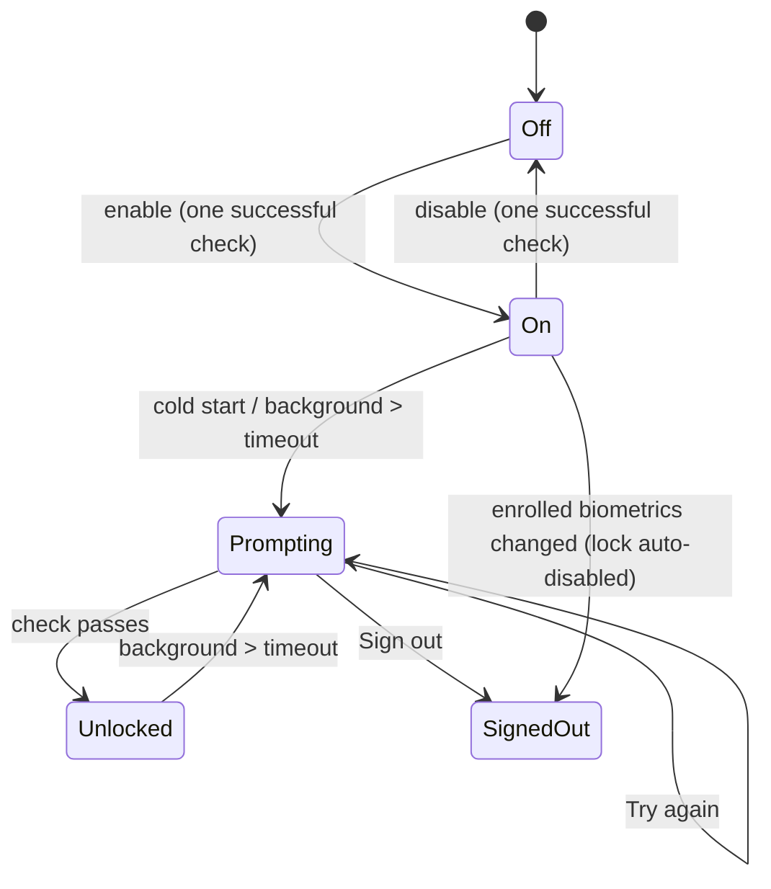

# Mobile app: design and delivery plan

> **Status:** design agreed on 2026-10-08. **All five pieces are implemented** (pieces 1–3 on
> 2026-10-08, pieces 4–5 on 2026-10-09); each section says what the implementation changed. The
> piece 5 items that need real phones are still open in [section 19](#piece-5-appsmobile). Every decision below was
> settled in a design review and the hard-to-reverse ones are recorded as ADRs
> ([029](../../adr/029-mobile-client-body-token-transport.md) –
> [034](../../adr/034-immediate-per-session-revocation.md)). When a piece lands, update its
> section from "planned" to "implemented" and correct anything the implementation taught us.

This page is the single reference for the mobile work. It explains **what** we are building,
**why** each choice was made, **how** each part works, and **in what order** it will be delivered.
It is written so that someone who was not in the design review can implement any piece of it
without re-opening a settled decision.

## Contents

1. [Goals and non-goals](#1-goals-and-non-goals)
2. [Decision summary](#2-decision-summary)
3. [Vocabulary](#3-vocabulary)
4. [Architecture at a glance](#4-architecture-at-a-glance)
5. [Piece 1: `packages/tokens`](#5-piece-1-packagestokens)
6. [Piece 2: `packages/api-client`](#6-piece-2-packagesapi-client)
7. [Piece 3: the `mobile` client type in the API](#7-piece-3-the-mobile-client-type-in-the-api)
8. [Piece 4: device sessions](#8-piece-4-device-sessions)
9. [Piece 5: `apps/mobile`](#9-piece-5-appsmobile)
10. [Screens, one by one](#10-screens-one-by-one)
11. [The app lock](#11-the-app-lock)
12. [Security model](#12-security-model)
13. [Testing strategy](#13-testing-strategy)
14. [CI and tooling](#14-ci-and-tooling)
15. [Developing with Expo Go](#15-developing-with-expo-go)
16. [Documentation that changes with this work](#16-documentation-that-changes-with-this-work)
17. [Out of scope and next steps](#17-out-of-scope-and-next-steps)
18. [Risks and how we contain them](#18-risks-and-how-we-contain-them)
19. [Acceptance checklists](#19-acceptance-checklists)
20. [Reference tables](#20-reference-tables)
21. [Design review log](#21-design-review-log)

---

## 1. Goals and non-goals

### Goals

- Add an **iOS and Android app** to the monorepo, built with **Expo**, **React Native**,
  **Uniwind** and **TypeScript**, that follows every non-negotiable in
  [`rules/00-non-negotiables.md`](../../../rules/00-non-negotiables.md) exactly like the web apps.
- Ship it as a **generic starter shell**, not a product: sign-in (with every step the API can
  require), sign-up, password reset request, profile, settings, security settings, a device list
  and an optional app lock. Products built on the starter add their own features on top; the
  consumer reward flow is the natural first one.
- Reuse, never duplicate: one source of **design tokens**, one **API client**, one set of **zod
  contracts**, one **session model** on the server for every client.
- Keep the developer loop free of paid services: develop in **Expo Go** with a free Expo account,
  no EAS, no store credentials, no native project folders in git.
- Give every user, on every client, a **list of their signed-in devices** with immediate
  single-device sign-out, and keep "sign out everywhere" immediate across web and mobile.

### Non-goals (for this change)

- No product features (rewards, claims, POS) in the mobile app yet.
- No web build of the Expo app: the three Next.js apps already cover the browser.
- No EAS, store submission, or release automation. The project is ready for EAS (adding it is one
  config file) but does not depend on it.
- No push notifications, offline mode, deep links beyond Expo Router defaults, mobile end-to-end
  tests, or GeoIP location. Each is listed in [section 17](#17-out-of-scope-and-next-steps) with
  where it plugs in.

### Who this is for

| Reader | What to read |
| --- | --- |
| Implementing a piece | Its section (5–9), then [section 19](#19-acceptance-checklists) for its checklist |
| Reviewing a PR for a piece | [Section 2](#2-decision-summary), the piece's section, its checklist |
| Building a product feature on the mobile shell later | Sections 4, 9, 10, 13, 15 |
| Security review | Sections 7, 8, 11, 12 |
| New to the repo | Sections 1–4 first, then [`docs/technical/architecture.md`](../architecture.md) |

---

## 2. Decision summary

Every row is settled. "ADR" means the reasoning and alternatives are recorded in a decision
record; everything else is recorded here.

| # | Topic | Decision | Record |
| --- | --- | --- | --- |
| 1 | Audience | Generic starter shell first; consumer features later | this page |
| 2 | Platforms | iOS and Android; Expo's web target off | this page |
| 3 | Accounts and builds | Free Expo account for Expo Go sign-in only; no EAS, no store pipeline | this page |
| 4 | Development runtime | Expo Go; native folders generated, never committed | this page |
| 5 | Expo SDK | Latest **stable** SDK that Expo Go runs: **SDK 57** today, 58 when stable | this page |
| 6 | Dependency versions | Expo packages pinned by `npx expo install`, enforced by `--check`; everything else latest stable under syncpack | this page |
| 7 | React version | `apps/mobile` gets its own syncpack version group (SDK 57 = React 19.2) | this page |
| 8 | Styling | Uniwind (free tier) on Tailwind v4 | [ADR 032](../../adr/032-uniwind-for-mobile-styling.md) |
| 9 | Design tokens | `packages/tokens` generates committed CSS for web and mobile | [ADR 030](../../adr/030-shared-design-token-source.md) |
| 10 | Token format | Same names and values on both platforms, two thin wrappers | [ADR 030](../../adr/030-shared-design-token-source.md) |
| 11 | API client | `packages/api-client` (core + `/react` entry) shared by web and mobile | this page |
| 12 | Mobile auth transport | `mobile` client type; tokens in response bodies; refresh token in request body | [ADR 029](../../adr/029-mobile-client-body-token-transport.md) |
| 13 | Session lifetime | Same refresh lifetime as web (`JWT_REFRESH_EXPIRY`) | this page |
| 14 | Token refresh on mobile | `packages/api-client` single-flight refresh, retry once, then "session expired" | this page |
| 15 | Storage | `expo-secure-store` for tokens **and** preferences; no AsyncStorage | this page |
| 16 | API address | Dev: Expo's host address + API port. Otherwise `EXPO_PUBLIC_API_URL`, zod-checked, config error screen | this page |
| 17 | Forced upgrade | `X-App-Version` header, `MOBILE_MIN_SUPPORTED_VERSION`, 426, blocking screen | [ADR 033](../../adr/033-mobile-forced-upgrade.md) |
| 18 | Navigation | Expo Router: `(auth)` stack, `(app)` tabs, root guard | this page |
| 19 | Starter screens | Full sign-in flow, sign-up, forgot password, Home, Search (placeholder), Profile, Settings, Security — under the floating tab bar ([ADR 036](../../adr/036-mobile-floating-tab-bar.md)) | this page |
| 20 | 2FA enrollment on phone | "Open in authenticator app" link + copyable secret + QR | this page |
| 21 | Email-link flows | Reset password and email verification finish on the web pages | this page |
| 22 | Theme | System / Light / Dark, default System | this page |
| 23 | App lock | Opt-in biometric lock, passcode fallback, 60 s default timeout, device-only | this page, [glossary](../../../rules/22-glossary.md) |
| 24 | Device list | On every client (web, merchant, admin, mobile), full details, revoke one, sign out everywhere | this page |
| 25 | Single-device sign-out | Immediate, via `sid` in access tokens | [ADR 034](../../adr/034-immediate-per-session-revocation.md) |
| 26 | Revocation attribution | `deletedBy` on sessions (user id or system marker) | [ADR 034](../../adr/034-immediate-per-session-revocation.md) |
| 27 | Location | GeoIP port with a `none` implementation; provider is a pending decision | [ADR index](../../adr/README.md#pending-decisions) |
| 28 | Tests | jest-expo + `@testing-library/react-native` for `apps/mobile` only | [ADR 031](../../adr/031-jest-expo-for-mobile-tests.md) |
| 29 | Lint | `packages/eslint-config/react-native.js`; `apps/mobile` in import boundaries | this page |
| 30 | CI | Lint, typecheck, tests, `expo install --check`, `expo export` bundle check | this page |
| 31 | Mobile e2e | Not in the starter; Maestro documented as next step | this page |
| 32 | Delivery | Five pieces in order: tokens → api-client → mobile client type → device sessions → mobile app | this page |

---

## 3. Vocabulary

These terms are defined in [`rules/22-glossary.md`](../../../rules/22-glossary.md) under
"Domain terms" and are used with exactly those meanings on this page.

| Term | Meaning (short) | Do not say |
| --- | --- | --- |
| **Client type** | The kind of app a request comes from: `web`, `admin`, `merchant`, `mobile`. Decides how tokens travel, never permissions. | client, platform, app type |
| **Mobile app** | The iOS and Android app built with Expo. | native app, Expo app, the app |
| **Device session** | One signed-in device's session; can be signed out alone or with all others. | login, token, connection |
| **Minimum supported app version** | The oldest mobile app version the API still serves. | min version, force update, kill switch |
| **App lock** | Optional on-device biometric or passcode check guarding a signed-in mobile app. | biometric login, Face ID login, PIN login |

Two more phrases recur:

- **Sign out** means revoking the current device session. **Sign out everywhere** revokes every
  device session of the user, on every client type. **Revoke** (in the device list) signs out one
  other device session.
- **Body token transport** is the `mobile` way of moving tokens (in JSON bodies);
  **cookie transport** is the browser way (httpOnly cookies). Both feed the same server-side
  session model.

---

## 4. Architecture at a glance

### Workspaces after all five pieces

```
apps/
  api/                 NestJS API (gains: mobile client type, device sessions, 426 check)
  web/  merchant/  admin/   Next.js apps (gain: device list in security settings)
  mobile/              NEW — Expo app (@workspace/mobile)
packages/
  shared/              zod schemas, contracts, routes (unchanged role; gains new schemas)
  tokens/              NEW — design token source + generator (@workspace/tokens)
  api-client/          NEW — platform-neutral API client (@workspace/api-client)
  client/              web-only wrappers (cookies, Next server helpers, auth UI) on top of api-client
  ui/                  web-only components; consumes generated token CSS
  eslint-config/       gains react-native.js; import-boundaries knows apps/mobile
```

### Dependency direction



Rules that follow from the graph, and are enforced by `import-boundaries.js`:

- `apps/mobile` may import `@workspace/shared`, `@workspace/api-client` (both entries) and the
  generated token CSS. It must never import `@workspace/client`, `@workspace/ui`, `next`,
  `react-dom` or anything Node-only.
- `@workspace/api-client` imports nothing from `next`, `react-dom`, the DOM or Node built-ins. Its
  `/react` entry may import `react` and `@tanstack/react-query` only.
- `@workspace/tokens` has no runtime dependencies at all; it is TypeScript data plus a generator
  script.

### Request path for the mobile app



---

## 5. Piece 1: `packages/tokens`

**Status: implemented (2026-10-08).** **Delivery order: first.** Recorded in
[ADR 030](../../adr/030-shared-design-token-source.md). The design below is what was built;
[5.9](#59-what-the-implementation-changed) lists where the implementation refined it.

### 5.1 Why it comes first

Every other piece either renders UI (web panel changes in piece 4, the whole mobile app in
piece 5) or is UI-agnostic. Moving token ownership first, while proving **zero visual change** on
the web, means the mobile app starts on tokens that are already shared and already tested.

### 5.2 What exists today

- `packages/ui/src/styles/palette.css`: primitive colors as `--palette-*` CSS variables in oklch.
- `packages/ui/src/styles/tokens.css`: semantic variables (`--background`, `--card`,
  `--muted-foreground`, …) and the Tailwind v4 `@theme inline` mapping that turns them into
  utilities (`bg-card`, `text-muted-foreground`, …).
- There is no JavaScript token object. `packages/ui/src/lib/charts/chart-colors.ts` is the only
  JavaScript color source, and it is chart-specific.

### 5.3 What the package contains

```
packages/tokens/
  package.json            @workspace/tokens, private, no runtime dependencies
  src/
    palette.ts            primitive scales (the values now in palette.css)
    semantic.ts           semantic roles per theme (light, dark) → palette references
    radius.ts             radii
    typography.ts         font families, sizes (only values the web already defines)
    schema.ts             zod schemas that validate the token data itself
    index.ts              typed exports for code that needs values in JS (charts, native APIs)
  scripts/
    generate.ts           writes the CSS outputs
  generated/
    web.css               consumed by packages/ui (replaces the hand-written values)
    mobile.css            consumed by apps/mobile's global.css
  src/*.test.ts           Vitest: schema, parity, staleness
```

### 5.4 The token model

- **Primitives** (`palette.ts`): named scales, for example `slate.50 … slate.950`, with oklch
  values copied exactly from today's `palette.css`. Names stay identical so the generated
  `--palette-*` variables match today's.
- **Semantic roles** (`semantic.ts`): one object per theme (`light`, `dark`), each mapping every
  role (`background`, `foreground`, `card`, `card-foreground`, `primary`, `muted-foreground`,
  `border`, …) to a primitive or a literal. Both theme objects are typed from **one** role list,
  so a missing role is a TypeScript error before the generator runs.
- **Non-color tokens**: radii and typography, limited to what the web already defines. Mobile
  gets the same values; nothing new is invented for mobile.
- **No `as const`**: role lists are typed tuples and objects are typed with explicit interfaces,
  per [ADR 018](../../adr/018-strict-typescript-and-as-const-ban.md).

### 5.5 The generator

`pnpm tokens:generate` (a root script delegating to the package) writes both files:

| Output | Wrapper | Consumed by |
| --- | --- | --- |
| `generated/web.css` | `:root { … }` for light, `.dark { … }` for dark, plus the `@theme inline` mapping | `packages/ui/src/styles/*` (imports it) |
| `generated/mobile.css` | `@layer theme { :root { @variant light { … } @variant dark { … } } }` plus `@theme` | `apps/mobile/global.css` (imports it) |

Rules the generator enforces (it exits non-zero on any violation):

1. Every theme defines **every** variable any theme defines. Uniwind warns about missing variables
   only in development; the generator makes it a hard failure for both platforms.
2. Every value parses as a supported color or length (zod schema in `schema.ts`).
3. Output is **deterministic**: same input, byte-identical output (sorted keys, fixed float
   formatting), so the staleness check never flaps.
4. A header comment in each file says it is generated and names the command, the same way
   generated migrations are marked.

### 5.6 Staleness check

A Vitest test in `packages/tokens` regenerates both outputs in memory and compares them to the
committed files. If anyone edits a token without regenerating, or edits the generated CSS by
hand, `pnpm run test` fails with the command to run. Because CI runs `pnpm run test`, CI fails
too. This mirrors the "generated, never hand-written" discipline of migrations
([`docs/technical/database.md`](../database.md)).

### 5.7 Migrating the web without a visual change

1. Write the token data by copying today's CSS values exactly.
2. Generate `web.css` and diff it against the current `palette.css` + `tokens.css` variable
   values: the set of variables and every value must match.
3. Point `packages/ui` at the generated file; delete only the hand-written **values** (keep any
   non-token CSS those files hold).
4. Visual check: run web, merchant and admin in light and dark; the existing component and
   showcase tests must pass unchanged.

### 5.8 Acceptance

See [section 19, piece 1](#piece-1-packagestokens).

### 5.9 What the implementation changed

- **A third output, `generated/palette.css`.** The docs site maps its own semantic names onto the
  primitives and must not receive the apps' semantic tokens or `@theme` mapping, so the primitives
  are also generated on their own (`@workspace/tokens/palette.css`). `web.css` is self-contained
  (palette + semantic) so `packages/ui` imports one file.
- **More than palette, semantic, radius and typography.** `tokens.css` also held z-index layers,
  web-chrome sizes (sidebar widths, switch geometry) and easing curves; they moved to `layout.ts` and
  `motion.ts` so no token value stays hand-written. The Tailwind mapping lives in `tailwind-theme.ts`.
- **Mobile values are literal.** Each Uniwind `@variant` carries every colour token already
  resolved for that theme (`--background: #f1f4f9`, not `var(--palette-neutral-50)`), so the native
  runtime never follows a `var()` chain; the radius scale is written as lengths, not `calc()`. Names
  and computed values match the web. Web-only chrome (z-index, sidebar widths, switch geometry,
  easing, web font variables, shadows) and the palette primitives are not in `mobile.css`.
- **Deterministic by declared order, not sorted keys.** Output follows the order of the zod enums in
  `schema.ts` (independent of how a data object lists its keys). Sorting alphabetically would put
  `--reward` before `--tier-gold`, which breaks tools that resolve `var()` in one pass (the contrast
  tests).
- **zod is a dev-only dependency.** The public entry (`@workspace/tokens`) imports only types from
  `schema.ts`; zod runs in the generator and tests, so the package still has no runtime dependencies.
- **Diff result before the switch:** the variable set and every value of the old `palette.css` +
  `tokens.css` matched the generated `web.css` exactly (`:root` 201, `.dark` 73, `@theme inline`
  117 declarations; `palette.css` 69). Compiling `packages/ui`'s `globals.css` with Tailwind before
  and after produced the same 383,883-byte stylesheet, differing only in the order of declarations
  inside the one `:root` rule.

---

## 6. Piece 2: `packages/api-client`

**Status: implemented (2026-10-08).** **Delivery order: second.** The design below is what was
built; [6.9](#69-what-the-implementation-changed) lists where the implementation refined it.
Sections 6.1 and 6.2 describe the code as it was before the move.

### 6.1 What exists today

- `packages/client/src/lib/api/api-request.ts` and `endpoints.ts` hold the request core: the
  endpoint router built from the shared contracts, `fetch` with zod validation of inputs and
  responses, and the error mapping. They import no Next or DOM modules, but:
  - `packages/client/src/lib/api/config.ts` reads `process.env.NEXT_PUBLIC_API_URL`;
  - requests are sent with `credentials: "include"` (cookie transport);
  - `endpoints.ts` imports a TanStack Query type.
- The rest of `packages/client` is web-only: `server-request.ts` (Next server helpers), the edge
  proxy refresh, auth forms, MFA UI, and the security settings panel. The package depends on
  `react-dom`, `server-only`, `@workspace/ui` and a Next peer.

Importing `packages/client` from a React Native app would drag those web peers into the native
dependency tree, so the portable core moves into its own package.

### 6.2 Package layout

```
packages/api-client/
  package.json        @workspace/api-client; exports "." and "./react"; peer: react, @tanstack/react-query (react entry only)
  src/
    index.ts          core entry
    config.ts         ApiClientConfig type + zod schema
    transport.ts      cookie transport and token transport
    request.ts        fetch, input/output validation, error envelope mapping
    router.ts         the endpoint router generated from @workspace/shared contracts
    refresh.ts        single-flight refresh for token transport
    errors.ts         typed ApiError (from the standard error envelope, ADR 016)
    react/
      index.ts        "./react" entry
      query-keys.ts   one query-key factory for every client
      hooks.ts        query and mutation hooks over the router
  src/**/*.test.ts    Vitest
```

### 6.3 Configuration is injected, never read from the environment

```ts
// Shape only — the real code follows the repo's no-cast, explicit-return-type rules.
interface ApiClientConfig {
	readonly baseUrl: string;                 // each app resolves it its own way
	readonly clientType: AuthClientType;      // "web" | "admin" | "merchant" | "mobile"
	readonly transport: CookieTransport | TokenTransport;
	readonly appVersion?: string;             // mobile only → X-App-Version
	readonly onSessionExpired?: () => void;   // token transport: refresh failed for good
}

interface TokenTransport {
	readonly kind: "token";
	readonly tokenProvider: TokenProvider;
}

interface TokenProvider {
	getAccessToken(): Promise<string | null>;
	getRefreshToken(): Promise<string | null>;
	saveTokens(tokens: { accessToken: string; refreshToken: string }): Promise<void>;
	clearTokens(): Promise<void>;
}
```

- **Web apps** construct the client with `baseUrl` from `NEXT_PUBLIC_API_URL` and a cookie
  transport (`credentials: "include"`); behavior is unchanged.
- **Mobile** constructs it with the resolved API address
  ([section 9.5](#95-resolving-the-api-address)) and a token transport whose provider is backed by
  Secure Store.
- The config object itself is validated with zod at construction; a wrong config fails at app
  start, not on the first request.

### 6.4 Token transport behavior

1. Every request adds `Authorization: Bearer <accessToken>` when an access token exists, plus
   `X-Client-Type: mobile` and `X-App-Version`.
2. On **401**, the client starts (or joins) **one** refresh: `POST /auth/refresh` with the refresh
   token in the body. Concurrent 401s wait for the same refresh promise; they never start their
   own. This is the same single-flight idea the web auth facade already uses for cookies.
3. On refresh success, the rotated tokens are saved through `saveTokens`, and every waiting
   request is retried **once** with the new access token.
4. On refresh failure (401 from refresh: expired, reused or revoked token), the client calls
   `clearTokens()` and then `onSessionExpired()`. The app routes to sign-in with a "Your session
   has ended. Please sign in again." message. A retried request that fails again is surfaced as
   an error, never retried in a loop.
5. On **426**, the client does not refresh or retry; it raises a typed `UpgradeRequiredError`
   that the app turns into the blocking update screen ([ADR 033](../../adr/033-mobile-forced-upgrade.md)).

### 6.5 The `/react` entry

- One **query-key factory** used by every app, so cache invalidation after a mutation means the
  same thing on web and mobile.
- Hooks are thin: they bind the router's typed procedures to TanStack Query. No DOM, no Next.
- Web apps switch their imports to `@workspace/api-client/react`; `packages/client` re-exports
  where that keeps call sites stable.

### 6.6 What stays in `packages/client`

Next server request helpers, the edge proxy refresh, cookie-name handling, auth and MFA forms, the
security settings panel (which gains the device list in piece 4), and anything that touches
`next`, `react-dom` or `server-only`. `packages/client` now depends on `packages/api-client`
instead of owning the core.

### 6.7 Migration safety

- Move code, then re-export from the old paths in the same PR so no app changes behavior.
- The existing `packages/client` API tests move with the code and must pass unchanged; new tests
  cover the token transport and the single-flight refresh (concurrency, retry-once, failure
  path, 426 path).

### 6.8 Acceptance

See [section 19, piece 2](#piece-2-packagesapi-client).

### 6.9 What the implementation changed

- **Layout as built.** `src/` holds `index.ts`, `config.ts` (`createApiClientContext`, the zod
  config schema, `InvalidApiClientConfigError`), `transport.ts`,
  `token-provider.ts`, `request.ts`, `router.ts`, `refresh.ts` (cooldown, single flight, body-token
  refresh), `errors.ts` (`ApiError`, `UpgradeRequiredError`), `http.ts` (URL and header building),
  `response-contract.ts`, `body-token-contract.ts`, `transient-failure-breaker.ts`, and
  `react/hooks.ts`. A third entry, `./testing` (fetch stubs and `MemoryTokenProvider`), is for test
  suites only.
- **Query keys live in the core, not in `react/query-keys.ts`.** The one key factory every client
  uses was already the router itself (`defineQuery`'s scope → `def.queryKey(input)` /
  `def.scopeKey(scope)`), and the web SSR prefetch needs the same keys without React. Keys are
  plain data (`ApiQueryKey = readonly DataValue[]`), so the core no longer imports any TanStack
  type; `./react` holds only the hooks (`buildClientRouter`, `createQueryProcedure`, …).
- **The config is the client's entry point, also on the web.** `createApiClientContext(config)`
  validates the config and returns the request context the callers and hooks take. The web's
  `useApi` builds its context through it with `transport: { kind: "cookie", refreshSession }`, where
  `refreshSession` is the auth facade's existing single-flight cookie refresh and
  `onSessionExpired` its existing unauthorized handler — so the web's 401 behavior is unchanged.
  The transport follows the client type: `mobile` requires the token transport and an
  `appVersion` (semantic version), the browser types require the cookie transport and no
  `appVersion`.
- **Signed-out requests never refresh.** A token-transport request sent without an access token
  (sign-in, sign-up, password reset) returns its 401 as the API's answer instead of ending a
  session that does not exist.
- **The session ends once.** `clearTokens()` + `onSessionExpired()` run once per session however
  many requests see it die, and a late request whose access token is no longer stored changes
  nothing. A 2xx refresh without a valid token pair, or a pair the secret store cannot save, ends
  the session (the old refresh token is already spent); an unreachable API, a 5xx, a 429 or an
  unreadable secret store keep it, behind the same 30-second transient-failure cooldown the web uses.
- **A 426 is typed for every transport.** `readErrorPayload` turns any 426 into
  `UpgradeRequiredError`, a subclass of `ApiError`; browsers never receive a 426, so the web is
  unaffected.
- **Aborts are recognized by name.** `fetch` aborts are matched by `{ name: "AbortError" }` instead
  of `instanceof DOMException`, which React Native does not define.
- **Lifecycle calls stay browser-only for now.** `fetchMutationUnchecked` (the web's refresh and
  logout) keeps the cookie transport; the mobile sign-out with a body token is wired with piece 5.
- **Wire shapes of the body transport come from the API contract.** The refresh request is the
  shared `RefreshTokenBodySchema`; the answer is parsed with the shared `RefreshMobileResponseSchema`
  (so it must carry `tokenTransport: "body"`), and what the `TokenProvider` stores is
  `BodyTokenPairSchema = BodyTokenFieldsSchema.pick(...)` — the refresh token bounded by
  `REFRESH_TOKEN_MAX_LENGTH` (4096), the access token by `ACCESS_TOKEN_MAX_LENGTH` (8192). The client
  type is the shared `AuthClientTypeSchema` (`isBrowserClientType()` picks the transport), and the
  app version and its header are the shared `AppVersionSchema` / `APP_VERSION_HEADER`. (Piece 2 first
  declared local mirrors of these; they were replaced by the shared ones with piece 4.)
- **Lint boundary.** `packages/eslint-config/import-boundaries.js` exports
  `apiClientBoundaryConfigs`: the core may not import `next`, `react`, `react-dom`,
  `@tanstack/react-query`, `server-only`, `@workspace/client`, `@workspace/ui` or a Node built-in,
  and shipped code may not touch DOM-only or Node globals (`window`, `document`, storage,
  `DOMException`, `process`, `Buffer`, …); `src/react/**` may add `react` and
  `@tanstack/react-query` only. Backends may not import `@workspace/api-client`.
- **Old paths kept.** `@workspace/client/lib/api/api-request` and `…/endpoints` re-export the moved
  code, so no app import changed; the moved tests pass unchanged apart from their import paths.

---

## 7. Piece 3: the `mobile` client type in the API

> **Status: implemented** (2026-10-08). Sections 7.1–7.7 are the plan as agreed; [7.8](#78-what-the-implementation-changed)
> records what the implementation added or decided differently.

**Delivery order: third.** Recorded in
[ADR 029](../../adr/029-mobile-client-body-token-transport.md) (transport) and
[ADR 033](../../adr/033-mobile-forced-upgrade.md) (forced upgrade).

### 7.1 What exists today

- `AuthClientTypeSchema = z.enum(["web", "admin", "merchant"])` in
  [`packages/shared/src/schemas/auth/auth.ts`](../../../packages/shared/src/schemas/auth/auth.ts).
- `CLIENT_TYPE_HEADER` (`X-Client-Type`) and `AUTH_COOKIE_NAMES` (one cookie pair per client
  type) in [`packages/shared/src/contracts/client-session.ts`](../../../packages/shared/src/contracts/client-session.ts).
- [`auth.guard.ts`](../../../apps/api/src/modules/auth/guards/auth.guard.ts) already accepts
  `Authorization: Bearer`, which takes priority over the cookie;
  [`mutation-intent.guard.ts`](../../../apps/api/src/modules/auth/guards/mutation-intent.guard.ts)
  skips its header requirement for Bearer requests.
- Login, login verification and refresh go through
  [`SetAuthCookiesInterceptor`](../../../apps/api/src/modules/auth/interceptors/set-auth-cookies.interceptor.ts),
  which moves tokens into httpOnly cookies and strips them from the body.
- `/auth/refresh` in [`sessions.controller.ts`](../../../apps/api/src/modules/sessions/sessions.controller.ts)
  reads the refresh token only from the cookie chosen by `X-Client-Type`
  ([`refresh-token.guard.ts`](../../../apps/api/src/modules/auth/guards/refresh-token.guard.ts)).

### 7.2 Changes

| Area | Change |
| --- | --- |
| Client type enum | Add `mobile` to `AuthClientTypeSchema`. `AUTH_COOKIE_NAMES` stays browser-only (no cookie pair for `mobile`). |
| Token delivery | `SetAuthCookiesInterceptor` (or a sibling selected by client type) leaves the tokens **in the response body** when the request's client type is `mobile`; it sets cookies for every other type, exactly as today. |
| Response contracts | Login, login verification (`/auth/verify-login`), 2FA completion (`/auth/login/2fa`, `/auth/login/backup-code`), forced-enrollment completion and `/auth/refresh` get a **token-bearing response variant** in `packages/shared`, documented in OpenAPI. Browser responses are unchanged. |
| Refresh input | For `mobile`, `refresh-token.guard.ts` reads `{ refreshToken }` from a zod-validated body. For browser types it reads only the cookie. A body token on a browser client type is rejected, never silently accepted. |
| Logout | `/auth/logout` and `/auth/logout-all` accept the refresh token in the body for `mobile`, mirroring refresh; browser types keep the cookie and the cookie-clearing interceptor. |
| 2FA setup response | `/auth/2fa/setup` additionally returns `otpAuthUrl` (the `otpauth://` link the server already builds for the QR code), so the phone can hand it to an authenticator app ([section 10.5](#105-forced-2fa-enrollment-and-2fa-setup)). Web ignores it. |
| Forced upgrade | New config `MOBILE_MIN_SUPPORTED_VERSION` (semver, validated in `api-config.schema.ts`, documented in `.env.example`). A global guard rejects `mobile` requests whose `X-App-Version` is missing, malformed or lower than the minimum with **426** in the standard error envelope (code `APP_VERSION_UNSUPPORTED`). Browser types are never checked. |
| Audit | Nothing new to build: the global HTTP audit log ([ADR 025](../../adr/025-global-http-audit-log.md)) already records client type, device, IP and the request. The token fields in mobile response bodies are **redacted** in the audit record like every other secret. |
| Rate limits | Unchanged; the same auth throttles apply per client type. |

### 7.3 How the server decides the transport

The transport is chosen **on the server from the validated client type**, never from a separate
client-controlled flag such as `?tokens=body`. A browser cannot ask for body tokens by setting a
header in JavaScript: `X-Client-Type: mobile` on a browser request yields body tokens **and no
cookies**, so a page that tried it would only sign itself out of its own cookie session. CORS for
the browser origins does not change.

### 7.4 Session lifetime

Mobile uses the same refresh-token lifetime as web (`JWT_REFRESH_EXPIRY`, 7 days today). Refresh
tokens rotate on every use, so an active user stays signed in indefinitely; only a user idle for
longer than the lifetime has to sign in again. A product that wants longer mobile sessions adds a
separate setting later; the starter keeps one knob.

### 7.5 Error codes the mobile app must handle

| HTTP | Code | Meaning | App behavior |
| --- | --- | --- | --- |
| 401 | (token expired) | Access token expired | Single-flight refresh, retry once |
| 401 | (refresh failed) | Refresh expired, reused or revoked | Clear tokens, sign-in screen, "session ended" |
| 403 | (various) | Authenticated but not allowed | Show the error; never refresh |
| 426 | `APP_VERSION_UNSUPPORTED` | App older than `MOBILE_MIN_SUPPORTED_VERSION` | Blocking update screen |
| 429 | (throttled) | Rate limited | Show retry-after message |

### 7.6 Tests

- Unit: the interceptor chooses body vs cookies by client type; the refresh guard reads body vs
  cookie by client type and rejects the wrong source; the version guard accepts equal/newer,
  rejects older/missing/malformed, and ignores browser types.
- e2e (`apps/api/test`): full mobile sign-in (password → verification code → 2FA → tokens in
  body), refresh rotation, reuse detection, logout and logout-all with body tokens, 426.
- Contract: the OpenAPI document gains the token-bearing variants; the artifact test is updated
  with `--update` only after reviewing the diff.

### 7.7 Acceptance

See [section 19, piece 3](#piece-3-mobile-client-type).

### 7.8 What the implementation changed

- **One client-type resolver.** `resolveRequestClientType()`
  (`apps/api/src/modules/auth/utils/client-type.ts`) reads `X-Client-Type`, then `?client_type=`,
  through `AuthClientTypeSchema`; absent or unknown values (case-sensitive: `Mobile` is not
  `mobile`) are `web`. Every guard and interceptor that cares about the client type uses it. Shared
  helpers: `BrowserClientTypeSchema`, `isBrowserClientType()`, `authTokenTransportOf()`,
  `AuthTokenTransportSchema` (`cookie` | `body`); `AUTH_COOKIE_NAMES` is typed
  `Record<BrowserClientType, …>`.
- **Token-bearing variants carry a marker.** For `mobile`, `SetAuthCookiesInterceptor` sets no
  cookie and adds `tokenTransport: "body"` to any body that holds both tokens. The variants
  (`LoginMobileResponseSchema`, `LoginRestrictedEnrollmentMobileResponseSchema`,
  `RefreshMobileResponseSchema`, all built from `BodyTokenFieldsSchema`) require the marker, so a
  browser body that still held a token can never match them and is stripped as before. The route
  contracts are `LoginClientResponseSchema` (now including the two mobile variants — this also
  covers team-invite registration) and the new `RefreshClientResponseSchema`.
- **Forced-enrollment completion is the refresh.** There is no separate endpoint: enabling 2FA
  bumps the token version and the next `POST /auth/refresh` returns the full session (in the body
  for `mobile`).
- **Refresh / logout input.** One route input, `RefreshTokenInputSchema` (`{ refreshToken? }`,
  strict, absent body allowed for the edge proxy), on `refresh`, `logout` and the new
  `apiContract.auth.logoutAll` leaf; `RefreshTokenBodySchema` is the required mobile form. The
  guard parses the body itself (guards run before pipes): a malformed body is `400`; a body token
  from a browser type is `401 REFRESH_TOKEN_TRANSPORT_MISMATCH` (new `AuthErrorCodeSchema` code,
  also on idempotent logout); a `mobile` request never reads a cookie.
- **The access token is Bearer-only for `mobile`**, and the mutation-intent guard exempts `mobile`
  (it never rides on an ambient cookie — a native app sends no `Origin`). `login/2fa` and
  `login/backup-code` need that exemption.
- **Order of the sign-in steps.** With 2FA enabled the API asks for the second factor **before**
  the emailed new-device code: password → TOTP or backup code → emailed code → tokens.
- **Forced upgrade.** `MobileAppVersionGuard` is the FIRST global guard, so an outdated app gets
  426 before 401 / 403 on every route, public ones included. `details` carries `reason`
  (`missing` / `malformed` / `below_minimum`) and `minimumVersion`. Prereleases follow semver
  precedence (`1.2.0-rc.1` < `1.2.0`); build metadata is ignored. `AppVersionSchema` and
  `compareAppVersions()` live in `@workspace/shared` for the app to reuse; `APP_VERSION_HEADER` is
  in `client-session.ts`. 426 is not in Nest's `HttpStatus`, hence `HTTP_STATUS_UPGRADE_REQUIRED`
  and `AppVersionUnsupportedError`.
- **`otpAuthUrl`** is returned by `/auth/2fa/setup` **and** `/auth/2fa/rotate` (same schema), and is
  redacted in logs and the audit trail together with `qrCodeDataUrl` (both encode the secret).
- **Two pre-existing refresh-token defects fixed**, found by the reuse-detection e2e test:
  refresh tokens were stored as **bcrypt** hashes, but bcrypt reads only the first 72 bytes and all
  refresh JWTs of a user share them, so any older token of a session matched and reuse detection
  never fired; and two rotations in the same second minted the identical JWT. Refresh tokens are
  now stored as SHA-256 digests (`CryptoService.hashRefreshToken` / `matchesRefreshToken`) and carry
  a random `nonce` claim. Rows stored before the change answer `401 REFRESH_TOKEN_INVALID` (sign in
  once more) rather than being treated as theft. No schema change.
- **Audit `auth_method` for body refresh tokens.** Piece 3 recorded a body-presented refresh token as
  `REFRESH_COOKIE`; piece 4's generated migration added `REFRESH_BODY` to `AuditAuthMethod`, and the
  refresh guard now records it for client type `mobile`.
- **Impersonation stays browser-only**: its payload carries only an access token, which the mobile
  transport does not mark, so the response contract strips it for `mobile`.

---

## 8. Piece 4: device sessions

> **Status: implemented** (2026-10-09). Sections 8.1–8.9 are the plan as agreed (8.1 describes the
> code before the change); [8.10](#810-what-the-implementation-changed) records what the
> implementation added or decided differently.

**Delivery order: fourth.** Recorded in
[ADR 034](../../adr/034-immediate-per-session-revocation.md).

### 8.1 What exists today

- `GET /auth/sessions` returns the caller's active sessions as `{ id, deviceInfo, ipAddress,
  expiresAt, createdAt }` (`SessionSchema`).
- Sessions are `RefreshToken` rows with `deviceInfo` (a raw string), `ipAddress`, `expiresAt`,
  soft-delete fields `isDeleted` / `deletedAt`, and rotation fields. There is **no** `deletedBy`,
  no client type, no last-active time and no way to tell the current session.
- `/auth/logout-all` revokes every refresh token of the user and bumps `tokenVersion` through
  [`UserSessionRevocationService`](../../../apps/api/src/modules/authorization/services/user-session-revocation.service.ts);
  cached access-token state is invalidated on every API instance after commit. **This is already
  immediate on every client type**: a user signed in on the merchant web app and the mobile app
  is signed out of both at once.
- There is no endpoint to revoke one session and no web screen that shows the list.

### 8.2 Data captured per device session

Every detail is stored as its own column (generated migration, seeded per the repo rules), never
packed into one text field.

| Column (logical) | Source | Trust | Shown as |
| --- | --- | --- | --- |
| `clientType` | validated `X-Client-Type` | server-classified | "Mobile app", "Web", "Merchant", "Admin" |
| `browserName`, `browserVersion` | parsed User-Agent ([`user-agent.ts`](../../../apps/api/src/common/http/user-agent.ts)) | client-reported | "Chrome 141" |
| `osName`, `osVersion` | parsed User-Agent | client-reported | "macOS 16.1", "iOS 26.0" |
| `deviceType` | parsed User-Agent (`DeviceTypeSchema`) | client-reported | icon: desktop / mobile / tablet |
| `deviceModel`, `deviceName` | mobile only: `expo-device`, sent in a header | client-reported, display only | "Bishen's iPhone 15 Pro" |
| `appVersion` | mobile only: `X-App-Version` | client-reported | "App 1.4.0" |
| `signInMethod` | the login flow that created the session | server | "Password + 2FA", "Backup code", "New-device code" |
| `ipAddress` | request IP at sign-in (existing) | server-observed | "203.0.113.24" |
| `lastIpAddress` | request IP at the most recent refresh | server-observed | "Last seen from 198.51.100.7" |
| `createdAt` | existing | server | "Signed in 3 Oct 2026" |
| `lastActiveAt` | set on every refresh | server | "Active 5 minutes ago" |
| `expiresAt` | existing | server | "Expires in 6 days" |
| `deletedBy` | user id, or a system marker | server | not shown in the list (revoked sessions are hidden) |
| `location` | GeoIP port, `none` for now | server | hidden while the port returns nothing |

Client-reported values are **shown as-is and trusted for nothing else**: they never influence
authorization, rate limits or risk decisions. They are length-limited and validated as plain
strings by zod before storage, and rendered as text (never as markup) on every client.

The existing `deviceInfo` column is replaced by the structured columns in the same generated
migration; the seed fills every new column for every seeded session (web, merchant, admin and
mobile examples).

### 8.3 `deletedBy` values

| Value | When |
| --- | --- |
| the user's id | The user signed out, revoked a device from the list, or chose "sign out everywhere" |
| an admin's id | An admin action that revokes a user's sessions (existing RBAC revocations) |
| `system:rotation-reuse` | Refresh-token reuse detected; the family is revoked |
| `system:logout-all` | A system-initiated sign-out of every device (for example after a password reset) |
| `system:expired-cleanup` | The expiry cleanup job soft-deletes expired sessions |

System markers are a closed zod enum in `packages/shared`; free-form strings are rejected.

### 8.4 The `sid` claim and immediate revocation

- Access tokens gain `sid`, the id of the device session that issued them. It is identity, not
  authorization data, so [ADR 003](../../adr/003-jwt-identity-only.md) still holds.
- The per-request access-token state check
  ([`access-token-state.service.ts`](../../../apps/api/src/modules/auth/services/access-token-state.service.ts))
  already rejects tokens whose `tokenVersion` is stale. It additionally rejects tokens whose
  `sid` belongs to a revoked session. The check reads the same cache (memory, with Redis
  pub/sub invalidation across instances in deployed environments), so it adds no database query
  on the hot path.
- Tokens minted before `sid` existed have none; they are accepted until they expire (one
  access-token lifetime) and are then replaced by tokens that carry it.

### 8.5 Endpoints

| Method and path | Purpose | Notes |
| --- | --- | --- |
| `GET /auth/sessions` | List the caller's active sessions | Response gains every column in 8.2 plus `isCurrent` |
| `POST /auth/sessions/:sessionId/revoke` | Revoke one of the caller's sessions | 404 for sessions that are not the caller's (never 403, to avoid confirming ids); soft-deletes with `deletedBy` = caller; audits; invalidates `sid` on every instance after commit; revoking the current session behaves like sign-out |
| `POST /auth/logout` | Sign out the current session | unchanged semantics; `deletedBy` = caller |
| `POST /auth/logout-all` | Sign out everywhere | unchanged semantics (already immediate); `deletedBy` = caller |

`isCurrent` is computed from the `sid` of the request's access token, so it is correct on both
transports.

### 8.6 Concurrency

- Revoking a session and refreshing it at the same moment must not resurrect it: the revoke and
  the refresh rotation both update the same row under the existing rotation guard
  (`rotationVersion` compare-and-set), so whichever commits second sees the other's result. A
  refresh that loses the race returns 401, and the device is signed out.
- Revoking an already revoked session is idempotent and returns success with no second audit
  side effect beyond the HTTP audit record.

### 8.7 Location (pending)

A `SessionLocationResolver` port with a `none` implementation returns no location, and the field
stays hidden. Choosing a provider (MaxMind GeoLite2 needs an account, a license key and periodic
database downloads; or a paid lookup API) is tracked in the
[pending decisions table](../../adr/README.md#pending-decisions). Adding one later means writing
one adapter and setting one config value; nothing else changes. Lookup failures must never block
sign-in: the resolver is called with a timeout and its failure is logged and ignored.

### 8.8 The device list in the web apps

The shared security settings panel
([`security-settings-panel.tsx`](../../../packages/client/src/lib/auth/mfa/security-settings-panel.tsx))
gains a **Signed-in devices** section used by web, merchant and admin alike:

- Rows sorted with the current device first, then by `lastActiveAt` descending.
- Each row shows the device label, client type, OS and browser (or model and app version for
  mobile), sign-in method, first and last IP, signed-in date, last active and expiry.
- Current device: a "This device" badge and no revoke button.
- Other devices: a **Revoke** button with a confirmation dialog naming the device. On success the
  row disappears and a toast confirms.
- A **Sign out everywhere** button at the bottom, with a confirmation dialog explaining that it
  includes this device and the mobile app.
- Empty and error states follow the existing panel patterns; all strings come from the panel's
  labels, per the UI rules.

### 8.9 Acceptance

See [section 19, piece 4](#piece-4-device-sessions).

### 8.10 What the implementation changed

- **Migration `20261008154344_device_sessions`** (generated): drops `refresh_tokens.deviceInfo`,
  adds every column of 8.2 plus `deleted_by`, the enums `SessionClientType` and
  `SessionSignInMethod`, and `REFRESH_BODY` in `AuditAuthMethod`. The device-detail columns are
  nullable (sessions stored before the change have none — the clients hide what is `null`);
  `last_active_at` defaults to the migration time for them. Location is stored as
  `location_country` / `location_region` / `location_city`. Columns per
  [database → device sessions](../database.md#device-sessions-refresh_tokens).
- **Sign-in methods, as the login flows really are.** `PASSWORD`, `PASSWORD_TOTP`,
  `PASSWORD_BACKUP_CODE` and `TEAM_INVITE_REGISTRATION` (the staff account created from a team
  invite signs in in the same request), each also with `_NEW_DEVICE_CODE` when login verification
  asked for the emailed code — 8 values. Signup and email verification create no session. The
  pending method travels in the login-verification record and is upgraded by
  `SIGN_IN_METHOD_WITH_NEW_DEVICE_CODE`.
- **The session describes the device that receives the tokens.** Its details come from the request
  that completes the login (the `verify-login` / `login/2fa` / `login/backup-code` request when there
  is one), read once by `readSessionDeviceContext()`. The new-device recognition and the
  verification email still use the User-Agent and IP of the request that started the login.
- **Mobile device headers.** `X-Device-Model` and `X-Device-Name` (`DEVICE_MODEL_HEADER`,
  `DEVICE_NAME_HEADER` in `packages/shared`) carry percent-encoded UTF-8
  (`encodeSessionDeviceHeaderValue`) so a name such as "Alex’s iPhone" survives HTTP headers. They
  are read for client type `mobile` only and validated by `SessionDeviceModelHeaderSchema` /
  `SessionDeviceNameHeaderSchema` (trimmed, 1–64 characters, no control or bidi-override
  characters). An invalid value is **dropped** (stored as `NULL`) rather than refused: display-only
  data never blocks a sign-in.
- **Label built by the server.** `GET /auth/sessions` adds `label` (`buildSessionDeviceLabel`: the
  phone's own name, else its model, else `<OS> app`; a browser as `Chrome 141 on macOS`) and
  `isCurrent`, and sorts current first, then by `lastActiveAt` descending.
- **`deletedBy` markers.** Besides the user (sign-out, revoke, sign out everywhere, own password
  change) and an admin (RBAC change), the closed `SessionSystemRevokerSchema` has
  `system:rotation-reuse`, `system:logout-all` (password reset), `system:expired-cleanup` (the sweep
  at sign-in — there is no separate cron), and two the plan did not name: `system:session-limit`
  (the same sweep retires live sessions above the per-user cap of 5, which it always did) and
  `system:rbac-mutation` (a scheduled authorization change such as an expired temporary permission,
  which has no user actor). The sweep now touches live sessions only, so it never overwrites an
  earlier `deletedBy`.
- **Immediate effect beyond revoke-one.** Logout and the session-cap retirement also drop the cached
  access-token state on every instance (trigger `session_revoked`), so their `sid`s are rejected at
  once too. The 401 code is `SESSION_REVOKED` (in `AuthErrorCodeSchema`), a dead-session code for
  the clients.
- **Revoke endpoint details.** `POST /auth/sessions/:sessionId/revoke` answers
  `{ message, revokedCurrentSession }`; `ClearAuthCookiesOnSessionEndInterceptor` clears the
  browser's cookies only when `revokedCurrentSession` is `true`. A repeat revoke is a success with no
  second `session.action` (`revoke-device`) event. An impersonation session may list but not revoke
  (`403 SESSION_REVOKE_DURING_IMPERSONATION`). Both endpoints map `@Authorize` to the implicit self
  grants (`READ` / `UPDATE` `USER` on self); ownership is the `userId` scope of the query.
- **Location port.** `SessionLocationResolver` (token `SESSION_LOCATION_RESOLVER`, factory per
  `SESSION_LOCATION_PROVIDER`, only `none`) is called once at sign-in by
  `SessionLocationLookupService` with `SESSION_LOCATION_TIMEOUT_MS` (default 300 ms); a timeout, an
  error or an answer that fails `SessionLocationSchema` is logged and the session is stored without
  a location.
- **Web.** `SignedInDevicesSection` (`packages/client/src/lib/auth/sessions/`) is a section of
  `SecuritySettingsPanel`; copy lives in `SIGNED_IN_DEVICES_LABELS`. Sign out everywhere is the auth
  facade's new `logoutEverywhere()` command (`POST /auth/logout-all` through the lifecycle path,
  then the normal exit); it reports failure instead of leaving. The router gained `auth.sessions`,
  `auth.revokeSession` and `auth.logoutAll`.
- **Seed.** `prisma/seed/device-sessions.ts` writes every session through the API's own parser and
  header validation; web, merchant, admin and mobile (iOS and Android) sessions, every sign-in
  method, and a revoked session for every `deletedBy` path.

---

## 9. Piece 5: `apps/mobile`

> **Status: implemented** (2026-10-09). Sections 9.1–9.9 are the plan as agreed;
> [9.10](#910-what-the-implementation-changed) records what the implementation added or decided
> differently. Manual checks on real phones are still open ([section 19](#piece-5-appsmobile)).

**Delivery order: last.** Styling in [ADR 032](../../adr/032-uniwind-for-mobile-styling.md),
tests in [ADR 031](../../adr/031-jest-expo-for-mobile-tests.md).

### 9.1 Stack and versions

| Concern | Choice | Version policy |
| --- | --- | --- |
| Framework | Expo | **SDK 57** (latest stable that Expo Go runs); move to 58 when stable |
| Runtime | React Native 0.86, React 19.2 | whatever SDK 57 pins; mobile has its own syncpack version group |
| Navigation | Expo Router | SDK-pinned via `npx expo install` |
| Styling | Uniwind (free) + Tailwind v4 | latest stable Uniwind; Tailwind v4 shared with web |
| Server state | TanStack Query via `@workspace/api-client/react` | same major as web |
| UI state | Zustand feature stores ([ADR 023](../../adr/023-client-state-feature-stores.md)) | same major as web |
| Forms | TanStack Form ([ADR 019](../../adr/019-tanstack-form-standard.md)) with shared zod schemas | same major as web |
| Validation | zod from `@workspace/shared` | exact repo pin |
| Secure storage | `expo-secure-store` | SDK-pinned |
| Biometrics | `expo-local-authentication` | SDK-pinned |
| Device details | `expo-device`, `expo-application` | SDK-pinned |
| Tests | jest-expo `~57.0.2` + `@react-native/jest-preset` 0.86.x + `@testing-library/react-native` | 57.0.0 has a known install failure; pin `~57.0.2` |

Expo-managed packages are always installed with `npx expo install <pkg>`, never `pnpm add`, so
they match the SDK. `npx expo install --check` runs in tests and CI and fails on a mismatch.

### 9.2 Folder structure

Following [`rules/04-mobile-expo.md`](../../../rules/04-mobile-expo.md), adapted for Uniwind:

```
apps/mobile/
  app.config.ts             app identity and plugins, from validated env
  global.css                @import "tailwindcss"; @import "uniwind"; + generated tokens
  metro.config.js           expo/metro-config wrapped by withUniwindConfig (outermost)
  jest.config.js            jest-expo preset
  eslint.config.js          @workspace/eslint-config/react-native
  README.md                 how to run, Expo Go notes, next steps
  src/
    app/                    Expo Router routes (smart components)
      _layout.tsx           providers + root guard
      config-error.tsx
      update-required.tsx
      lock.tsx
      (auth)/_layout.tsx    stack
      (auth)/sign-in.tsx
      (auth)/verify-device.tsx
      (auth)/two-factor.tsx
      (auth)/enroll-two-factor.tsx
      (auth)/sign-up.tsx
      (auth)/forgot-password.tsx
      (app)/_layout.tsx     tabs
      (app)/index.tsx       Home
      (app)/profile.tsx
      (app)/settings/index.tsx
      (app)/settings/security.tsx
      (app)/settings/devices.tsx
      (app)/settings/appearance.tsx
      (app)/settings/app-lock.tsx
    components/             presentational only (data-agnostic, controlled, accessible)
    features/               per-feature hooks and stores (auth, session, app-lock, preferences)
    lib/
      env.ts                zod schema for EXPO_PUBLIC_* and the resolved API address
      api.ts                builds the api-client with the Secure Store token provider
      secure-store.ts       typed wrapper: one key registry, zod-validated reads
      app-version.ts        version from expo-application
```

Smart vs presentational follows [`rules/03`](../../../rules/03-web-nextjs.md) and
[`rules/07`](../../../rules/07-ui-system.md) in spirit: route files fetch and transform;
components in `components/` receive props only.

### 9.3 App identity and configuration

`app.config.ts` reads identity from environment variables validated with zod at config time:

| Variable | Purpose | Default (placeholder) |
| --- | --- | --- |
| `MOBILE_APP_NAME` | Display name | `Starter` |
| `MOBILE_APP_SLUG` | Expo slug | `starter` |
| `MOBILE_BUNDLE_ID` | iOS bundle identifier and Android package | `com.example.starter` |
| `MOBILE_SCHEME` | Deep-link scheme (router default links only) | `starter` |
| `EXPO_PUBLIC_API_URL` | API base URL outside development | none (required outside development) |

`app.config.ts` also sets the `faceIDPermission` text for `expo-local-authentication` so real
iOS builds can use Face ID ([section 11](#11-the-app-lock)). Products built on the starter
rename the app by setting variables, never by editing code. Anything prefixed `EXPO_PUBLIC_` is
bundled into the app and therefore **public**; no secret is ever configured this way
([`rules/10`](../../../rules/10-security-auth-authorization.md)).

### 9.4 Providers and app start

`src/app/_layout.tsx` composes, in order:

1. **Environment check**: parse `lib/env.ts`. On failure, render only the config error screen.
2. **Preferences load**: theme and app-lock settings from Secure Store, before first paint, so the
   right theme is applied on the first frame (`Uniwind.setTheme`).
3. **API client**: constructed once with the token transport.
4. **Query client** (TanStack Query) provider.
5. **Session store** (Zustand): `unknown → signedOut | signedIn | locked | upgradeRequired`.
6. **Root guard** ([section 9.6](#96-navigation-and-the-root-guard)).

### 9.5 Resolving the API address

| Situation | Address |
| --- | --- |
| Development in Expo Go | The dev machine's host that Expo Go is connected to (from Expo's host URI) + the API port from `EXPO_PUBLIC_API_PORT` (default the API's dev port). `localhost` is never used: on a phone it means the phone. |
| Anything else | `EXPO_PUBLIC_API_URL`, required; validated as an `https://` URL outside development |
| Missing or invalid | The config error screen with the exact variable name and an example value |

### 9.6 Navigation and the root guard



| State | Routes allowed |
| --- | --- |
| `ConfigError` | `config-error` only |
| `UpgradeRequired` | `update-required` only (cannot be dismissed) |
| `SignedOut` | `(auth)` group only |
| `Locked` | `lock` only |
| `SignedIn` | `(app)` group only |

The guard reads the session store and redirects; screens never decide where to go after
authentication on their own. Route params are parsed with zod
(`Schema.parse(useLocalSearchParams())`), per `rules/04`.

### 9.7 Secure Store usage

One typed key registry, so nothing is stored under an ad-hoc key:

| Key | Value | Notes |
| --- | --- | --- |
| `auth.accessToken` | string | short-lived |
| `auth.refreshToken` | string | read only after the app lock is satisfied |
| `prefs.theme` | `"system" \| "light" \| "dark"` | zod-validated on read; default `system` |
| `prefs.appLock.enabled` | boolean | default `false` |
| `prefs.appLock.timeoutMs` | number | default `60000` |
| `prefs.appLock.enrolledBiometrics` | fingerprint of the enrolled biometric set (if the platform exposes one) | used to detect changed biometrics |

Every read goes through zod; a corrupt or unexpected value is treated as absent and overwritten
with the default, never cast.

### 9.8 Lint and import boundaries

- `packages/eslint-config/react-native.js`: React Native globals instead of `globals.browser`, the
  same strict TypeScript rules as everywhere (no `as`, no `typeof` runtime checks, explicit
  return types, explicit access modifiers), React and hooks rules, accessibility rules that apply
  to React Native.
- `packages/eslint-config/import-boundaries.js`: add `apps/mobile` to `APP_WORKSPACES`; forbid
  `next`, `next/*`, `react-dom`, `@workspace/ui` and `@workspace/client` from `apps/mobile`;
  forbid `next`, `react-dom` and Node built-ins from `packages/api-client`.

### 9.9 Acceptance

See [section 19, piece 5](#piece-5-appsmobile).

### 9.10 What the implementation changed

- **Versions as installed.** `expo` 57.0.27, React 19.2.3, React Native 0.86.3, `expo-router`
  57.0.25, Uniwind 1.12.2 on Tailwind 4.3.3, jest-expo 57.0.5 (`~57.0.5` satisfies the `~57.0.2`
  floor) on Jest 29.7 with `@react-native/jest-preset` 0.86.3 and `@testing-library/react-native`
  14.0.1 (14.1.0 was younger than the repo's one-day `minimumReleaseAge`). Expo-managed packages
  came from `npx expo install`; `expo install --check` runs at the end of the `test` task.
- **pnpm and peers.** pnpm auto-installs missing peers at their newest version, which gave Uniwind
  Metro 0.87 while Expo runs Metro 0.84.5, and `@react-native/community-cli-plugin` a React Native
  0.87 twin. `apps/mobile` therefore pins `metro`, `metro-cache`, `metro-transform-worker` (0.84.5,
  what `@expo/metro` bundles) and `@react-native/metro-config` (0.86.3) as devDependencies, and the
  `.syncpackrc.json` `apps/mobile` version groups pin them together with React 19.2.3,
  `@types/react` ~19.2.18, React Native / `@react-native/*` 0.86.3 and Jest 29. No
  `nodeLinker: hoisted`.
- **Two Metro resolution rules — not monorepo plumbing.** `expo/metro-config` handles the workspace
  (no `watchFolders` / `extraNodeModules`). Two scoped `resolveRequest` rules were still needed:
  `react`, `react-native` and `@tanstack/react-query` always resolve from the app (a workspace
  package's own devDependency copies — `@workspace/api-client` keeps React 19.3 for its tests — would
  otherwise be bundled as a second React and a second TanStack Query, breaking hooks and the
  `QueryClient` context), and `@workspace/*` resolve through their `development` export (TypeScript
  source, like the Next apps and `tsc`), so no stale `dist/` is bundled. `jest.resolver.cjs` mirrors
  both rules.
- **URL polyfill.** React Native's built-in `URL` concatenates a base with a path instead of
  resolving it and implements `URLSearchParams` only partly; `react-native-url-polyfill` (4.0) is
  imported first in `index.ts` so the api-client and zod's URL checks see the WHATWG behaviour.
- **Uniwind verified with the generated tokens.** `packages/tokens/generated/mobile.css` needed no
  change: an unminified `expo export` showed Uniwind compiling both `@variant`s (oklch → hex,
  alpha kept: `#1920290f`), the `@theme inline` mapping (`bg-card` → the theme's `--card`) and the
  radius scale (`rounded-lg` → 10). `uniwind-types.d.ts` (Uniwind's generated theme names) is
  committed so `tsc` runs without Metro.
- **Expo CLI owns two files.** It rewrites `tsconfig.json` (comments dropped) and deletes
  `expo-env.d.ts` when typed routes are off, so the `expo/types` reference lives in
  `src/types/expo.d.ts`. The ESLint config is `eslint.config.mjs` because the package stays
  CommonJS (Metro and Jest configs).
- **Structure as built.** `src/runtime/` holds what is built once per start (`app-runtime.ts`: env →
  app version → query client → session and preferences stores → Secure Store token provider → API
  client), the providers (`app-shell.tsx`) and the root guard (`root-navigator.tsx`, Expo Router
  protected routes). `features/` holds `session`, `preferences`, `app-lock`, `auth`, `two-factor`,
  `devices` and `profile`. Route tests live in `src/app-tests/`, mirroring `src/app`: Expo Router
  bundles EVERY file under `src/app` (a test there broke `expo export` by pulling
  `expo-router/testing-library` into the app). Extra routes: `(auth)/verify-email` (a session restricted to email
  verification) and `(app)/settings/two-factor` (turn 2FA on / new backup codes).
- **Session states.** `unknown` is `starting` (the splash screen stays up). `ConfigError` is decided
  before the store exists (an invalid environment builds no API client). `SignedIn` carries the
  session scope read from the access token's `sessionScope` claim, unverified, only to pick screens
  (the API enforces it): a restricted session is routed to its enrollment step inside `(auth)`; a
  refresh that returns a full session moves it to `(app)`. `SignedOut` carries why (`sessionExpired`,
  `appLockReset`, `passwordChanged`, `signedOut`), which the sign-in screen explains.
  `UpgradeRequired` is final. Every 426 reaches it through the query client's global error handler.
- **App version.** Inside Expo Go (and a development client) `expo-application` reports the HOST
  app's version, so the version sent is `app.config.ts`'s `version` there and the native version in
  a real build (`src/lib/app-version.ts`).
- **api-client additions (with Vitest tests).** `ApiClientConfig.headers` — static headers for every
  request, the refresh included (the device headers; owned headers such as `Authorization` cannot be
  set; values must be visible ASCII) — so the device model and name are sent on every request, not
  only at sign-in and refresh. `fetchBodyTokenLifecycleMutation` — sign out / sign out everywhere
  with the refresh token in the body, outside the 401 pipeline (an `anonymous-token` request
  transport: no Bearer, no cookies, no refresh).
- **Secure Store.** Values are stored as JSON and parsed with the entry's schema; a corrupt token is
  deleted, a corrupt preference is overwritten with its default; an unreadable store reads as the
  default for preferences and as "signed out, tokens kept" at start.
- **CI and tooling (§14).** `expo export --output-dir dist` lands in the `build` task's existing
  `dist/**` output; the `build` task's `env` lists the `EXPO_PUBLIC_*` and `MOBILE_*` variables; the
  root gained `pnpm dev:mobile`. `.github/workflows/ci.yml` needed no change (its jobs run turbo over
  every workspace). `pnpm audit --audit-level=high` found one new advisory with no patched release —
  `node-forge` (GHSA-86w9-cpqp-85rv) inside the Expo CLI's code-signing tooling, which only ever
  handles the developer's own keys and is not in the app bundle — accepted under
  `auditConfig.ignoreGhsas` with a reason and a review date, per the repository's audit policy.
  `apps/mobile/.env.example` joined the secret scan.
- **Feature stores without `@workspace/client`.** The web's feature-store toolkit lives in
  `@workspace/client` (web-only), so `src/lib/state` is its React Native twin (no Redux DevTools).
  The auth error copy and the device-list copy are likewise mirrored from the web. Moving the toolkit
  and the copy into a platform-neutral package is a follow-up.
- **Third-party components need `withUniwind` (found on the first device run).** Uniwind maps
  `className` only on React Native's own components. The screen frame used `SafeAreaView` from
  react-native-safe-area-context with `className="flex-1 …"`; the class was silently dropped, the
  frame collapsed to zero height and every screen rendered blank, while every Jest suite (which
  renders without compiled styles) passed. `src/components/screen.tsx` now wraps it once with
  `withUniwind`, the Jest fake for `uniwind` lives in `test/uniwind-mock.tsx`, and
  [`rules/04`](../../../rules/04-mobile-expo.md) states the rule.
- **The API must listen on the network for a phone.** Its default bind address (`HOST=127.0.0.1`)
  refuses a phone's requests; phone development sets `HOST=0.0.0.0` in `apps/api/.env` (the Android
  emulator alone reaches `127.0.0.1` through `10.0.2.2`).

---

## 10. Screens, one by one

> **Status: implemented** (2026-10-09) — [10.15](#1015-what-the-implementation-changed) lists the
> differences from the plan.

Every screen uses the shared zod schemas for validation (the same rules the web forms use), shows
field errors under fields, shows request errors from the standard error envelope, disables its
submit button while a request is in flight, and is fully usable with a screen reader (labels,
roles, focus order) and with large text.

### 10.1 Sign in

- **Fields:** email, password. **Actions:** Sign in, "Forgot password?", "Create an account".
- **Outcomes** from `POST /auth/login` (with `X-Client-Type: mobile`):
  - tokens in body → save, go to `(app)`;
  - new-device verification required → **Verify device** with the verification id;
  - 2FA required → **Two-factor** with the challenge token;
  - forced 2FA enrollment (restricted session) → **Enroll two-factor**;
  - lockout / throttling → show the message with the retry time.

### 10.2 Verify device (new-device code)

- The API emailed a code; the screen takes the code (`POST /auth/verify-login` with the
  verification id). Numeric keyboard, one-time-code autofill hints on both platforms.
- "Resend code" with the server's cooldown; "Use a different account" returns to sign-in.
- Outcome may chain into 2FA or enrollment, exactly like web.

### 10.3 Two-factor challenge

- TOTP code (`POST /auth/login/2fa`) or "Use a backup code" (`POST /auth/login/backup-code`).
- Clear copy when backup codes are running low (the API reports remaining codes).

### 10.4 Sign up

- Native form for `POST /auth/signup` with the shared signup schema.
- On success: a confirmation screen saying "We sent a verification link to *email*. Open it on
  any device, then come back and sign in." Email verification finishes on the **web** page the
  link opens; deep links are out of scope.

### 10.5 Forced 2FA enrollment and 2FA setup

Used both for forced enrollment during sign-in and for turning 2FA on from Security settings:

1. `POST /auth/2fa/setup` returns the secret, the QR image, the backup codes and (new)
   `otpAuthUrl`.
2. The screen shows, in this order:
   - **Open in authenticator app**: opens `otpAuthUrl`; any installed authenticator registers the
     account. If no app handles the link, the button explains how to add the key manually.
   - **Setup key**: the secret, grouped for reading, with a **Copy** button.
   - **QR code**, for scanning with a second device.
3. The user enters a code from the authenticator (`POST /auth/2fa/enable`).
4. **Backup codes** screen: the codes with **Copy all** and **Share**, and a required "I saved my
   backup codes" confirmation before continuing.

### 10.6 Forgot password

- Native form that requests the reset email (`POST /auth/forgot-password`).
- Confirmation: "If an account exists for *email*, we sent a reset link. Open it on any device to
  choose a new password, then come back and sign in." The reset itself finishes on the **web**
  page. The response is identical whether or not the account exists (no account enumeration).

### 10.7 Home

A placeholder dashboard showing who is signed in (name, email, avatar if any) and a short
"This is the starter shell" explanation with a pointer to the mobile README. Products replace it.

### 10.8 Profile

View and edit the fields the web profile supports, through the same endpoints and schemas.
Avatar upload follows the existing upload contract if the web profile supports it; otherwise it is
listed as a next step rather than invented here.

### 10.9 Settings

- **Appearance:** System / Light / Dark (radio list). Applied immediately via `Uniwind.setTheme`
  and saved to Secure Store.
- **Security:** see 10.10.
- **App lock:** see [section 11](#11-the-app-lock).
- **About:** app version, build number, API address in development builds only.
- **Sign out:** confirmation, then revoke the current session and clear storage.

### 10.10 Security settings

Same capabilities as the web security panel, on the same endpoints:

| Item | Behavior |
| --- | --- |
| Change password | Current + new password with the shared password schema; success may revoke other sessions per existing API behavior, and the device list refreshes |
| Two-factor authentication | Turn on (10.5 flow) or off; users whose role forces 2FA see it locked on, exactly like web |
| Backup codes | Show remaining count; generate new codes (shown once, copy and share) |
| Signed-in devices | 10.11 |
| Sign out everywhere | Confirmation naming the consequence: every device, every app, including this one |

### 10.11 Signed-in devices

- List from `GET /auth/sessions`, current device first with a "This device" badge, then by last
  activity.
- Each row: device label (model and name on mobile; browser and OS on web), client type, app
  version (mobile), sign-in method, first and last IP, signed in, last active, expires.
- **Revoke** on any other row: confirmation naming the device, then
  `POST /auth/sessions/:id/revoke`. Effect is immediate on that device
  ([ADR 034](../../adr/034-immediate-per-session-revocation.md)).
- **Sign out everywhere** at the bottom.
- Pull to refresh; empty and error states.

### 10.12 Lock screen

See [section 11](#11-the-app-lock).

### 10.13 Update required

Full-screen, cannot be dismissed or navigated away from. Explains that this version is no longer
supported and offers **Open the store** (store URLs come from config; in development it explains
how to update instead). Shown on any 426, from any state.

### 10.14 Configuration error

Shown when the environment fails validation. Names the variable, shows an example value, and in
development links to the mobile README section that explains it. Never shows secret values (there
are none in `EXPO_PUBLIC_*`, but the screen does not print values regardless).

---

### 10.15 What the implementation changed

- **Verify device (10.2):** the API has no resend endpoint (the web has none either), so the screen
  says "Didn't get a code? Sign in again to send a new one." next to "Use a different account".
- **Two-factor (10.3):** the login answer does not report remaining backup codes, so the
  running-low notice (3 or fewer, and none left) shows on Home and in Security from
  `GET /auth/2fa/backup-codes/remaining`.
- **Sign up / forgot password (10.4, 10.6):** the confirmation replaces the form on the same screen.
- **2FA setup (10.5):** enabling (and rotating) 2FA bumps the token version, which makes the current
  access token stale (`TOKEN_VERSION_MISMATCH`, a dead-session code). A full session therefore
  refreshes right after `enable` / `rotate`; a restricted (forced-enrollment) session refreshes when
  the user continues after saving the backup codes, which turns it into a full session. A session
  restricted to email verification gets its own screen (`verify-email`: resend the link, "I've
  verified my email" refreshes).
- **Profile (10.8):** name editing with the optimistic-lock `version`; the avatar is shown but
  uploading one from the phone is a next step (`apps/mobile/README.md`).
- **Settings (10.9):** sign out always clears the tokens, even when the API cannot be reached.
- **Security (10.10):** the API has no "turn 2FA off" endpoint (the web security panel has none), so
  an enabled 2FA shows as **On** with no off switch, and a role that forces 2FA shows up as the
  restricted session's enrollment screen. "Generate new backup codes" is the web's rotation
  (password + current code → new secret and codes, re-added to the authenticator). Changing the
  password signs every session out, this one included (existing API behaviour), so the phone leaves
  with "Your password was changed…".
- **Devices (10.11):** relative times ("Active 1 hour ago") are computed against the list's fetch
  time; pull to refresh refetches.
- **Update required (10.13):** store URLs are `EXPO_PUBLIC_IOS_STORE_URL` /
  `EXPO_PUBLIC_ANDROID_STORE_URL`.

## 11. The app lock

> **Status: implemented** (2026-10-09) — [11.6](#116-what-the-implementation-changed). Behaviour on
> real phones is not verified yet ([section 19](#piece-5-appsmobile)).

### 11.1 What it is and is not

The app lock is an **optional, on-device** check that guards an already signed-in app. It is
**not** a sign-in method, it does not replace the password, and the server does not know it
exists. Its job is to stop someone who picks up an unlocked phone from opening the signed-in app.

### 11.2 Behavior

| Aspect | Decision |
| --- | --- |
| Default | Off |
| Turning it on | Settings → App lock; requires one successful biometric/passcode check first |
| When it asks | Cold start, and on returning from the background after the timeout |
| Timeout | Choice of Immediately / 1 minute / 5 minutes; **default 60 seconds** |
| Method | Biometrics (Face ID, Touch ID, fingerprint), with the OS **device passcode** as fallback |
| Cancel | The lock screen offers only **Try again** or **Sign out**; there is no way past it |
| Biometrics removed or changed | The lock turns itself off and the user must sign in again with their password |
| Tokens | The refresh token is not read from Secure Store until the lock is satisfied |
| Server | No API change, no audit event (device-only) |

### 11.3 State machine



### 11.4 Platform notes

| Where | What the user sees |
| --- | --- |
| Real iPhone, **real build** (development or store) | Face ID / Touch ID; passcode fallback. Requires `faceIDPermission` in `app.config.ts`. |
| Real iPhone, **Expo Go** | **Device passcode**, not Face ID: Expo Go cannot use Face ID. Expected, not a bug. |
| Real Android phone (Expo Go or a real build) | Fingerprint (or face, where the device supports it); passcode fallback |
| iOS Simulator / Android emulator | Simulated enrollment only; biometrics are not enforced |

`expo-secure-store`'s own `requireAuthentication` option is **not** used: it is unsupported in
Expo Go when biometrics are available, and the lock is implemented with
`expo-local-authentication` in front of the store instead.

### 11.5 Timing details

- The background timestamp is recorded when the app moves to the background; on return, the lock
  prompts when `now - backgroundedAt >= timeout`. "Immediately" means a timeout of 0.
- The app shows a privacy cover over its content while in the app switcher when the lock is on,
  so the last screen is not visible in the task switcher snapshot.

---

### 11.6 What the implementation changed

- **"Biometrics changed" is what the OS lets an app see.** iOS and Android do not tell an app which
  fingers or faces are enrolled. When the lock is turned on, the app stores a fingerprint of what
  `expo-local-authentication` exposes — the enrolled security level and the supported
  authentication types (`3:1` = strong biometrics, fingerprint). A different value at a later lock
  resets the lock (it turns off, the tokens are dropped, sign-in asks for the password). This catches
  biometrics removed, switched (fingerprint ↔ face) and the passcode removed; it **cannot** catch a
  finger or face added to the same enrollment, which needs native keystore invalidation in a real
  build. A missing or unreadable fingerprint counts as changed (fail closed).
- **Sign out from the lock screen** clears the device's tokens without revoking the server session:
  the refresh token stays unread while locked. The session ends at its expiry or from the device
  list on another client.
- **A failing check is a failed check:** if the native call itself fails on return from the
  background, the app locks rather than letting the session through.
- **Privacy cover** shows while the app is `inactive` or `background` with the lock on. iOS draws it
  before the app-switcher snapshot; on Android the recents snapshot may be taken first —
  `FLAG_SECURE` (`expo-screen-capture`) is the stronger option for a product that needs it.
- **A restricted (enrollment) session locks too**; the lock applies to any signed-in session.

## 12. Security model

### 12.1 Threats and mitigations

| Threat | Mitigation |
| --- | --- |
| Token theft from device storage | Tokens only in `expo-secure-store` (Keychain / Keystore); never in AsyncStorage, logs or state persisted elsewhere |
| Stolen or lost phone, unlocked | App lock (opt-in); single-device revoke from any other client, effective immediately |
| Stolen phone, locked | OS lock + Secure Store protection; revoke from another device |
| Refresh token replay | Rotation on every refresh + reuse detection revokes the family (`deletedBy` = `system:rotation-reuse`) |
| Browser page requesting body tokens | Transport chosen server-side by client type; a browser declaring `mobile` gets no cookies and gains nothing |
| Old app versions with known bugs | `MOBILE_MIN_SUPPORTED_VERSION` + 426 |
| Spoofed device details | Client-reported values are display-only, length-limited, validated, rendered as text |
| Account enumeration via forgot password | Identical response whether or not the account exists (existing behavior) |
| Secrets in the bundle | `EXPO_PUBLIC_*` is public; no secret is configured through it |
| Revoked device keeps working for minutes | `sid` claim + revoked-session check on every request |

### 12.2 What the server still decides

Authorization is server-side and authoritative for every request regardless of client type
([`rules/10`](../../../rules/10-security-auth-authorization.md)). The client type never grants or
removes permissions; it selects a token transport. The mobile app validates input with the shared
zod schemas for user experience only; the API validates everything again.

### 12.3 Audit

Every state-changing mobile request lands in the global HTTP audit log with organization, user,
timestamp, endpoint, request, response (secrets redacted), IP, device and client type, exactly
like web ([ADR 025](../../adr/025-global-http-audit-log.md)). Session revocations additionally
record `deletedBy` on the session row.

### 12.4 Threat model document

[`docs/technical/security/threat-model.md`](../security/threat-model.md) gains a "Mobile client"
section summarizing 12.1 when piece 3 lands.

---

## 13. Testing strategy

| Layer | Runner | What is covered |
| --- | --- | --- |
| `packages/tokens` | Vitest | schemas, theme parity, deterministic output, staleness of committed CSS |
| `packages/api-client` | Vitest | request/response validation, error mapping, cookie and token transports, single-flight refresh, retry-once, session-expired path, 426 path, query keys |
| `packages/shared` | Vitest | new schemas: client type, token-bearing responses, session details, `deletedBy` markers |
| `apps/api` | Vitest unit + e2e | transport selection, refresh source rules, version guard, `sid` issuance and rejection, revoke endpoint (own vs others, idempotency, race with refresh), list fields, seed coverage |
| `packages/client` | Vitest | device list section: rendering, revoke flow, sign out everywhere, empty/error states |
| `apps/mobile` | jest-expo + `@testing-library/react-native` | every screen's states, the root guard transitions, the app lock state machine (with `expo-local-authentication` mocked), Secure Store wrapper validation, env parsing, theme persistence |

Rules that apply to every layer ([`rules/11`](../../../rules/11-testing-vitest.md), with the
jest-expo exception from [ADR 031](../../adr/031-jest-expo-for-mobile-tests.md)):

- Tests for everything, including small functions.
- Never mock the thing under test; mock only boundaries (network, native modules, time).
- No `.skip`, `.only` or weakened assertions to get green.

Manual verification on real devices (one iPhone, one Android phone) is part of piece 5's
acceptance: sign-in with every step, app lock on both platforms, revoke from web while the phone
is open, sign out everywhere from the phone while merchant web is open.

---

## 14. CI and tooling

### 14.1 Tasks for `apps/mobile`

| Turbo task | Command | Purpose |
| --- | --- | --- |
| `lint` | `eslint --max-warnings=0` | same zero-warning gate as every workspace |
| `typecheck` | `tsc --noEmit` | strict flags from the shared TypeScript config |
| `test` | `jest` (jest-expo) + `npx expo install --check` | tests and SDK version alignment |
| `build` | `npx expo export --platform ios --platform android` | bundle check: proves Metro resolves every workspace package in the pnpm workspace, without Xcode or Android Studio |

CI's existing `pnpm turbo run lint|typecheck|test|build` jobs pick the new workspace up
automatically. `turbo.json` gains the `expo export` output folder in `build.outputs` and any
`EXPO_PUBLIC_*` variables the build reads in the build task's `env`.

### 14.2 Root scripts

| Script | Purpose |
| --- | --- |
| `pnpm tokens:generate` | regenerate token CSS (piece 1) |
| `pnpm dev:mobile` | start Expo for the mobile app (`turbo dev --filter @workspace/mobile`) |

### 14.3 Dependency hygiene

- `.syncpackrc.json`: a version group for `apps/mobile` that pins `react` (and React-coupled
  packages Expo dictates) to the SDK's versions, exactly; every other workspace keeps the
  repo-wide pins. When the SDK's React matches the repo's, the group is a no-op.
- pnpm workspaces work with Expo SDK 57 without `nodeLinker: hoisted`; switch only if a specific
  React Native library proves it needs hoisting, and record why.
- Metro needs no manual monorepo configuration with `expo/metro-config`; do not add
  `watchFolders` or `extraNodeModules` by hand.

---

## 15. Developing with Expo Go

### 15.1 One-time setup

1. Create (or reuse) a **free Expo account**.
2. Install **Expo Go** from the App Store / Google Play on each test phone and sign in to it.
3. Sign in to the Expo CLI on the dev machine (`npx expo login`).
4. Make sure the phone and the dev machine are on the same network.

### 15.2 Daily loop

1. Start the API as usual (`pnpm dev:api`).
2. Start the app: `pnpm dev:mobile`.
3. Scan the QR code with the phone (camera on iOS, Expo Go on Android).
4. The app finds the API through the dev machine's address automatically
   ([section 9.5](#95-resolving-the-api-address)).

### 15.3 SDK versions and Expo Go

- Each Expo Go build runs exactly **one** SDK version, and the project must match it. The starter
  targets the latest stable SDK that Expo Go runs (SDK 57 today).
- When Expo releases the next SDK as stable and updates Expo Go: upgrade with
  `npx expo install expo@<next> --fix`, run the full gate, test on both phones, update this page.
- Beta SDKs are not used: running a beta in Expo Go on iPhone needs a private TestFlight build
  (`eas go`) and an Apple Developer membership.

### 15.4 Known Expo Go limitations

| Limitation | Effect on the starter |
| --- | --- |
| No Face ID | App lock uses the passcode on iPhone in Expo Go (section 11.4) |
| No remote push notifications | Push is out of scope |
| No universal / app links | Email links open the web; deep links are out of scope |
| No third-party native modules | Only Expo-included modules are used |
| Icons and splash screens are not testable | Verify them later in a real build |

### 15.5 Leaving Expo Go later

When a product needs native modules, Face ID during development, or push: switch to
**development builds** (`npx expo run:ios` / `run:android` locally, or EAS). Native folders stay
generated (`npx expo prebuild`), not committed, so the switch does not change the repo layout.

---

## 16. Documentation that changes with this work

| Document | Change | Piece |
| --- | --- | --- |
| [`rules/04-mobile-expo.md`](../../../rules/04-mobile-expo.md) | NativeWind → Uniwind (ADR 032), Expo Go workflow, jest-expo (ADR 031), body token transport (ADR 029), app lock, forced upgrade | 5 |
| [`rules/11-testing-vitest.md`](../../../rules/11-testing-vitest.md) | Note the jest-expo exception for `apps/mobile` | 5 |
| [`rules/01-repository-architecture.md`](../../../rules/01-repository-architecture.md) | Add `packages/tokens` and `packages/api-client`; correct the allowed edges for `apps/mobile` | 1, 2, 5 |
| [`rules/07-ui-system.md`](../../../rules/07-ui-system.md) | Tokens come from `packages/tokens`; generated CSS is never hand-edited | 1 |
| [`docs/technical/security/authentication.md`](../security/authentication.md) | Mobile client type and body transport | 3 |
| [`docs/technical/security/token-refresh.md`](../security/token-refresh.md) | Token-transport refresh, single flight, `sid` revocation | 2, 3, 4 |
| [`docs/technical/configuration/api.md`](../configuration/api.md) | `MOBILE_MIN_SUPPORTED_VERSION`; `SESSION_LOCATION_PROVIDER`, `SESSION_LOCATION_TIMEOUT_MS` | 3, 4 |
| [`docs/technical/configuration/frontend.md`](../configuration/frontend.md) | `EXPO_PUBLIC_*` variables and app identity variables | 5 |
| [`docs/technical/database.md`](../database.md) | Session columns and seed coverage | 4 |
| API reference (auth and sessions) | New endpoint, new response fields, token-bearing variants | 3, 4 |
| `apps/mobile/README.md` | Run instructions, Expo Go notes, limitations, next steps | 5 |
| This page | Mark each piece "implemented" and correct anything the work changed | every piece |

---

## 17. Out of scope and next steps

| Item | Why not now | Where it plugs in later |
| --- | --- | --- |
| Push notifications | Expo Go has no remote push; needs a dev build and a push provider decision | `rules/04` push section; a notification module in the API |
| Offline mode | `rules/04` requires an ADR before claiming offline support | TanStack Query persistence + an ADR on conflict handling |
| Deep links / universal links | Not available in Expo Go | `MOBILE_SCHEME` is already configured; add associated domains in a real build |
| Mobile e2e tests | Simulators in CI; Detox needs native builds | Maestro flows in `apps/mobile/e2e`, run against a dev build |
| GeoIP location | External dependency and account | `SessionLocationResolver` adapter + pending decision |
| EAS builds and store submission | Paid accounts and credentials; the deploying team's choice | Add `eas.json` with development / preview / production profiles |
| Product features (rewards, claims) | Starter shell first | New route groups under `(app)` using existing consumer endpoints |
| Longer mobile sessions | One knob is enough for the starter | A separate refresh lifetime setting for `mobile` |

---

## 18. Risks and how we contain them

| Risk | Likelihood | Impact | Containment |
| --- | --- | --- | --- |
| Generated web CSS differs subtly from today's | Medium | Visible color shifts | Exact value diff before switching; visual check of three apps in both themes |
| `api-client` extraction changes web behavior | Medium | Auth or request regressions | Move + re-export in one PR; existing tests move unchanged; no behavior change allowed in piece 2 |
| Body tokens leak into a browser path | Low | Weaker web security | Server-side transport selection by client type; tests that browser types never receive body tokens |
| `sid` check adds latency | Low | Slower requests | Served from the existing token-state cache; no hot-path query |
| Expo Go and SDK drift (store builds lag) | Medium | Developers cannot open the app | Target only stable SDKs Expo Go runs; document upgrade steps |
| React version split (19.2 mobile vs 19.3 web) | Certain until SDK 58 | Two React versions in the lockfile | Explicit syncpack group; disappears when SDK 58 is stable |
| Uniwind free tier gaps | Low | Missing styling features | ADR 032 lists the escape hatch (Pro needs dev builds) |
| pnpm isolated linker breaks a React Native library | Low | Metro resolution errors | `expo export` bundle check in CI catches it; hoisting only with a recorded reason |
| Client-reported device details are misleading | Certain (by nature) | Confusing labels | Shown as reported, never trusted; server-observed fields shown alongside |
| Raising the minimum app version locks out users on old OS versions | Medium | Users cannot use the app | Release checklist step before raising the minimum (ADR 033) |

---

## 19. Acceptance checklists

Every piece ends with the completion gate in the repository root — `pnpm run lint` and
`pnpm run test` both exit 0 after the last change — plus `pnpm run typecheck` because every piece
touches shared packages.

### Piece 1: `packages/tokens`

- [x] Token data reproduces today's `palette.css` and `tokens.css` values exactly (diff attached to the PR).
- [x] `pnpm tokens:generate` writes `generated/web.css` and `generated/mobile.css` deterministically.
- [x] The generator fails when a theme lacks a variable another theme defines.
- [x] The staleness test fails on a hand edit and on an un-regenerated token change.
- [x] `packages/ui` consumes the generated CSS; hand-written values removed.
- [ ] Web, merchant and admin look identical in light and dark; existing UI tests pass unchanged. (Compiled CSS proven identical and UI tests pass; a manual browser check in both themes is still to do.)
- [x] `rules/07` and `rules/01` updated.

### Piece 2: `packages/api-client`

- [x] Core entry has no `next`, `react-dom`, DOM or Node imports (lint-enforced).
- [x] `/react` entry depends only on `react` and `@tanstack/react-query`.
- [x] Config is injected and zod-validated; no environment reads inside the package.
- [x] Cookie transport reproduces today's web behavior; all moved tests pass unchanged. (Only their import paths changed, and `QueryKey` became the core's `ApiQueryKey` in the router test.)
- [x] Token transport: Bearer header, client type and app version headers, single-flight refresh, retry once, session-expired callback, 426 error — each tested.
- [x] Web apps switched with no behavior change. (`useApi` builds its context through `createApiClientContext` with the cookie transport; app imports are unchanged through the re-exported `@workspace/client/lib/api/*` paths.)
- [x] `docs/technical/security/token-refresh.md` updated.

### Piece 3: mobile client type

- [x] `mobile` in `AuthClientTypeSchema`; no cookie names for it.
- [x] Mobile login, verification, 2FA, enrollment and refresh return tokens in bodies; browsers unchanged.
- [x] Refresh and logout read the body token for `mobile` only; wrong source rejected.
- [x] `/auth/2fa/setup` returns `otpAuthUrl`.
- [x] `MOBILE_MIN_SUPPORTED_VERSION` in config schema and `.env.example`; 426 with `APP_VERSION_UNSUPPORTED` in the standard envelope; browsers never checked.
- [x] Token fields redacted in the audit log.
- [x] Unit and e2e tests from 7.6; OpenAPI artifact reviewed and updated.
- [x] Authentication, configuration and threat-model docs updated.

### Piece 4: device sessions

- [x] Generated migration adds every column in 8.2 and `deletedBy`; `deviceInfo` replaced; drift check clean. (`20261008154344_device_sessions`.)
- [x] Seed fills every new column for web, merchant, admin and mobile sessions. (`db:check-seed-coverage` clean on a fresh database.)
- [x] Access tokens carry `sid`; revoked `sid` rejected on the next request on every instance.
- [x] `POST /auth/sessions/:sessionId/revoke`: own sessions only (404 otherwise), idempotent, audited, race-safe with refresh.
- [x] `GET /auth/sessions` returns the full details and `isCurrent`.
- [x] `deletedBy` set on every revocation path, system markers from a closed enum.
- [x] `SessionLocationResolver` port with a `none` adapter; failures never block sign-in.
- [x] Device list in the shared security panel on web, merchant and admin, with revoke and sign out everywhere.
- [x] Database, API reference and token-refresh docs updated.

### Piece 5: `apps/mobile`

- [x] SDK 57, Expo-managed packages installed with `npx expo install`; `--check` passes in tests.
- [x] syncpack version group for mobile; `deps:check` passes. (The `apps/mobile` groups pin React 19.2.3, `@types/react`, React Native / `@react-native/*`, Metro and Jest. Note: `pnpm deps:check` runs `syncpack lint` inside `packages/tooling`, where it only reads that package; run from the repo root, the mobile groups leave no mobile mismatch, and the 8 remaining root-level findings predate this work.)
- [ ] Uniwind configured (`withUniwindConfig` outermost, CSS imported in the root layout); generated tokens imported; System / Light / Dark works from the first frame. (Configuration, token compilation and "theme applied before the navigator renders" are verified by `expo export` and tests; the visual check on a phone is NOT VERIFIED ON DEVICE.)
- [x] All screens in section 10 implemented with shared zod schemas.
- [x] Root guard enforces the route table in 9.6; route params parsed with zod.
- [x] Secure Store wrapper with the key registry in 9.7; no AsyncStorage in the dependency tree.
- [ ] App lock behaves as in section 11 on a real iPhone (Expo Go: passcode) and a real Android phone (fingerprint). (NOT VERIFIED ON DEVICE; the state machine is covered by jest-expo with `expo-local-authentication` mocked.)
- [x] Forced-upgrade and config-error screens work. (Verified in jest-expo through the real root layout, app shell and api-client; not yet seen on a phone.)
- [ ] Device list: revoke from the phone signs out a web session immediately and vice versa; sign out everywhere signs out merchant web and the phone at once. (NOT VERIFIED ON DEVICE; each request and the session end are covered by tests.)
- [x] ESLint `react-native.js` config; `apps/mobile` in import boundaries; forbidden imports fail lint.
- [x] jest-expo tests for every screen, the guard, the lock and the storage wrapper.
- [x] `expo export` for iOS and Android succeeds as the `build` task.
- [x] `rules/04`, `rules/11`, `rules/01`, frontend configuration docs and `apps/mobile/README.md` updated.

---

## 20. Reference tables

### 20.1 Request headers

| Header | Sent by | Value | Read by |
| --- | --- | --- | --- |
| `X-Client-Type` | every client | `web` \| `admin` \| `merchant` \| `mobile` | auth interceptors and guards, audit |
| `Authorization` | mobile (and API keys / tools) | `Bearer <access token>` | `auth.guard.ts` |
| `X-App-Version` | mobile | semver of the installed app | version guard (426), session details |
| `X-Device-Model`, `X-Device-Name` | mobile (sign-in and refresh) | model and device name from `expo-device`, percent-encoded UTF-8 (`encodeSessionDeviceHeaderValue`) | session details (display only; an invalid value is dropped) |

### 20.2 Configuration

| Variable | Where | Required | Purpose |
| --- | --- | --- | --- |
| `MOBILE_MIN_SUPPORTED_VERSION` | API | yes (has a default of the first release) | forced upgrade threshold |
| `SESSION_LOCATION_PROVIDER` | API | no (`none`) | the `SessionLocationResolver` adapter (8.7) |
| `SESSION_LOCATION_TIMEOUT_MS` | API | no (`300`) | location lookup budget at sign-in |
| `EXPO_PUBLIC_API_URL` | mobile | outside development | API base URL |
| `EXPO_PUBLIC_API_PORT` | mobile | no | API port used with the dev host in development |
| `MOBILE_APP_NAME` | mobile (`app.config.ts`) | no | display name |
| `MOBILE_APP_SLUG` | mobile | no | Expo slug |
| `MOBILE_BUNDLE_ID` | mobile | no | bundle id / package name |
| `MOBILE_SCHEME` | mobile | no | deep-link scheme |

### 20.3 Endpoints the mobile shell uses

| Endpoint | Screen |
| --- | --- |
| `POST /auth/login` | Sign in |
| `POST /auth/verify-login` | Verify device |
| `POST /auth/login/2fa`, `POST /auth/login/backup-code` | Two-factor |
| `POST /auth/2fa/setup`, `POST /auth/2fa/enable` | Enroll / turn on 2FA |
| `POST /auth/2fa/rotate`, `GET /auth/2fa/backup-codes/remaining` | Backup codes |
| `POST /auth/signup` | Sign up |
| `POST /auth/forgot-password` | Forgot password |
| `GET /auth/me` | Home, Profile |
| `POST /auth/change-password` | Security |
| `POST /auth/refresh` | api-client (automatic) |
| `GET /auth/sessions` | Signed-in devices |
| `POST /auth/sessions/:sessionId/revoke` | Signed-in devices |
| `POST /auth/logout`, `POST /auth/logout-all` | Settings, Security |

(The exact turn-off-2FA endpoint is whatever the web security panel uses today; mobile calls the
same one.)

### 20.4 New and changed ADRs

| ADR | Title |
| --- | --- |
| [029](../../adr/029-mobile-client-body-token-transport.md) | Mobile is a client type with body-delivered tokens |
| [030](../../adr/030-shared-design-token-source.md) | One platform-neutral design token source |
| [031](../../adr/031-jest-expo-for-mobile-tests.md) | jest-expo for the mobile app's tests |
| [032](../../adr/032-uniwind-for-mobile-styling.md) | Uniwind (free) for mobile styling |
| [033](../../adr/033-mobile-forced-upgrade.md) | Minimum supported mobile app version (forced upgrade) |
| [034](../../adr/034-immediate-per-session-revocation.md) | Immediate per-session revocation (`sid` in access tokens) |

---

## 21. Design review log

The design was settled in a structured review on 2026-10-08. Each round asked every question whose
prerequisites were already answered; facts (versions, existing code, Expo Go capabilities) were
looked up rather than asked. This log records what was asked, the answer, and the facts that shaped
it, so the reasoning survives.

### Round 1: scope

| Question | Answer |
| --- | --- |
| Who is the app for? | A generic starter shell for now |
| Which platforms? | iOS and Android |
| Expo account and builds? | No EAS, no store pipeline for now |
| Where do terms go? | `rules/22-glossary.md`, new "Domain terms" section |
| Where do decisions go? | New ADRs in `docs/adr/`, continuing the numbering |

Facts found before round 2: no mobile code existed; `rules/04` already prescribed Expo Router,
TanStack Query, Zustand, NativeWind and Secure Store; the API issued tokens only as cookies; the
repo pins React 19.3.0 and Tailwind v4; `packages/ui` is web-only with CSS-only tokens.

### Round 2: foundations

| Question | Answer |
| --- | --- |
| How does the phone sign in? | Fourth client type `mobile` with body tokens (ADR 029) |
| Run and build without an account? | Expo Go |
| React version? | Mobile gets its own syncpack version group |
| Styling engine? | Uniwind instead of NativeWind (ADR 032) |
| Design tokens? | `packages/tokens` generating both platforms (ADR 030) |
| API calls? | Extract `packages/api-client` |
| Test runner? | jest-expo for mobile (ADR 031) |
| Starter scope? | Full sign-in flow, profile, settings |
| Lint? | `react-native.js` config, import boundaries |

Facts found before round 3: Uniwind's free tier runs in Expo Go, uses Tailwind v4 and supports
oklch; Expo Go now requires an Expo account sign-in (SDK 57); Expo SDK 57 pins React 19.2;
pnpm workspaces work with Expo without hoisting.

### Round 3: behavior

| Question | Answer |
| --- | --- |
| Mobile session lifetime | Same as web |
| Who refreshes tokens | `packages/api-client`, single flight |
| API address | Expo dev host in development; `EXPO_PUBLIC_API_URL` otherwise, zod-checked, error screen |
| Navigation | `(auth)` stack and `(app)` tabs with a root guard |
| Preferences storage | Secure Store for everything |
| Generated CSS | Committed, with a staleness check |
| api-client split | Core + `/react`, shared query keys |
| Out of scope | Push, offline, deep links out; **biometric unlock in** |
| Forced upgrade | Minimal mechanism with 426 (ADR 033) |
| SDK version | Latest stable |
| Expo account | Free account for Expo Go sign-in |
| Token format | One format, two wrappers |

Facts found before round 4: SDK 58 is in beta only (latest stable is 57); Expo Go on iPhone
cannot run beta SDKs without `eas go`; Face ID does not work in Expo Go;
`requireAuthentication` in Secure Store is unsupported in Expo Go.

### Round 4: app lock and versions

| Question | Answer |
| --- | --- |
| What the lock protects | An app lock on a signed-in device, opt-in |
| Failure handling | Passcode fallback; Try again or Sign out only; auto-off when biometrics change |
| Timeout | Default 60 seconds |
| Server involvement | None |
| "Latest packages" | Latest stable SDK; `expo install --check` enforced |
| Theme | System / Light / Dark |
| App identity | Env-driven, zod-checked placeholders |
| SDK | 57 now, 58 when stable |
| Face ID in Expo Go | Passcode instead is acceptable; fingerprint on Android |

### Round 5: account flows

| Question | Answer |
| --- | --- |
| 2FA setup on the phone | Authenticator link + copyable secret + QR |
| Sign-up and forgot password | Native request screens; email links finish on the web |
| Security settings | Same capabilities as web on the same endpoints |
| Device list | Yes, with per-device sign-out and sign out everywhere |

Facts found before round 6: `GET /auth/sessions` exists but there is no revoke-one endpoint, no
web screen, no client type, last-active or current-session marker, and no `deletedBy` on
sessions; access tokens are not tied to a session.

### Rounds 6 and 7: device sessions

| Question | Answer |
| --- | --- |
| Sign out everywhere across merchant web and mobile | Already immediate on every client type (confirmed in code) |
| Single-device sign-out | Immediate via `sid` (ADR 034) |
| Details per device | Everything available, as separate columns |
| Device list on web | Yes, in the shared security panel |
| Record who revoked | `deletedBy` with system markers |
| Location | GeoIP port with `none`; provider is a pending decision |

### Round 8: delivery

| Question | Answer |
| --- | --- |
| Order | Five pieces: tokens → api-client → mobile client type → device sessions → mobile app |
| Mobile CI | Lint, typecheck, jest-expo, `expo install --check`, `expo export` |
| Mobile e2e | Not in the starter; Maestro documented |
