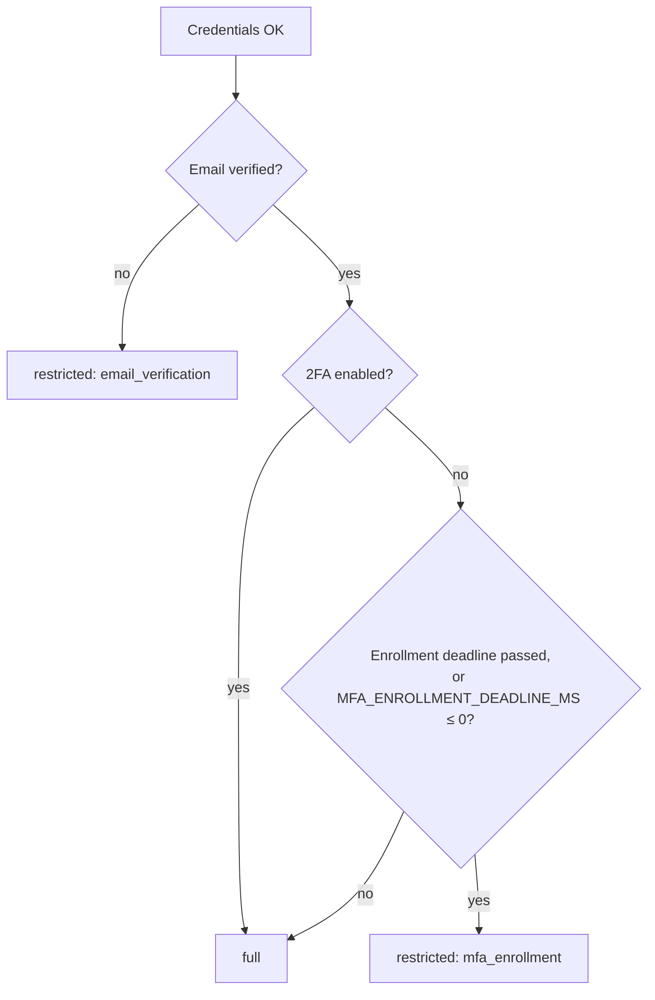

# Authentication, MFA and privileged access

User-facing behaviour is described in [Account and security](../../user-guide/10-account-and-security.md);
every endpoint with a real request/response is in the
[Auth API reference](../api-reference/auth-and-sessions.md). Code lives in
`apps/api/src/modules/{auth,sessions,impersonation,support-access}`.

## Sessions

- **JWTs carry identity only** (user id, session scope, token version, MFA assurance time) —
  never permissions ([ADR 003](../../adr/003-jwt-identity-only.md)). Permissions are resolved per
  request from the database through a cache ([ADR 004](../../adr/004-authorization-caching.md)).
- **httpOnly cookies per client**: `X-Client-Type: web | admin | merchant` on login selects the
  cookie pair, so sessions of the three apps are isolated. API clients may send
  `Authorization: Bearer <access token>` instead.
- **Rotation:** `POST /auth/refresh` rotates the refresh token with a compare-and-set, so
  concurrent refreshes (several tabs, SSR + browser) cannot fork a session; the Next.js proxies
  refresh server-side on navigation. Details: [Token refresh](./token-refresh.md).
- **Lifetimes:** `JWT_ACCESS_EXPIRY` (default `15m`) and `JWT_REFRESH_EXPIRY` (default `7d`).
- **Revocation:** every role or permission change, password reset and 2FA change increments the
  user's `tokenVersion`; the next request with an older token gets `401 TOKEN_VERSION_MISMATCH`.
- **CSRF:** cookie-authenticated mutations need `X-Mutation-Intent: same-origin` and an allowed
  `Origin` / `Referer` (`CORS_ORIGINS`). Machine routes (POS, webhooks, local upload) opt out with
  `@SkipMutationIntent()` because they accept no cookies. Failures are `403 MUTATION_INTENT_REQUIRED`
  (header missing) or `403 MUTATION_ORIGIN_REJECTED` (origin not allowed — usually an app origin
  missing from `CORS_ORIGINS`). Use the shared API client, which adds the header; details in
  [Token refresh](./token-refresh.md).
- **Per-app login gates** (same credentials, different `X-Client-Type`):

  | App | Who may sign in | Otherwise |
  | --- | --- | --- |
  | Admin | SuperAdmins and users holding an `ADMIN_DASHBOARD` permission | `401 INVALID_CREDENTIALS` — the same answer as a wrong password, so the admin login reveals nothing |
  | Merchant | users with an ACTIVE membership in an organization that has a merchant profile, holders of `MANAGE:MERCHANT_ORG`, or anyone with a **pending, unexpired team invite** for their email (so they can sign in and accept it) | `403 MERCHANT_ACCESS_REQUIRED` |
  | Web | any active account | — |

  Signing in to one app never signs you in to another: each has its own cookie pair.

## Restricted and full sessions

`SessionRestrictionService` decides at login **and on every refresh** (so a refresh can never
escalate):

A restricted session reaches only the routes needed to finish setup (verification, 2FA setup,
recovery, logout, own profile); everything else answers `403 RESTRICTED_SESSION`. Routes that need
more declare `@RequiresFullSession()` / `@EmailVerified()`.

## Login hardening

- **New-device verification** (`LOGIN_VERIFICATION_MODE`): `new-device` (default) emails a code
  for an unrecognized device, `always` on every login, `disabled` never (rejected in production;
  for automated tests only).
- **Lockout:** repeated failures lock the account for a while; a SuperAdmin can unlock it.
- **Throttling:** strict per-IP limits on login, signup, password reset and verification resend
  (5 per minute on login). Client IPs honour `X-Forwarded-For` only from proxies listed in
  `TRUST_PROXY`.
- **No enumeration:** signup, forgot-password and resend-verification answer the same way whether
  or not the account exists. Reset tokens are single-use and stored as SHA-256 digests.
- Passwords: bcrypt with `BCRYPT_SALT_ROUNDS` (10–15, default 12) and a password history.

## Two-factor authentication

- TOTP secrets are encrypted with `MFA_ENCRYPTION_KEYS` (versioned AES-256 key ring; the highest
  version encrypts, older ones still decrypt, so keys rotate without re-enrollment).
- Setup returns the secret, a QR data URL and backup codes; enabling verifies one TOTP code. A code
  cannot be replayed within its 30-second step.
- Backup codes are single-use. Rotation needs the password plus a TOTP or backup code.
- `mfaAssuredAt` records the last successful second factor; **step-up** checks require it to be
  within `MFA_STEP_UP_TTL_MS` (default 5 minutes).
- **Login challenges are single-use.** The second login step is a `TwoFactorLoginChallenge` row
  (`MfaChallengeService`) referenced by a short-lived signed token: 10 minutes, at most 5 attempts
  (`maxAttempts`), consumed on success or when the attempts run out — and failures feed the account
  lockout.
- Each encrypted secret is bound to its purpose with authenticated data (`totp-pending` during setup,
  `totp-secret` once enabled), so a ciphertext cannot be replayed in the other context.
- `MFA_ENROLLMENT_DEADLINE_MS` is the grace period before enrolment becomes mandatory (restricted
  session afterwards); always set `MFA_ENCRYPTION_KEYS` explicitly in production.

## MFA recovery

`PENDING → APPROVED → COMPLETED` or `DENIED`. A SuperAdmin approves; 2FA is removed only after
`MFA_RECOVERY_DELAY_MS` (default 24 hours) so the real owner can react. There is deliberately no
instant "reset MFA" button. Every transition writes `mfa_recovery_audit_logs` (append-only).

## Impersonation

- Only an active **SuperAdmin** with a fresh MFA step-up may impersonate; never another SuperAdmin,
  never nested (`ALREADY_IMPERSONATING`).
- The impersonation session lasts 900 seconds; `stop-impersonation` restores the admin's session.
- Every audited request records both the acting admin (`impersonatorId`) and the user, and
  `impersonation_audit_logs` / `impersonation_sessions` keep the history. Self-service writes such as
  editing the user's profile are refused while impersonating.

## Support access

Just-in-time access for support staff to one organization: a SuperAdmin requests a grant (reason,
ticket, `READ_ONLY` or `WRITE_ELEVATED`, 15–480 minutes); only an active OWNER of that organization
approves; a SuperAdmin revokes. Each transition is a compare-and-set plus an organization audit row,
under its own allow-listed system operation (`support_access.*`).

## Dos and don'ts

- ✅ Read the current user with `@GetUser()`; never trust ids from the body for "who am I".
- ✅ Bump `tokenVersion` (via the existing services) whenever you change what a user may do.
- ✅ Put new auth routes behind the strict throttler and keep responses enumeration-safe.
- ❌ Never put permissions, roles or organization lists in a JWT.
- ❌ Never add a bypass of the restricted-session rule or of the MFA step-up for convenience.
- ❌ Never log tokens, codes, secrets or full emails (the logger masks addresses).

## Troubleshooting

| Symptom | Cause | Fix |
| --- | --- | --- |
| `401 TOKEN_VERSION_MISMATCH` right after a password, 2FA, role or permission change | Expected: older tokens are revoked | The client refreshes or signs in again; never disable the check |
| Redirect loop between a page and `/auth/…` | A restricted session (email or MFA pending) on a route the proxy does not allow for restricted sessions | Finish verification / enrolment; when adding a setup route, add it to the allow-list in `packages/client/src/lib/auth/edge/restricted-session.ts` |
| A shared schema "is not defined" in a client after an auth change | Stale `@workspace/shared` build | `pnpm build:shared`, restart dev |
| Login 2FA code always rejected | Server clock skew, or a reused code (a code is valid once per 30-second step) | Sync the clock; wait for the next code |
| MFA recovery approved but 2FA still required | `MFA_RECOVERY_DELAY_MS` has not elapsed | Wait for the delay; a job (`TaskScheduleService`, every 10 minutes) then completes the request and removes 2FA |
| Logged in on web but "not authenticated" on admin | Cookie isolation by design | Sign in on each app |
| Cookies set but the Next.js proxy cannot read them locally | API and apps run on different ports | `COOKIE_DOMAIN=localhost` in the API and app `.env` files |

## Known residual risks

- The auth guard maps any validation failure — including a database outage while checking token
  state — to `401`; infrastructure errors should surface as 5xx/503 (follow-up).
- There is no "sign out one other device" endpoint (only this session or all sessions).
- No cross-tab refresh lock (mitigated by single-flight refresh per tab/SSR and atomic rotation).
