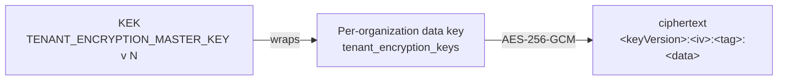

# Encryption, keys and KMS

## Key material the API uses

| Variable | Kind | Used for | Rotation |
| --- | --- | --- | --- |
| `JWT_ACCESS_SECRET`, `JWT_REFRESH_SECRET`, `EMAIL_VERIFICATION_SECRET`, `TWO_FACTOR_PENDING_SECRET` | HMAC secrets (≥ 32 chars, all different) | Signing the four token types | Change + redeploy (signs users out) |
| `MFA_ENCRYPTION_KEYS` | JSON ring `{"<version>": "<base64 32 bytes>"}` | AES-256-GCM encryption of TOTP secrets | Add a higher version; keep old ones until no secret uses them |
| `REWARD_CODE_HASH_KEYS` | Same ring format | HMAC-SHA256 lookup hashes of reward QR tokens and backup codes | Add a higher version; every version is tried on lookup |
| `TENANT_ENCRYPTION_MASTER_KEY` (+ `_VERSION`, `TENANT_ENCRYPTION_PREVIOUS_MASTER_KEYS`) | Base64 of 32 bytes | Key-encryption key (KEK) for tenant data keys | See below |
| `TENANT_JOB_HMAC_SECRET` | HMAC secret | Signed tenant job contexts (unset = signing fails closed) | Change + redeploy |
| `STORAGE_PROCESSING_CALLBACK_SECRET` | Shared secret | `POST /files/processing-callback` (unset = every callback rejected) | Change on both sides |
| `RESEND_WEBHOOK_SECRET` | `whsec_…` from Resend | Verifying delivery webhooks | Recreate the webhook, update the env |

`pnpm secrets:generate apps/api/.env` fills every app-owned secret; `pnpm secrets:scan` keeps real
values out of `.env.example`. Production values belong in a secrets manager, never in the repo.

### If a secret leaked

Tracked example files (`.env.example`) contain **placeholders only**. If a real secret was ever
committed or copied into a deployed environment:

1. Generate new values for `JWT_ACCESS_SECRET`, `JWT_REFRESH_SECRET`, `EMAIL_VERIFICATION_SECRET`
   and `TWO_FACTOR_PENDING_SECRET`, plus a new `MFA_ENCRYPTION_KEYS` version
   (`pnpm secrets:generate apps/api/.env`). The generator never removes an MFA key version: secrets
   stored under the leaked version still need it to decrypt. New MFA secrets use the highest
   version; the leaked one can be deleted only once no stored MFA secret uses it (every affected
   user re-enrolled) — there is no automated re-encryption job yet.
2. Rotate `RESEND_WEBHOOK_SECRET` in the Resend dashboard and on the server.
3. Update the live environment variables (never commit real values) and restart the API. Every
   existing session becomes invalid; users sign in again.
4. Run `pnpm secrets:scan` before opening the PR.

## Tenant envelope encryption

`TenantEncryptionService` (`apps/api/src/modules/encryption/`) gives each organization its own data
key (DEK), stored wrapped by the KEK together with the provider's key id (for example
`local-dev-kek/v2`). Creating, decrypting and re-wrapping keys is audited. The service is ready for
tenant-confidential fields; no business module stores encrypted fields yet.

**Rotating the KEK:** move the current key into `TENANT_ENCRYPTION_PREVIOUS_MASTER_KEYS` under its
version, set a new key with a higher `TENANT_ENCRYPTION_MASTER_KEY_VERSION`, deploy, then run
`pnpm --filter @workspace/api db:rewrap-tenant-keys -- --actor-user-id <superadmin id>`. Remove the
old version only after the re-wrap finished.

## Decision: KMS provider

`TENANT_KMS_PROVIDER` currently accepts only **`local`**: the KEK lives in the environment and
wrapping happens in process (`LocalDevelopmentKeyManagementService`). Outside production it is the
default; production must set it explicitly so the choice is never implicit.

A managed provider is **pending**. It plugs in behind `TenantKeyManagementPort`
(`wrapDataKey` / `unwrapDataKey` / `currentKeyId`) as one adapter plus one enum value. Options under
consideration:

| Option | Fits when |
| --- | --- |
| HashiCorp Vault / OpenBao **Transit** | Self-hosted or multi-cloud; keys never leave Vault |
| **GCP Cloud KMS** | Deployments on Google Cloud (pairs with Firebase Storage) |
| **Azure Key Vault** | Deployments on Azure |
| **Infisical** | Teams already using it for secrets management |

AWS KMS is the natural fifth option for the S3 deployment path. Until one is chosen and implemented,
treat `local` as acceptable only where the environment's secret store is itself trusted, and record
the choice in a new ADR.
