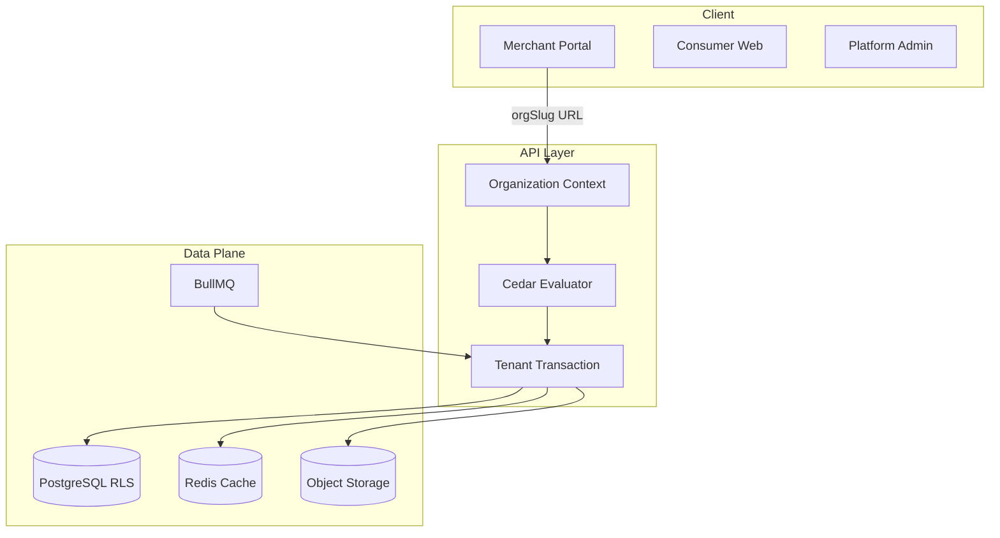

# Multi-Tenancy Threat Model

## Scope

Organization-scoped isolation for the merchant portal, shared PostgreSQL with RLS, in-process Cedar ABAC, background jobs, object storage, caches, analytics, and JIT support access.

**Out of scope at pilot launch:** HIPAA/PHI, contractual RPO/RTO on single-VPS topology.

## Assets

| Asset | Owner |
| --- | --- |
| Organization business data (rewards, KYB, files, keys) | Organization |
| User credentials and MFA secrets | Global user |
| Platform RBAC catalog | Platform |
| Cedar policy bundles | Platform + organization |
| Audit and support-grant records | Platform (tenant-scoped views for org admins) |
| Encryption key metadata | Organization |

## Trust boundaries

## Threat catalog

| ID | Threat | Impact | Mitigation |
| --- | --- | --- | --- |
| T1 | Confused deputy via client tenant header | Cross-tenant read/write | URL slug resolution + membership check; reject client `organizationId` |
| T2 | Slug enumeration | Tenant discovery | Uniform not-found; rate limits |
| T3 | IDOR on organization resources | Data leak | RLS + Cedar + composite FKs |
| T4 | Cross-tenant FK reference | Integrity break | Composite `(organizationId, id)` constraints |
| T5 | Pool/session context bleed | Wrong-tenant query | Transaction-local `SET LOCAL`; fail-closed without context |
| T6 | Implicit RLS bypass | Global data exposure | Remove default bypass; allowlisted system ops only |
| T7 | Stale authorization cache | Post-revocation access | Policy version in cache keys; pub/sub invalidation; seconds SLA |
| T8 | Cache key without org namespace | Cross-tenant cache hit | Prefix keys with env + org + policy version |
| T9 | Worker trusts queue payload | Forged tenant job | Signed job context + re-authorization at execution |
| T10 | Super-admin permanent impersonation | Unaudited full access | JIT grants, read-only default, expiry, tenant approval |
| T11 | Tenant policy lockout / escalation | Admin loss / privilege gain | Platform forbids, simulation, protected policy-admin role |
| T12 | Object storage path traversal | Cross-tenant file access | Org namespace prefixes + authz on download |
| T13 | Analytics/metadata leakage | Tenant inference | Metadata-only platform analytics; tenant-tagged warehouse rows |
| T14 | Incomplete tenant deletion | Regulatory/residual data | Erasure saga + backup expiry + deletion certificate |
| T15 | Slug reuse after rename | Wrong-tenant routing | Slug history reservation |
| T16 | Mixed-tenant API batch | Cross-tenant mutation | Single org context per request |
| T17 | Realtime subscription bleed | Live data leak | Per-channel authz + revalidation on revocation |
| T18 | Support grant without approval | Unauthorized access | Tenant or two-person emergency approval |
| T19 | Encryption key misuse | Decrypt without audit | Envelope keys + audited decrypt operations |
| T20 | Migration partial state | Exposure during cutover | Expand/backfill/contract gates; shadow Cedar parity |

## Abuse cases (detailed)

### AC1: Attacker swaps `X-Merchant-Org-Id` to victim org

**Precondition:** Valid session, not a member of victim org.  
**Attack:** Send API request with victim org header.  
**Expected:** 404 uniform not-found; no RLS-visible rows.

### AC2: Attacker reuses old slug after org rename

**Precondition:** Org renamed from `acme` to `acme-corp`.  
**Attack:** Request `/orgs/acme/...`.  
**Expected:** Redirect or not-found per slug history policy; never attach to wrong org.

### AC3: Policy admin removes all owners

**Precondition:** Tenant policy admin with builder access.  
**Attack:** Publish policy denying all `OrganizationOwner` actions.  
**Expected:** Simulation blocks last-owner removal; platform forbid prevents owner strip.

### AC4: Worker job forged without signature

**Precondition:** Compromised queue producer.  
**Attack:** Enqueue job with arbitrary `organizationId`.  
**Expected:** Signature verification fails; job rejected and audited.

## Mobile client

The Expo app is client type `mobile` ([ADR 029](../../adr/029-mobile-client-body-token-transport.md)):
its tokens travel in JSON bodies (access token sent back as `Authorization: Bearer`, refresh
token as a `{ refreshToken }` body) instead of httpOnly cookies, and it declares its version in
`X-App-Version` ([ADR 033](../../adr/033-mobile-forced-upgrade.md)). The full design is
[Mobile app §12](../mobile/mobile-app.md#12-security-model); authentication details are in
[Authentication](./authentication.md#client-types-and-token-transport).

| ID | Threat | Impact | Mitigation |
| --- | --- | --- | --- |
| M1 | Token theft from device storage | Session takeover | Tokens only in `expo-secure-store` (Keychain / Keystore), never AsyncStorage, logs or other persisted state; single-device revoke and sign-out-everywhere from any client |
| M2 | Refresh-token replay (stolen or leaked token) | Persistent session takeover | Rotation on every refresh with compare-and-set; refresh tokens stored as SHA-256 digests with a per-issue nonce (a bcrypt hash only covered the first 72 bytes, which all of a user's refresh JWTs share); reuse of an older token revokes every session of the user and bumps `tokenVersion` |
| M3 | A browser page declares `X-Client-Type: mobile` to obtain tokens in a body | Script-readable tokens | Transport chosen server-side from the validated client type, no client flag; a `mobile` request gets body tokens **and no cookies**, so a page only obtains tokens for credentials it already holds and signs itself out of its cookie session |
| M4 | CSRF through the mutation-intent exemption for `mobile` | Forged state change | A `mobile` request is never authenticated by a cookie (auth guard: Bearer only; refresh guard: body only), so a forged cross-site request has no ambient credential to ride on |
| M5 | A refresh token presented through the wrong channel (body from a browser type, cookie from `mobile`) | Transport confusion, token exfiltration paths | Rejected: `401 REFRESH_TOKEN_TRANSPORT_MISMATCH` for a browser body token (even next to a valid cookie); a cookie is never read for `mobile` (`401 REFRESH_TOKEN_MISSING`) |
| M6 | A token left in a browser response body by a misordered interceptor | Script-readable tokens | Token-bearing response variants require the `tokenTransport: "body"` marker only the mobile transport adds; any other token is stripped by the response contract |
| M7 | Tokens or 2FA secrets in the audit log / logs | Credential exposure to operators | `accessToken`, `refreshToken`, `otpAuthUrl`, `qrCodeDataUrl`, codes and secrets are redacted before storage (`common/logging/redaction.ts`) |
| M8 | Old app versions with known bugs keep calling the API | Exploitable legacy behavior | `MOBILE_MIN_SUPPORTED_VERSION` + `426 APP_VERSION_UNSUPPORTED` on every `mobile` request, checked before authentication |
| M9 | Spoofed client type or version header | Bypass of the version check | Declaring a browser type only switches the request to cookie transport, which a native app does not have; the version check protects users from old builds, not the API from attackers — authorization never depends on the client type |
| M10 | Stolen or lost phone, unlocked | Account use by a finder | Opt-in app lock (piece 5); revoke the device from another client — `POST /auth/sessions/:sessionId/revoke`, effective on the device's next request (`sid`, ADR 034) |
| M11 | Spoofed device details (`X-Device-Name`, `X-Device-Model`, User-Agent) | A misleading device list | Display-only: read for client type `mobile` only, percent-decoded, length-limited and validated by the shared zod schemas (an invalid value is dropped, never stored), rendered as text on every client; never used for authorization, rate limits or risk decisions |

Residual risks: a leaked mobile refresh token is usable until it is rotated, revoked or expires
(`JWT_REFRESH_EXPIRY`) — exactly like a leaked cookie; `logout-all`, token-version bumps and
revoking the device from the device list revoke it. A revoked device's access tokens are rejected
on its next request (`sid`, ADR 034); a missed cross-instance invalidation delays that by at most
the access-token state cache TTL. Client-reported device details (model, name, browser, OS, app
version) are display-only, length-limited, validated before storage and rendered as text — they
never influence authorization. A body-presented refresh token is audited as `REFRESH_BODY`.

## Verification requirements

- Two-tenant integration tests per resource class
- RLS policy coverage tests per classified table
- Cedar golden tests for guardrail + tenant templates
- Cache isolation tests across org switch
- Job context tampering tests
- Support grant expiry and revocation tests
- Migration reconciliation checksums before cutover
- Mobile client e2e (`apps/api/test/mobile-client.e2e-spec.ts`): body tokens and no cookies, wrong-source refresh rejection, rotation + reuse detection, logout / logout-all by body token, 426

## References

- [Data classification inventory](./data-classification.md)
- ADRs 008–013
