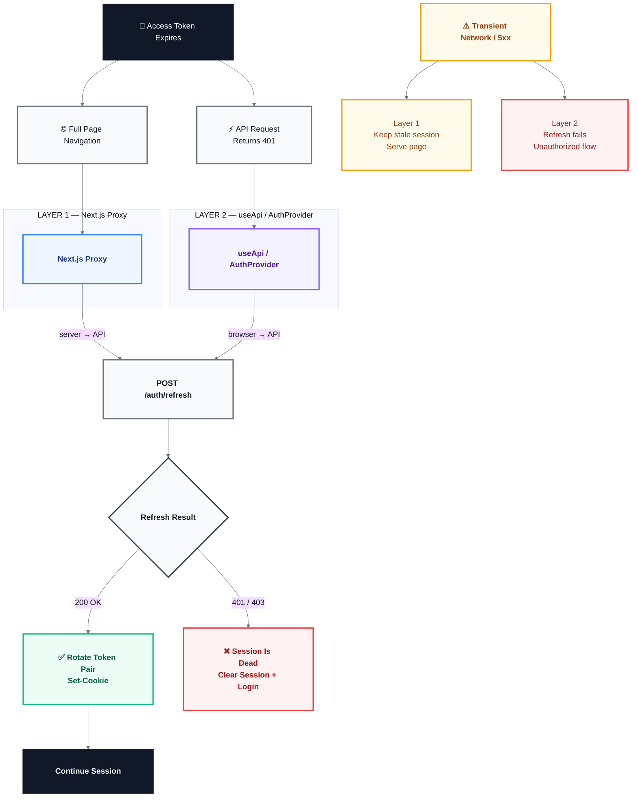

# Token Refresh — Architecture & Request Flow

> [!NOTE]
> This document explains **why tokens rotate, where refresh happens, what happens when refresh succeeds or fails, and how to debug the two refresh paths**.
>
> There are two independent refresh mechanisms:
>
> 1. **Layer 1 — Server-side proxy refresh** for full-page navigations.
> 2. **Layer 2 — Browser-side reactive refresh** when an API request returns `401`.
>
> Both ultimately use the same `POST /auth/refresh` API endpoint.

---

## TL;DR — the 30-second version

The app uses **two keys** to keep you logged in:

1. A **short-lived key** (the access token) — like a movie ticket that expires after 15 minutes.
2. A **long-lived key** (the refresh token) — like a season pass that can get you a new ticket whenever the old one runs out.

When the ticket expires, the app **quietly trades in the season pass for a fresh ticket** — you never notice. That's "silent refresh."

The swap happens in **two different places**, and that's what confuses everyone:

| What you do | Which layer runs | Will I see it in DevTools? |
| --- | --- | --- |
| Press Cmd+R / refresh the page | **Layer 1** (server) | ❌ No — it's server-to-server |
| Open a new tab / type a URL | **Layer 1** (server) | ❌ No |
| Click a link in the sidebar (SPA navigation) | **Layer 2** (browser) | ✅ Yes — you'll see the 401 + refresh |
| A background request happens while the page is open | **Layer 2** (browser) | ✅ Yes |

> [!NOTE]
> **Full page loads refresh invisibly on the server. Anything that happens while the page is already open refreshes visibly from the browser.**

And a **401 in the Network tab is not an error** — it's the *trigger* that starts the silent refresh:

```text
1. GET /session            → 401 Unauthorized  (expired ticket, expected)
2. POST /auth/refresh      → 200              (trade pass for a new ticket)
3. GET /session (retry)    → 200              (order goes through)
```

> [!TIP]
> Start here if the machinery below feels heavy — everything in this document is just the detail behind the table above. The coffee-shop intuition is the whole system in miniature.

---

## Contents

1. [TL;DR — the 30-second version](#tldr--the-30-second-version)
2. [Architecture at a glance](#1-architecture-at-a-glance)
3. [Token model](#2-token-model)
4. [The two refresh layers](#3-the-two-refresh-layers)
5. [Layer 1 — Server-side proxy refresh](#4-layer-1--server-side-proxy-refresh)
6. [Layer 2 — Browser-side reactive refresh](#5-layer-2--browser-side-reactive-refresh)
7. [Which layer runs when?](#6-which-layer-runs-when)
8. [Failure handling](#7-failure-handling)
9. [Observability & debugging](#8-observability--debugging)
10. [Deployment requirements](#9-deployment-requirements)
11. [Security & trade-offs](#10-security--trade-offs)
12. [Configuration & tuning](#11-configuration--tuning)
13. [FAQ](#12-faq)

---

## 1. Architecture at a glance

### 1.1 The core idea

The API authenticates requests using a short-lived **access token**.

When that token expires, the application does **not** immediately ask the user to log in again. Instead, it exchanges the long-lived **refresh token** for a new access/refresh pair.

The important part is that the refresh mechanism has **two entry points**:

```text
                              ┌──────────────────────────┐
                              │         API :8080        │
                              │                          │
                              │  POST /auth/refresh     │
                              │                          │
                              │  refresh cookie          │
                              │          ↓               │
                              │  rotate token pair       │
                              │          ↓               │
                              │      Set-Cookie          │
                              └────────────┬─────────────┘
                                           │
                         ┌─────────────────┴─────────────────┐
                         │                                   │
                         ▼                                   ▼
              ┌─────────────────────┐             ┌─────────────────────┐
              │       LAYER 1       │             │       LAYER 2       │
              │     SERVER-SIDE     │             │     BROWSER-SIDE    │
              ├─────────────────────┤             ├─────────────────────┤
              │ Next.js proxy       │             │ useApi /            │
              │                     │             │ AuthProvider         │
              │ Trigger:            │             │                     │
              │ full page           │             │ Trigger:             │
              │ navigation          │             │ API returns 401      │
              └──────────┬──────────┘             └──────────┬──────────┘
                         │                                   │
                         └─────────────────┬─────────────────┘
                                           │
                                           ▼
                                  POST /auth/refresh
```

#### The rule of thumb

> **Full page load → refresh on the server.**
>
> **API request while the page is open → refresh in the browser.**

This separation exists because the browser cannot read `httpOnly` cookies, while the Next.js proxy can.

---

### 1.2 End-to-end request model

```text
Browser
  │
  │ Request
  ▼
┌───────────────────┐
│ Next.js / Browser │
└─────────┬─────────┘
          │
          ├── Full page navigation ──► Layer 1: Proxy refresh
          │
          └── API request ───────────► API
                                      │
                                      ├── 2xx ──► continue
                                      │
                                      └── 401 ──► Layer 2: refresh
                                                     │
                                                     ▼
                                              POST /auth/refresh
```

---

## 2. Token model

### 2.1 Access token vs refresh token

| Token | Default lifetime | Purpose |
|---|---:|---|
| Access token | `15m` | Authenticate normal API requests |
| Refresh token | `7d` | Obtain a new access/refresh pair |

The short access-token lifetime limits the useful lifetime of a stolen access token.

The refresh token lets a legitimate session continue without requiring the user to log in every 15 minutes.

---

### 2.2 Rotation

A refresh is not simply "give me another access token."

It is a **rotation**:

```text
Old refresh token
       │
       │ POST /auth/refresh
       ▼
┌────────────────────────────┐
│            API             │
│                            │
│  Validate refresh token    │
│  Invalidate old token      │
│  Issue new access token    │
│  Issue new refresh token   │
└──────────────┬─────────────┘
               │
               ▼
        New token pair
        via Set-Cookie
```

The old refresh token is invalidated after rotation. Refresh tokens are stored hashed in the database, so the previous token cannot simply be reused.

This means a stolen refresh token is intended to be **single-use**.

---

### 2.3 Cookie model

Both tokens live in `httpOnly` cookies.

| Property | Behavior |
|---|---|
| JavaScript access | ❌ Not available |
| `document.cookie` | ❌ Cannot read them |
| Browser automatically sends cookies | ✅ |
| API can read them | ✅ |
| Next.js proxy can read them | ✅ |
| Token stored in JS memory | ❌ |

This is important because Layer 1 depends on server-side access to the `httpOnly` cookies.

#### Session cookies

The API sets the cookies as session cookies:

- no `Max-Age`
- no `Expires`

Therefore closing the browser ends the browser session.

The refresh token still has a server-enforced lifetime of `JWT_REFRESH_EXPIRY` (`7d` by default), but the browser will no longer send the session cookie after the browser session ends.

---

### 2.4 Web vs admin cookies

The web and admin applications use separate cookie names:

| Application | Access cookie | Refresh cookie |
|---|---|---|
| Web | `accessToken` | `refreshToken` |
| Admin | `adminAccessToken` | `adminRefreshToken` |

The backend determines which cookie set to use from the `X-Client-Type` header:

```text
Web
  X-Client-Type: web
       │
       └── accessToken / refreshToken

Admin
  X-Client-Type: admin
       │
       └── adminAccessToken / adminRefreshToken
```

This keeps web and admin sessions isolated.

---

## 3. The two refresh layers

### 3.1 Why are there two?

The two mechanisms solve different problems.

| | Layer 1 | Layer 2 |
|---|---|---|
| Runs in | Next.js server | Browser |
| Trigger | Full page navigation | API `401` |
| Reads `httpOnly` cookies | ✅ | ❌ |
| Calls refresh | Server → API | Browser → API |
| Visible in Network tab | ❌ | ✅ |
| Retries failed API request | Not applicable | ✅ |
| Main purpose | Prevent stale sessions on page load | Recover from expired tokens during SPA activity |

The layers are **independent**.

They do not share a global single-flight lock.

---

## 4. Layer 1 — Server-side proxy refresh

### 4.1 Location

Layer 1 lives in:

```text
apps/web/proxy.ts
apps/admin/proxy.ts
```

It uses the Next.js 16 `proxy.ts` convention and runs on the Node.js runtime.

---

### 4.2 When does it run?

The proxy attempts refresh only when all of these conditions are met:

1. The route is not public.
2. Both access-token and refresh-token cookies are present.
3. The request looks like a document navigation.
4. The access token is expired or expires within 30 seconds.

The navigation detection uses:

```text
sec-fetch-mode: navigate
```

or:

```text
Accept: text/html
```

RSC/prefetch data requests are skipped.

The 30-second buffer is controlled by:

```text
REFRESH_SKEW_MS = 30000
```

This absorbs clock drift between the server and browser.

---

### 4.3 Full navigation flow

```text
┌─────────┐
│ Browser │
└────┬────┘
     │
     │ GET /hello
     │ full page navigation
     ▼
┌────────────────────────┐
│     Next.js Proxy      │
│                        │
│ Read httpOnly cookies  │
└───────────┬────────────┘
            │
            │ Access token expired
            │ or expires within 30s?
            ▼
       ┌────────────┐
       │            │
      NO           YES
       │            │
       ▼            ▼
┌─────────────┐  ┌───────────────────────┐
│ Continue     │  │ POST /auth/refresh    │
│ normally     │  │ Server → API         │
└──────┬──────┘  │ Timeout: 3 seconds    │
       │         └───────────┬───────────┘
       │                     │
       │                     ▼
       │              ┌──────────────┐
       │              │ API response │
       │              └──────┬───────┘
       │                     │
       │        ┌────────────┼─────────────┐
       │        │            │             │
       │       200         401/403      Network/5xx
       │        │            │             │
       │        ▼            ▼             ▼
       │   New cookies   Dead session   Keep stale
       │   attached      clear cookies   session
       │   to response   + redirect      + serve
       │
       └──────────────────────┬──────────────────────
                              │
                              ▼
                         Browser receives
                         page response
                         + Set-Cookie
```

---

### 4.4 Refresh succeeds

When the API returns `200`:

```text
Next.js Proxy
     │
     │ POST /auth/refresh
     ▼
    API
     │
     │ 200
     │ Set-Cookie: new access token
     │ Set-Cookie: new refresh token
     ▼
Next.js Proxy
     │
     │ Attach Set-Cookie headers
     ▼
Browser
```

The browser receives the new cookies as part of the page response.

The refresh itself is **not visible in the browser Network tab** because the refresh request happened server-to-server.

---

### 4.5 Refresh token is dead

If `/auth/refresh` returns `401` or `403`, the session is considered dead.

```text
Proxy
  │
  │ POST /auth/refresh
  ▼
 API
  │
  │ 401 / 403
  ▼
Proxy
  │
  ├── Clear cookies
  │
  └── Redirect → /auth/login
```

Clearing the cookies matters.

Without clearing them, the proxy could continue interpreting the user as authenticated and create a redirect loop.

---

### 4.6 API is temporarily unavailable

A network error, timeout, or `5xx` does **not** immediately log the user out.

```text
Proxy
  │
  │ POST /auth/refresh
  ▼
 API
  │
  ├── network error
  ├── timeout
  └── 5xx
       │
       ▼
Proxy
  │
  ├── Keep stale cookies
  └── Serve the page anyway
```

The rationale is simple:

> A temporary API outage should not destroy an otherwise valid user session.

The page may load with a stale session, and Layer 2 can handle the eventual `401` if an API request actually fails.

---

### 4.7 Refresh timeout

The proxy refresh has a hard timeout:

```text
REFRESH_TIMEOUT_MS = 3000
```

Therefore a slow API can add at most approximately **3 seconds** to a full-page navigation before the proxy falls back to serving the page with the stale session.

---

### 4.8 Proxy cooldown

Transient refresh failures are memoized for:

```text
PROXY_REFRESH_COOLDOWN_MS = 60000
```

That means:

```text
API unavailable
      │
      ▼
First navigation
      │
      ├── refresh attempt
      └── transient failure
              │
              ▼
        60-second cooldown
              │
       ┌──────┴──────┐
       │             │
       ▼             ▼
Later navigation   Later navigation
       │             │
       └── skip refresh
             │
             ▼
       Serve stale page
```

This prevents a dead API from being hammered by repeated navigations.

The cooldown is cleared by:

- successful refresh
- dead-session response
- fresh login

#### Important caveat

The web and admin proxies have separate cooldown instances.

If both apps run in the same Next.js server process, each app maintains its own refresh cooldown state.

This is intentional and accepted as a per-instance trade-off.

---

## 5. Layer 2 — Browser-side reactive refresh

### 5.1 Location

Layer 2 lives in:

```text
packages/client/src/lib/auth.tsx
packages/client/src/lib/use-api.ts
```

The refresh entry point is:

```text
AuthProvider.handleRefresh
```

The request pipeline is handled by:

```text
useApi
```

---

### 5.2 When does it run?

Layer 2 activates when an API request returns `401` while the page is already running.

Examples:

- SPA navigation
- `router.push`
- Next.js `Link`
- background refetch
- mutations
- any other API call

The proxy does not handle these requests, so an expired access token can reach the API and produce a `401`.

---

### 5.3 401 → refresh → retry

```text
Browser
   │
   │ GET /auth/me
   ▼
 API
   │
   │ 401 — access token expired
   ▼
 useApi
   │
   │ onRefresh()
   ▼
Browser
   │
   │ POST /auth/refresh
   ▼
 API
   │
   ├───────────────┐
   │               │
  OK              Fail
   │               │
   ▼               ▼
Retry request   onUnauthorized()
   │               │
   ▼               ▼
  200          Clear auth state
                   +
               Redirect /login
```

The refresh is a normal browser request and therefore appears in DevTools.

---

### 5.4 Single-flight refresh

Multiple requests can fail at the same time:

```text
Browser
  │
  ├── GET /auth/me ───────► 401
  │
  ├── GET /auth/user ─────► 401
  │
  └── GET /auth/profile ──► 401
             │
             ▼
       ONE refresh call
             │
             ▼
      POST /auth/refresh
             │
             ▼
        New token pair
             │
       ┌─────┼─────┐
       ▼     ▼     ▼
     retry retry retry
```

The requests share a **single refresh operation**.

This is essential because refresh-token rotation invalidates the old refresh token.

Without single-flight behavior:

```text
401 ──► refresh A ──► rotate
401 ──► refresh B ──► uses old refresh token
                         │
                         ▼
                      failure
```

---

### 5.5 Why refresh uses `apiFetch`

The refresh request is routed through `apiFetch`, rather than `useApi`.

That prevents this recursion:

```text
useApi
  │
  └── 401
       │
       └── refresh
            │
            └── useApi
                 │
                 └── 401
                      │
                      └── refresh
                           │
                           └── ...
```

The refresh operation must sit **outside the 401 → refresh pipeline that it drives**.

---

### 5.6 Client-side failure

If the refresh request itself fails:

```text
API request
    │
    ▼
  401
    │
    ▼
refresh
    │
    └── failure
         │
         ▼
   onUnauthorized()
         │
         ├── clear auth state
         └── redirect /auth/login
```

Unlike Layer 1, the browser-side mechanism does not have the same "serve the page anyway" fallback because the page is already running and the API request has explicitly failed.

---

## 6. Which layer runs when?

| Situation | Layer | `/auth/refresh` visible in browser? |
|---|---|---|
| Hard refresh with expired access token | Layer 1 | ❌ No |
| New tab / typed URL with expired token | Layer 1 | ❌ No |
| Hard refresh with valid token | Neither | — |
| SPA navigation with expired token | Layer 2 | ✅ Yes |
| Background refetch returns `401` | Layer 2 | ✅ Yes |
| Mutation returns `401` | Layer 2 | ✅ Yes |
| Refresh token is dead | Redirect to login | Depends on layer |

#### The mental model

```text
             FULL PAGE NAVIGATION
                     │
                     ▼
              ┌─────────────┐
              │ Next.js     │
              │ Proxy       │
              └──────┬──────┘
                     │
                Layer 1
                     │
                     ▼
             POST /auth/refresh


              PAGE ALREADY OPEN
                     │
                     ▼
                API request
                     │
                    401
                     │
                     ▼
              ┌─────────────┐
              │ useApi /    │
              │ AuthProvider│
              └──────┬──────┘
                     │
                Layer 2
                     │
                     ▼
             POST /auth/refresh
```

> **Full page loads refresh invisibly on the server.**
>
> **In-page API failures refresh visibly from the browser.**

---

## 7. Failure handling

### 7.1 Dead session vs transient failure

These two failure types must be treated differently.

| Refresh result | Meaning | Layer 1 | Layer 2 |
|---|---|---|---|
| `200` | Refresh succeeded | Set new cookies | Retry request |
| `401` / `403` | Refresh token is dead | Clear + login | Clear + login |
| Network error | API unavailable | Keep stale session | Refresh fails |
| Timeout | API unavailable | Keep stale session | Refresh fails |
| `5xx` | API/server problem | Keep stale session | Refresh fails |

#### The key distinction

```text
                 Refresh failed
                       │
             ┌─────────┴─────────┐
             │                   │
         401 / 403          Network / 5xx
             │                   │
             ▼                   ▼
        Session dead        Probably transient
             │                   │
             ▼                   ▼
        Clear session       Keep session
        + login             + try again later
```

---

### 7.2 Why Layer 1 is more forgiving

A full-page navigation is an opportunity to recover **before the application starts making API requests**.

If the refresh service is temporarily unavailable, it is better to let the page render and preserve the session than to force a login because of a transient infrastructure problem.

Layer 2 is different: it is already responding to an actual `401`.

---

## 8. Observability & debugging

### 8.1 Layer 1 — server console

Layer 1 does not appear in the browser Network tab.

Watch the Next.js server console:

```text
[proxy:web] /hello: refreshed — rotated 2 cookie(s) (API 200, 14ms)

[proxy:admin] /: dead-session — refresh rejected,
clearing cookies (API 401, 6ms)

[proxy:web] /hello: transient-failure — refresh failed
(network/5xx) — connect ECONNREFUSED 127.0.0.1:8080,
keeping stale session (API 0, 8ms)
```

The prefixes identify the application:

```text
[proxy:web]
[proxy:admin]
```

---

### 8.2 Layer 2 — browser Network tab

Layer 2 is visible.

Look for:

```text
POST /auth/refresh
```

followed by the original request being retried.

Typical sequence:

```text
GET /auth/me       401
        │
        ▼
POST /auth/refresh 200
        │
        ▼
GET /auth/me       200
```

The first `401` is expected. It is the **trigger** for the recovery mechanism.

---

### 8.3 Testing Layer 1

For a fast local test:

```text
JWT_ACCESS_EXPIRY=1m
```

Then:

1. Log in.
2. Wait approximately one minute.
3. Hard refresh the page.
4. Open the browser Network tab.
5. Check the Next.js server console.

Expected result:

```text
Browser Network:
  GET /hello      200
  GET /auth/me    200
  POST /auth/refresh  ← NOT visible

Server console:
  [proxy:web] /hello: refreshed ...
```

This confirms the refresh happened in Layer 1.

---

### 8.4 Testing Layer 2

With the page already open:

1. Let the access token expire.
2. Trigger an API request without performing a full page navigation.
3. Open the browser Network tab.

Expected result:

```text
GET /auth/me       401
POST /auth/refresh 200
GET /auth/me       200
```

This confirms Layer 2 handled the expired token.

---

## 9. Deployment requirements

### 9.1 Runtime

The Next.js `proxy.ts` implementation runs on the **Node.js runtime**.

There is no Edge runtime configuration required for this architecture.

The proxy therefore deploys like a normal Node.js application on environments such as:

- DigitalOcean
- Linode
- Railway
- Vercel
- other Node.js-compatible hosting

---

### 9.2 API connectivity

The Next.js server must be able to reach:

```text
NEXT_PUBLIC_API_URL
```

The API can be:

```text
Next.js server
      │
      ├── same machine
      ├── private network
      └── public HTTPS endpoint
```

The Layer 1 refresh request is **server-to-server**, so browser CORS rules do not apply to that request.

---

### 9.3 Cookie requirements

Production cookies should be:

- `httpOnly`
- `Secure`
- `SameSite=Lax`

The web and API should be deployed under the same site, for example:

```text
app.example.com
api.example.com
```

This preserves the intended first-party cookie behavior.

---

## 10. Security & trade-offs

### 10.1 Security properties

#### Tokens never touch JavaScript

Both access and refresh tokens remain in `httpOnly` cookies.

```text
Browser JavaScript
       │
       │ cannot read
       ▼
httpOnly cookies
```

This prevents ordinary client-side JavaScript from directly extracting the tokens.

---

#### Refresh-token rotation

Every successful refresh rotates the refresh token.

```text
refresh A
   │
   ▼
refresh B
   │
   ▼
refresh C
```

The previous refresh token is invalidated during each rotation.

---

#### Web/admin isolation

Separate cookie names prevent a normal web session from being treated as an admin session.

```text
Web:
accessToken
refreshToken

Admin:
adminAccessToken
adminRefreshToken
```

---

### 10.2 Trade-off: independent refresh domains

Layer 1 and Layer 2 do not share a cross-tab/global single-flight mechanism.

That means a race is theoretically possible:

```text
Tab A
  │
  └── refresh ──► rotates token

Tab B
  │
  └── refresh ──► still using old refresh token
                       │
                       ▼
                    rejected
```

This can result in a spurious re-login.

The trade-off is intentional: the system avoids the complexity of cross-tab coordination.

---

### 10.3 Trade-off: per-instance proxy cooldown

The proxy cooldown is local to each proxy instance.

If web and admin run independently, their cooldown state is independent.

A transient API outage may therefore result in:

```text
Web proxy    → cooldown
Admin proxy  → cooldown
```

rather than a shared application-wide cooldown.

This is acceptable because:

- a healthy API clears the condition naturally;
- a genuinely dead API will fail for both;
- the cooldown expires automatically;
- no distributed state is required.

---

### 10.4 No proactive background refresh

There is deliberately no:

```text
setTimeout(...)
```

or periodic background refresh.

Refresh happens **on demand**:

```text
Full navigation
      │
      └── Layer 1

API returns 401
      │
      └── Layer 2
```

There is also no JS-readable expiry cookie.

The access token remains `httpOnly`, so JavaScript cannot independently inspect its expiry and schedule a reliable refresh.

---

## 11. Configuration & tuning

| Setting | Location | Default | Purpose |
|---|---|---:|---|
| `JWT_ACCESS_EXPIRY` | `apps/api/.env` | `15m` | Access-token lifetime |
| `JWT_REFRESH_EXPIRY` | `apps/api/.env` | `7d` | Maximum refresh-token lifetime |
| `REFRESH_SKEW_MS` | `proxy-refresh.ts` | `30000` | Refresh this early before expiry |
| `REFRESH_TIMEOUT_MS` | `proxy-refresh.ts` | `3000` | Maximum proxy refresh duration |
| `PROXY_REFRESH_COOLDOWN_MS` | `proxy-refresh.ts` | `60000` | Suppress repeated transient refresh failures |

#### Recommended local testing

```text
JWT_ACCESS_EXPIRY=1m
```

This makes both refresh paths easy to exercise.

Do not use the short test expiry in production.

---

## 12. FAQ

### Why does `/auth/me` sometimes return `401` on a cold page load?

If the request was not a full document navigation — for example, an SPA navigation or background refetch — Layer 1 does not run.

The API can therefore return:

```text
401
  ↓
Layer 2 refresh
  ↓
retry
  ↓
200
```

The initial `401` is the **trigger**, not necessarily a user-visible failure.

---

### Why don't I see `/auth/refresh` in the Network tab?

If the page was loaded through a full navigation and Layer 1 refreshed the token, the refresh happened:

```text
Next.js server → API
```

rather than:

```text
Browser → API
```

Therefore the browser cannot see the refresh request.

Look at the Next.js server console instead.

---

### Why do I see `/auth/refresh` in the Network tab?

That means Layer 2 probably handled an API `401`.

The expected sequence is:

```text
original request → 401
refresh          → 200
retry            → 200
```

---

### Why do I see `/auth/refresh` twice?

Single-flight prevents **concurrent** refreshes from being duplicated within the same client flow.

It does not prevent two sequential refreshes.

For example:

```text
401
 ↓
refresh
 ↓
200
 ↓
another request
 ↓
401
 ↓
refresh again
```

Those are two separate rotations.

---

### Why does the user get logged out after closing the browser?

The authentication cookies are session cookies.

They intentionally do not specify:

```text
Max-Age
Expires
```

Closing the browser ends the browser session, so the user must log in again on the next visit.

---

### Why does a temporary API outage not immediately log the user out?

Layer 1 treats:

```text
network error
timeout
5xx
```

as transient failures.

It keeps the existing cookies and serves the page.

Only a refresh response indicating that the refresh session is actually invalid (`401`/`403`) causes Layer 1 to clear the session immediately.

---

### Why can another tab sometimes stay logged in while this tab gets logged out?

The two refresh layers do not coordinate across tabs.

Because rotation invalidates the previous refresh token, a race between tabs can cause one refresh attempt to use a token that another tab has already rotated.

This is a known trade-off of the current architecture.

---

## Quick reference



---

_Last updated: August 3, 2026_
