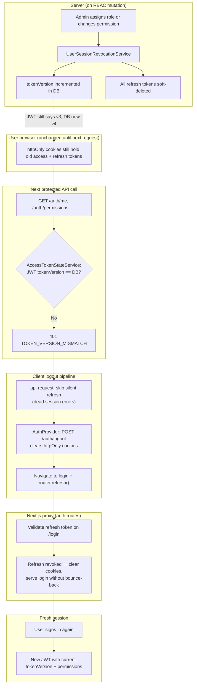
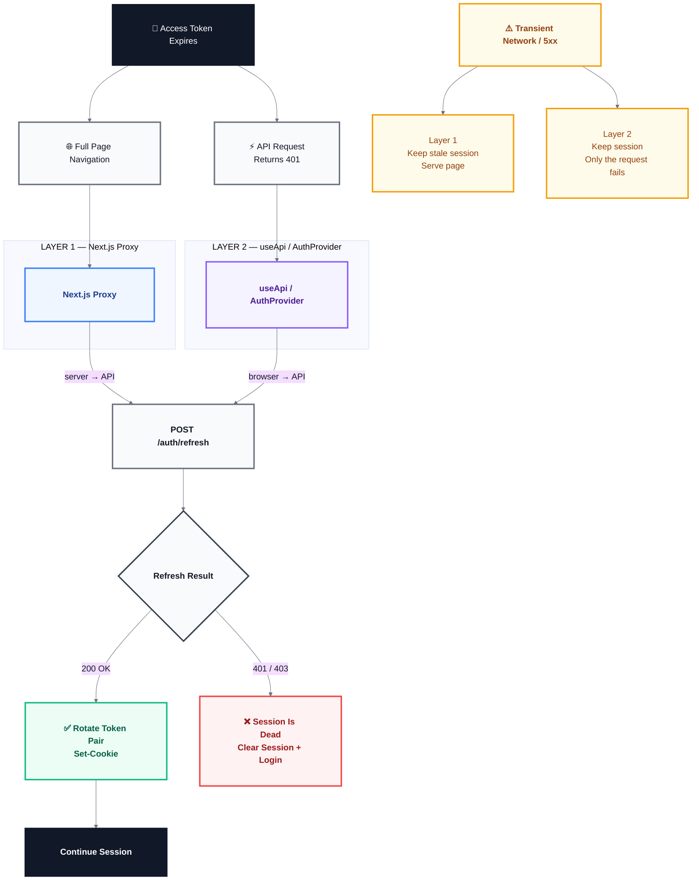

# Token Refresh — Architecture & Request Flow

> [!NOTE]
> This document explains **why tokens rotate, where refresh happens, what happens when refresh succeeds or fails, and how to debug the two refresh paths**.
>
> There are two independent refresh mechanisms:
>
> 1. **Layer 1 — Server-side proxy refresh** for full-page navigations.
> 2. **Layer 2 — Browser-side reactive refresh** when an API request returns `401`.
>
> Both ultimately use the same `POST /auth/refresh` API endpoint.

---

## TL;DR — the 30-second version

The app uses **two keys** to keep you logged in:

1. A **short-lived key** (the access token) — like a movie ticket that expires after 15 minutes.
2. A **long-lived key** (the refresh token) — like a season pass that can get you a new ticket whenever the old one runs out.

When the ticket expires, the app **quietly trades in the season pass for a fresh ticket** — you never notice. That's "silent refresh."

The swap happens in **two different places**, and that's what confuses everyone:

| What you do | Which layer runs | Will I see it in DevTools? |
| --- | --- | --- |
| Press Cmd+R / refresh the page | **Layer 1** (server) | ❌ No — it's server-to-server |
| Open a new tab / type a URL | **Layer 1** (server) | ❌ No |
| Click a link in the sidebar (SPA navigation) | **Layer 2** (browser) | ✅ Yes — you'll see the 401 + refresh |
| A background request happens while the page is open | **Layer 2** (browser) | ✅ Yes |

> [!NOTE]
> **Full page loads refresh invisibly on the server. Anything that happens while the page is already open refreshes visibly from the browser.**

And a **401 in the Network tab is not an error** — it's the *trigger* that starts the silent refresh:

```text
1. GET /session            → 401 Unauthorized  (expired ticket, expected)
2. POST /auth/refresh      → 200              (trade pass for a new ticket)
3. GET /session (retry)    → 200              (order goes through)
```

> [!TIP]
> Start here if the machinery below feels heavy — everything in this document is just the detail behind the table above. The coffee-shop intuition is the whole system in miniature.

---

## Contents

1. [TL;DR — the 30-second version](#tldr--the-30-second-version)
2. [Architecture at a glance](#1-architecture-at-a-glance)
3. [Token model](#2-token-model)
4. [The two refresh layers](#3-the-two-refresh-layers)
5. [Layer 1 — Server-side proxy refresh](#4-layer-1--server-side-proxy-refresh)
6. [Layer 2 — Browser-side reactive refresh](#5-layer-2--browser-side-reactive-refresh)
7. [Which layer runs when?](#6-which-layer-runs-when)
8. [Failure handling](#7-failure-handling)
9. [Observability & debugging](#8-observability--debugging)
10. [Deployment requirements](#9-deployment-requirements)
11. [Security & trade-offs](#10-security--trade-offs)
12. [Configuration & tuning](#11-configuration--tuning)
13. [FAQ](#12-faq)

---

## 1. Architecture at a glance

### 1.1 The core idea

The API authenticates requests using a short-lived **access token**.

When that token expires, the application does **not** immediately ask the user to log in again. Instead, it exchanges the long-lived **refresh token** for a new access/refresh pair.

The important part is that the refresh mechanism has **two entry points**:

```text
                              ┌──────────────────────────┐
                              │         API :8080        │
                              │                          │
                              │  POST /auth/refresh     │
                              │                          │
                              │  refresh cookie          │
                              │          ↓               │
                              │  rotate token pair       │
                              │          ↓               │
                              │      Set-Cookie          │
                              └────────────┬─────────────┘
                                           │
                         ┌─────────────────┴─────────────────┐
                         │                                   │
                         ▼                                   ▼
              ┌─────────────────────┐             ┌─────────────────────┐
              │       LAYER 1       │             │       LAYER 2       │
              │     SERVER-SIDE     │             │     BROWSER-SIDE    │
              ├─────────────────────┤             ├─────────────────────┤
              │ Next.js proxy       │             │ useApi /            │
              │                     │             │ AuthProvider         │
              │ Trigger:            │             │                     │
              │ full page           │             │ Trigger:             │
              │ navigation          │             │ API returns 401      │
              └──────────┬──────────┘             └──────────┬──────────┘
                         │                                   │
                         └─────────────────┬─────────────────┘
                                           │
                                           ▼
                                  POST /auth/refresh
```

#### The rule of thumb

> **Full page load → refresh on the server.**
>
> **API request while the page is open → refresh in the browser.**

This separation exists because the browser cannot read `httpOnly` cookies, while the Next.js proxy can.

---

### 1.2 End-to-end request model

```text
Browser
  │
  │ Request
  ▼
┌───────────────────┐
│ Next.js / Browser │
└─────────┬─────────┘
          │
          ├── Full page navigation ──► Layer 1: Proxy refresh
          │
          └── API request ───────────► API
                                      │
                                      ├── 2xx ──► continue
                                      │
                                      └── 401 ──► Layer 2: refresh
                                                     │
                                                     ▼
                                              POST /auth/refresh
```

---

## 2. Token model

### 2.1 Access token vs refresh token

| Token | Default lifetime | Purpose |
|---|---:|---|
| Access token | `15m` | Authenticate normal API requests |
| Refresh token | `7d` | Obtain a new access/refresh pair |

The short access-token lifetime limits the useful lifetime of a stolen access token.

The refresh token lets a legitimate session continue without requiring the user to log in every 15 minutes.

---

### 2.2 Rotation

A refresh is not simply "give me another access token."

It is a **rotation**:

```text
Old refresh token
       │
       │ POST /auth/refresh
       ▼
┌────────────────────────────┐
│            API             │
│                            │
│  Validate refresh token    │
│  Invalidate old token      │
│  Issue new access token    │
│  Issue new refresh token   │
└──────────────┬─────────────┘
               │
               ▼
        New token pair
        via Set-Cookie
```

The old refresh token is invalidated after rotation. Refresh tokens are stored hashed in the database, so the previous token cannot simply be reused.

This means a stolen refresh token is intended to be **single-use**.

---

### 2.3 Global `tokenVersion` validation

Every access token carries a `tokenVersion` claim copied from the `User` row at issuance time.

On **every authenticated request**, `AuthGuard` calls `AccessTokenStateService.assertTokenValid()` which re-checks:

| Field | Effect when stale |
| --- | --- |
| `tokenVersion` | `401 TOKEN_VERSION_MISMATCH` — password changes, logout-all, MFA changes, and role updates bump the counter |
| `isActive` | `401 ACCOUNT_IS_INACTIVE` |
| `isDeleted` | `401 ACCOUNT_DELETED` |

A short-lived in-process cache (30 seconds) avoids hitting the database on every request while still propagating revocations quickly.

**Guests make no session calls.** The web app passes `sessionHint` (did the server see a session cookie — `hasServerSession`) to `AuthProvider`; without one it skips the on-mount `/auth/me` + `/auth/permissions` revalidation, which could only answer 401. Cross-tab sync and the post-login session sync are unaffected.

**Logout-all bumps `tokenVersion`:** `POST /auth/logout-all` soft-deletes every refresh token **and** increments `tokenVersion`, so outstanding access tokens die immediately — not only after their 15-minute expiry.

**Revoked refresh rejection:** `POST /auth/refresh` rejects refresh tokens whose database row has `isDeleted: true` with `401 REFRESH_TOKEN_REVOKED` before rotation logic runs. Token-theft detection also revokes all refresh rows and bumps `tokenVersion`.

#### Session revocation after role or permission change

When an admin assigns a role, grants/revokes a permission, or syncs a user's access, `UserSessionRevocationService` runs in the same flow as the RBAC mutation. It does **not** delete cookies in the user's browser — it invalidates the session **server-side** so the next request fails fast.


```mermaid
flowchart TD
    subgraph server["Server (on RBAC mutation)"]
        A["Admin assigns role or changes permission"]
        B["UserSessionRevocationService"]
        C["tokenVersion incremented in DB"]
        D["All refresh tokens soft-deleted"]
        A --> B --> C
        B --> D
    end

    subgraph browser["User browser (unchanged until next request)"]
        E["httpOnly cookies still hold old access + refresh tokens"]
    end

    C -.->|"JWT still says v3, DB now v4"| E

    subgraph next["Next protected API call"]
        F["GET /auth/me, /auth/permissions, …"]
        G{"AccessTokenStateService:<br/>JWT tokenVersion == DB?"}
        H["401 TOKEN_VERSION_MISMATCH"]
        F --> G
        G -->|No| H
    end

    E --> F

    subgraph client["Client logout pipeline"]
        I["api-request: skip silent refresh<br/>(dead session errors)"]
        J["AuthProvider: POST /auth/logout<br/>clears httpOnly cookies"]
        K["Navigate to login + router.refresh()"]
        H --> I --> J --> K
    end

    subgraph proxy["Next.js proxy (auth routes)"]
        L["Validate refresh token on /login"]
        M["Refresh revoked → clear cookies,<br/>serve login without bounce-back"]
        K --> L --> M
    end

    subgraph fresh["Fresh session"]
        N["User signs in again"]
        O["New JWT with current tokenVersion + permissions"]
        M --> N --> O
    end
```

**Key idea:** the access token may still be within its time expiry (e.g. 15 minutes left), but the embedded `tokenVersion` is checked on every request. After a role change, that version is stale immediately — refresh cannot recover because refresh rows were deleted too.

**Code paths:** `UserSessionRevocationService` (`apps/api/.../user-session-revocation.service.ts`), wired from `RoleService` and `PermissionService`; client handling in `packages/client/src/lib/api/api-request.ts` and `packages/client/src/lib/features/auth/facade.tsx` (`AuthProvider`); proxy hardening in `packages/client/src/lib/auth/proxy-refresh.ts`.

---

### 2.4 Cookie model

Both tokens live in `httpOnly` cookies.

| Property | Behavior |
|---|---|
| JavaScript access | ❌ Not available |
| `document.cookie` | ❌ Cannot read them |
| Browser automatically sends cookies | ✅ |
| API can read them | ✅ |
| Next.js proxy can read them | ✅ |
| Token stored in JS memory | ❌ |

This is important because Layer 1 depends on server-side access to the `httpOnly` cookies.

#### Session cookies

The API sets the cookies as session cookies:

- no `Max-Age`
- no `Expires`

Therefore closing the browser ends the browser session.

The refresh token still has a server-enforced lifetime of `JWT_REFRESH_EXPIRY` (`7d` by default), but the browser will no longer send the session cookie after the browser session ends.

---

### 2.5 Application-specific cookies

The consumer, admin, and merchant applications use separate cookie names:

| Application | Access cookie | Refresh cookie |
|---|---|---|
| Web | `accessToken` | `refreshToken` |
| Admin | `adminAccessToken` | `adminRefreshToken` |
| Merchant | `merchantAccessToken` | `merchantRefreshToken` |

The backend determines which cookie set to use from the `X-Client-Type` header:

```text
Web
  X-Client-Type: web
       │
       └── accessToken / refreshToken

Admin
  X-Client-Type: admin
       │
       └── adminAccessToken / adminRefreshToken

Merchant
  X-Client-Type: merchant
       │
       └── merchantAccessToken / merchantRefreshToken
```

This prevents a login or logout in one application from changing the session in another application.
Merchant login also requires an active merchant membership or the global
`MANAGE MERCHANT_ORG` permission, so consumer-only accounts are rejected before
a merchant session is created.

---

## 3. The two refresh layers

### 3.1 Why are there two?

The two mechanisms solve different problems.

| | Layer 1 | Layer 2 |
|---|---|---|
| Runs in | Next.js server | Browser |
| Trigger | Full page navigation | API `401` |
| Reads `httpOnly` cookies | ✅ | ❌ |
| Calls refresh | Server → API | Browser → API |
| Visible in Network tab | ❌ | ✅ |
| Retries failed API request | Not applicable | ✅ |
| Main purpose | Prevent stale sessions on page load | Recover from expired tokens during SPA activity |

The layers are **independent**.

They do not share a global single-flight lock.

---

## 4. Layer 1 — Server-side proxy refresh

### 4.1 Location

Layer 1 lives in:

```text
apps/web/proxy.ts
apps/admin/proxy.ts
```

It uses the Next.js 16 `proxy.ts` convention and runs on the Node.js runtime.

---

### 4.2 When does it run?

The proxy attempts refresh only when all of these conditions are met:

1. The route is not public.
2. Both access-token and refresh-token cookies are present.
3. The request looks like a document navigation.
4. The access token is expired or expires within 30 seconds.

The navigation detection uses:

```text
sec-fetch-mode: navigate
```

or:

```text
Accept: text/html
```

RSC/prefetch data requests are skipped.

The 30-second buffer is controlled by:

```text
REFRESH_SKEW_MS = 30000
```

This absorbs clock drift between the server and browser.

---

### 4.3 Full navigation flow

```text
┌─────────┐
│ Browser │
└────┬────┘
     │
     │ GET /hello
     │ full page navigation
     ▼
┌────────────────────────┐
│     Next.js Proxy      │
│                        │
│ Read httpOnly cookies  │
└───────────┬────────────┘
            │
            │ Access token expired
            │ or expires within 30s?
            ▼
       ┌────────────┐
       │            │
      NO           YES
       │            │
       ▼            ▼
┌─────────────┐  ┌───────────────────────┐
│ Continue     │  │ POST /auth/refresh    │
│ normally     │  │ Server → API         │
└──────┬──────┘  │ Timeout: 3 seconds    │
       │         └───────────┬───────────┘
       │                     │
       │                     ▼
       │              ┌──────────────┐
       │              │ API response │
       │              └──────┬───────┘
       │                     │
       │        ┌────────────┼─────────────┐
       │        │            │             │
       │       200         401/403      Network/5xx
       │        │            │             │
       │        ▼            ▼             ▼
       │   New cookies   Dead session   Keep stale
       │   attached      clear cookies   session
       │   to response   + redirect      + serve
       │
       └──────────────────────┬──────────────────────
                              │
                              ▼
                         Browser receives
                         page response
                         + Set-Cookie
```

---

### 4.4 Refresh succeeds

When the API returns `200`:

```text
Next.js Proxy
     │
     │ POST /auth/refresh
     ▼
    API
     │
     │ 200
     │ Set-Cookie: new access token
     │ Set-Cookie: new refresh token
     ▼
Next.js Proxy
     │
     │ Attach Set-Cookie headers
     ▼
Browser
```

The browser receives the new cookies as part of the page response.

The refresh itself is **not visible in the browser Network tab** because the refresh request happened server-to-server.

---

### 4.5 Refresh token is dead

If `/auth/refresh` returns `401` or `403`, the session is considered dead.

```text
Proxy
  │
  │ POST /auth/refresh
  ▼
 API
  │
  │ 401 / 403
  ▼
Proxy
  │
  ├── Clear cookies
  │
  └── Redirect → /auth/login
```

Clearing the cookies matters.

Without clearing them, the proxy could continue interpreting the user as authenticated and create a redirect loop.

---

### 4.6 API is temporarily unavailable

A network error, timeout, or `5xx` does **not** immediately log the user out.

```text
Proxy
  │
  │ POST /auth/refresh
  ▼
 API
  │
  ├── network error
  ├── timeout
  └── 5xx
       │
       ▼
Proxy
  │
  ├── Keep stale cookies
  └── Serve the page anyway
```

The rationale is simple:

> A temporary API outage should not destroy an otherwise valid user session.

The page may load with a stale session, and Layer 2 can handle the eventual `401` if an API request actually fails.

---

### 4.7 Refresh timeout

The proxy refresh has a hard timeout:

```text
REFRESH_TIMEOUT_MS = 3000
```

Therefore a slow API can add at most approximately **3 seconds** to a full-page navigation before the proxy falls back to serving the page with the stale session.

---

### 4.8 Proxy cooldown

Transient refresh failures are memoized for:

```text
PROXY_REFRESH_COOLDOWN_MS = 60000
```

That means:

```text
API unavailable
      │
      ▼
First navigation
      │
      ├── refresh attempt
      └── transient failure
              │
              ▼
        60-second cooldown
              │
       ┌──────┴──────┐
       │             │
       ▼             ▼
Later navigation   Later navigation
       │             │
       └── skip refresh
             │
             ▼
       Serve stale page
```

This prevents a dead API from being hammered by repeated navigations.

The cooldown is cleared by:

- successful refresh
- dead-session response
- fresh login

#### Important caveat

The web and admin proxies have separate cooldown instances.

If both apps run in the same Next.js server process, each app maintains its own refresh cooldown state.

This is intentional and accepted as a per-instance trade-off.

---

## 5. Layer 2 — Browser-side reactive refresh

### 5.1 Location

Layer 2 lives in:

```text
packages/client/src/lib/features/auth/facade.tsx   (AuthProvider — re-exported by @workspace/client/lib/auth)
packages/client/src/lib/api/use-api.ts
packages/client/src/lib/api/api-request.ts
```

The refresh entry point is:

```text
AuthProvider.handleRefresh
```

The request pipeline is handled by:

```text
useApi
```

#### Client session state (the `auth` feature store)

`AuthProvider` keeps what the tab believes about its session in a per-mount
`auth` feature store ([ADR 023](./adr/023-client-state-feature-stores.md)). It
is UI status only — the httpOnly cookies and the API stay the only authority:

| Owner | Holds |
|---|---|
| `auth` feature store | `status`: `unknown`, then `authenticated` (with the session's subject id and scope) or `signed-out` (with the reason). Also a session `epoch`. No token and no profile, and never persisted. |
| TanStack Query | The profile (`GET /auth/me`) and permissions (`GET /auth/permissions`). A sign-in seeds `/auth/me` from the login response. |
| Derived | `useAuth().user` = profile + scope. `isAuthenticated` and `isLoading` come from `status`. |

Every transition is a named event (`[ Auth ] Session Established`, `Session
Restored`, `Session Not Found`, `Session Scope Changed`, `Signed Out`, `Session
Expired`, `Signed Out In Another Tab`, `Server Session Cleared`, …). The store and
its effects guarantee the following.

- **The cache is cleared on every way of losing the session.** That covers
  `Signed Out`, `Session Expired`, `Signed Out In Another Tab`, and a
  session check that no longer finds the session (`Session Not Found`).
  - The clear is synchronous. It finishes before the flow's next step, such as
    `POST /auth/logout` or navigation.
  - While the tab is signed out this way, the silent refresh resolves `expired`
    without calling the API.
  - A session check never redirects and never runs the exit sequence: it
    bypasses the 401 pipeline. The next real request still goes through the
    401 → refresh → redirect rules.
- **The cache is cleared when the identity changes.** If a sign-in or a session
  check brings a different user than the one whose `/auth/me` is cached, the
  whole cache is dropped before anything of the new user is written. This covers
  the case where another member signed in in another tab. Every sign-in also
  drops the cached `/auth/permissions`, even for the same member, because it
  described the previous session.
- **The receiving tab drops the session at once.** When another tab signs out,
  this tab clears its state and cache before its own `POST /auth/logout` is sent.
  That POST is repeated deliberately, because the sender broadcasts even if its
  own POST failed. The redirect waits for it.
- **The exit sequence runs once.** Concurrent 401s, and any later ones, run the
  server logout, broadcast and redirect only once. Only the call that ended the
  session runs them.
- **Stale session checks are dropped.** The session `epoch` goes up at every
  sign-in, every way of losing the session, and every identity change. A check
  that started in an earlier epoch is ignored. For example, a `200` that arrives
  after the user signed out never restores the session.
- **Server-rendered session data is only used at epoch 0.** `useIsServerRenderedSession()`
  is true only before the tab's first session boundary. Server-rendered session
  data, such as `/auth/me` on `/hello` and the SSR `/auth/permissions` in
  `WebAuthorizationProvider`, seeds a query (`initialData`) only while it is true.
  Otherwise, a still-mounted component would recreate the previous member's
  query as fresh right after the sign-out cache clear.
- **Other tabs are told in order.** `logged-out` is posted only after
  `POST /auth/logout` returns (`Server Session Cleared`), and only when the tab
  is leaving for the login page. `logged-in` is posted on a sign-in. Only event
  names cross tabs, never tokens.
- **A restored session is fetched once.** The on-mount `/auth/me` +
  `/auth/permissions` check seeds both queries, so each page load fetches the
  profile only once.

##### Session check outcomes

The session check (`checkSession`, `packages/client/src/lib/auth/session/session-check.ts`)
classifies every answer before it touches the store. Only `no-session` can end a
session; an unreachable API never does.

| `/auth/me` answer | Verdict | What the tab does |
|---|---|---|
| 2xx, body matches the contract | `valid` | `Session Restored` (seeds `/auth/me`, and `/auth/permissions` when that answered). A failed `/auth/permissions` alone does not block it: the live permissions query fills the scope in. |
| 401 with `TOKEN_VERSION_MISMATCH`, `REFRESH_TOKEN_REVOKED` or `TOKEN_THEFT_DETECTED` | `no-session` | `Session Not Found` at once, no refresh. |
| Any other 401 (expired, missing, invalid access token) | `expired-access-token` | ONE refresh through the tab's single-flight refresh (the same one the 401 pipeline uses, so the token rotates once), then one more read without refreshing. That read is final; a 401 now means `no-session`. The second read also runs after a refresh that answered 401, because another tab may have rotated the shared refresh token first (`REFRESH_TOKEN_SUPERSEDED`), leaving this tab a valid new pair. |
| 403 | `unavailable` (`unexpected-status`), reported | The API answers 403 only after authentication succeeded (`AuthGuard` runs first), restricted sessions are allowlisted for both endpoints (`RestrictedSessionGuard`), and neither route has an authorization requirement. A 403 here comes from a gateway or a contract break: signing out would be wrong and a refresh cannot fix it. |
| Other 4xx (404, 400, …) | `unavailable` (`unexpected-status`), reported | Same reasoning. |
| 429 | `unavailable` (`rate-limited`) | Kept status, retried. |
| 5xx | `unavailable` (`server-error`) | Kept status, retried. |
| No HTTP answer | `unavailable` (`network`, or `aborted` when the browser cancelled it) | Kept status, retried. |
| No answer within 10 s (`SESSION_CHECK_TIMEOUT_MS`) | `unavailable` (`timeout`) | The read is aborted. Before, a hung API kept the tab `unknown` forever. |
| 2xx whose body the contract rejects, or that is not JSON | `unavailable` (`contract-violation`), reported | Never read as signed in. |
| The refresh needed by an expired token could not run (network, 5xx, 30 s cooldown) or timed out | `unavailable` (`refresh-unavailable` / `timeout`) | Kept status, retried. |

"Reported" means a structured `console.warn` (`event: "auth.session_check.contract_problem"`,
endpoint, status, and the bounded zod issue list — never the body). The client has no
error-reporting pipeline yet; outages are not reported, because every tab would report them.

`unavailable` dispatches `[ Auth ] Session Check Failed` with the reason category. It
changes only the store's `check` slice, never `status` or `epoch`:

| Store slice | Values |
|---|---|
| `status` | unchanged: an `authenticated` tab stays authenticated (cache intact, no redirect, no broadcast); an `unknown` tab stays `unknown` (never `signed-out`). |
| `check` | `ok` · `retrying { reason, failedAttempts }` · `paused { reason, failedAttempts }` |

`useAuth().isLoading` stays `true` while the status is `unknown`, deliberately: consumers
read `isLoading === false && user === null` as signed out. Whether the check is still
running or failing is `useSessionCheckStatus()`. Each app shell mounts
`SessionCheckNotice` (`@workspace/client/lib/auth/session/session-check-notice`), a
polite `role="status"` banner shown only while `check` is not `ok`, with a "Try again"
button once retries are paused. Guest pages do not mount it; the web landing header shows
a neutral placeholder instead of "Sign in" while a member's session is unverified.

##### Retry policy

- **Backoff:** capped exponential with equal jitter: retry *n* waits between half and all
  of `min(1 s × 2^(n−1), 30 s)`. Up to 6 retries (`SESSION_CHECK_MAX_RETRIES`), about
  30–60 s in total, which covers a typical deploy restart. The fixed half keeps retries
  from hammering; the random half spreads tabs and members that failed together.
- **Budget:** past 6 failures the check is `paused` and nothing is sent until a trigger.
  A verdict (`Session Restored` / `Session Not Found`) or any session boundary (sign-in,
  sign-out, another member) resets it to `ok`.
- **Stops:** a scheduled retry is cancelled, and a check in flight is aborted, at every
  session boundary (epoch change), when the route stops checking, and on unmount. Only the
  newest check applies: a new one aborts the one in flight, and an answer from an
  earlier epoch is dropped.
- **Hidden or offline:** a hidden tab or an offline browser does not retry (nobody is
  looking, or the request cannot succeed). This is also what prevents a retry storm across
  tabs: only the visible tab retries, and failed checks are never broadcast.
- **Triggers** (only while `check` is not `ok`, so a healthy tab never re-checks on them),
  each starting a new series (`[ Auth ] Session Recheck Requested`):
  - `online`: the browser regained connectivity, the most likely moment the API is
    reachable again.
  - `visibilitychange` to visible: the member is looking again, and hidden tabs did not
    retry.
  - "Try again" (`useAuthCommands().recheckSession()`): the member asked.

  The two browser events reach every tab at once, so those re-checks wait a random
  0–1 s (`SESSION_RECHECK_JITTER_MS`). There is no unbounded loop: automatic retries are
  capped per series, and only these triggers start a series.

---

### 5.2 When does it run?

Layer 2 activates when an API request returns `401` while the page is already running.

Examples:

- SPA navigation
- `router.push`
- Next.js `Link`
- background refetch
- mutations
- any other API call

The proxy does not handle these requests, so an expired access token can reach the API and produce a `401`.

---

### 5.3 401 → refresh → retry

```text
Browser
   │
   │ GET /auth/me
   ▼
 API
   │
   │ 401 — access token expired
   ▼
 useApi
   │
   │ onRefresh()
   ▼
Browser
   │
   │ POST /auth/refresh
   ▼
 API
   │
   ├───────────────┐
   │               │
  OK              Fail
   │               │
   ▼               ▼
Retry request   onUnauthorized()
   │               │
   ▼               ▼
  200          Clear auth state
                   +
               Redirect /login
```

The refresh is a normal browser request and therefore appears in DevTools.

---

### 5.4 Single-flight refresh

Multiple requests can fail at the same time:

```text
Browser
  │
  ├── GET /auth/me ───────► 401
  │
  ├── GET /auth/user ─────► 401
  │
  └── GET /auth/profile ──► 401
             │
             ▼
       ONE refresh call
             │
             ▼
      POST /auth/refresh
             │
             ▼
        New token pair
             │
       ┌─────┼─────┐
       ▼     ▼     ▼
     retry retry retry
```

The requests share a **single refresh operation**.

This is essential because refresh-token rotation invalidates the old refresh token.

Without single-flight behavior:

```text
401 ──► refresh A ──► rotate
401 ──► refresh B ──► uses old refresh token
                         │
                         ▼
                      failure
```

---

### 5.5 Why refresh uses `apiFetch`

The refresh request is routed through `apiFetch`, rather than `useApi`.

That prevents this recursion:

```text
useApi
  │
  └── 401
       │
       └── refresh
            │
            └── useApi
                 │
                 └── 401
                      │
                      └── refresh
                           │
                           └── ...
```

The refresh operation must sit **outside the 401 → refresh pipeline that it drives**.

---

### 5.6 Client-side failure

What the 401 pipeline does depends on how the refresh ended (`OnRefresh` resolves a
`RefreshResult`):

```text
API request
    │
    ▼
  401
    │
    ▼
refresh ─┬─ ok ──────────► retry the request (a second 401 → onUnauthorized)
         │
         ├─ expired ─────► onUnauthorized()
         │  (401 / 403)      ├── clear auth state + cache
         │                   └── redirect /auth/login
         │
         └─ transient ───► fail THIS request with SessionRefreshUnavailableError
            (network, 5xx,   — the session is kept: no logout, no redirect,
             or cooldown)      no cross-tab sign-out
```

A refresh that could not reach the API says nothing about the session, so it never ends
it. During the 30 s cooldown after a transient failure, further 401s fail the same way
without calling the API. Before this, the pipeline collapsed the result to a boolean and
a 5xx or network error on `/auth/refresh` signed the member out.

---

## 6. Which layer runs when?

| Situation | Layer | `/auth/refresh` visible in browser? |
|---|---|---|
| Hard refresh with expired access token | Layer 1 | ❌ No |
| New tab / typed URL with expired token | Layer 1 | ❌ No |
| Hard refresh with valid token | Neither | — |
| SPA navigation with expired token | Layer 2 | ✅ Yes |
| Background refetch returns `401` | Layer 2 | ✅ Yes |
| Mutation returns `401` | Layer 2 | ✅ Yes |
| Refresh token is dead | Redirect to login | Depends on layer |

#### The mental model

```text
             FULL PAGE NAVIGATION
                     │
                     ▼
              ┌─────────────┐
              │ Next.js     │
              │ Proxy       │
              └──────┬──────┘
                     │
                Layer 1
                     │
                     ▼
             POST /auth/refresh


              PAGE ALREADY OPEN
                     │
                     ▼
                API request
                     │
                    401
                     │
                     ▼
              ┌─────────────┐
              │ useApi /    │
              │ AuthProvider│
              └──────┬──────┘
                     │
                Layer 2
                     │
                     ▼
             POST /auth/refresh
```

> **Full page loads refresh invisibly on the server.**
>
> **In-page API failures refresh visibly from the browser.**

---

## 7. Failure handling

### 7.1 Dead session vs transient failure

These two failure types must be treated differently.

| Refresh result | Meaning | Layer 1 | Layer 2 |
|---|---|---|---|
| `200` | Refresh succeeded | Set new cookies | Retry request |
| `401` / `403` | Refresh token is dead | Clear + login | Clear + login |
| Network error | API unavailable | Keep stale session | Keep session; the request fails (`SessionRefreshUnavailableError`) |
| Timeout | API unavailable | Keep stale session | Keep session; the request fails |
| `5xx` | API/server problem | Keep stale session | Keep session; the request fails |

#### The key distinction

```text
                 Refresh failed
                       │
             ┌─────────┴─────────┐
             │                   │
         401 / 403          Network / 5xx
             │                   │
             ▼                   ▼
        Session dead        Probably transient
             │                   │
             ▼                   ▼
        Clear session       Keep session
        + login             + try again later
```

---

### 7.2 Why Layer 1 is more forgiving

A full-page navigation is an opportunity to recover **before the application starts making API requests**.

If the refresh service is temporarily unavailable, it is better to let the page render and preserve the session than to force a login because of a transient infrastructure problem.

Layer 2 is already responding to an actual `401`, so it cannot serve a page "anyway". It keeps
the session too when the refresh is transient — only the request that triggered it fails —
and it ends the session only when the refresh says the session is dead (`401`/`403`).

---

## 8. Observability & debugging

### 8.1 Layer 1 — server console

Layer 1 does not appear in the browser Network tab.

Watch the Next.js server console:

```text
[proxy:web] /hello: refreshed — rotated 2 cookie(s) (API 200, 14ms)

[proxy:admin] /: dead-session — refresh rejected,
clearing cookies (API 401, 6ms)

[proxy:web] /hello: transient-failure — refresh failed
(network/5xx) — connect ECONNREFUSED 127.0.0.1:8080,
keeping stale session (API 0, 8ms)
```

The prefixes identify the application:

```text
[proxy:web]
[proxy:admin]
```

---

### 8.2 Layer 2 — browser Network tab

Layer 2 is visible.

Look for:

```text
POST /auth/refresh
```

followed by the original request being retried.

Typical sequence:

```text
GET /auth/me       401
        │
        ▼
POST /auth/refresh 200
        │
        ▼
GET /auth/me       200
```

The first `401` is expected. It is the **trigger** for the recovery mechanism.

---

### 8.3 Testing Layer 1

For a fast local test:

```text
JWT_ACCESS_EXPIRY=1m
```

Then:

1. Log in.
2. Wait approximately one minute.
3. Hard refresh the page.
4. Open the browser Network tab.
5. Check the Next.js server console.

Expected result:

```text
Browser Network:
  GET /hello      200
  GET /auth/me    200
  POST /auth/refresh  ← NOT visible

Server console:
  [proxy:web] /hello: refreshed ...
```

This confirms the refresh happened in Layer 1.

---

### 8.4 Testing Layer 2

With the page already open:

1. Let the access token expire.
2. Trigger an API request without performing a full page navigation.
3. Open the browser Network tab.

Expected result:

```text
GET /auth/me       401
POST /auth/refresh 200
GET /auth/me       200
```

This confirms Layer 2 handled the expired token.

---

## 9. Deployment requirements

### 9.1 Runtime

The Next.js `proxy.ts` implementation runs on the **Node.js runtime**.

There is no Edge runtime configuration required for this architecture.

The proxy therefore deploys like a normal Node.js application on environments such as:

- DigitalOcean
- Linode
- Railway
- Vercel
- other Node.js-compatible hosting

---

### 9.2 API connectivity

The Next.js server must be able to reach:

```text
NEXT_PUBLIC_API_URL
```

The API can be:

```text
Next.js server
      │
      ├── same machine
      ├── private network
      └── public HTTPS endpoint
```

The Layer 1 refresh request is **server-to-server**, so browser CORS rules do not apply to that request.

---

### 9.3 Cookie requirements

Production cookies should be:

- `httpOnly`
- `Secure`
- `SameSite=Lax`

The web and API should be deployed under the same site, for example:

```text
app.example.com
api.example.com
```

This preserves the intended first-party cookie behavior.

---

## 10. Security & trade-offs

### 10.1 Security properties

#### Tokens never touch JavaScript

Both access and refresh tokens remain in `httpOnly` cookies.

```text
Browser JavaScript
       │
       │ cannot read
       ▼
httpOnly cookies
```

This prevents ordinary client-side JavaScript from directly extracting the tokens.

---

#### Refresh-token rotation

Every successful refresh rotates the refresh token.

```text
refresh A
   │
   ▼
refresh B
   │
   ▼
refresh C
```

The previous refresh token is invalidated during each rotation.

---

#### Restricted sessions stay restricted on refresh

Refresh recomputes `sessionScope` from the user's current enrollment state (email verification, MFA deadline). A restricted session may refresh but never escalates to `full` until enrollment completes.

---

#### Atomic rotation & superseded detection

Refresh rotation uses a compare-and-swap update (`rotateTokenIfHashMatches`). Concurrent refreshes with the same valid token produce `REFRESH_TOKEN_SUPERSEDED` instead of false theft detection. SSR and proxy paths single-flight refresh per refresh-token identity.

---

#### Mutation intent (CSRF layer)

Cookie-authenticated `POST`/`PUT`/`PATCH`/`DELETE` requests require:

- `X-Mutation-Intent: same-origin`
- `Origin` or `Referer` matching `CORS_ORIGINS`

Bearer-authenticated and `@SkipMutationIntent()` routes (webhooks) are exempt.

---

#### Web/admin isolation

Separate cookie names prevent a normal web session from being treated as an admin session.

```text
Web:
accessToken
refreshToken

Admin:
adminAccessToken
adminRefreshToken
```

---

### 10.2 Trade-off: independent refresh domains

Layer 1 and Layer 2 do not share a cross-tab/global single-flight mechanism.

That means a race is theoretically possible:

```text
Tab A
  │
  └── refresh ──► rotates token

Tab B
  │
  └── refresh ──► still using old refresh token
                       │
                       ▼
                    rejected
```

This can result in a spurious re-login.

The trade-off is intentional: the system avoids the complexity of cross-tab coordination.

---

### 10.3 Trade-off: per-instance proxy cooldown

The proxy cooldown is local to each proxy instance.

If web and admin run independently, their cooldown state is independent.

A transient API outage may therefore result in:

```text
Web proxy    → cooldown
Admin proxy  → cooldown
```

rather than a shared application-wide cooldown.

This is acceptable because:

- a healthy API clears the condition naturally;
- a genuinely dead API will fail for both;
- the cooldown expires automatically;
- no distributed state is required.

---

### 10.4 No proactive background refresh

There is deliberately no:

```text
setTimeout(...)
```

or periodic background refresh.

Refresh happens **on demand**:

```text
Full navigation
      │
      └── Layer 1

API returns 401
      │
      └── Layer 2
```

There is also no JS-readable expiry cookie.

The access token remains `httpOnly`, so JavaScript cannot independently inspect its expiry and schedule a reliable refresh.

---

## 11. Configuration & tuning

| Setting | Location | Default | Purpose |
|---|---|---:|---|
| `JWT_ACCESS_EXPIRY` | `apps/api/.env` | `15m` | Access-token lifetime |
| `JWT_REFRESH_EXPIRY` | `apps/api/.env` | `7d` | Maximum refresh-token lifetime |
| `REFRESH_SKEW_MS` | `proxy-refresh.ts` | `30000` | Refresh this early before expiry |
| `REFRESH_TIMEOUT_MS` | `proxy-refresh.ts` | `3000` | Maximum proxy refresh duration |
| `PROXY_REFRESH_COOLDOWN_MS` | `proxy-refresh.ts` | `60000` | Suppress repeated transient refresh failures |

#### Recommended local testing

```text
JWT_ACCESS_EXPIRY=1m
```

This makes both refresh paths easy to exercise.

Do not use the short test expiry in production.

---

## 12. FAQ

### Why does `/auth/me` sometimes return `401` on a cold page load?

If the request was not a full document navigation — for example, an SPA navigation or background refetch — Layer 1 does not run.

The API can therefore return:

```text
401
  ↓
Layer 2 refresh
  ↓
retry
  ↓
200
```

The initial `401` is the **trigger**, not necessarily a user-visible failure.

---

### Why don't I see `/auth/refresh` in the Network tab?

If the page was loaded through a full navigation and Layer 1 refreshed the token, the refresh happened:

```text
Next.js server → API
```

rather than:

```text
Browser → API
```

Therefore the browser cannot see the refresh request.

Look at the Next.js server console instead.

---

### Why do I see `/auth/refresh` in the Network tab?

That means Layer 2 probably handled an API `401`.

The expected sequence is:

```text
original request → 401
refresh          → 200
retry            → 200
```

---

### Why do I see `/auth/refresh` twice?

Single-flight prevents **concurrent** refreshes from being duplicated within the same client flow.

It does not prevent two sequential refreshes.

For example:

```text
401
 ↓
refresh
 ↓
200
 ↓
another request
 ↓
401
 ↓
refresh again
```

Those are two separate rotations.

---

### Why does the user get logged out after closing the browser?

The authentication cookies are session cookies.

They intentionally do not specify:

```text
Max-Age
Expires
```

Closing the browser ends the browser session, so the user must log in again on the next visit.

---

### Why does a temporary API outage not immediately log the user out?

Layer 1 treats:

```text
network error
timeout
5xx
```

as transient failures.

It keeps the existing cookies and serves the page.

Only a refresh response indicating that the refresh session is actually invalid (`401`/`403`) causes Layer 1 to clear the session immediately.

In the browser, the same rule holds for Layer 2 (a transient refresh fails only the request,
§5.6) and for the session check (an unreachable API keeps the tab's status and retries with
backoff, see "Session check outcomes" in §5.1).

---

### Why can another tab sometimes stay logged in while this tab gets logged out?

The two refresh layers do not coordinate across tabs.

Because rotation invalidates the previous refresh token, a race between tabs can cause one refresh attempt to use a token that another tab has already rotated.

This is a known trade-off of the current architecture.

---

## Quick reference


```mermaid
%%{init: {
  "theme": "base",
  "themeVariables": {
    "fontFamily": "Inter, system-ui, sans-serif",
    "fontSize": "18px",
    "lineWidth": "3px",
    "primaryTextColor": "#111827",
    "primaryBorderColor": "#374151",
    "lineColor": "#6B7280"
  },
  "flowchart": {
    "htmlLabels": true,
    "curve": "basis",
    "nodeSpacing": 70,
    "rankSpacing": 90,
    "padding": 25
  }
}}%%

flowchart TB

    START["<div style='padding: 12px 20px;'>🔐 Access Token Expires</div>"]

    START --> NAV["<div style='padding: 14px 24px;'>🌐 Full Page Navigation</div>"]
    START --> API["<div style='padding: 14px 24px;'>⚡ API Request<br/>Returns 401</div>"]

    subgraph L1["LAYER 1 — Next.js Proxy"]
        direction TB

        PROXY["<div style='padding: 18px 30px; font-weight: 600;'>Next.js Proxy</div>"]
    end

    subgraph L2["LAYER 2 — useApi / AuthProvider"]
        direction TB

        AUTH["<div style='padding: 18px 30px; font-weight: 600;'>useApi / AuthProvider</div>"]
    end

    NAV --> PROXY
    API --> AUTH

    PROXY -->|"server → API"| REFRESH["<div style='padding: 16px 28px; font-weight: 600;'>POST /auth/refresh</div>"]
    AUTH -->|"browser → API"| REFRESH

    REFRESH --> RESULT{"<div style='padding: 14px 22px; font-weight: 600;'>Refresh Result</div>"}

    RESULT -->|"200 OK"| SUCCESS["<div style='padding: 16px 28px; font-weight: 600;'>✅ Rotate Token Pair<br/>Set-Cookie</div>"]
    RESULT -->|"401 / 403"| DEAD["<div style='padding: 16px 28px; font-weight: 600;'>❌ Session Is Dead<br/>Clear Session + Login</div>"]

    SUCCESS --> CONTINUE["<div style='padding: 12px 24px; font-weight: 600;'>Continue Session</div>"]

    NETWORK["<div style='padding: 14px 24px; font-weight: 600;'>⚠️ Transient Network / 5xx</div>"]

    NETWORK --> STALE["<div style='padding: 16px 24px;'>Layer 1<br/>Keep stale session<br/>Serve page</div>"]
    NETWORK --> UNAUTH["<div style='padding: 16px 24px;'>Layer 2<br/>Keep session<br/>Only the request fails</div>"]


    %% ─────────────────────────────────────────────
    %% Styling
    %% ─────────────────────────────────────────────

    classDef start fill:#111827,color:#fff,stroke:#111827,stroke-width:3px
    classDef layer1 fill:#EFF6FF,color:#1E3A8A,stroke:#3B82F6,stroke-width:3px
    classDef layer2 fill:#F5F3FF,color:#4C1D95,stroke:#8B5CF6,stroke-width:3px
    classDef action fill:#F9FAFB,color:#111827,stroke:#6B7280,stroke-width:3px
    classDef success fill:#ECFDF5,color:#065F46,stroke:#10B981,stroke-width:3px
    classDef failure fill:#FEF2F2,color:#991B1B,stroke:#EF4444,stroke-width:3px
    classDef warning fill:#FFFBEB,color:#92400E,stroke:#F59E0B,stroke-width:3px
    classDef decision fill:#F9FAFB,color:#111827,stroke:#374151,stroke-width:3px

    class START,CONTINUE start
    class PROXY layer1
    class AUTH layer2
    class NAV,API,REFRESH action
    class RESULT decision
    class SUCCESS success
    class DEAD failure
    class NETWORK,STALE,UNAUTH warning
```

---

_Last updated: August 3, 2026_
