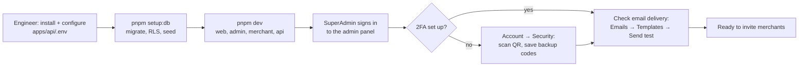

# 1. Platform setup

Done once per environment by an engineer together with the first SuperAdmin.

## Steps

1. **Install and configure.** An engineer follows [Getting started](../technical/getting-started.md):
   installs dependencies, copies the `.env.example` files and fills in the secrets
   (`pnpm secrets:generate apps/api/.env`).
2. **Create the database.** `pnpm setup:db` applies the migrations, the row-level security
   policies and the `development` seed (demo accounts, merchants, rewards). The seed refuses to
   run unless the database is local and `NODE_ENV` is `development` or `test`
   ([Database](../technical/database.md#seed-data)). A deployed environment runs only
   `pnpm db:deploy` (migrations + RLS) and, for reference data, `pnpm db:seed -- --scenario empty`.
   There is no built-in command yet to create the **first SuperAdmin** on a non-demo database —
   see [known gaps](../technical/README.md#known-gaps).
3. **Choose the delivery services.** Before real users arrive, configure
   [email (Resend)](../technical/email/resend-setup.md) and [file storage](../technical/storage/overview.md)
   (AWS S3 or Firebase Storage). Locally, `EMAIL_MODE=log-only` prints emails into the API log
   and `STORAGE_PROVIDER=local` keeps files on disk.
4. **Sign in as SuperAdmin** at the admin panel (`superadmin@example.com` / `SuperAdmin@123` in
   the demo data). A new device may be asked for an emailed one-time code first
   (`LOGIN_VERIFICATION_MODE`).
5. **Set up two-factor authentication** under **Account → Security**. Accounts can be required
   to enroll within a grace period (`MFA_ENROLLMENT_DEADLINE_MS`, 30 days by default); after it
   ends the account can only reach the enrollment screen. Impersonation always needs 2FA
   ([Account and security](./10-account-and-security.md)).
6. **Check email delivery.** **Emails → Templates**, pick a template, **Send test email**. The
   result appears in **Emails → Log**.
7. **Review access control** under **Settings → Access control** (roles and permissions,
   [Platform administration](./09-platform-administration.md)).

## What the admin panel contains

| Menu | Purpose |
| --- | --- |
| Overview | Headline platform numbers (sales, bills, average bill, active merchants) |
| Analytics → Sales | Weekly platform sales and the top merchants ([Analytics](./08-analytics.md)) |
| Users → All users / MFA recovery | Accounts, locked accounts, MFA recovery requests |
| Merchants → All merchants / Invites / Verification / Store requests | The merchant lifecycle ([Onboarding](./02-merchant-onboarding.md), [Stores](./03-stores-and-team.md)) |
| Rewards → Review | Rewards waiting for approval ([Rewards](./04-rewards.md)) |
| Emails → Templates / Log | Email previews, test sends and the delivery log |
| Geography | Countries, states and cities reference data |
| Catalog → Products / Categories | Sample catalog modules |
| Settings → Access control | Roles, permissions and per-user overrides |

Menu items a user may not use are hidden; the API enforces the same rules on every call.
