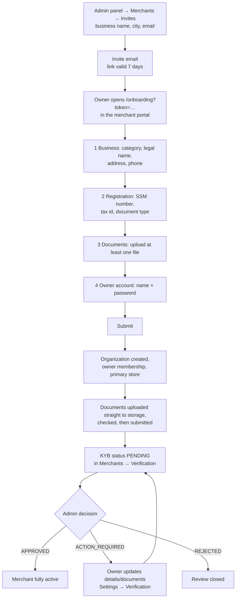

# 2. Merchant invite, onboarding and verification (KYB)

A merchant joins by **invitation only**. The owner sets up the account and submits the business
verification (KYB, "know your business") in one visit; a platform admin then reviews it.

## For the platform admin: sending the invite

1. **Merchants → Invites → Invite merchant.** Enter the business name, the pilot city
   (Kuala Lumpur or Melaka) and the owner's email. **Preview email** shows exactly what will be
   sent.
2. The owner receives a link to the merchant portal (`/onboarding?token=…`). It is valid for
   **7 days** and works once.

## For the merchant owner: onboarding

The onboarding form has five steps — **Business**, **Stores**, **Registration**, **Documents**,
**Owner account** — and is submitted once:

- **Business:** category (cafe, restaurant, retail, wellness, entertainment, food, beverage) and
  the registered legal name.
- **Stores:** the primary store's name, address and phone, plus any additional locations. More
  stores can also be added later from **Settings → Locations**.
- **Registration:** SSM / registration number, tax id and the type of the main document.
- **Documents:** at least one PDF or image (JPEG, PNG, WebP), up to 25 MB each.
- **Owner account:** your name and password. If the email already has an account, enter that
  account's password instead.

A timeline beside the form shows your progress and every step. Select a completed step to go
back and change it; your answers are kept until you submit, as long as the tab stays open. On a
phone the timeline is condensed into a row of numbered marks above the form.

When you press **Submit**, the platform creates your organization, your owner membership and your
primary store in one step, uploads the documents directly to storage and submits the
application. If something fails you can press **Submit** again: nothing is created twice.

After onboarding the owner must **verify their email address** (link in the welcome email)
before the portal opens fully.

> [!NOTE]
> The invite link becomes a narrow, short-lived upload pass once the account exists: it only
> works for the onboarding document steps, for 24 hours, until the documents are submitted.
> After that, use **Settings → Verification** (owner only).

## Document checks and scan statuses

Every uploaded document is checked before anyone can open it: the size, a SHA-256 checksum and
the real file type (a renamed `.exe` is rejected). Then it goes to the malware scanner.

| Scan status | Meaning | Can the admin download it? |
| --- | --- | --- |
| `SCANNING` | Checks passed, waiting for the scanner's verdict | No |
| `CLEAN` | A malware scanner checked it | Yes |
| `NOT_SCANNED` | No malware scanner is configured on this environment (`MALWARE_SCANNER=none`, today's only option). Checked for size, checksum and type, **not** for malware | Yes |
| `INFECTED` | The scanner flagged it; the bytes were deleted | No |
| `SCAN_FAILED` | No verdict could be obtained | No |

The review status follows the documents automatically: if a document of a pending application
turns out `INFECTED` or `SCAN_FAILED`, the application moves to **ACTION_REQUIRED**; once every
document is usable again it returns to **PENDING**. An approved or rejected review is never
changed by a scan.

## For the platform admin: reviewing KYB

1. **Merchants → Verification** lists applications by status (`PENDING`, `ACTION_REQUIRED`,
   `APPROVED`, `REJECTED`).
2. Open a merchant: business details, registration number, tax id and each document with its
   scan status. **Download** opens a short-lived signed link (5 minutes by default).
3. Decide:
   - **Approve** → `APPROVED`.
   - **Action required** → the owner is asked to fix something; add review notes.
   - **Reject** → `REJECTED` with a reason. A rejected or approved review cannot be resubmitted.

## For the merchant owner: after the review

**Settings → Verification** shows the current status and the admin's notes. With
`ACTION_REQUIRED` or `PENDING` you can correct details and upload new documents, then resubmit.

## Under the hood

| Step | API |
| --- | --- |
| Invite / preview | `POST /api/v1/admin/invites`, `POST /api/v1/admin/invites/preview-email` |
| Check the link | `POST /api/v1/orgs/onboarding/validate` |
| Create organization + owner | `POST /api/v1/orgs/onboarding/complete` |
| Upload documents | `POST /api/v1/orgs/onboarding/documents/upload-url(s)` → upload to storage → `…/upload-complete(-batch)` → `…/status` → `…/submit` |
| Owner resubmits | `PATCH /api/v1/orgs/{orgSlug}/kyb` |
| Admin reviews | `GET /api/v1/admin/merchants/{organizationId}`, `PATCH /api/v1/admin/merchants/{organizationId}/kyb` |

`complete` is one all-or-nothing transaction: it claims the PENDING, unexpired invite with a
compare-and-set (exactly one request wins), creates the owner membership, saves the profile and
stores, activates the organization (lifecycle event + audit row) and commits — or rolls everything
back. Repeating it:

| Situation | Answer | What the client does |
| --- | --- | --- |
| `complete` failed | (the original error) | Retry `complete` with the same credentials |
| `complete` already succeeded | `409 MERCHANT_INVITE_UNAVAILABLE` | Continue with the document steps (still inside the 24-hour window) |
| The invite expired | `410 MERCHANT_INVITE_EXPIRED` | Ask the platform admin for a new invite |
| `submit` repeated | `410` (the first `submit` consumed the token) | Nothing — the application is submitted |
| A document call more than 24 hours after `complete` | `410 MERCHANT_ONBOARDING_DOCUMENTS_CLOSED` | Sign in and upload from **Settings → Verification** (`merchant:manage_verification`) |
| Submitting after the review was approved or rejected | `409 KYB_REVIEW_CLOSED` | Nothing to resubmit |

Why the documents are separate calls after `complete`: KYB files are private uploads through the
normal direct-to-storage pipeline, and a file can only be bound to an organization and an owner that
already exist. After `complete`, the invite token becomes a narrow credential for this organization's
document endpoints only (`ONBOARDING_DOCUMENTS_WINDOW_MS`, 24 hours, until `submit` consumes it).

Request and response examples: [Merchant organizations API](../technical/api-reference/merchant-organizations.md)
and [Platform administration API](../technical/api-reference/platform-admin.md). Upload
mechanics: [Object storage](../technical/storage/overview.md).
