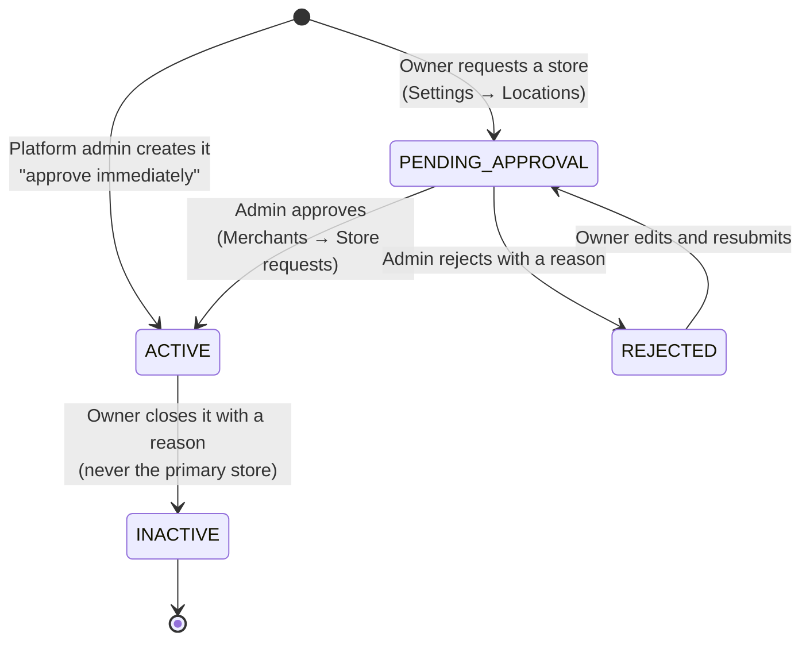
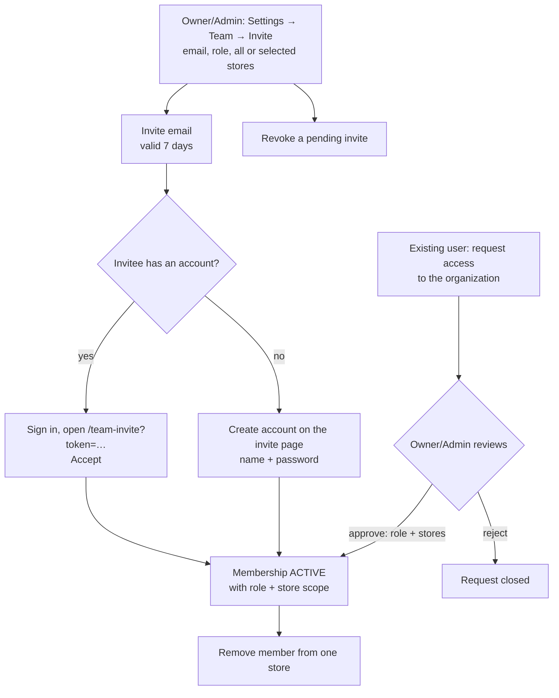

# 3. Stores and team

A merchant organization has one **primary store** (created during onboarding) and any number of
further stores. Rewards, POS terminals, API keys, staff access, redemptions and analytics can all
be limited to particular stores.

## Stores

### Request a store (merchant owner or admin)

1. **Settings → Locations → Add store**: name, address, contact phone.
2. The store is **pending approval**. It cannot be used for rewards, staff or terminals yet.
3. A merchant can only have a limited number of requests pending at once ("Too many store
   requests are already pending review").

### Approve or reject (platform admin)

**Merchants → Store requests** lists pending stores of every merchant. **Approve** makes the
store active. **Reject** needs a reason, which the merchant sees. A platform admin can also add a
store for a merchant directly and approve it in the same step.

### Edit a rejected request

Only a **rejected** request can be edited; saving it sends it back to the admin as pending.

### Close a store

**Settings → Locations → Close store** asks for a reason. Closing is permanent and audited:

- the primary store can never be closed;
- the store's POS terminals are removed and their API keys revoked, so no till can redeem there;
- rewards stop being valid at that store; a reward offered only at closed stores can no longer
  be claimed;
- claims customers already hold stay valid until they expire and can be redeemed at any other
  open store of the reward;
- sales and redemption history are kept.

## Team

### Invite a member

1. **Settings → Team → Invite member.** Enter the email, choose the role (Owner, Admin, Member,
   Policy admin, Cashier — see the [role table](./README.md#roles-in-one-table)) and the stores:
   **All stores** or **Selected stores** (only active stores can be selected).
2. You can only give access to stores you can access yourself.
3. The invitee gets an email with a link to `/team-invite?token=…` in the merchant portal. The
   invite is valid for **7 days**; pending invites can be **revoked** from the same page.
4. The invitee either signs in and presses **Accept**, or creates an account right on the invite
   page (that also signs them in). Either way they land on the organization's dashboard.

Try it: `alice.kl@kl-rewards.demo` / `AliceKl@123` has a pending invite to Brew & Bean KL (link
`/team-invite?token=seed_team_invite_token_kl_alice`).

### Access requests

A signed-in user can ask to join an organization. Owners and admins see the request, and either
approve it — choosing the role and the stores — or reject it.

### Remove a member from a store

On the member's row, remove a single store from their access. Removing their **last** store needs
an explicit confirmation (`allowNoStores`): they stay a member but can no longer see any store.
The removal is audited.

### Your display name in an organization

Every member can choose how their name appears in one organization (for example
"Kak Mira" or "Lee — Bukit Bintang counter"), shown on the team roster instead of the account's full
name. It is per organization, up to 100 characters, trimmed; clearing it shows the full name
again. Only the member can change their own display name — an owner cannot rename someone else, and
it cannot be changed while a platform admin is impersonating the member. Every change is audited
with the old and the new value.

## Under the hood

| Step | API |
| --- | --- |
| Request / edit / close a store | `POST /api/v1/orgs/{orgSlug}/locations`, `PATCH …/locations/{locationId}`, `POST …/locations/{locationId}/close` |
| Admin store review | `GET /api/v1/admin/location-requests`, `PATCH /api/v1/admin/merchants/{organizationId}/locations/{locationId}/review`, `POST /api/v1/admin/merchants/{organizationId}/locations` |
| Team | `GET …/members`, `POST …/members/invite`, `GET …/members/invites`, `POST …/members/invites/{inviteId}/revoke`, `POST …/members/{membershipId}/stores/{locationId}/remove` |
| Own display name | `PATCH /api/v1/orgs/{orgSlug}/members/me` with `{ "displayName": "Kak Mira" }` or `{ "displayName": null }` |
| Invite link | `POST /api/v1/orgs/invites/validate`, `…/accept`, `…/register-and-accept` |
| Access requests | `POST …/access-requests`, `POST …/access-requests/{requestId}/review` |

### Guarantees and error codes

| Action | Who | Guarantees | Errors |
| --- | --- | --- | --- |
| Remove a member from a store | `merchant:manage_team` and a location scope covering the store (else `403 ORGANIZATION_STORE_OUT_OF_SCOPE`) | One transaction with its audit row (real actor). Deletes the member's SELECTED scope row and soft-deletes their store membership (`deleted_at`, `deleted_by`). The member row is locked (`FOR UPDATE`) first, so two removals cannot both pass the last-store check. | `404` unknown member or not scoped to that store · `409 ORGANIZATION_OWNER_PROTECTED` · `409 ORGANIZATION_MEMBER_COVERS_ALL_STORES` (narrow them first) · `409 ORGANIZATION_MEMBER_LAST_STORE` (send `allowNoStores: true`) |
| Close a store | `merchant:manage_locations` and a covering location scope; body `{ "reason": "<1–500 chars>" }` | One transaction: the location (`status = INACTIVE`, `closure_reason`, `deleted_at`, `deleted_by`) and its store are soft-deleted, the store's memberships soft-deleted, SELECTED scope rows to it deleted, terminals removed and their keys revoked, one audit row. A reward offered only at closed stores cannot be claimed (out of stock); held claims stay redeemable at the reward's other open stores. | `409` primary store · `400` missing reason · `404` already closed |
| Set or clear your display name | Any live ACTIVE member, for their **own** membership only | One tenant transaction: the caller's membership row is locked (`FOR UPDATE`) and updated, then `membership.display_name_updated` is audited (actor = the member, `previousDisplayName` → `displayName`). | `400` blank, longer than 100 characters, or unknown fields · `404` not a member of that organization · `403 ORGANIZATION_MEMBERSHIP_UPDATE_DURING_IMPERSONATION` |

Seed data: `prisma/seed/store-closure.ts` creates one closed store ("Taman Melaka Raya (Closed)")
and one member removed from a store (the Jonker cashier, removed from Bukit Katil); the demo
members of both organizations have display names except the Jonker Street Kitchen owner.

Examples: [Merchant organizations API](../technical/api-reference/merchant-organizations.md). How
store scoping is enforced in the database: [Tenancy and RLS](../technical/authorization/tenancy-and-rls.md).

