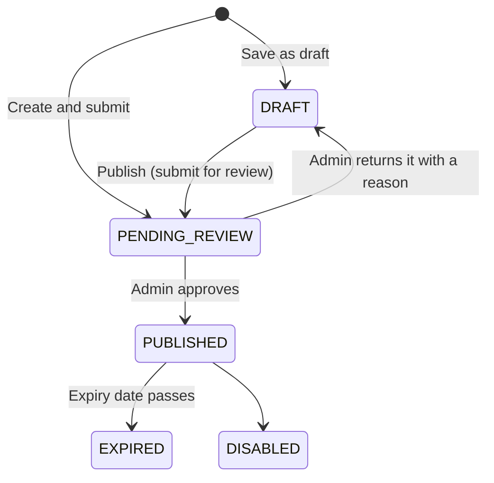

# 4. Rewards: create, review, publish

## Create a reward (owner or merchant admin)

**My Rewards → Create New** (needs the *manage rewards* capability: owners and admins).

| Field | Meaning |
| --- | --- |
| Title, description, terms | What customers see |
| Category | cafe, restaurant, retail, wellness, entertainment, food, beverage |
| Type and value | `DISCOUNT`, `FREE_ITEM`, `CASHBACK`, `POINTS`, `BOGO`, with a value |
| Quantity | How many customers can claim it in total (stock) |
| Start and expiry date | When it is visible and claimable |
| Stores | **All stores** or **selected stores** (redeemable only there) |
| Rules | Maximum claims per customer; minimum spend in RM (checked against the whole bill at checkout) |
| Referrals | Whether customers can earn a referrer reward through it, the size of the referral pool and the title of the referrer reward ([Referrals](./07-referrals.md)) |
| Save as draft | Keep it private; otherwise it is submitted for review straight away |

A draft (or a reward waiting for review) can still be edited. **Publish** on a draft submits it
for review; the merchant cannot make it live alone.

## Review a reward (platform admin)

1. **Rewards → Review** lists every reward in `PENDING_REVIEW`.
2. **Approve** → `PUBLISHED`: it appears on the web app immediately. The owner gets an in-app
   notification ("Reward approved").
3. **Reject** with a reason → back to `DRAFT`; the owner gets the reason as a notification
   ("Reward needs changes"), edits and submits again.

## Under the hood

| Step | API |
| --- | --- |
| List / read / create / edit | `GET|POST /api/v1/orgs/{orgSlug}/rewards`, `GET|PATCH …/rewards/{rewardId}` |
| Submit for review | `POST …/rewards/{rewardId}/publish` |
| Admin queue / decision | `GET /api/v1/admin/rewards/pending`, `POST /api/v1/admin/rewards/{rewardId}/approve`, `…/reject` |
| Customers see it | `GET /api/v1/rewards`, `GET /api/v1/rewards/{rewardId}` |

Examples: [Merchant organizations API](../technical/api-reference/merchant-organizations.md#organization-rewards),
[Platform administration API](../technical/api-reference/platform-admin.md).
