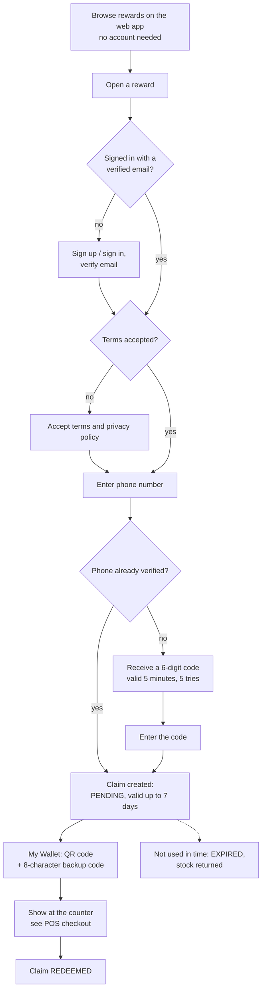

# 5. Customer claims (QR and backup code)

## Steps for the customer

1. **Browse** at `/rewardhub` (or open a shared link `/rewards/{id}`). Anyone can browse.
2. **Sign in** with a verified email address. New accounts sign up at `/auth/signup` and click
   the link in the verification email.
3. **Accept the terms** the first time you claim (terms and privacy versions are recorded).
4. **Claim**: enter your phone number. Unless that number is already verified on your account,
   a 6-digit code is sent (in this starter kit by email); it is valid for 5 minutes and allows 5
   attempts.
5. The claim appears in **My Wallet** as **pending**. It is valid for **7 days** or until the
   reward expires, whichever comes first.
6. **At the counter**, open the claim: show the **QR code**, or read out the **8-character
   backup code** (letters and digits, no look-alike characters). The cashier scans it before you
   pay ([POS checkout](./06-pos-checkout.md)).
7. After payment the claim is **redeemed**. **My Activity** shows your spending: total spent,
   shop visits, where you spent most and by business category.

## Why a claim can be refused

| Message | Reason |
| --- | --- |
| Accept terms before claiming | Terms not accepted yet |
| OTP required / OTP expired or missing / Too many OTP attempts | Phone code missing, wrong or used up |
| This reward is sold out | Stock exhausted |
| You can hold at most N claims of this reward | The reward's per-customer limit |
| Reward expired | Past its expiry date |

## Notifications

The API keeps in-app reward notifications per user (a referral credit for customers; "Reward
approved" / "Reward needs changes" for merchant owners) and can mark them read. The typed client
exposes them, but no screen in the web or merchant app shows them yet.

## Under the hood

`GET /api/v1/rewards`, `GET /api/v1/legal/status`, `POST /api/v1/legal/accept`,
`POST /api/v1/claims/otp`, `POST /api/v1/claims`, `GET /api/v1/claims`,
`GET /api/v1/claims/{claimId}/qr`, `GET /api/v1/claims/analytics`,
`GET /api/v1/reward-notifications`, `POST /api/v1/reward-notifications/read` —
examples in [Customer rewards API](../technical/api-reference/customer-rewards.md). QR tokens and
backup codes are stored only as keyed hashes (`REWARD_CODE_HASH_KEYS`).

**Stock is reserved, not spent, at claim time.** Each reward keeps `quantityRemaining` (still
claimable) and `quantityReserved` (held by pending claims); every change is one conditional update in
the claim's transaction, so two customers can never take the last unit:

| Event | `quantityRemaining` | `quantityReserved` |
| --- | --- | --- |
| Claim created (after the phone code) | −1 (only if > 0) | +1 |
| Pending claim expires | +1 | −1 |
| Claim redeemed at the till | — | −1 |

A claim's validity is `min(claimed at + 7 days, reward expiry)`. A reward offered only at closed
stores cannot be claimed (the reservation finds no live store and answers out of stock).
