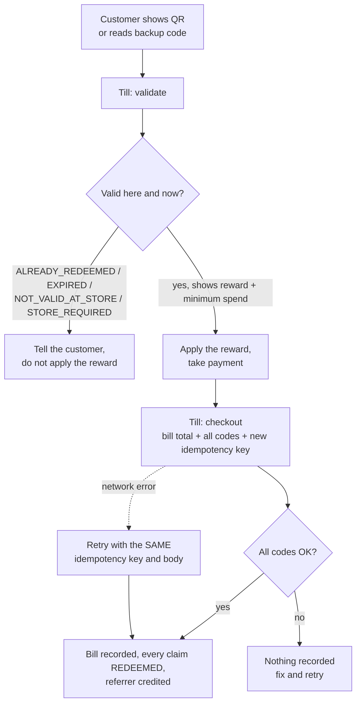

# 6. POS pairing and checkout

The till (POS) talks to the platform with its own **API key**, never with a person's login.
Pairing gives each till its key; checkout records each paid bill and every reward used on it.

## Pair a till (owner or merchant admin)

```mermaid
sequenceDiagram
    actor Owner as Owner / admin (merchant portal)
    participant Portal as POS terminals page
    participant Till as Till (POS software)
    participant API
    Owner->>Portal: Add terminal: store, name, optional terminal id
    Portal->>API: create terminal
    API-->>Portal: one-time pairing code (8 characters, 15 minutes)
    Owner->>Till: type the pairing code
    Till->>API: POST /pos/terminals/pair { pairingCode }
    API-->>Till: API key (shown once) + terminal id + store
    Note over Till: stores the key; sends it as X-API-Key from now on
```

- **POS terminals → Add terminal**, choose the store. A store-limited admin can only add tills to
  their stores. The terminal id is optional (for example `KL-REGISTER-07`); one is generated
  otherwise.
- The **pairing code** works once and expires after 15 minutes. Wrong, expired and used codes
  all get the same answer.
- **Re-pair** a replaced till or a possibly leaked key: the old key stops working when the till
  pairs with the new code. **Remove** a terminal to revoke its key at once.
- The page shows each till's status (awaiting pairing, active, unpaired) and when it was last
  seen. **Only allow registered terminals** (off by default) refuses calls from unknown terminal
  ids made with manually created keys.
- **API keys** (same capability) are for server-to-server integrations: a `POS` key works on the
  redemption calls only; an `INTEGRATION` key can also read rewards, redemptions and analytics
  and manage rewards. A key can be limited to one store.

## Checkout at the counter (cashier)



Rules the till must follow:

- **Validate before payment**; validate changes nothing.
- **Checkout after payment** with the bill total in sen (`2500` = RM 25.00) and 1–10 codes of
  **one** customer. Each reward's minimum spend is checked against the whole bill.
- It is **all-or-nothing**: if one code fails, nothing is recorded.
- Use a **new idempotency key per bill**. Retrying with the same key and body returns the
  original result and never deducts twice.
- **Protection against guessing:** 10 unknown backup codes within 15 minutes lock that API key
  for 60 minutes; each key may make 120 redemption calls per minute.

Try it with the demo data: the seeded Brew & Bean register key with `X-Terminal-Id:
KL-REGISTER-01` redeems the seeded pending claim (QR token `seed_qr_token_kl_pending_alice_001`,
backup code `ABCD2345`).

## Afterwards

- **Redemptions** in the merchant portal lists every redemption (limited to the member's stores).
- **Analytics → Sales** shows the bills ([Analytics](./08-analytics.md)).
- The customer sees the visit under **My Activity**.

Full technical reference (headers, store resolution, every error code):
[POS integration](../technical/pos-integration.md) and the [POS API](../technical/api-reference/pos.md).
