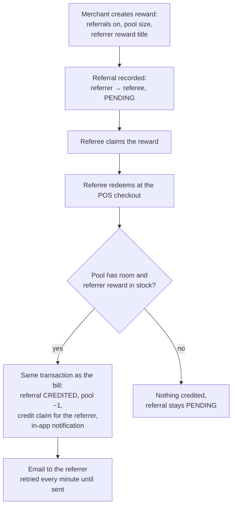

# 7. Referrals

A merchant can let a reward pay its **referrers**: when a customer who was referred redeems the
reward, the customer who referred them receives a reward of their own (the **referrer reward**),
taken from a limited **referral pool**.

## For the merchant

When creating a reward ([Rewards](./04-rewards.md)) set **Referrals enabled**, the **referral
pool** (how many referrers can be paid) and the **referrer reward title**. Referrals are on by
default for new rewards.

## For the referrer

When a referred friend redeems, you get a new claim in **My Wallet** (valid for the normal claim
period) plus a notification and an email. A referral is credited at most once, even if your
friend redeems several times or at several tills at the same moment.

## Statuses

| Status | Meaning |
| --- | --- |
| `PENDING` | Recorded, waiting for the referee's redemption (or the pool / referrer reward ran out) |
| `CREDITED` | The referrer received the credit claim |
| `BLOCKED` | Not eligible for credit |

> [!IMPORTANT]
> **Not built yet:** the API has no endpoint for a customer to *create* a referral (an invite
> link or code), and the web app's Referrals menu entries have no pages. Today referral rows
> exist only in the seed data; crediting at checkout is fully implemented. See
> [known gaps](../technical/README.md#known-gaps).

Technical detail: [POS integration → Referrals](../technical/pos-integration.md#checkout).
