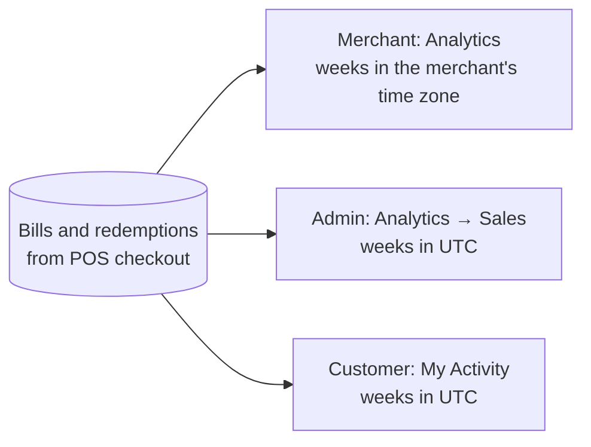

# 8. Analytics

Every paid bill recorded by a [POS checkout](./06-pos-checkout.md) feeds three views.

## Weeks and time zones

Charts are weekly. A week starts **Monday 00:00**:

| View | Week boundary | Why |
| --- | --- | --- |
| Merchant | Monday 00:00 in the **merchant organization's time zone** (default `Asia/Kuala_Lumpur`) | A café's "this week" must match its own calendar |
| Platform admin | Monday 00:00 **UTC** | One view across merchants in different zones |
| Customer | Monday 00:00 **UTC** | A customer spends across merchants and zones |

The default period is the last **8 weeks** (the current week counts as one); a period can cover at
most 53 weeks. Each headline number is compared with the previous period of the same length.

## Merchant (Analytics, needs *view analytics*: owner, admin, cashier)

- Claims and redemptions per week.
- **Sales**: total sales, number of bills and average bill, weekly sales, and when the first bill
  was paid. Until the POS has reported a bill, the section explains how to connect the till.
- Store-limited members only see their stores; anyone can filter by one store.

## Platform admin (Analytics → Sales, needs `ANALYTICS:READ`)

Choose 4, 8 or 12 weeks (default 8): total sales, bills, average bill, active merchants, weekly
sales and the top ten merchants with category and share of sales. The same headline cards open
the admin **Overview**.

## Customer (My Activity)

**Your spending**: total spent and shop visits (against the previous period), the top five shops
by amount, and spend by business category (merchants without a category are "Other").

## Under the hood

`GET /api/v1/orgs/{orgSlug}/analytics`, `GET /api/v1/admin/analytics/sales`,
`GET /api/v1/claims/analytics` — all take optional `from` / `to` (epoch milliseconds). Examples in
the [API reference](../technical/api-reference/README.md). Amounts are integer **sen** (minor
units).
