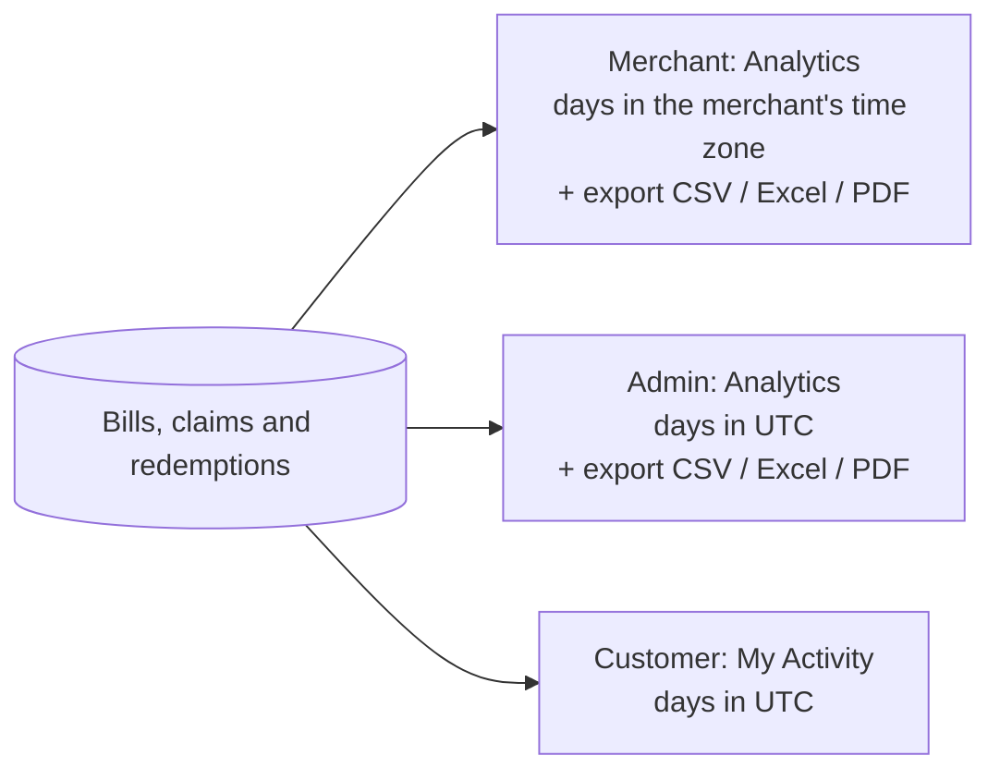

# 8. Analytics

Every paid bill recorded by a [POS checkout](./06-pos-checkout.md), every claim and every
redemption feeds three views.

## Choosing the period

Every analytics page has one filter row above the numbers. Everything below it — headline
numbers, charts, breakdowns and the export — follows the same choice.

- **Date range presets:** Last 7 days, **Last 30 days** (the default), Last 90 days, This month,
  Last month, This quarter, Year to date, Last 12 months (this month and the eleven before it).
  Every preset ends **today** and covers whole days.
- **Custom range:** pick *Custom range*, open **Days** and click the first and then the last day in
  the calendar (both included), then **Apply**. A range can cover at most **366 days** (a year, leap years included); a longer or
  reversed range is explained under the fields and cannot be applied. The last day can be today
  at the latest.
- **Group by day, week or month.** Picked automatically from the length — up to a month by day,
  up to six months by week, longer by month — and changeable. Choosing a new range goes back to
  the automatic choice. Weeks start on **Monday**, months on the 1st.
- The range in effect is written next to the filters, with the time zone its days are counted in
  (for example *6 Sept – 5 Oct 2026 · Asia/Kuala_Lumpur*).
- **Share a view:** the range and grouping are part of the page address, so a copied link opens the
  same view (a merchant's store choice comes from the store selector, so a colleague sees their
  own stores). While a new range loads, the previous numbers stay on screen, dimmed.
- Every headline number is compared with the **previous period of the same length** (the 30 days
  before, the year before…), as an amount and a percentage. When there was nothing before, only
  the amount is shown ("from nothing" has no percentage).
- A day, week or month cut off by the start or end of the range is marked **partial** — shaded in
  the chart and labelled in its tooltip and table — because its total covers fewer days.

## Reading the charts

- Hover or tap a bar or point — or focus a chart and use the arrow keys — to see every value of
  that day, week or month, with its exact dates.
- **Show as table** under each chart lists every value, for screen readers, printing or copying.
- Each headline number shows its change against the previous period with an arrow **and** a word
  (up, down, no change); green means good news, red bad news.

## Time zones

| View | A day starts at | Why |
| --- | --- | --- |
| Merchant | midnight in the **merchant organization's time zone** (default `Asia/Kuala_Lumpur`) | A café's "Monday" must match its own calendar |
| Platform admin | midnight **UTC** | One view across merchants in different zones |
| Customer | midnight **UTC** | A customer spends across merchants and zones |

Days are real calendar days: where daylight saving applies, the day the clocks change is 23 or 25
hours long.

## Merchant (Analytics, needs *view analytics*: owner, admin, cashier)

- **Headline:** sales, bills, average bill, customers; claims, redemptions, conversion rate.
- **Charts:** sales, bills and average bill over time; claims vs redemptions.
- The time zone the days are counted in is shown next to the filters.
- **By store:** sales, bills, average bill and redemptions per store. Bills recorded without a
  store show as "No store recorded" (visible to members who see every store).
- **By reward:** the 25 most active rewards with claims, redemptions and conversion.
- **By redemption method:** QR code scan vs backup code.
- A store-limited member only ever sees their own stores — on screen and in exports. Anyone can
  narrow the view to one of their stores.

## Platform admin (Analytics, needs `ANALYTICS:READ`)

- **Headline:** sales, bills, average bill, active merchants, customers, **new** customers (their
  first bill ever was in the period) and **returning** customers, claims, redemptions, conversion.
- **Charts:** sales and bills over time; claims vs redemptions; new vs returning customers per
  period.
- **Top merchants** (ten, with category), **sales by business category** (merchants without a
  category are "Other") and **sales by city**.

## Customer (My Activity)

Total spent, shop visits, average bill, shops visited; rewards claimed and redeemed and the
redemption rate; referrals sent, referrals credited and the rewards they earned you. **Your
claims by status** splits the rewards you claimed in the range into waiting to be used, redeemed
and expired. Charts show **spending over time** and **claimed vs redeemed**; breakdowns list
**where you spent the most** (top five shops), **what you spent on** (by type of shop) and your
**top three shops over time**. Customers can change the range but there is no export.

## Exporting (merchants and admins)

Choose the range (and day / week / month) — merchants also the store in the store selector — then
open **Export** at the top of the page and pick a format. The file covers exactly what is on
screen:

| Format | Best for |
| --- | --- |
| **CSV** | Importing anywhere. UTF-8 (opens correctly in Excel), amounts like `1234.50` with the currency in the column name. |
| **Excel (XLSX)** | Working with the numbers: a Summary sheet plus one sheet per table, real numbers, percentages and dates, header row frozen. |
| **PDF** | Sharing: a branded report with the headline numbers, charts and every table. Names in English, Malay, Tamil, Chinese and Hindi print correctly. |

- The file is named after the organization (or `platform`), the first and last day and the
  interval, e.g. `analytics_brew-bean-kl_2026-09-01_2026-09-30_day.xlsx`.
- The button is disabled while a file is being prepared; the file is saved under the name above.
- You can start **10 exports every 10 minutes**; after that a message says how long to wait.
- A very long range grouped by day can take too long to prepare; the message then suggests a
  shorter range or grouping by week or month.
- Every export is recorded in the audit log (who, which report, which period, which format).
- Text that a spreadsheet could run as a formula (a reward named `=…`) is exported as plain text.

## Under the hood

`GET /api/v1/orgs/{orgSlug}/analytics/dashboard`, `GET /api/v1/admin/analytics/dashboard`,
`GET /api/v1/claims/analytics/dashboard` and the two `…/analytics/export` routes — details in the
[Analytics API](../technical/api/analytics.md) and the [API reference](../technical/api-reference/README.md).
Amounts are integer **sen** (minor units). How the screens are built:
[Analytics dashboards](../technical/frontend/analytics-charts.md). The older weekly summaries
(`…/analytics`, `/admin/analytics/sales`) still answer for API clients; no screen reads them.
