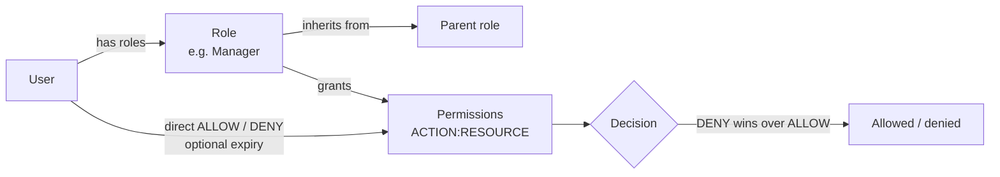

# 9. Platform administration

Everything here happens in the **admin panel**. Each screen needs a permission (an `ACTION` on a
`RESOURCE`, for example `READ` on `GEO`); SuperAdmins have all of them.

## Users

**Users → All users**: search, open a user, see roles and status, unlock a locked account.
**Users → MFA recovery**: approve or deny recovery requests
([Account and security](./10-account-and-security.md#lost-your-authenticator-mfa-recovery)).

## Roles and permissions (Settings → Access control)

- **Roles** bundle permissions and can inherit from a parent role. Create, rename, deactivate,
  soft-delete and restore roles; **preview** what a user would be able to do before assigning.
- **Permissions** are `ACTION:RESOURCE` pairs (actions: `CREATE`, `READ`, `UPDATE`, `DELETE`,
  `LIST`, `MANAGE`). They can also be granted or denied to one user directly, optionally until a
  date. A direct **DENY** always wins.
- **Check** shows whether a user has a permission; the API's **explain** answers "why was this
  403?".
- Every change bumps the affected users' token version, so new permissions apply on their next
  request.

Merchant staff roles (Owner, Admin, Cashier, …) are a separate, per-organization system managed
by the merchant ([Stores and team](./03-stores-and-team.md)). Tenant policies (Cedar) can narrow
what a merchant role may do; publishing a policy needs two SuperAdmins (the author cannot publish
their own draft).

## Audit log

Every state-changing request is recorded once, append-only and kept forever: who (user, and the
impersonating admin if any), organization, endpoint, request and response, IP, device and time
([ADR 025](../adr/025-global-http-audit-log.md)). Platform admins with `READ:AUDIT_LOG` can list
and filter it.

## Emails

- **Emails → Templates**: preview every transactional email with sample data and **send a test**
  (with `EMAIL_TEST_TO` set in development, it goes to that inbox).
- **Emails → Log**: every outbound email with its delivery status (`sent`, `delivered`,
  `bounced`, `complained`, `failed`), updated live from Resend's webhooks
  ([Email setup](../technical/email/resend-setup.md)).

## Geography

Regions, subregions, countries, states and cities used by address forms: list, search, create,
edit, soft-delete (with a preview of what a delete cascades to), import (validate first) and
export.

## Catalog (Products, Categories)

Sample modules that show the full pattern every new feature follows: lists with sort, filter and
search, detail pages, create and edit forms, soft delete, restore and bulk actions.

## Under the hood

[Roles, permissions, policies and audit API](../technical/api-reference/access-control.md) ·
[Email API](../technical/api-reference/email.md) · [Geography API](../technical/api-reference/geography.md) ·
[Sample catalog API](../technical/api-reference/catalog-samples.md) ·
[Authorization overview](../technical/authorization/overview.md).
