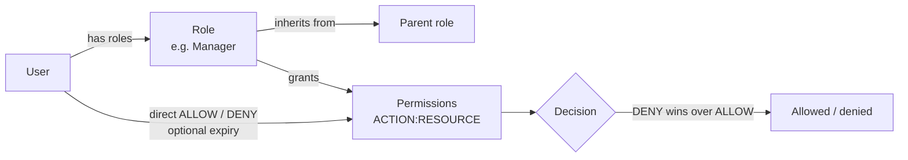

# 9. Platform administration

Everything here happens in the **admin panel**. Each screen needs a permission (an `ACTION` on a
`RESOURCE`, for example `READ` on `GEO`); SuperAdmins have all of them.

## Users

**Users → All users**: search, open a user, see roles and status, unlock a locked account.
**Users → MFA recovery**: approve or deny recovery requests
([Account and security](./10-account-and-security.md#lost-your-authenticator-mfa-recovery)).

## Roles and permissions (Settings → Access control)

- **Roles** bundle permissions and can inherit from a parent role. Create, rename, deactivate,
  soft-delete and restore roles; **preview** what a user would be able to do before assigning.
- **Permissions** are `ACTION:RESOURCE` pairs (actions: `CREATE`, `READ`, `UPDATE`, `DELETE`,
  `LIST`, `MANAGE`). They can also be granted or denied to one user directly, optionally until a
  date. A direct **DENY** always wins.
- **Check** shows whether a user has a permission; the API's **explain** answers "why was this
  403?".
- Every change bumps the affected users' token version, so new permissions apply on their next
  request.

Merchant staff roles (Owner, Admin, Cashier, …) are a separate, per-organization system managed
by the merchant ([Stores and team](./03-stores-and-team.md)). Tenant policies (Cedar) can narrow
what a merchant role may do; publishing a policy needs two SuperAdmins (the author cannot publish
their own draft).

## Audit log

Every request to the API — reads included, whether it succeeded or was refused — is recorded
once, append-only and kept forever ([ADR 025](../adr/025-global-http-audit-log.md)). Only the
automated health checks are left out. Open **Platform → Audit log** to see it.
Admins, Managers and SuperAdmins can open it (`LIST:AUDIT_LOG` for the table, `READ:AUDIT_LOG` for
a record).

- **The table** shows, newest first: time and duration, method and endpoint, outcome and HTTP
  status (with the error code of a refused request), the user (and the SuperAdmin behind an
  impersonation), organization, device (desktop / mobile / tablet / bot, browser and OS), IP
  address with its class (public, private network, carrier NAT …), country and city, and the
  credential — colour-coded. Filter by outcome, method, credential, device or address class, or
  search a path, endpoint, error code, IP address, User-Agent or correlation id. Filters live in
  the address bar, so you can share a filtered view.
- **Click a row** to open its full record in a side drawer; **Open full page** gives the record
  its own link.
- **Location** (country, region, city, time zone) comes from the CDN in front of the API. When
  the API is not behind one (local development, a direct connection), it is empty.
- **A record** adds everything else: the impersonation session, API key and POS terminal, store
  and location, user agent, client app, Origin, Referer, Accept-Language, host, HTTP version,
  request size, idempotency key, correlation and trace ids, the row-level-security bypasses the
  request used, and the route params, request body and response body. Click an actor,
  organization or correlation id to see every other record for it.
- Secrets read `[REDACTED]` and personal data is masked: they are removed **before** a record is
  stored, so nobody — including you — can see them.
- Looking at the audit log is itself recorded, so you can always answer "who looked at this?" —
  the record shows what was viewed, not the data itself.

## Emails

- **Emails → Templates**: preview every transactional email with sample data and **send a test**
  (with `EMAIL_TEST_TO` set in development, it goes to that inbox).
- **Emails → Log**: every outbound email with its delivery status (`sent`, `delivered`,
  `bounced`, `complained`, `failed`), updated live from Resend's webhooks
  ([Email setup](../technical/email/resend-setup.md)).

## Geography

Regions, subregions, countries, states and cities used by address forms: list, search, create,
edit, soft-delete (with a preview of what a delete cascades to), import (validate first) and
export.

## Catalog (Products, Categories)

Sample modules that show the full pattern every new feature follows: lists with sort, filter and
search, detail pages, create and edit forms, soft delete, restore and bulk actions.

## Under the hood

[Roles, permissions, policies and audit API](../technical/api-reference/access-control.md) ·
[Email API](../technical/api-reference/email.md) · [Geography API](../technical/api-reference/geography.md) ·
[Sample catalog API](../technical/api-reference/catalog-samples.md) ·
[Authorization overview](../technical/authorization/overview.md).
