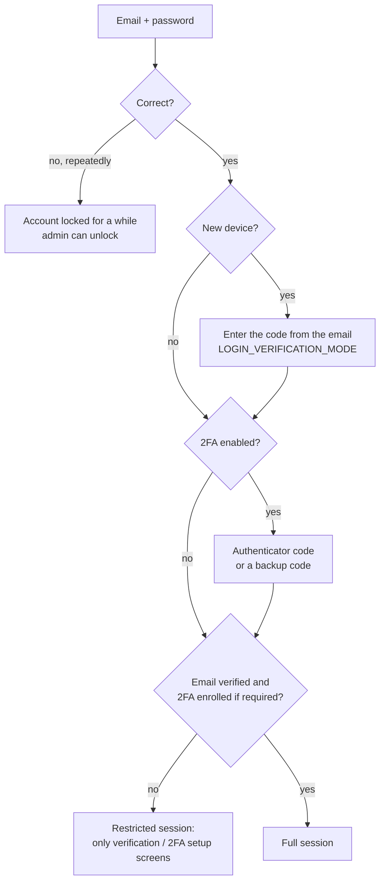
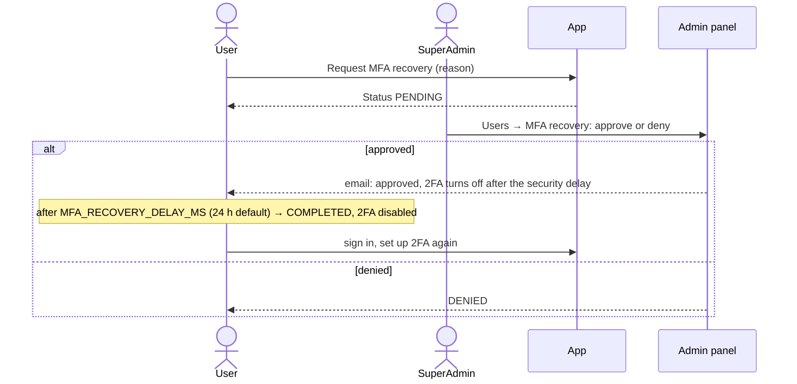
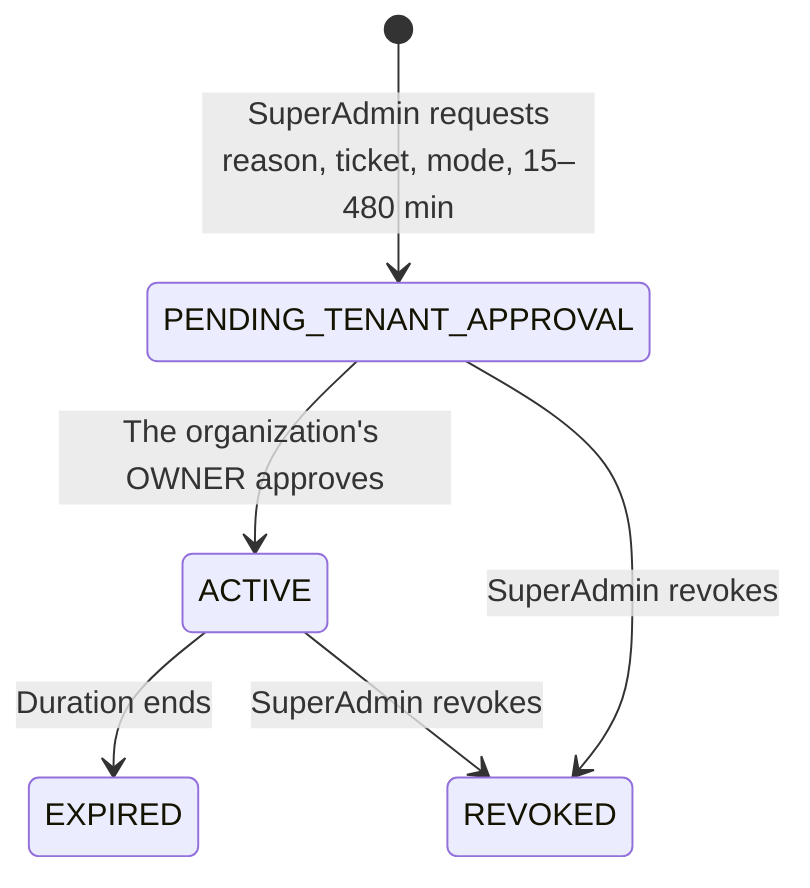

# 10. Account and security

## Sign-in

- Sessions are two httpOnly cookies per app (an access token refreshed automatically and a
  refresh token). **Sign out** ends this session; **sign out everywhere** ends all of them.
- If 2FA becomes required for your account (an enrollment deadline set by the platform, 30 days
  by default) and you have not set it up when it passes, you can only reach the 2FA setup screen.

## Profile and avatar

**Account → Profile** (all three apps) edits your full name. Edits use a version number so two
tabs cannot overwrite each other silently. A profile picture is uploaded straight to storage and
becomes visible once its checks pass ([Object storage](../technical/storage/overview.md)). While
an administrator is impersonating you, your profile cannot be edited.

## Password

- **Change password** (signed in): current password + new password twice.
- **Forgot password**: enter your email; if an account exists, a single-use reset link is sent
  (the answer never reveals whether the account exists). Resetting signs you out everywhere.

## Two-factor authentication (2FA)

1. **Account → Security → Set up 2FA**: scan the QR code with an authenticator app and **save the
   backup codes** — each works once.
2. Enter a code from the app to switch 2FA on. Your other sessions are signed out.
3. **Rotate** (new secret and new backup codes) needs your password plus a current code or a
   backup code. The page shows how many backup codes remain.

## Lost your authenticator? MFA recovery

The delay gives the real owner time to notice a fraudulent request.

## Impersonation (SuperAdmin only)

A SuperAdmin can act as another user to reproduce a problem:

- the SuperAdmin must have **2FA enabled and have passed it in the last 5 minutes**
  (`MFA_STEP_UP_TTL_MS`) — sign in again with the second factor first;
- another SuperAdmin cannot be impersonated, and impersonation cannot be nested;
- the impersonation session lasts at most **15 minutes**; **Stop impersonating** returns to the
  admin's own session;
- every request made while impersonating is recorded in the audit log under both people, and
  the impersonated user's profile cannot be edited.

## Support access (time-boxed access to a merchant)

Support staff never get standing access to a merchant's data. A SuperAdmin asks for a grant with
a reason, an optional ticket reference, a mode (`READ_ONLY` by default, or `WRITE_ELEVATED`) and a
duration (15–480 minutes, default 60). Only an active **owner** of that organization can approve
it. Every step is written to the organization's audit trail; a revoked or expired grant can never
be revived.

## For platform admins: locked accounts and sessions

**Users → All users** shows each account's status. **Unlock** (SuperAdmin) clears a lockout after
too many wrong passwords. Users can list their active sessions and **sign out everywhere**; there
is no "end one other device" action yet.

## Under the hood

[Auth and sessions API](../technical/api-reference/auth-and-sessions.md) ·
[Authentication internals](../technical/security/authentication.md) ·
[Token refresh](../technical/security/token-refresh.md).
