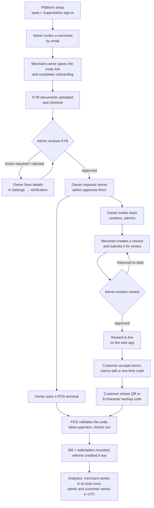

# User guide — start here

This guide is for the people who **operate** the platform: platform administrators, merchant
owners and their staff, and the customers who claim rewards. It explains each task in the
order it happens, with a flowchart per task. Engineers building on the starter kit should
also read the [technical documentation](../technical/README.md); every page here links to the
API calls behind each step.

## The three apps and who uses them

| App | Address (local) | Who uses it | What they do there |
| --- | --- | --- | --- |
| **Admin panel** | `http://localhost:3001` | Platform staff (SuperAdmin, Admin) | Invite merchants, review business verification (KYB) and store requests, approve rewards, manage users, roles and permissions, read platform sales |
| **Merchant portal** | `http://localhost:3003` | Merchant owners, admins, cashiers | Finish onboarding, manage stores and team, create rewards, pair POS terminals, see redemptions and analytics |
| **Web app (RewardHub)** | `http://localhost:3000` | Customers | Browse rewards, claim them, show the QR code at the counter, see their spending |

A merchant's till (the **POS**) is not an app: it talks to the API directly with an API key
([POS checkout](./06-pos-checkout.md)).

## Roles in one table

| Role | Where | Can do |
| --- | --- | --- |
| **SuperAdmin** | Admin panel | Everything on the platform, including impersonation, support access, MFA recovery and policy publishing |
| **Admin / Manager** (platform roles) | Admin panel | What their permissions allow (for example `MERCHANT_ORG` to review merchants, `REWARD` to review rewards, `ANALYTICS:READ` to read sales) |
| **Owner** | Merchant portal | Runs the business: everything, including business verification (KYB) |
| **Admin** (merchant) | Merchant portal | Everything except business verification |
| **Cashier** | Merchant portal | Views rewards, redemptions, analytics and stores — no management |
| **Policy admin** | Merchant portal | Administers the organization's access policies |
| **Member** | Merchant portal | Dashboard and store list only |
| **Customer** | Web app | Claims and redeems rewards |

Merchant staff can be limited to **some stores** ("selected stores") or work across **all
stores**; everything they see and do is limited to those stores.

## The whole journey

## Pages in this guide

| # | Page | Main people |
| --- | --- | --- |
| 1 | [Platform setup](./01-platform-setup.md) | SuperAdmin |
| 2 | [Merchant invite, onboarding and verification (KYB)](./02-merchant-onboarding.md) | Admin, merchant owner |
| 3 | [Stores and team](./03-stores-and-team.md) | Merchant owner/admin, platform admin |
| 4 | [Rewards: create, review, publish](./04-rewards.md) | Merchant, platform admin |
| 5 | [Customer claims (QR and backup code)](./05-customer-claims.md) | Customer |
| 6 | [POS pairing and checkout](./06-pos-checkout.md) | Merchant owner, cashier |
| 7 | [Referrals](./07-referrals.md) | Merchant, customer |
| 8 | [Analytics](./08-analytics.md) | Merchant, platform admin, customer |
| 9 | [Platform administration](./09-platform-administration.md) | Platform admins |
| 10 | [Account and security](./10-account-and-security.md) | Everyone |

## Try it with the demo data

`pnpm db:seed` creates a complete demo world (two merchants in Kuala Lumpur and Melaka, their
stores, staff, rewards, claims and a POS key) and prints every login. In development the login
pages of all three apps also show these demo accounts as one-click buttons (they are never shown
in production). The accounts used throughout this guide:

| Account | Password | Who |
| --- | --- | --- |
| `superadmin@example.com` | `SuperAdmin@123` | Platform SuperAdmin (admin panel) |
| `admin@example.com` | `Admin@123` | Platform admin (admin panel) |
| `brew.owner@kl-rewards.demo` | `BrewOwner@123` | Owner of **Brew & Bean KL** (one store, Bukit Bintang) |
| `jonker.owner@melaka-rewards.demo` | `JonkerOwner@123` | Owner of **Jonker Street Kitchen** (Bukit Katil, Bukit Beruang, Ayer Keroh pending) |
| `brew.cashier@kl-rewards.demo` | `BrewCashier@123` | Cashier at Brew & Bean KL |
| `alice.kl@kl-rewards.demo` | `AliceKl@123` | Has a pending team invite to Brew & Bean KL |

Seeded customer accounts (`alice.johnson@example.com`, `bob.smith@example.com`, …) start with an
**unverified** email address, so the web app first asks them to verify it.
