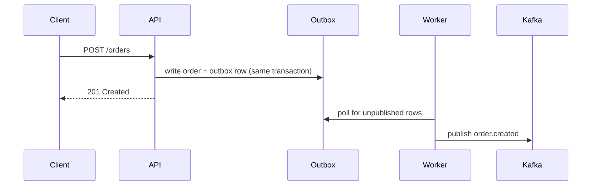

# 14 — Documentation Standards

Documentation is part of the implementation, not a follow-up task — a change isn't done until the relevant docs reflect it (`18-definition-of-done.md`). If this feels like it slows a task down, that's the point in a narrow sense: it's meant to cost a little time now, in exchange for not costing a lot more time later when the next person (possibly you, in six months) has to reverse-engineer why something is the way it is from the code alone.

## What must be documented

Update docs when changing: architecture, API contracts, database schema, authentication, authorization (including the per-endpoint permission mapping from `10-security-auth-authorization.md`), messaging, environment variables, operational procedures, developer commands, reusable UI components, or package boundaries.

## Documentation levels

### Root README
What the repository is, setup, common commands, architecture overview.

### Package README

Every `apps/*` and `packages/*` gets one, minimally:

```markdown
# <name>
One-paragraph description of what this is for.

## Structure
(brief folder overview, linking to relevant rules/*.md for detail)

## Getting started
(how to run/dev this specific app/package)

## Key conventions
(links to rules/NN-*.md — don't duplicate their content here)

## Environment variables
(table: name, purpose, required/optional)
```

```text
❌ DON'T — a package README that just says "This is the UI package."
   and nothing else. This tells a junior nothing about how to actually
   use it, what it depends on, or what's off-limits to import from it.

✅ DO — a README specific enough that someone who has never seen this
   package before could start using it correctly within five minutes,
   without asking anyone.
```

### ADR (Architecture Decision Record)

For meaningful architectural decisions: alternatives considered, consequences, and why the chosen option won. Lives in `docs/adr/`, one file per decision, numbered.

```markdown
# ADR 0007 — Use an outbox pattern for order events

## Status
Accepted

## Context
Publishing a Kafka event directly inside the same request that creates an
order means a Kafka outage or transient failure can leave an order created
with no corresponding event ever published, and downstream consumers
(inventory, notifications) silently miss it.

## Decision
Write order events to an `outbox` table in the SAME transaction as the
order write. A separate worker polls the outbox and publishes to Kafka,
retrying on failure, and marks rows as published once confirmed.

## Alternatives considered
- Publish directly after commit, with a manual retry: rejected — still has
  a window where the DB write succeeds and the publish fails with no
  record that it needs retrying.
- Change Data Capture (CDC) off the orders table directly: considered for
  the future, rejected for now due to added infrastructure complexity for
  the current scale.

## Consequences
- Slightly higher write latency (one extra insert per order).
- A new outbox worker needs its own monitoring/alerting.
- Event delivery is now reliably at-least-once, requiring idempotent
  consumers (see rules/09-messaging-and-jobs.md).
```

### Runbook

For incidents, migrations, queue recovery, dead-letter handling, and other operational procedures. Lives in `docs/runbooks/`. A good runbook lets an on-call engineer who has never touched this specific system before follow clear steps under pressure, rather than having to reconstruct the procedure from memory or from reading source code at 3am.

## Junior-friendly rule

A six-month developer should be able to understand, from the docs: why this exists, where it belongs, how data flows through it, how to test it, how to change it safely, and what can go wrong. Avoid documentation that merely repeats what the code already says — the value is in the *why* and the *gotchas*, not restating the *what*.

```text
❌ DON'T — a comment that just restates the code:
   // increments the counter by one
   counter += 1;

✅ DO — a comment that explains something the code alone can't tell you:
   // Retried up to 3 times because the payment provider's webhook
   // occasionally arrives before the charge record is committed locally
   // (see ADR 0012). Do not remove this retry without re-reading that ADR.
```

## Keeping docs from rotting

If you notice an existing doc is out of date while working on something unrelated: fix it inline if it's a small correction, or flag it explicitly for follow-up if it's a larger rewrite — never leave a known-wrong doc silently in place, since a wrong doc is often worse than no doc at all (it actively misleads the next reader with false confidence). "Were the docs updated?" is an explicit item in `16-code-review-checklist.md`.

## Code comments — what deserves one, and what doesn't

```ts
// ❌ DON'T — a comment that adds no information beyond what the code
// already, obviously says
// loop through orders
for (const order of orders) { ... }

// increment retry count
retryCount += 1;

// ✅ DO — a comment that explains something the code CANNOT tell you on
// its own: why a non-obvious choice was made, a constraint from outside
// the code (a third-party API's undocumented quirk, a business rule
// from a stakeholder conversation that isn't written down anywhere
// else), or a warning about a non-obvious consequence of changing something
// Stripe's webhook signature check MUST run before body parsing middleware —
// if body-parser runs first, the raw body Stripe signed is lost and every
// signature verification will fail. See ADR 0014.
app.use('/webhooks/stripe', express.raw({ type: 'application/json' }), stripeWebhookHandler);
```

## API documentation practices

Beyond the Swagger/OpenAPI generation already covered (`05-contracts-zod-api.md`), every non-obvious endpoint (an action endpoint, anything with side effects beyond straightforward CRUD, anything with a non-standard error condition) gets a short human-readable description attached via the zod-to-OpenAPI description mechanism, not left to a bare, unexplained schema shape:

```ts
const PublishRewardSchema = z.object({ id: z.uuid() }).describe(
  'Publishes a draft reward, making it visible to customers. Cannot be undone — a published reward can only be archived, not un-published. Requires REWARD.PUBLISH permission.',
);
```

## Diagram standards

For architecture/flow documentation that benefits from a visual (a request lifecycle, a multi-service event flow, an entity relationship diagram), prefer a text-based, diff-friendly diagram format (Mermaid, embedded directly in the relevant Markdown doc) over an external image file or a diagram trapped in a proprietary tool nobody else on the team has access to — a Mermaid diagram lives in version control, updates in the same PR as the code it describes, and is reviewable as a normal text diff.



## Onboarding documentation

The root README (`14-documentation.md`'s "Root README" section, restated with more specificity here) should let a brand-new engineer go from `git clone` to a running local environment with zero synchronous help from a teammate — every step explicit, every required tool/version stated, every environment variable's source documented (which ones need a real value from a teammate/secrets manager vs. which have a safe local default). If a new hire has ever had to ask "how do I even get this running" in Slack, that's a concrete, specific gap in this document worth fixing immediately, not a one-off inconvenience to shrug off.

## A shared glossary — naming things consistently across the whole team

```text
❌ DON'T — let the same concept accumulate several different names
   across the codebase and its docs ("customer" in one module, "client"
   in another, "account" in a third, all referring to the exact same
   domain concept) — this quietly costs every new person real time
   figuring out these are the same thing, and invites actual bugs when
   someone assumes they're NOT the same thing.

✅ DO — maintain a short glossary (docs/architecture/glossary.md) of this
   project's core domain terms, each with ONE canonical name, and use
   that exact name consistently in code (class/variable names), schemas,
   and documentation alike. When a new domain concept is introduced,
   add it to the glossary in the same PR.
```

## Keeping `AGENTS.md` and `rules/` in sync as tools evolve

The AI agent tooling landscape (which tools read `AGENTS.md` natively, which need a pointer file, what conventions each supports) changes over time. When onboarding a new AI coding tool to this repository, or when an existing tool changes its instruction-file conventions, update the connector files (the tool-specific pointer files alongside `AGENTS.md`) in the same change — treat this the same as any other documentation-drift risk covered above: a stale connector file that silently stops working is worse than no connector file, because it creates false confidence that a tool is reading rules it has actually stopped reading.

## Examples of good vs weak documentation, side by side

```markdown
❌ WEAK — packages/database/README.md, in its entirety:
# Database
Prisma stuff goes here.
```

```markdown
✅ GOOD — packages/database/README.md:
# Database

Prisma schema, generated client, and seed data for the whole monorepo.
Only apps/api imports this package directly (08-database-prisma.md,
01-repository-architecture.md — never import Prisma types into
apps/web or apps/mobile).

## Structure
- prisma/schema.prisma — the schema, single source of truth
- prisma/migrations/ — versioned, never hand-edited once applied
- prisma/seed.ts — MUST be updated alongside any schema change that
  adds/changes a table or column (see 08-database-prisma.md)

## Getting started
pnpm --filter @repo/database prisma migrate dev
pnpm --filter @repo/database prisma db seed

## Key conventions
- Every business-entity model has isDeleted/deletedAt/deletedBy — see
  rules/08-database-prisma.md's "Soft deletion" section.
- Money is always Decimal, never Float — see the same file's "Decimal
  vs Float" section.

## Environment variables
| Variable | Purpose | Required |
|---|---|---|
| DATABASE_URL | Postgres connection string | Yes |
| SHADOW_DATABASE_URL | Used by Prisma Migrate for diffing | Yes, dev only |
```

The difference isn't length for its own sake — it's that the second version actually tells a new contributor everything they'd otherwise have to ask a teammate or reverse-engineer from source.

## Documenting a deliberate exception

When a rule in this document set is genuinely, deliberately not followed for a specific, justified reason (rare, and only with explicit maintainer approval — e.g. a documented `forwardRef()` cycle per `01-repository-architecture.md`, or a third-party type limitation that has been reviewed by a human), document it AT the exception, not just in a PR description that will be hard to find later:

```ts
// EXCEPTION (approved by @maintainer in PR #123, tracked in ISSUE-456):
// <library X> types <method Y> as returning a wider type than it actually
// does at runtime. We narrow it via a zod parse instead of a cast — see
// below. If <library X> fixes its typings, delete this wrapper.
const narrowed = LibraryResultSchema.parse(libraryCall());
```

A future reader (human or AI agent) encountering this line should never have to wonder "is this an oversight, or deliberate?" — the comment answers that immediately, at the point of the exception, not three documents away.

## Documentation review checklist (per PR)

- [ ] New/changed endpoint: description, error codes, permission, rate limit, idempotency noted (via the zod → OpenAPI description)
- [ ] New env var: added to the zod env schema, `.env.example`, and the README table (name, purpose, required, where to get it)
- [ ] New package/app: README with purpose, runtimes, public exports, forbidden consumers
- [ ] New architectural decision: ADR (context, decision, alternatives, consequences)
- [ ] New operational behavior (queue, job, alert): runbook entry (symptom, causes, steps, escalation)
- [ ] Changed rule/convention: the relevant `rules/*.md` updated and, if routing changed, `AGENTS.md`
- [ ] Deliberate exception: commented at the exception site and listed in the PR
- [ ] Glossary updated for any new domain term

## ADR index hygiene

Keep `docs/adr/README.md` as a one-line-per-ADR index with status (Proposed / Accepted / Superseded by ADR-N / Deprecated). Never delete an ADR that was once accepted — mark it superseded and link forward. The history of *why we changed our minds* is often the most valuable documentation in the repo.

## Writing style for rule documents

```text
✅ Lead with the rule, then the reason, then a ❌/✅ pair.
✅ Prefer concrete code over adjectives ("fast", "clean", "proper").
✅ State the failure mode a rule prevents — people follow rules they understand.
✅ Cross-link instead of duplicating; one canonical home per rule.
❌ Vague guidance ("use good judgment") with no example.
❌ Rules with no reason attached.
❌ Two documents giving slightly different answers to the same question — fix the conflict, don't leave both.
```
